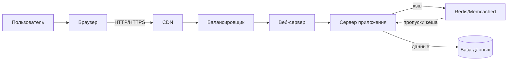
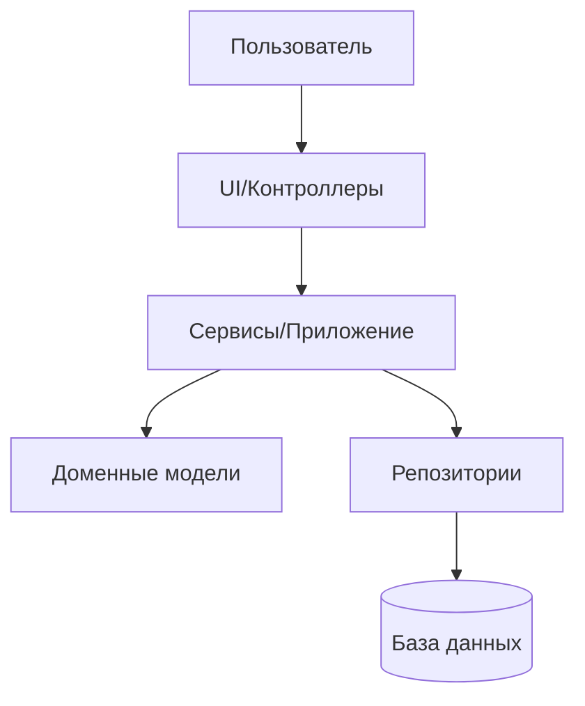
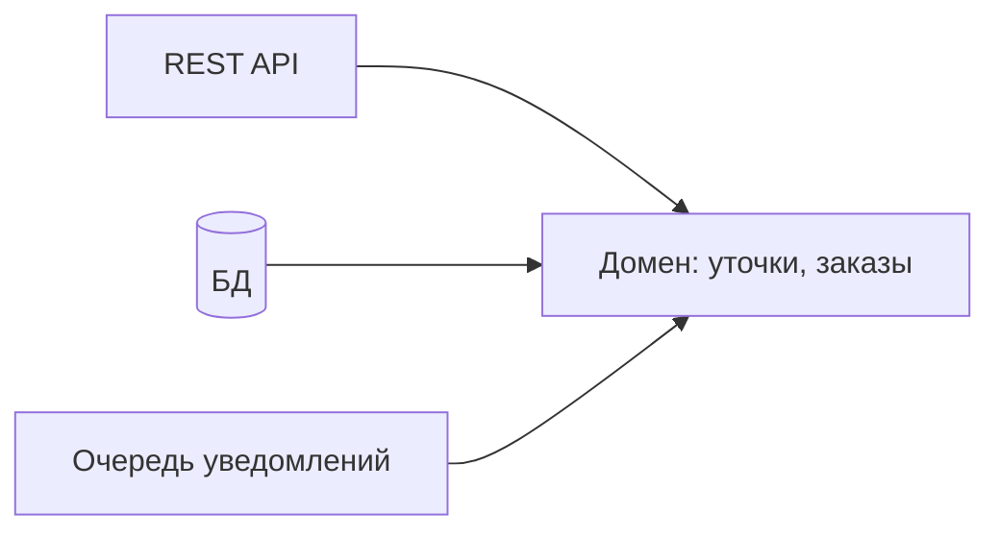
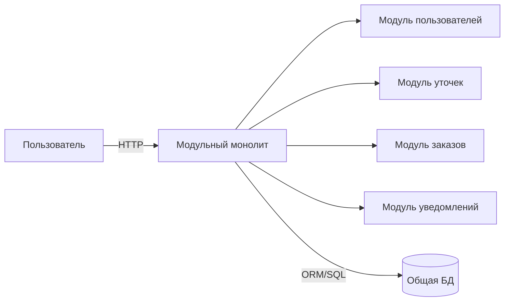
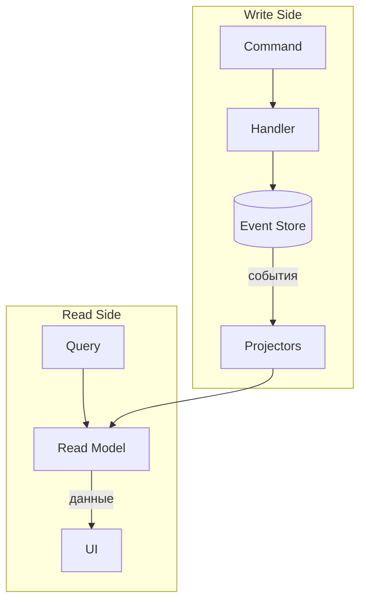

# Лекция 02. Архитектура веб‑приложений

Короткий план лекции:

- Зачем вообще архитектура
- Основные компоненты веб‑приложений
- Виды архитектуры и где они уместны
- Как выбирать подход в реальных проектах
- Немного практики и ссылки для прокачки

## Что такое архитектура и для чего она нужна

Архитекту́ра или зодчество, согласно википедии, это искусство и наука строить, проектировать здания и сооружения (включая их комплексы), а также сама совокупность зданий и сооружений, создающих пространственную среду для жизни и деятельности человека.

В той же википедии есть определения того, что такое программная архитектура.

> Архитектура программного обеспечения (англ. software architecture) — совокупность важнейших решений об организации программной системы, включающая в себя:
>
> - выбор структурных элементов и их интерфейсов, с помощью которых составлена система, а также их поведения в рамках сотрудничества структурных элементов;
> - соединение выбранных элементов структуры и поведения во всё более крупные системы;
> - архитектурный стиль, который направляет всю организацию — все элементы, их интерфейсы, их сотрудничество и их соединение.

Наиболее понятным, на мой взгляд, кажется определение, которое объединит эти два понятия:

> Архитектура ПО (разработка архитектуры ПО), это искусство и наука строить и проектировать программное обеспечение таким образом, чтобы оно удовлетворяло всем заявленным к нему требованиям, а также обеспечивало максимальную простоту доработки, развертывания и масштабирования приложения.

Проще говоря, если мы решили использовать HEAD-FIRST подход (сначала думай, потом делай), то без проработки архитектуры нам не обойтись. Да и в ситуации, когда мы сначала всё сделали, а потом начали думать – к вопросу архитектуры мы тоже придем, только теперь с большим объемом кода, который надо переписывать.

## Зачем нужна архитектура (коротко)

- Определяет структуру — как компоненты организованы и взаимодействуют.
- Управляет данными — маршруты данных, хранение, кэширование и согласованность.
- Обеспечивает масштабируемость — позволяет выдерживать рост нагрузки.
- Повышает надёжность — отказоустойчивость, деградация без падений, наблюдаемость.
- Упрощает разработку и эволюцию — модули, чёткие границы и зоны ответственности.

## Основные компоненты архитектуры веб‑приложений

- Клиентская сторона (Frontend) — интерфейс пользователя в браузере: HTML, CSS, JavaScript/TypeScript. Может быть классическим MPA, SPA, SSR/SSG/ISR — главное, что здесь живёт UI и часть логики взаимодействия.

- Серверная сторона (Backend) — обрабатывает запросы, исполняет бизнес‑логику, интегрируется с внешними системами и управляет данными:
  - Веб‑серверы — принимают HTTP(S), отдают статику, терминируют TLS, делают reverse proxy (пример: Nginx, Apache, Caddy).
  - Серверы приложений — исполняют динамический код и формируют ответы (Node.js/Express/Nest, .NET, Java/Spring, Python/Django/FastAPI и др.).
  - Базы данных — хранят и извлекают данные (реляционные и NoSQL: PostgreSQL, MySQL, MongoDB и т. п.).
  - Службы кэширования — ускоряют ответы и снижают нагрузку (Redis, Memcached, CDN‑кэш на краю).
  - Балансировщики нагрузки — распределяют трафик между экземплярами (L4/L7, health‑checks, high availability).
  - CDN — геораспределённая доставка статических ассетов (изображения, стили, скрипты) ближе к пользователю.

  Набросок потока запроса (упрощённо):




## Виды архитектуры ПО

### Базовые семейства

- Слойная (Layered, n‑tier) — классика жанра: UI → бизнес‑логика → доступ к данным. Простая ментально модель, хорошо ложится на монолит и «модульный монолит».

**Подробнее о слойной архитектуре (Layered, n‑tier):**

- Идея: разделяем код на слои с понятными обязанностями. Каждый верхний слой зависит от нижележащего, но не наоборот.
  - Presentation/UI — контроллеры/вьюхи/хэндлеры HTTP. Не содержит бизнес‑логики и SQL.
  - Application/Service — оркестрация сценариев: валидации, транзакции, вызовы доменных операций.
  - Domain (опционально отдельно) — правила предметной области, сущности, инварианты.
  - Data Access (Repository/DAO) — общение с БД/внешними источниками данных.
  - Database — сама БД.
- n‑tier — это про физическое разделение по контурам развёртывания (узлам): например, веб‑клиент, сервер приложений, отдельный сервер БД/CDN/кэш. Layered — про логическое разделение в коде. Часто используют вместе.
- Где уместно: монолит, модульный монолит, типичные CRUD‑системы, админки, внутренние инструменты.

Набросок (упрощённо):



Мини‑пример (Express, без БД — репозиторий «в памяти»):

Структура:

```text
src/
  app.js
  controllers/
    user.controller.js
  services/
    user.service.js
  repositories/
    user.repo.js
```

Код:

```javascript
// src/app.js
const express = require('express');
const { getUserById } = require('./controllers/user.controller');
const app = express();

app.get('/users/:id', getUserById);

app.listen(3000, () => console.log('http://localhost:3000'));
```

```javascript
// src/controllers/user.controller.js (Presentation/UI)
const userService = require('../services/user.service');

exports.getUserById = async (req, res) => {
  try {
    const id = Number(req.params.id);
    const user = await userService.getById(id);
    if (!user) return res.status(404).json({ message: 'Not found' });
    res.json(user);
  } catch (e) {
    res.status(400).json({ message: e.message });
  }
};
```

```javascript
// src/services/user.service.js (Application/Service)
const repo = require('../repositories/user.repo');

exports.getById = async (id) => {
  if (!Number.isInteger(id) || id <= 0) throw new Error('Invalid id');
  // Бизнес‑правила/валидации/транзакции здесь
  return repo.findById(id);
};
```

```javascript
// src/repositories/user.repo.js (Data Access)
const data = new Map([[1, { id: 1, name: 'Ducky' }]]);

exports.findById = async (id) => {
  // Вместо реальной БД используем память; в жизни тут будет ORM/SQL
  return data.get(id) || null;
};
```

Плюсы:
- Простая и понятная структура, низкий порог входа для команды.
- Легко тестировать слои изолированно (мокать репозитории в сервисах, вызывать контроллеры как чёрные ящики).
- Хорошая основа для модульного монолита; затем можно выделять части наружу.

Минусы/ловушки:
- «Протекание» слоёв: SQL/ORM в контроллерах, бизнес‑логика в репозиториях.
- Анемичная доменная модель: вся логика уходит в сервисы, сущности — только «мешки данных».
- Глубокие цепочки вызовов и дублирование cross‑cutting (логирование, транзакции) в каждом слое.

Советы новичкам:
- Держите правила предметной области ближе к домену/сервисам, а не к контроллерам.
- Контроллеры тонкие: парсят вход/отдают выход; сервисы — сценарии; репозитории — только доступ к данным.
- Вводите интерфейсы/контракты на границах (репозитории), чтобы упрощать тестирование.


- Гексагональная / Порты и адаптеры / Чистая / Луковичная — вариации про одно и то же: зависимости направлены «внутрь» к домену; внешние вещи (БД, веб, очередь) — это адаптеры. Лечит «боли» тестируемости и избыточной связности.

#### Подробнее о гексагональной архитектуре (Hexagonal/Ports & Adapters)

- В центре находится доменная логика (правила и сущности предметной области), которая не зависит от внешних технологий.
- Внешние интерфейсы (REST API, база данных, очереди сообщений, UI) реализуются как адаптеры, подключаемые через "порты" — абстрактные интерфейсы, определённые в домене.
- Все зависимости направлены внутрь: домен ничего не знает о реализации адаптеров, только о контрактах (интерфейсах).
- Это облегчает тестирование (можно подменять адаптеры моками), упрощает замену технологий (например, сменить СУБД или протокол API), снижает связанность кода.
- Чистая архитектура (Clean Architecture) и луковичная (Onion) строятся по тем же принципам: слои зависят только от более "внутренних" слоёв, а не наоборот.

#### Пример

- В приложении доменная логика реализует правила оформления заказа, а взаимодействие с БД, REST API и очередями реализовано отдельными адаптерами.
- Для тестов можно подменить адаптеры на фейковые реализации, не затрагивая бизнес-логику.




- Сервис‑ориентированная (SOA) — крупные сервисы по бизнес‑областям, общаются через шину/ESB. Микросервисы — частный случай, но мельче по гранулярности и без единого «короля‑ESB».

#### SOA простыми словами (для начинающих)

- Систему делят на крупные доменные сервисы (Каталог, Заказы, Платежи, Склад), которые общаются через «шину» (ESB). Шина — это диспетчер: принимает сообщения, преобразует и направляет их нужному сервису.
- Сервисы независимы по коду и данным, но строго следуют общим контрактам (форматам сообщений). Общение бывает синхронным (REST/SOAP) и асинхронным (очереди/события).
- Такой подход удобен, когда нужно интегрировать много разнородных систем и строить долгие бизнес‑процессы с несколькими шагами и проверками.

SOA в двух словах:
- Каждый крупный кусок бизнеса — отдельный сервис.
- Есть общая «шина» — как почта: принимает, сортирует и доставляет сообщения между сервисами.
- Сервисы не лезут в чужие базы и общаются только «письмами» по договорённым правилам.

Мини‑пример «Уточки»:
- «Создать заказ» → шина → Сервис заказов.
- Шина просит Склад зарезервировать уточек и Платежи списать деньги.
- Всё ок → шина рассылает «Заказ подтверждён» в Уведомления и CRM.


### Монолит и его вариации

- Монолит — единое развёртывание, слои внутри одного приложения. 
  - Плюсы: простота e2e‑тестов и деплоя, цельная транзакционность, меньше DevOps. 
    - Минусы: сложнее масштабировать по частям, границы модулей на совести команды.
    - Масштабирование: чаще «поднимаем всё». Если заранее заложить очереди/кэш и грамотно выделить модули — жить можно.

#### Пояснение для начинающих: очереди и кэш

Когда мы разрабатываем веб-приложение, иногда приходится запускать («поднимать») сразу все его части: сервер, базу данных, очереди сообщений, кэш и другие модули. Это может быть сложно, особенно если приложение большое.

**Что такое очереди и кэш?**

Очередь сообщений — это специальное место, куда приложение может временно складывать задачи, чтобы другие части приложения могли их обработать позже. Это помогает не перегружать систему.
Кэш — это быстрый временный «склад» данных, чтобы не обращаться каждый раз к медленной базе данных.
**Почему важно выделять модули?** Если заранее разделить приложение на отдельные части (модули) и правильно настроить очереди и кэш, работать с приложением становится проще. Можно запускать и обновлять отдельные части, не трогая всё остальное. Это облегчает поддержку и развитие проекта.

**Пример из жизни:**
Представьте интернет-магазин. Заказы попадают в очередь, чтобы их обработал отдельный сервис. Информация о товарах хранится в кэше, чтобы сайт работал быстрее. Если что-то сломалось, можно починить только нужный модуль, а не весь магазин.
- Модульный монолит — монолит с жёсткими границами модулей (домены, интерфейсы, отдельные пакеты). 
    - Плюсы: быстрый старт как у монолита, дисциплина границ, иногда миграция в микросервисы «по швам». 
    - Минусы: всё ещё один процесс/деплой.

#### Пример: модульный монолит для приложения

Вместо отдельных сервисов, вся логика реализована в одном приложении, но с чётким разделением на модули:

- `Модуль пользователей` — регистрация, аутентификация, профиль.
- `Модуль заказов` — оформление и обработка заказов.
- `Модуль уведомлений` — отправка email/SMS.

Каждый модуль — отдельная папка/пакет, взаимодействие через интерфейсы, общая база данных (с отдельными таблицами/схемами для каждого модуля).



**Плюсы:** проще разрабатывать и деплоить, нет сетевых накладных расходов, единая транзакция.  
**Минусы:** масштабируется только целиком, при росте команды — сложнее поддерживать границы.
Масштабирование (монолит):
- Масштабируется только целиком: при росте нагрузки на один модуль (например, поиск или каталог) приходится добавлять ресурсы для всего приложения. Это ведёт к перерасходу и не позволяет избирательно «нарастить» только горячие части.
- Отдельные типы нагрузки (HTTP, фоновые задачи, обработка очередей) часто живут в одном процессе, поэтому их нельзя масштабировать независимо.

Рост команды и границы:
- Сложно удерживать чёткие границы: общий доменный слой и общая БД создают сильную связанность, изменения в модели или схеме каскадно затрагивают другие модули.
- Координационные издержки: один релиз для всех, больше конфликтов в PR, дольше интеграция и тестирование, сложно назначить владельцев отдельных частей.

Пример:
- Пик трафика бьёт по каталогу товаров, но вы масштабируете весь монолит (и оплату, и профиль, и админку), хотя они почти не нагружены.

Как смягчить:
- Вводить явные модульные границы (bounded contexts), разбивать код по предметным областям, общение через публичные интерфейсы.
- Ограничивать зависимости «внутрь» домена (архитектурные правила/линтеры, архитектурные тесты).
- Постепенно выделять самые горячие или независимо развиваемые части в отдельные сервисы/процессы с асинхронным взаимодействием.

Популярные UI‑паттерны в монолите (понятно и коротко):

- MVC — как устроен сайт из трёх частей.
  - Model: данные и правила (валидация, доступ к БД).
  - View: отображение (HTML/шаблоны), минимум логики.
  - Controller: принимает HTTP‑запрос, вызывает Model и возвращает View.
  - Где уместно: серверные фреймворки — Rails, Django (MTV), Laravel, ASP.NET Core MVC, Spring MVC.

- MVP — Presenter руководит UI.
  - View «тупая»: только показывает и пересылает события (клик, ввод).
  - Presenter содержит логику представления и говорит View, что рисовать.
  - Где встречается: исторически Android; во фронтенде — подход container/presenter в React.

- MVVM — ViewModel хранит состояние экрана; биндинг синхронизирует View и данные.
  - Ввод в форме меняет ViewModel, и наоборот (двустороннее связывание).
  - Где встречается: Vue (v‑model), Angular (ngModel), Svelte (bind:), Knockout.

Выбор на практике:
- Нужен простой серверный рендер — берите MVC.
- Много логики отображения, но хотите «тонкий» UI — MVP.
- Современный SPA с реактивными формами и состоянием — MVVM.

Типичные ошибки новичков:
- Кладут бизнес‑логику в шаблоны View — выносите её в Model/сервисы.
- «Толстые» контроллеры/вью‑модели — дробите и выделяйте модули.
- Чрезмерный двусторонний биндинг усложняет отладку — используйте однонаправленный там, где можно.

### Микросервисы: симметрия и автономность

Каждый сервис — мини‑приложение со своей БД и API, отвечает за конкретную бизнес‑функцию.

- **Микросервисы простыми словами (для начинающих):**
  - Разбиваем большое приложение на маленькие самостоятельные сервисы: каждый делает одну вещь хорошо (пользователи, каталог уточек, заказы, уведомления).
  - У каждого сервиса — свой код и своя база данных; общаются по сети по чётким контрактам (обычно HTTP/gRPC или события).
  - Обновлять и масштабировать можно каждый сервис отдельно, не трогая остальные.

  Мини‑пример «Уточки»:
  - Сервис заказов создаёт заказ, обращается к Сервису уточек за ценой/наличием и отправляет событие в Сервис уведомлений.
  - Пошёл пик продаж — увеличиваем только Сервис заказов (больше экземпляров), остальные не трогаем.

- Плюсы: независимые релизы и стеки, масштабирование «по горячим точкам», чёткие границы контекстов.
- Минусы: сеть, распределённые транзакции, наблюдаемость, девопс‑косты, согласованность данных «в итоге».
- Инфраструктура по делу: API Gateway, сервис‑меш, централизованные логи/трейсинг, брокер сообщений.

**Плюсы:** можно независимо обновлять, масштабировать сервисы (например, сервис заказов при распродаже уточек).  
**Минусы:** сложнее отлаживать, нужны централизованные логи, продуманная интеграция и мониторинг.

### Событийная архитектура (EDA)

**EDA простыми словами (для начинающих):**
- Компоненты не вызывают друг друга напрямую — они публикуют «события» (факты: «Заказ создан», «Оплата прошла»), а нужные подписчики их получают и реагируют.
- Между ними есть брокер сообщений (Kafka/RabbitMQ/NATS), который принимает, хранит и раздаёт события подписчикам.
- Это асинхронно: издатель не ждёт ответа, поэтому система масштабируется лучше, но данные могут становиться согласованными «со временем» (eventual consistency).

Сервисы общаются событиями (pub/sub), а не только синхронными запросами. Kafka/RabbitMQ/NATS — наши друзья.

EDA в двух словах (ещё проще):
- Сервис сообщает «что случилось», а не «что делать».
- Брокер — как «громкоговоритель»: публикуешь событие — все, кому нужно, слышат и делают своё.
- Плюс — масштаб и слабая связность; минус — данные сходятся не сразу, а по мере обработки событий.

Три шага «Уточки»:
1) OrderCreated → склады слушают и резервируют.
2) StockReserved → платежи слушают и списывают.
3) PaymentCaptured → заказы подтверждают и шлют уведомление.

- Плюсы: слабая связность, высокая масштабируемость, естественная интеграция.
- Минусы: дебаг по событиям — квест; согласованность «в итоге», упорядочивание, повторная доставка.
- Часто сочетается с микросервисами и CQRS.

### CQRS и Event Sourcing (поверх доменной архитектуры)

**Простыми словами (для начинающих):**
- CQRS: разделяем «запись» и «чтение». Команды (создать заказ, добавить товар) меняют систему; запросы (показать заказ) читают из отдельной, удобной для чтения модели. Писать — в одну модель; читать — из другой, оптимизированной и часто обновляемой асинхронно.
- Event Sourcing: вместо того чтобы хранить только текущее состояние, сохраняем все события («Заказ создан», «Товар добавлен», «Оплата прошла»). Состояние можно восстановить как сумму событий; легко видеть историю и причины изменений.

Мини‑пример «Уточки»:
1) Пользователь оформляет заказ → команда CreateOrder.
2) Write‑часть записывает события: OrderCreated, ItemAdded, PaymentCaptured (в «хранилище событий»).
3) Проекции (read‑модели) слушают события и обновляют представления: OrdersReadModel, StockReadModel.
4) UI всегда читает из read‑моделей: быстро показать «Заказ №123 — Оплачен, 2 жёлтые уточки».

В двух словах:
- Меняем через команды → рождаем события; читаем из проекций (read‑моделей).
- Плюсы: быстрые и гибкие чтения, масштабирование чтения отдельно, полная история изменений.
- Минусы: сложнее поддерживать согласованность «сразу», нужны проекции и миграции событий, выше порог входа.

- CQRS — разделяем модели на чтение и запись, чтобы быстрее читать и масштабировать отчётность/поиск.
- Event Sourcing — состояние системы как журнал событий; текущие «снимки» можно пересобрать. Мощно, но добавляет сложности в моделировании и миграциях.

### Serverless / FaaS

**Простыми словами (для начинающих):**
- Вы пишете маленькие функции, а облако запускает их по событию: HTTP‑запрос, расписание (cron) или сообщение из очереди.
- Постоянный сервер не нужен: функция «просыпается», быстро выполняет работу и «засыпает». Масштабирование и инфраструктура — на стороне провайдера.
- Платите только за время выполнения кода и количество вызовов.

Мини‑пример «Уточки»:
- HTTP‑функция createOrder обрабатывает POST /orders, валидирует данные и пишет заказ в БД/BaaS.
- Функция emitOrderEvent триггерится после записи и публикует событие OrderCreated в очередь.
- Функция sendOrderEmail слушает событие и отправляет письмо пользователю.

Функции как сервис: пишем хендлеры, которые триггерятся HTTP/крон/очередями. Веб‑бэкенд на облачных функциях + BaaS (auth, storage) — вполне рабочая схема.

- Плюсы: масштабирование «из коробки», оплата за фактическое время, scale‑to‑zero.
- Минусы: холодные старты, вендор‑локин, ограничения по времени/памяти, сложные долгие оркестрации.

### Архитектуры фронтенда (пара слов)

- PWA — веб‑сайт, который можно установить как приложение; работает офлайн и поддерживает push‑уведомления.
- BFF — отдельный бэкенд «под этот клиент»: агрегирует данные и отдаёт только то, что нужно вебу/мобайлу.
- Микрофронтенды — делим большой UI на независимые части, которые можно разрабатывать и обновлять отдельно.

### Как выбирать (быстрый гайд)

- Небольшой продукт, маленькая команда, надо вчера — монолит или модульный монолит.
  - Пример: интернет‑магазин уточек (MVP) — модульный монолит: модули «Каталог», «Заказы», «Оплата» в одном приложении (Django/Express/Nest) с общей БД; один репозиторий, один деплой.
- Быстрый MVP, но с прицелом на рост — модульный монолит + границы контекстов.
  - Пример: маркетплейс уточек (MVP) — модульный монолит с явными границами: «Каталог», «Заказы», «Оплата», «Профиль»; общение только через публичные интерфейсы. Позже «Заказы» можно выделить в сервис.
- Много доменов и независимых команд — микросервисы + API Gateway + брокер сообщений.
  - Пример: «Каталог», «Поиск», «Заказы», «Оплата», «Уведомления» — отдельные сервисы со своими БД; вход через API Gateway; события через Kafka/RabbitMQ.
- Пики нагрузки бьют по отдельным функциям — микросервисы или serverless на «горячих точках».
  - Пример: распродажа — растёт нагрузка на checkout и расчёт доставки: масштабируем только Order/Checkout‑service; отправку писем и генерацию счетов выносим в serverless‑функции.
- Много интеграций и асинхронщины — EDA + (по надобности) CQRS.
  - Пример: «Заказ создан» → склад резервирует; «Резерв подтверждён» → платеж списывает; «Оплата прошла» → уведомления шлют письмо. Для быстрых списков — read‑модель (CQRS).
- Несколько клиентов (веб/мобайл/IoT) с разными требованиями — добавляем BFF.
  - Пример: веб и мобильное приложение — два BFF: Web BFF агрегирует витрину и фильтры; Mobile BFF отдаёт компактные списки и готовые DTO для экрана. Для IoT‑киоска — отдельный BFF.

> Лайфхак: никто не догадается, что монолит — это монолит, если никого не пускать к кодовой базе. Но лучше всё‑таки пускать — код‑ревью лечит.

## Практические задания

1) Разработайте схему компонентов для небольшого сервиса заметок: клиент, CDN, балансировщик, веб‑сервер, приложение, кэш, БД. Укажите точки масштабирования и отказоустойчивости.
2) Выберите архитектуру для маркетплейса MVP при команде 3‑4 человека: аргументируйте «модульный монолит vs микросервисы», нарисуйте границы модулей/сервисов.
3) Спроектируйте обмен событиями (EDA) между «Заказы», «Склад», «Оплата»: какие события, кто издатель/подписчик, какая стратегия повторов.
4) Добавьте BFF для мобильного клиента: какие агрегации он делает, какие эндпоинты скрывает, как кэширует ответы.
5) Для фронтенда опишите, что именно вы отдаёте через CDN, где включаете кэширование, и какие заголовки ставите (Cache‑Control/ETag).

Подсказка (необязательно): пример минимального reverse proxy на Nginx для Node‑приложения.

```nginx
# /etc/nginx/conf.d/app.conf
server {
	listen 80;
	server_name example.com;

	# Статика с кешем
  # (Cache-Control управляет кэшированием у клиента/CDN)
	location /assets/ {
		root /var/www/app;
		expires 7d;
		add_header Cache-Control "public, max-age=604800";
	}

	# Проксирование динамики
	location / {
		proxy_pass http://127.0.0.1:3000;
		proxy_set_header Host $host;
		proxy_set_header X-Real-IP $remote_addr;
		proxy_set_header X-Forwarded-For $proxy_add_x_forwarded_for;
		proxy_set_header X-Forwarded-Proto $scheme;
	}
}
```

## Рекомендованное чтение и ресурсы

- [12factor.net](https://12factor.net/) — «Двенадцать факторов» для облачных приложений.
- [Martin Fowler](https://martinfowler.com/articles/microservices.html) — статьи про Layered/Hexagonal/Clean, Microservices, EDA, CQRS/Event Sourcing.
- [MDN Web Docs](https://developer.mozilla.org/en-US/docs/Web/HTTP/Caching) — HTTP, кэширование, Service Workers, PWA, заголовки Cache‑Control/ETag.
- [Nginx docs](https://nginx.org/en/docs/) — reverse proxy, кеширование, gzip/brotli.
- [Google Web.dev](https://web.dev/progressive-web-apps/) — PWA‑гайды, Lighthouse, производительность фронтенда.
- Книги: "Building Microservices" by Sam Newman, "Clean Architecture" by Robert C. Martin, "Domain-Driven Design" by Eric Evans.

## Ключевые выводы

- Архитектура — это не только код, но и стратегия: думай о масштабируемости, надёжности и эволюции с самого начала.
- Монолит для старта, микросервисы для роста — но всегда с учётом команды и нагрузки.
- Компоненты (CDN, балансировщик, кэш) — твои друзья для производительности; не игнорируй их.
- EDA и CQRS мощны, но добавляют сложности — используй, когда асинхронщина критична.
- Практика: рисуй схемы, пробуй паттерны на мини-проектах, читай Fowler и MDN.

## Часто задаваемые вопросы (Q&A)

- **В чём разница между SOA и микросервисами?** SOA — крупные сервисы с ESB как "королём"; микросервисы мельче, без единого брокера, с API Gateway.
- **Когда переходить с монолита на микросервисы?** Когда команда растёт, нагрузка неравномерна, или нужно независимые релизы. Не ради моды.
- **Как тестировать микросервисы?** Юнит-тесты для каждого, интеграционные для взаимодействия, e2e через API Gateway. Используй mocks для внешних зависимостей.
- **Что такое холодные старты в serverless?** Первый вызов функции после простоя занимает время на инициализацию — оптимизируй код и используй provisioned concurrency.
- **Как кэшировать в вебе?** Заголовки Cache-Control/ETag на сервере, Service Worker на клиенте для PWA. CDN для статики.
- **BFF vs микрофронтенды?** BFF — бэкенд для клиента; микрофронтенды — разбиение UI на независимые части.

## Глоссарий

- **EDA (Event-Driven Architecture)**: Архитектура, где компоненты общаются через события (pub/sub), а не прямые вызовы.
- **CQRS (Command Query Responsibility Segregation)**: Разделение моделей на чтение и запись для оптимизации производительности.
- **Event Sourcing**: Хранение состояния как журнала событий; текущее состояние — проекция из событий.
- **BFF (Backend for Frontend)**: Специализированный бэкенд для конкретного клиента (веб/мобайл), агрегирующий данные.
- **ESB (Enterprise Service Bus)**: Центральный брокер для интеграции сервисов в SOA.
- **CDN (Content Delivery Network)**: Сеть серверов для быстрой доставки контента ближе к пользователю.
- **API Gateway**: Входная точка для микросервисов, обрабатывающая аутентификацию, маршрутизацию и агрегацию.
- **Service Mesh**: Инфраструктура для управления трафиком, безопасностью и наблюдаемостью между микросервисами (e.g., Istio).
- **PWA (Progressive Web App)**: Веб-приложение с нативными функциями (оффлайн, push, установка).
- **SSR/SSG/ISR**: Server-Side Rendering/Static Site Generation/Incremental Static Regeneration — способы рендеринга на сервере для SEO и производительности.
- **API (Application Programming Interface)**: Программный интерфейс приложения; контракты для взаимодействия (HTTP/gRPC и др.).
- **UI (User Interface)**: Пользовательский интерфейс.
- **DB (Database)**: База данных.
- **HTTP/HTTPS (Hypertext Transfer Protocol / Hypertext Transfer Protocol Secure)**: Протокол/защищённый протокол передачи гипертекста.
- **TLS (Transport Layer Security)**: Криптографический протокол защиты транспорта (основа HTTPS).
- **MPA (Multi-Page Application)**: Многостраничное веб‑приложение.
- **SPA (Single-Page Application)**: Одностраничное веб‑приложение.
- **SEO (Search Engine Optimization)**: Поисковая оптимизация.
- **OSI (Open Systems Interconnection)**: Модель взаимодействия открытых систем (7 уровней/слоёв).
- **L4/L7 (Layer 4 / Layer 7)**: Транспортный и прикладной уровни модели OSI; часто в контексте балансировки.
- **BaaS (Backend as a Service)**: Облачный бэкенд‑сервис (аутентификация, хранилище, функции и т. п.).
- **E2E (End‑to‑End testing)**: Сквозное тестирование всей системы.
- **MTV (Model‑Template‑View)**: Паттерн Django, близок к MVC (Model‑View‑Controller).

## Дополнительные диаграммы

### Поток событий в EDA (упрощённо)

```mermaid
flowchart LR
    P[Publisher] -->|событие| B[Broker (Kafka/RabbitMQ)]
    B --> S1[Subscriber 1]
    B --> S2[Subscriber 2]
    B --> S3[Subscriber 3]
    S1 -->|обработка| DB[(DB)]
    S2 -->|уведомление| U[Пользователь]
```

### CQRS с Event Sourcing



## Примеры кода для паттернов

### MVC в Node.js/Express (простой контроллер)

```javascript
// controllers/userController.js
const User = require('../models/User');

exports.getUser = async (req, res) => {
  try {
    const user = await User.findById(req.params.id);
    res.render('user', { user }); // View
  } catch (err) {
    res.status(500).send('Error');
  }
};
```

### Обработчик событий в Kafka (Node.js)

```javascript
// consumer.js
const { Kafka } = require('kafkajs');

const kafka = new Kafka({ clientId: 'my-app', brokers: ['localhost:9092'] });
const consumer = kafka.consumer({ groupId: 'test-group' });

const run = async () => {
  await consumer.connect();
  await consumer.subscribe({ topic: 'orders', fromBeginning: true });

  await consumer.run({
    eachMessage: async ({ topic, partition, message }) => {
      console.log(`Received: ${message.value}`);
      // Обработка события, e.g., обновить склад
    },
  });
};

run().catch(console.error);
```

### CQRS: Write Command (C#/.NET)

```csharp
// Commands/OrderCommand.cs
public class CreateOrderCommand : IRequest<OrderId>
{
    public string ProductId { get; set; }
    public int Quantity { get; set; }
}

// Handlers/CreateOrderHandler.cs
public class CreateOrderHandler : IRequestHandler<CreateOrderCommand, OrderId>
{
    private readonly IEventStore _eventStore;

    public async Task<OrderId> Handle(CreateOrderCommand request, CancellationToken cancellationToken)
    {
        var order = new Order(request.ProductId, request.Quantity);
        await _eventStore.SaveEventsAsync(order.Id, order.GetUncommittedEvents());
        return order.Id;
    }
}
```