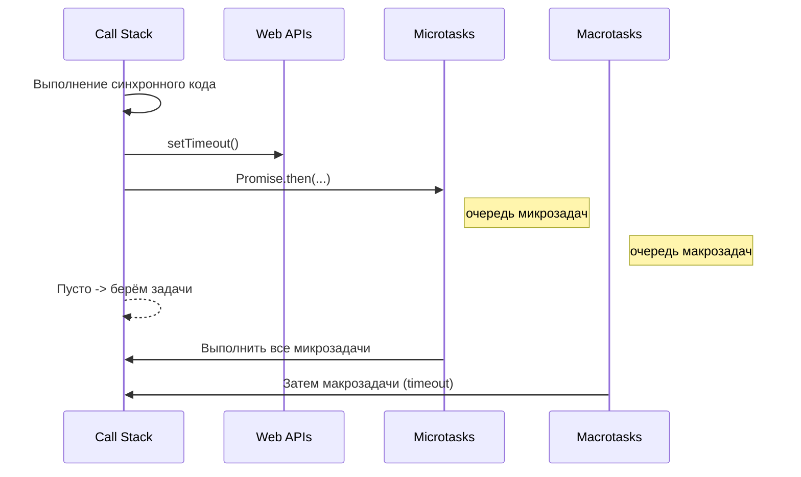

# Лекция 05. JavaScript: основы, ES6+, DOM и события, асинхронность, модули

План:

1. Что такое JavaScript. Движок, среда выполнения (браузер vs Node.js), ECMAScript.
2. Базовый синтаксис: переменные, типы, операторы, условия, циклы.
3. Функции, область видимости, замыкания, контекст `this`, стрелочные функции.
4. Объекты и массивы: деструктуризация, spread/rest, методы массивов.
5. Модель исполнения: стек вызовов, Event Loop, microtasks vs macrotasks.
6. Асинхронность: callbacks → Promise → async/await; fetch; обработка ошибок.
7. Модули ES: `import`/`export`, `type="module"`, структура проекта.
8. Инструменты и стиль: ESLint/Prettier, кратко о TypeScript.

Практика:

- Мини‑проект: интерактивный список задач (ToDo) с сохранением в `localStorage`.
- Запрос к публичному API (например, `https://jsonplaceholder.typicode.com/`) и рендер карточек.
- Разбивка кода на модули, базовая валидация форм, обработка ошибок.

Чтение:

- [MDN (RU): Руководство по JavaScript](https://developer.mozilla.org/ru/docs/Web/JavaScript/Guide)
- [Современный учебник JavaScript](https://learn.javascript.ru/)
- [MDN: Fetch API](https://developer.mozilla.org/ru/docs/Web/API/Fetch_API/Using_Fetch)

Иллюстрации:

- [Логотип JavaScript (Wikimedia)](https://upload.wikimedia.org/wikipedia/commons/6/6a/JavaScript-logo.png "Логотип JS")
- [Схема Event Loop (RU)](https://learn.javascript.ru/event-loop "Цикл событий")

---

## Материал для лекции

### 1. JavaScript и среда выполнения

**Теория:**

- JS — динамический, мультипарадигменный язык, стандарт — ECMAScript (ES5, ES6/ES2015 и далее ежегодные версии).
JavaScript сейчас популярен благодаря интернету. Дело в том, что это единственный язык, который умеют исполнять все браузеры. Если ты хочешь добавить анимацию или некоторую логику в свою интернет-страницу, то ты можешь сделать это с помощью JavaScript.
 На самом деле сначала он назывался LiveScript, но когда Java начала набирать популярность, его переименовали в JavaScript.
 JavaScript, в отличие от Java, не имеет классов, не поддерживает статическую типизацию, многопоточность и много чего еще. И если Java – это скорее большой набор строительных инструментов, то JavaScript – это швейцарский нож. JavaScript создан для решения маленьких задач, а Java – для больших и очень больших.
- Движки: V8 (Chrome/Node.js), SpiderMonkey (Firefox), JavaScriptCore (Safari). JIT‑компиляция.
- В браузере JS работает в одном потоке, неблокирующие операции организованы через цикл событий (Event Loop).
- Node.js — среда выполнения без браузера (другие API: файловая система, сеть), но сам язык тот же.

**Мини‑пример:**

```js
console.log('Привет, JS!')
```

> Подсказка: В браузере откройте DevTools (F12) → Console и введите пример.

### 2. Базовый синтаксис: переменные, типы, операторы

**Теория (кратко):**

- Объявления: `let` (переменная), `const` (константа), `var` (устаревший, функция‑скоуп + hoisting).
- Примитивы: `number`, `string`, `boolean`, `null`, `undefined`, `bigint`, `symbol`.
- Объекты и массивы — ссылочные типы.
- Сравнение: всегда предпочитайте строгое `===`/`!==` вместо `==`/`!=`.

**Примеры:**

```js
const rate = 1.2;           // const по умолчанию
let count = 0;               // изменяемая переменная
const title = `Курс: JS`;    // шаблонные строки

// Разница == vs ===
console.log(0 == false);  // true (приведение типов)
console.log(0 === false); // false (строгое сравнение)

// Типы
console.log(typeof null);       // 'object' (историческая особенность)
console.log(Number.isNaN(NaN)); // true
```

**Условия и циклы:**

```js
if (count > 0) {
  console.log('Положительное')
} else {
  console.log('Ноль или отрицательное')
}

for (let i = 0; i < 3; i++) {
  console.log(i)
}

// Итерируем по массиву
['a','b','c'].forEach((ch, idx) => console.log(idx, ch))
```

#### Переменные: правила и практика

- Предпочитайте `const` по умолчанию; используйте `let`, когда значение действительно будет переназначаться. `var` считается устаревшим из‑за особенностей области видимости (функция‑скоуп) и hoisting.
- Имена чувствительны к регистру: `myVariable` и `myvariable` — разные идентификаторы.
- Имена переменных: используйте латиницу, camelCase, без пробелов; не начинайте с цифры; избегайте зарезервированных слов.
- Точка с запятой: JavaScript поддерживает автоматическую подстановку (ASI), но лучше ставить `;` там, где это однозначно улучшает читаемость и избегает ловушек (например, при начале строки с `[` или `(`).

```js
let myVariable
myVariable = 'Bob'
console.log(myVariable) // 'Bob'
myVariable = 'Steve'    // переназначение допустимо для let

const pi = 3.14159
// pi = 3 // Ошибка: переназначение const запрещено
```

Типы значений (базово):

- String (строка): `'Привет'`, `"Мир"`; кавычки обязательны.
- Number (число): `10`, `3.14` — без кавычек.
- Boolean (логический): `true`/`false` — без кавычек.
- Array (массив): `[1, 'Bob', 'Steve', 10]` — доступ по индексу `arr[0]`.
- Object (объект): `{}`, например экземпляры `Date`, `Map`.

#### Комментарии

Комментарии игнорируются Интерпретатором/Движком и помогают документировать код.

```js
// Однострочный комментарий

/*
Многострочный комментарий
*/
```

#### Операторы (базово)

- Сложение (и конкатенация строк): `+`
- Вычитание/умножение/деление: `-`, `*`, `/`
- Присваивание: `=`
- Строгое равенство/неравенство: `===`, `!==`
- Логическое отрицание: `!`

```js
console.log(6 + 9)                 // 15
console.log('Hello ' + 'world!')   // 'Hello world!'
console.log(9 - 3, 8 * 2, 9 / 3)   // 6 16 3

const x = 3
console.log(x === 4)  // false
console.log(!(x === 3)) // false

// Осторожно с типами при +
console.log('35' + '25') // '3525' — строки склеились
console.log(35 + 25)     // 60    — числа сложились
```

#### Условия: подробнее

Условия позволяют выполнять разные блоки кода в зависимости от истинности выражения.

```js
const iceCream = 'chocolate'
if (iceCream === 'chocolate') {
  alert('Yay, I love chocolate ice cream!')
} else {
  alert('Awwww, but chocolate is my favorite...')
}

// else if — несколько ветвей
const n = 10
if (n > 10) {
  console.log('> 10')
} else if (n === 10) {
  console.log('= 10')
} else {
  console.log('< 10')
}

// Тернарный оператор для простых случаев
const msg = n % 2 === 0 ? 'чётное' : 'нечётное'
console.log(msg)
```

### 3. Функции, область видимости, замыкания, this

**Теория:**

- Объявление функции (Function Declaration) и выражение (Function Expression).
- Стрелочные функции не имеют собственного `this` и `arguments`.
- Замыкание — функция «помнит» лексическое окружение, где была создана.
- `this` зависит от способа вызова. В стрелках `this` лексический (берётся снаружи).

#### Функции: базовые понятия (практичный взгляд)

- Функция — это «упаковка» логики, которую можно вызывать много раз по имени вместо копирования кода.
- Вызов функции распознаётся по круглым скобкам: `doSomething()`. Если скобок нет — это ссылка на функцию, а не вызов.
- Данные, которые мы передаём функции, называются аргументами; им соответствуют параметры в определении функции.

Примеры встроенных функций среды (без DOM):

```js
// Работа с датами и числами
const now = new Date()
console.log('Сегодня:', now.toISOString())
console.log('Максимум из [1, 5, 3]:', Math.max(1, 5, 3))
```

Функции часто принимают аргументы (через запятую, если их несколько). Например, `alert` принимает строку, которую нужно показать. Вы можете объявлять и свои функции — ниже простая функция умножения двух чисел:

```js
function multiply(num1, num2) {
  const result = num1 * num2
  return result
}

// Вызов
console.log(multiply(3, 4)) // 12
```

Ключевые моменты:

- Возвращаемое значение: оператор `return` завершает функцию и отдаёт значение; без `return` функция возвращает `undefined`.
- Имена параметров — локальные переменные внутри функции; их значения доступны только в её теле.
- Параметры по умолчанию: можно задать значение, которое используется, если аргумент не передан.

```js
function greet(name = 'гость') {
  return `Привет, ${name}!`
}
console.log(greet())       // Привет, гость!
console.log(greet('Ира'))  // Привет, Ира!
```

Стрелочные функции — компактный синтаксис объявления, в самом простом виде могут иметь «неявный return»:

```js
// Эквивалентные варианты
function square(x) { return x * x }
const square2 = (x) => x * x        // неявный return
```

**Примеры:**

```js
// Объявления
function add(a, b) { return a + b }
const mul = (a, b) => a * b

// Замыкание: счётчик
function makeCounter() {
  let x = 0
  return () => ++x
}
const counter = makeCounter()
console.log(counter()) // 1
console.log(counter()) // 2

// this
const user = {
  name: 'Ира',
  greet() { console.log('Привет, ' + this.name) }
}
user.greet() // Привет, Ира
const fn = user.greet
fn() // Привет, undefined (в строгом режиме) — потеряли контекст
const bound = user.greet.bind(user)
bound() // Привет, Ира
```

#### Развёрнуто: правила привязки `this`

- По умолчанию (простой вызов): `this === undefined` в строгом режиме (или `window` в нестрогом в браузере).
- Неявная привязка: при вызове как метода `obj.method()`, внутри `method` `this === obj`.
- Явная привязка: `call/apply/bind` принудительно задают `this`.
- Конструктор: при вызове с `new` создаётся новый объект, `this` указывает на него.
- Стрелочные функции: не имеют собственного `this`; берут его из внешнего лексического окружения.

```js
function hi() { console.log(this?.name) }
const alex = { name: 'Алекс', hi }
hi()            // undefined (strict)
alex.hi()       // 'Алекс' (неявная привязка)
hi.call({ name: 'Вера' }) // 'Вера' (явная привязка)

const make = () => console.log(this) // стрелка — берёт внешнее this
make() // в модуле браузера: undefined; в глобале без модуля — window

function User(name) { this.name = name }
const u = new User('Игорь')
console.log(u.name) // 'Игорь'
```

```js
// Разница call/apply/bind
function sum(a, b) { return a + b }
console.log(sum.call(null, 2, 3))   // 5 — аргументы по одному
console.log(sum.apply(null, [2, 3])) // 5 — аргументы массивом

const plusOne = sum.bind(null, 1) // частичное применение
console.log(plusOne(4)) // 5
```

### 4. Объекты и массивы: современный синтаксис

**Теория:**

- Короткая запись свойств: `{name, age}` вместо `{name: name, age: age}`.
- Вычисляемые имена свойств: `{ [key]: value }`.
- Деструктуризация, параметры по умолчанию, rest/spread.
- Методы массивов: `map`, `filter`, `reduce`, `find`, `some`, `every`.

**Примеры:**

```js
const person = { name: 'Анна', age: 21 }
const { name, age } = person // деструктуризация объекта

const arr = [1, 2, 3]
const [first, ...rest] = arr // деструктуризация массива + rest

const doubled = arr.map(x => x * 2)       // [2,4,6]
const even = arr.filter(x => x % 2 === 0) // [2]
const sum = arr.reduce((acc, x) => acc + x, 0) // 6
```

#### Прототипы и прототипная цепочка

- У каждого объекта есть скрытая ссылка на прототип (`[[Prototype]]`), доступная через `Object.getPrototypeOf(obj)` или `__proto__`.
- Поиск свойства идёт по цепочке прототипов, пока не будет найдено имя или достигнут `null`.
- Функции‑конструкторы используют свойство `Function.prototype` при создании экземпляров: `obj.__proto__ === Ctor.prototype`.

```js
const animal = { eat() { console.log('nom nom') } }
const dog = Object.create(animal)
dog.bark = () => console.log('woff')
dog.bark()
dog.eat() // найдено в прототипе animal

function Counter() {}
Counter.prototype.inc = function () { this.x = (this.x || 0) + 1 }
const c = new Counter()
c.inc(); c.inc()
console.log(c.x) // 2
```

Подсказка: современные приложения чаще используют композицию и классы/функции вместо ручной работы с прототипами, но понимание механики важно для чтения чужого кода.

### 5. Модель исполнения: Event Loop (важно для асинхронности)

**Теория:**

- JS выполняется в основном потоке: стек вызовов + очередь задач.
- Макрозадачи (setTimeout, I/O) и микрозадачи (Promise.then, queueMicrotask).
- Микрозадачи исполняются раньше макрозадач между рендерами.

**Наблюдаемый порядок:**

```js
console.log('A')
setTimeout(() => console.log('B: timeout'))
Promise.resolve().then(() => console.log('C: microtask'))
console.log('D')
// Порядок: A, D, C, B
```



### 6. Асинхронность: Promise и async/await, fetch

**Теория:**

- Промис — объект состояния будущего результата.
- `async/await` — синтаксический сахар над промисами, упрощает линейное чтение кода.
- `fetch` — современный API для HTTP запросов. По умолчанию бросает ошибку ТОЛЬКО при сетевых сбоях, коды 4xx/5xx нужно проверять вручную.

**Примеры:**

```js
// Promise
const delay = (ms) => new Promise(resolve => setTimeout(resolve, ms))
delay(300).then(() => console.log('Прошло 300мс'))

// async/await + fetch c обработкой ошибок и AbortController
async function loadPosts(signal) {
  const res = await fetch('https://jsonplaceholder.typicode.com/posts', { signal })
  if (!res.ok) {
    throw new Error('HTTP ' + res.status)
  }
  return res.json()
}

const controller = new AbortController()
loadPosts(controller.signal)
  .then((data) => console.log('Постов:', data.length))
  .catch((err) => console.error('Ошибка загрузки:', err.message))

// Прерывание при необходимости:
// controller.abort()
```

#### Комбинаторы промисов и параллельные запросы

```js
const urls = [
  'https://jsonplaceholder.typicode.com/users',
  'https://jsonplaceholder.typicode.com/posts'
]

// Параллельная загрузка, ошибка — если упадёт любой
const [users, posts] = await Promise.all(urls.map(u => fetch(u).then(r => r.json())))

// «Собрать всё» даже при ошибках
const settled = await Promise.allSettled(urls.map(u => fetch(u)))

// Гонка — кто первый
const fastest = await Promise.race(urls.map(u => fetch(u)))
```

```js
// Таймаут для fetch через AbortController + Promise.race
function fetchWithTimeout(url, { timeout = 5000, ...init } = {}) {
  const controller = new AbortController()
  const id = setTimeout(() => controller.abort(), timeout)
  return fetch(url, { ...init, signal: controller.signal })
    .finally(() => clearTimeout(id))
}
```

#### Fetch: CORS, кэш, куки

- `mode`: `cors` (по умолчанию для cross-origin), `same-origin`, `no-cors` (ограниченный).
- `credentials`: `omit` (по умолчанию), `same-origin`, `include` (всегда слать куки).
- `cache`: `default`, `no-store`, `reload`, `no-cache`, `force-cache`, `only-if-cached`.
- Заголовки: чаще всего `Content-Type: application/json` при `POST`/`PUT` JSON.

```js
const res = await fetch('/api/data', {
  method: 'POST',
  headers: { 'Content-Type': 'application/json' },
  body: JSON.stringify({ a: 1 }),
  credentials: 'include',
  cache: 'no-store'
})
```

### 7. Модули ES

**Теория:**

- В браузере используйте `<script type="module" src="./main.js"></script>`.
- Импорт/экспорт именованных и экспорта по умолчанию.
- Модули выполняются в строгом режиме, имеют собственную область видимости.

**Структура:**

```text
project/
  index.html
  src/
    main.js
    api.js
    dom.js
```

**Пример:**

```js
// api.js
export async function getUsers() {
  const res = await fetch('https://jsonplaceholder.typicode.com/users')
  if (!res.ok) throw new Error('HTTP ' + res.status)
  return res.json()
}

// dom.js
export function renderUsers(users, root) {
  root.innerHTML = users.map(u => `<li>${u.name}</li>`).join('')
}

// main.js
import { getUsers } from './api.js'
import { renderUsers } from './dom.js'

const root = document.querySelector('#users')
getUsers().then(u => renderUsers(u, root)).catch(console.error)
```

#### Динамический импорт и top‑level await

- Динамический импорт: `const { fn } = await import('./utils.js')` — код инициализации можно подгружать по требованию.
- Top‑level await (TLA): в модулях можно `await` на верхнем уровне (поддержка браузерами/сборщиками требуется).
- Модули кэшируются: повторный импорт того же URL возвращает уже загруженный модуль.

```js
// dynamic-import.js
export function hi(name) { return `Привет, ${name}!` }

// main.js
const { hi } = await import('./dynamic-import.js')
console.log(hi('Мир'))
```

### 8. Инструменты и стиль кода (кратко)

**Теория:**

- Линтеры и форматтеры: ESLint и Prettier помогают держать код единообразным и находить ошибки.
- TypeScript — надстройка над JS с типами; снижает класс ошибок на проектах среднего/крупного размера.

---

## Подсказки и частые ошибки

- Используйте `const` по умолчанию, `let` когда реально нужна переназначаемость; избегайте `var`.
- Проверяйте `res.ok` у `fetch`. HTTP 404/500 — это не исключение автоматически.
- Не мутируйте массивы/объекты без необходимости: предпочитайте иммутабельные операции (`map`, `filter`, spread).
- Помните про «временную мёртвую зону» (TDZ) у `let/const` — не обращайтесь к переменной до объявления.
- Разница `this` у обычных и стрелочных функций важна для обработчиков и классов.

---

## Материалы для чтения (RU)

- [MDN: Руководство по JavaScript](https://developer.mozilla.org/ru/docs/Web/JavaScript/Guide)
- [Современный учебник JavaScript](https://learn.javascript.ru/)
- [MDN: Fetch API](https://developer.mozilla.org/ru/docs/Web/API/Fetch_API/Using_Fetch)
 

---

## Иллюстрации (ссылки)

- [Логотип JavaScript](https://upload.wikimedia.org/wikipedia/commons/6/6a/JavaScript-logo.png)
- [Event Loop (обзор)](https://learn.javascript.ru/event-loop)
 

---

## Вопросы для самопроверки

- Чем отличаются `var`, `let` и `const`? Что такое hoisting и TDZ?
- Почему `[] == ![]` даёт `true`? Почему лучше использовать `===`?
- Что такое замыкание? Приведите пример практического применения.
- Объясните разницу между микрозадачами и макрозадачами в Event Loop.
- Как корректно обработать ошибку при `fetch` запроса?

---

## Как собрать и запустить (Windows)

Ниже — три быстрых способа запустить примеры из лекции локально.

### Вариант 1. VS Code: Live Server

- Установите расширение Live Server (или Live Preview) в VS Code.
- Откройте папку проекта, кликните правой кнопкой по `index.html` → "Open with Live Server".
- Браузер откроется по адресу вида `http://127.0.0.1:5500/`.

### Вариант 2. PowerShell: статический сервер (Python)

- Требуется установленный Python 3.
- В PowerShell перейдите в папку с HTML файлом и запустите сервер:

```powershell
cd "C:\path\to\your\folder"
python -m http.server 8000
```

- Откройте в браузере: <http://localhost:8000>

Альтернатива (Node.js):

```powershell
npx serve .
```

### Вариант 3. Vite: быстрый дев‑сервер

- Требуется установленный Node.js (LTS).
- Создайте проект и запустите дев‑сервер:

```powershell
npm create vite@latest js-lecture-05 -- --template vanilla
cd js-lecture-05
npm install
npm run dev
```

- Перенесите ваш HTML в `index.html`, JS — в `main.js` (или подключите свой файл в `index.html`).
- Для прод‑сборки используйте:

```powershell
npm run build
```

Сборка появится в папке `dist/`.

---

## Мини‑шаблон проекта (для практики)

```html
<!doctype html>
<html lang="ru">
<head>
  <meta charset="UTF-8" />
  <meta name="viewport" content="width=device-width, initial-scale=1" />
  <title>JS Практика</title>
  <style>
    body { font-family: system-ui, Arial, sans-serif; margin: 2rem; }
    .done { text-decoration: line-through; color: #6c757d }
    .error { color: #d00000 }
  </style>
</head>
<body>
  <h1>ToDo + API</h1>
  <div>
    <input id="todo-input" placeholder="Новая задача" />
    <button id="add">Добавить</button>
  </div>
  <ul id="todos"></ul>

  <hr />
  <button id="load">Загрузить пользователей</button>
  <p id="status"></p>
  <ul id="users"></ul>

  <script type="module">
    const input = document.querySelector('#todo-input')
    const addBtn = document.querySelector('#add')
    const todos = document.querySelector('#todos')
    const users = document.querySelector('#users')
    const statusEl = document.querySelector('#status')

    // Загрузка/сохранение ToDo в localStorage
    const STORAGE_KEY = 'vt-js-05-todos'
    const read = () => JSON.parse(localStorage.getItem(STORAGE_KEY) || '[]')
    const write = (data) => localStorage.setItem(STORAGE_KEY, JSON.stringify(data))

    function renderList(items) {
      todos.innerHTML = items.map((t, i) => `
        <li data-idx="${i}" class="${t.done ? 'done' : ''}">
          ${t.text}
          <button data-action="toggle">Готово</button>
          <button data-action="remove">Удалить</button>
        </li>`).join('')
    }

    let items = read()
    renderList(items)

    addBtn.addEventListener('click', () => {
      const text = input.value.trim()
      if (!text) return
      items.push({ text, done: false })
      write(items)
      renderList(items)
      input.value = ''
      input.focus()
    })

    todos.addEventListener('click', (e) => {
      const li = e.target.closest('li')
      if (!li) return
      const idx = Number(li.dataset.idx)
      const action = e.target.dataset.action
      if (action === 'toggle') {
        items[idx].done = !items[idx].done
      } else if (action === 'remove') {
        items.splice(idx, 1)
      }
      write(items)
      renderList(items)
    })

    // Загрузка пользователей
    document.querySelector('#load').addEventListener('click', async () => {
      statusEl.textContent = 'Загрузка...'
      users.innerHTML = ''
      try {
        const res = await fetch('https://jsonplaceholder.typicode.com/users')
        if (!res.ok) throw new Error('HTTP ' + res.status)
        const data = await res.json()
        users.innerHTML = data.map(u => `<li>${u.name} — ${u.email}</li>`).join('')
        statusEl.textContent = 'Готово'
      } catch (e) {
        statusEl.textContent = ''
        users.innerHTML = `<li class="error">Ошибка: ${e.message}</li>`
      }
    })
  </script>
</body>
</html>
```

---

> Примечание: Материалы и примеры ориентированы на русскоязычные ресурсы. По возможности используйте иллюстрации и схемы (mermaid, ссылки на изображения) для лучшего восприятия.
