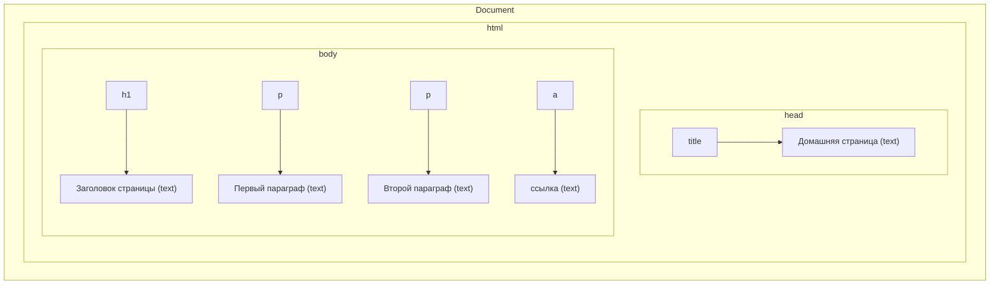

# Лекция 07. DOM и события: дерево, выборка, манипуляции, фазы, делегирование, производительность

План:

1. Что такое DOM: дерево узлов, ноды и элементы, атрибуты и свойства.
1. Поиск элементов: querySelector/All, getElementById/…; обход и коллекции.
1. Манипуляции: создание/вставка/удаление, шаблоны, классы и стили.
1. События: модель событий, addEventListener, this/target/currentTarget.
1. Фазы событий: capture → target → bubble; остановка распространения.
1. Делегирование событий: принцип, преимущества, практические паттерны.
1. Производительность DOM: reflow/repaint, батчинг изменений, DocumentFragment.
1. Безопасность вывода: textContent vs innerHTML; XSS‑риски.

Практика:

- Интерактивный список (ToDo): добавление/удаление/переключение статуса через делегирование; состояние в localStorage.
- Форма с валидацией: required, pattern, пользовательские ошибки; вывод сообщений без перезагрузки.
- Галерея/табы: переключение видимого контента классовыми переключателями.

Чтение (RU):

- [MDN: Введение в DOM](https://developer.mozilla.org/ru/docs/Web/API/Document_Object_Model/Introduction)
- [MDN: Document.querySelector](https://developer.mozilla.org/ru/docs/Web/API/Document/querySelector)
- [MDN: addEventListener](https://developer.mozilla.org/ru/docs/Web/API/EventTarget/addEventListener)
- [MDN: Руководство — Добавляем интерактивность](https://developer.mozilla.org/ru/docs/Learn_web_development/Getting_started/Your_first_website/Adding_interactivity)

Иллюстрации:

- [Схема DOM‑дерева (MDN)](https://developer.mozilla.org/ru/docs/Web/API/Document_Object_Model/Introduction)
- [Поток событий (capturing/bubbling)](https://learn.javascript.ru/bubbling-and-capturing)

---

## Материал для лекции

### 1. DOM: основы в повествовательной форме

Представьте, что браузер получает HTML как «сырой текст», а затем аккуратно собирает из него иерархию вложенных коробок: документ содержит html, у него внутри head и body, а уже в body — заголовки, параграфы, ссылки и текст. Эта внутренняя модель иерархии и есть Document Object Model (DOM) — структура данных из узлов, где каждый узел представляет элемент, текст или комментарий. Когда мы меняем DOM, страница перерисовывается и изменения становятся видны немедленно.

Для ориентации по дереву у нас есть связи: parentNode/parentElement — «родитель», childNodes/children — «дети», nextElementSibling/previousElementSibling — «соседи». У корня документа есть document.documentElement (обычно тег html), а также удобные ссылки document.head и document.body.

Набросаем минимальный документ с заголовком, двумя параграфами и ссылкой — чисто как мысленную модель для дальнейшего разговора:

```html
<!doctype html>
<html>
  <head>
    <title>Домашняя страница</title>
  </head>
  <body>
    <h1>Заголовок</h1>
    <p>Первый параграф с текстом.</p>
    <p>Второй параграф и <a href="https://example.com">ссылка</a>.</p>
  </body>
  </html>
```

И мысленно представим это как «объект в объекте» (дерево):



DOM — это про доступ и управление. Любой узел можно найти, прочитать его атрибуты и содержимое, а при необходимости — создать новые элементы, удалить старые, переставить местами. Всё как с деревом файлов, только узлы — это элементы и текст.

Небольшой пример: посчитаем элементы списка.

```html
<ul id="list">
  <li>Первый</li>
  <li>Второй</li>
</ul>
```

```js
const list = document.querySelector('#list')
console.log(list.children.length) // 2
```

### 2. Как находить и обходить элементы

На практике чаще всего используют querySelector и querySelectorAll — те же CSS‑селекторы, к которым мы привыкли в стилях. Это удобно, выразительно и кросс‑браузерно. Возвращаемые коллекции бывают «живыми» (HTMLCollection) и статическими (NodeList). Живые отражают изменения DOM сразу, статические — фиксируют срез на момент запроса.

Навигационные методы помогают ориентироваться без селекторов: parentElement, children, closest (поднимается вверх и ищет предка по селектору), contains (проверяет включение узла).

```js
const items = document.querySelectorAll('#list li')
items.forEach((li, i) => { li.dataset.idx = String(i) })
```

### 3. Меняем документ: элементы, классы, стили

Создавать можно через createElement и createTextNode, а массовые вставки — через шаблон в <template> или готовую строку (только если вы полностью контролируете содержимое). Вставка делается методами append/appendChild, before/after, prepend, replaceWith. Для оформления используйте классы (classList.add/remove/toggle) — это управляемо и масштабируемо; инлайн‑стили оставьте для редких случаев.

```js
const li = document.createElement('li')
li.textContent = 'Третий' // безопасно для пользовательского текста
list.append(li)

li.classList.add('active')
```

### 4. События и обработчики: где «цель», а где «контейнер»

Обработчики навешиваем через addEventListener(type, handler, options). Внутри колбэка важно отличать e.target (фактический источник события) и e.currentTarget (элемент, на котором висит обработчик). Для снятия обработчика нужна та же ссылка на функцию.

```js
function onClick(e) {
  console.log('клик по', e.currentTarget)
}
const btn = document.querySelector('#btn')
btn.addEventListener('click', onClick)
// btn.removeEventListener('click', onClick)
```

### 5. Фазы событий и делегирование

Событие проходит три стадии: захват (идём сверху вниз), цель (target) и всплытие (поднимаемся вверх). Мы можем слушать на стадии захвата (options.capture = true), а также останавливать распространение (e.stopPropagation) и отменять действие по умолчанию (e.preventDefault).

Делегирование — это приём, когда вместо множества обработчиков на дочерних элементах мы ставим один на общий контейнер и разбираем, по кому кликнули. Это проще, быстрее и легче поддерживать.

```js
const listEl = document.querySelector('#list')
listEl.addEventListener('click', (e) => {
  const li = e.target.closest('li')
  if (!li || !listEl.contains(li)) return
  li.classList.toggle('done')
})
```

### 6. Производительность DOM: как не заставлять движок «потеть» зря

Пересчёт раскладки (reflow) и перерисовка (repaint) стоят дорого. Старайтесь группировать изменения: генерируйте узлы во временном контейнере (DocumentFragment) и вставляйте одним действием; не чередуйте чтения геометрии (offsetWidth/Height, getBoundingClientRect) и записи стилей — разделяйте эти фазы.

```js
const frag = document.createDocumentFragment()
for (let i = 0; i < 1000; i++) {
  const li = document.createElement('li')
  li.textContent = 'Элемент #' + i
  frag.appendChild(li)
}
list.appendChild(frag)
```

### 7. Безопасность вывода: где textContent, а где innerHTML

Любой пользовательский ввод вставляйте через textContent — так вы избежите исполнения чужого HTML/скриптов. innerHTML используйте только для собственных заранее подготовленных шаблонов. Если нужно отобразить доверенный фрагмент HTML — пропускайте его через белый список тегов/атрибутов или надёжный санитайзер.

---

## Практика (мини‑задачи)

1. ToDo со статусом и удалением через делегирование

   - Поле ввода + кнопка → добавление `li`, клик по пункту переключает класс done, кнопка удаляет.
   - Сохраняйте массив задач в localStorage.

1. Форма обратной связи

   - Поля name/email/message; показывайте ошибки валидации рядом с полем; при успешной отправке — очистка и уведомление.

1. Табы/галерея

   - Клик по вкладке показывает соответствующую секцию; скрывать остальные классом hidden.

---

## Как собрать и запустить (Windows)

### Вариант 1. VS Code Live Server

- Установите расширение Live Server; откройте `index.html` → "Open with Live Server".

### Вариант 2. PowerShell HTTP сервер

```powershell
cd "C:\path\to\project"
python -m http.server 8000
```

Откройте: <http://localhost:8000>

---

## Мини‑шаблон (DOM + события)

```html
<!doctype html>
<html lang="ru">
<head>
  <meta charset="UTF-8" />
  <meta name="viewport" content="width=device-width, initial-scale=1" />
  <title>DOM Практика</title>
  <style>
    body { font-family: system-ui, Arial, sans-serif; margin: 2rem; }
    .done { text-decoration: line-through; color: #6c757d }
    .hidden { display: none }
  </style>
</head>
<body>
  <h1>ToDo + Форма</h1>
  <div>
    <input id="todo-input" placeholder="Новая задача" />
    <button id="add">Добавить</button>
  </div>
  <ul id="list"></ul>

  <hr />
  <form id="contact">
    <label>Имя <input name="name" required></label>
    <label>Email <input name="email" type="email" required></label>
    <label>Сообщение <textarea name="message" required></textarea></label>
    <div class="error" aria-live="polite"></div>
    <button type="submit">Отправить</button>
  </form>

  <script>
    const input = document.querySelector('#todo-input')
    const addBtn = document.querySelector('#add')
    const list = document.querySelector('#list')
    const KEY = 'vt-07-todos'

    const read = () => JSON.parse(localStorage.getItem(KEY) || '[]')
    const write = (x) => localStorage.setItem(KEY, JSON.stringify(x))

    function render(items) {
      list.innerHTML = items.map((t, i) => `
        <li data-i="${i}" class="${t.done ? 'done' : ''}">
          ${t.text}
          <button data-action="toggle">Готово</button>
          <button data-action="remove">Удалить</button>
        </li>`).join('')
    }

    let items = read(); render(items)

    addBtn.addEventListener('click', () => {
      const text = input.value.trim(); if (!text) return
      items = [...items, { text, done: false }]
      write(items); render(items)
      input.value = ''; input.focus()
    })

    list.addEventListener('click', (e) => {
      const li = e.target.closest('li'); if (!li) return
      const i = Number(li.dataset.i)
      const action = e.target.dataset.action
      if (action === 'toggle') items = items.map((t, idx) => idx === i ? { ...t, done: !t.done } : t)
      else if (action === 'remove') items = items.filter((_, idx) => idx !== i)
      write(items); render(items)
    })

    const form = document.querySelector('#contact')
    const err = form.querySelector('.error')
    form.addEventListener('submit', (e) => {
      e.preventDefault()
      const fd = new FormData(form)
      const email = String(fd.get('email') || '').trim()
      if (!email) { err.textContent = 'Введите email'; return }
      err.textContent = 'Отправлено!'; form.reset()
    })
  </script>
</body>
</html>
```

---

> Примечание: Материал изложен в связном повествовательном стиле, с опорой на русскоязычные источники. Для презентаций добавляйте схемы и скриншоты там, где это помогает пониманию.
