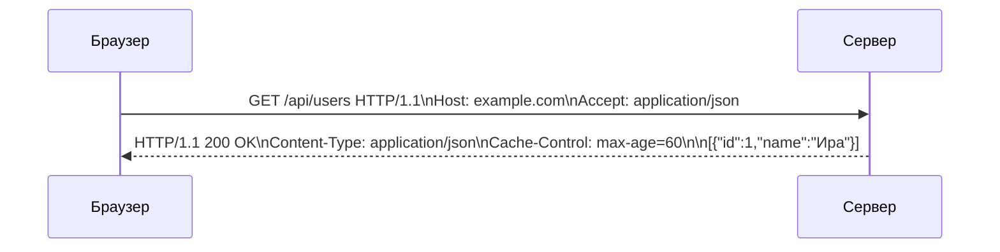
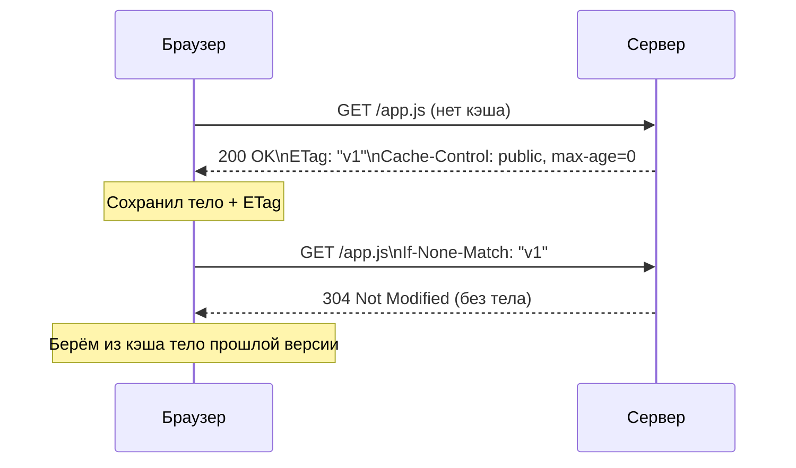
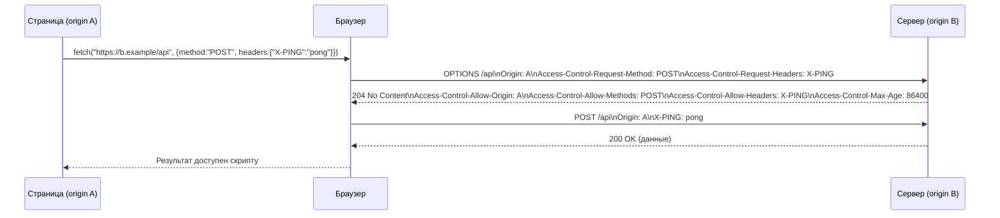
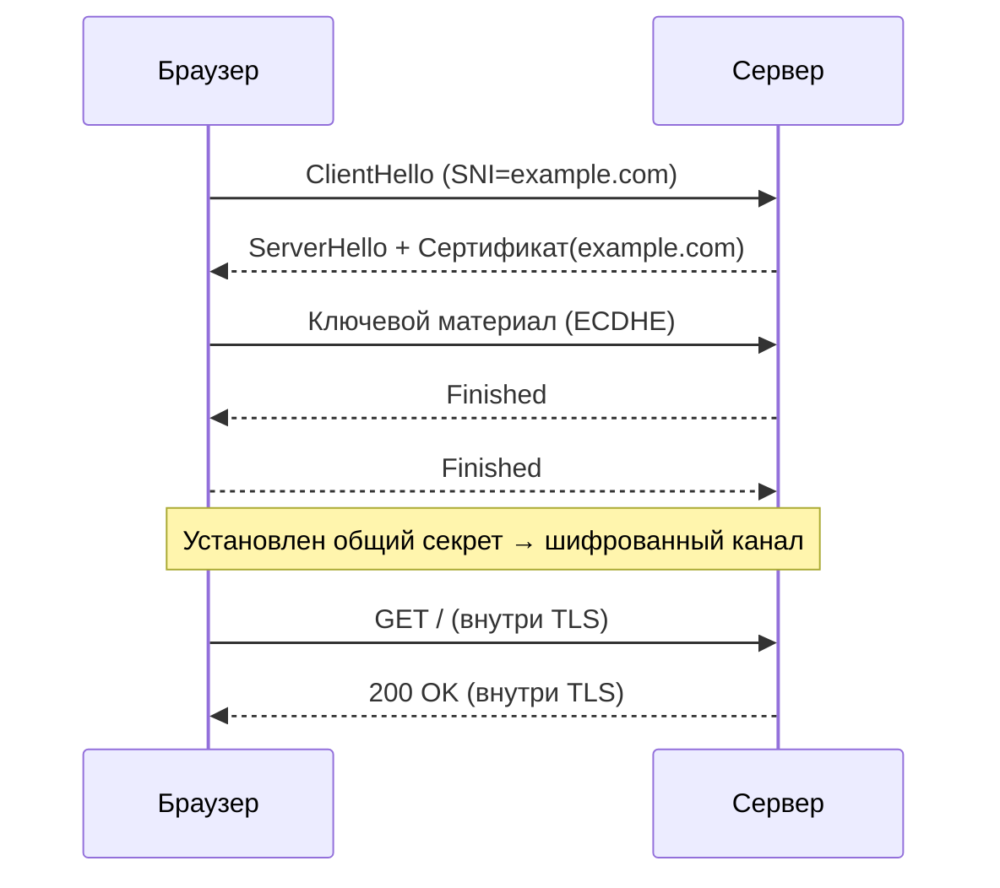

# Лекция 08. HTTP/HTTPS: методы, заголовки, кэширование, CORS, безопасность

Эта лекция — связный рассказ о том, как устроен HTTP «в жизни»: от первой строки запроса до шифрования TLS и заголовков, которые делают веб быстрее и безопаснее. Опираемся на идею из популярной статьи-введения в HTTP: отделяем семантику (что мы говорим) от транспорта (как мы это доставляем), объясняем, почему HTTPS стал «везде», зачем нужен CORS и как кэш экономит половину запросов.

---

## 1) С чего начинается HTTP: семантика «запрос ↔ ответ»

Представьте, вы пишете в мессенджере: сначала одно ясное предложение, затем детали. HTTP устроен так же.

- Первая строка запроса — это «глагол + путь + версия» (например: `GET /api/users?page=1 HTTP/1.1`).
- Дальше идут заголовки: короткие пары «ключ: значение», которые добавляют контекст (формат данных, авторизация, кэш‑политика и т. д.).
- Иногда есть тело запроса (обычно у POST/PUT/PATCH).
- Ответ симметричен: статусная строка (версия + код + фраза), заголовки и, при необходимости, тело.

Пример минимального обмена:

```http
GET /api/users?page=1 HTTP/1.1
Host: example.com
Accept: application/json

HTTP/1.1 200 OK
Content-Type: application/json; charset=utf-8
Cache-Control: max-age=60

[{"id":1,"name":"Ира"}]
```

Неформальные/кастомные заголовки допустимы, но чем ближе вы к стандарту, тем предсказуемее поведение прокси, кэшей и браузеров. Исторический префикс `X-` сейчас считают устаревшим — лучше сразу выбирать понятные, «говорящие» имена.

Иллюстрация (схема запроса/ответа):



---

## 2) Транспорт эволюционирует: HTTP/1.1 → HTTP/2 → HTTP/3

Семантика HTTP почти не менялась 20+ лет, а «как мы доставляем» — менялось радикально:

- HTTP/1.1: появились несколько важных практических улучшений по сравнению с HTTP/1.0, которые сделали протокол более пригодным для реального веба:
  - Постоянные соединения по умолчанию (Keep‑Alive): вместо открытия нового TCP‑соединения на каждый запрос подключение обычно держат открытым и выполняют несколько запросов подряд. Это сокращает накладные расходы на установку соединения.
  - Конвейеризация (pipelining): разрешается отправлять несколько запросов подряд без ожидания ответов, но из‑за того, что ответы должны приходить в том же порядке, что и запросы, и из‑за проблем с прокси/приоритетами, браузеры почти не использовали эту возможность — она плохо масштабировала параллелизм и приводила к «head‑of‑line» блокировке на прикладном уровне.
  - Chunked transfer‑encoding: добавлена возможность отправлять тело ответа частями (Transfer‑Encoding: chunked), когда заранее неизвестен общий размер — это важно для стриминга и динамического контента.
  - Host обязателен: заголовок Host сделал возможным виртуальный хостинг (несколько сайтов на одном IP), без него корректная маршрутизация запроса к конкретному сайту невозможна.
  - Expect: 100‑Continue: механизм для экономии трафика при больших телах — клиент может спросить у сервера, готов ли он принять запрос, прежде чем шлёт тело.
  - Диапазонные запросы и частичные ответы (Range / 206 Partial Content): поддержка скачивания кусков файла.
  - Текстовый формат заголовков и их избыточность: заголовки в HTTP/1.1 человекочитаемы, но многократно повторяемы и громоздки, что увеличивает накладные расходы и задержки при частых запросах.
  - Ограничения практики: сочетание последовательной обработки запросов на одном соединении, текстового и повторяющегося представления заголовков и ограничений TCP (head‑of‑line на транспортном уровне) привело к появлению более эффективных протоколов (HTTP/2/3) с бинарным фреймированием и мультиплексированием.
  - Обратная совместимость: семантика методов и кодов статуса осталась прежней, поэтому переход на новые версии стека не требует переработки моделей API, а даёт преимущественно улучшения в доставке и производительности.
- HTTP/2: бинарное фреймирование, мультиплексирование нескольких запросов по одному TCP‑соединению, сжатие заголовков (HPACK). Это сильно уменьшает задержки «головной блокировки» на уровне HTTP/1.1. Сервер Push исторически существовал, но сейчас практически не используется.

  - Бинарное фреймирование: вместо текстовых строк в HTTP/1.1 данные разбиваются на типизированные фреймы (HEADERS, DATA, SETTINGS, PRIORITY и т.д.). Это упрощает парсинг, позволяет инкапсулировать метаданные и эффективнее обрабатывать потоки.
  - Мультиплексирование: несколько логических потоков (streams) идут по одному TCP‑соединению одновременно — фреймы разных запросов/ответов чередуются. Это устраняет ограничение последовательной обработки запросов в одном соединении HTTP/1.1.
  - Ограничение: HTTP/2 убирает «head-of-line» блокировку на уровне HTTP, но TCP всё ещё обеспечивает порядковую доставку пакетов — при потере пакета блокируется весь TCP‑поток. Именно это привело к появлению HTTP/3/QUIC (на базе UDP), где потоки независимы.
  - HPACK (сжатие заголовков): использует статическую и динамическую таблицы + Huffman‑кодирование для уменьшения объёма повторяющихся заголовков. Внедряет механизмы, минимизирующие уязвимости старых схем сжатия (например, CRIME), но реализация должна быть корректной.
  - Server Push: позволяет серверу отправлять ресурсы клиенту до явного запроса. Практически редко используется в продакшене — легко привести к лишней передаче данных и конфликтам с кэшом; применять осторожно и только при явной пользе.
  - Практические советы: использовать ALPN/TLS (браузеры обычно поддерживают HTTP/2 только по TLS), профилировать загрузку через DevTools, не полагаться на Server Push как на основной оптимизатор, рассмотреть HTTP/3 для устранения TCP‑HOL в долгих соединениях.

  Gotchas:
  - Неправильные настройки приоритезации/flow control могут ухудшить производительность.
  - Server Push без учёта кэша клиента может увеличить трафик.
  - Отладка бинарного протокола требует специальных инструментов (nghttp2, h2load, Chrome DevTools — Network panel).
- HTTP/3: семантика HTTP остается прежней, но транспорт полностью переехал на QUIC поверх UDP. Коротко по сути:
  - QUIC объединяет транспорт и TLS (использует механизм, совместимый с TLS 1.3), поэтому рукопожатие быстрее и защищено «из коробки».
  - Настоящее мультиплексирование без TCP‑HOL: потеря пакета не блокирует другие логические поток(ы), улучшается отзывчивость при потере пакетов.
  - Быстрое установление соединения (меньше RTT, поддержка 0‑RTT в ряде случаев) и возможность миграции соединения при смене IP (полезно для мобильных клиентов).
  - Управление приоритетами и потоками на уровне QUIC даёт дополнительные возможности оптимизации загрузки ресурсов.
  - Ограничения и практические нюансы: QUIC/UDP может блокироваться в строгих сетях/прокси; отладка сложнее (бинарный протокол), а корректная настройка приоритезации и flow‑control важна для производительности.
  - Рекомендации: включайте HTTP/3 там, где это поддерживается CDN/сервером, тестируйте при реальных условиях (потери, мобильность), и обязательно оставляйте fallback на HTTP/2/1.1 для совместимости.

Вывод для разработчика: пишем тот же HTTP (методы, заголовки, коды), а ускорение приносит стек передачи данных под капотом. На практике «включить HTTPS и HTTP/2/3» — это и про безопасность, и про скорость.

---

## 3) Методы, идемпотентность и «дневник веб‑сервера»

Методы выражают намерение:

- GET и HEAD — безопасные и (для GET) идемпотентные: не должны менять состояние на сервере.
- PUT и DELETE — идемпотентны: повтор запроса оставляет ресурс в том же состоянии.
- POST — не идемпотентен: повтор может создавать дубликаты или выполнять действие снова.

Практическая деталь из «жизни»: веб‑серверы журналируют путь запроса. Если вы положите секреты в URL, они окажутся в логах. Поэтому чувствительные данные — в теле запроса (и по HTTPS), а не в query‑параметрах.

Коды статусов читаются как «семейства»: 2xx — успех; 3xx — перенаправления; 4xx — ошибка на стороне клиента; 5xx — значит, «сервера не сложилось». Полезные ориентиры: 200/201/204, 301/302/304, 400/401/403/404/409/429, 500/502/503.

---

## 4) Заголовки, которые встречаются каждый день

- Content-Type и Accept — описывают формат тела и желаемые форматы (контент‑негациация).
- Authorization — Basic/Bearer и пр.; вместе с 401/WWW-Authenticate формируют базовую схему доступа.
- Cookie и Set-Cookie — сессии и предпочтения. Для безопасности:
  - HttpOnly — недоступно JavaScript, меньше риск XSS‑кражи.
  - Secure — отправлять только по HTTPS.
  - SameSite=Lax/Strict/None — как вести себя при кросс‑сайтовых переходах (по умолчанию современные браузеры считают Lax; для `None` обязателен `Secure`).
  - Префиксы `__Host-` и `__Secure-` добавляют дополнительные гарантии корректной установки cookie.
- Vary — расширяет ключ кэша (например, по Accept-Encoding или Origin).

---

## 5) Кэширование: «сильное» и «условное»

Кэш нужен, чтобы не ходить зря. Есть две большие стратегии:

1) «Сильное» (fresh) кэширование по времени

- Сервер говорит: `Cache-Control: public, max-age=3600` (иногда ещё `Expires`). Пока объект свежий — клиент берёт его из кэша без запроса к серверу.
- Для частных данных используйте `private`; для всего, что можно кэшировать прокси и CDN, — `public`.

1) «Условное» (revalidation) кэширование по валидаторам

- Сервер выдаёт валидатор версии: `ETag: "abc123"` или время изменения: `Last-Modified: Tue, 01 Oct 2024 12:34:56 GMT`.
- Клиент при следующем запросе отправляет:
  - `If-None-Match: "abc123"` → при совпадении сервер отвечает `304 Not Modified` без тела.
  - `If-Modified-Since: <дата>` → сервер сравнивает с последней модификацией.
- ETag точнее, чем даты. Бывают «сильные» (`"v1"`) и «слабые» (`W/"v1"`) ETag — слабые означают «семантически то же», но не побайтно.

Полезные директивы:

- `no-store` — не сохранять вообще (для чувствительных ответов).
- `no-cache` — можно хранить, но перед отдачей нужно валидировать у origin.
- `must-revalidate` — не использовать просроченное без проверки.

Иллюстрация (ETag и 304):



Про `Vary`: если ответ зависит, например, от `Accept-Encoding` или `Origin`, сервер обязан добавить `Vary: Accept-Encoding, Origin`, иначе кэши начнут отдавать «чужой» вариант.

---

## 6) CORS: как сервер решает, можно ли «соседям»

Браузер по умолчанию защищает пользователей политикой одного источника. Когда страница с origin A хочет обратиться к ресурсу на origin B, браузер проверяет разрешение.

- Для «простых» запросов (GET с типичными заголовками) браузер сразу выполняет запрос, но отдаст данные странице только если в ответе есть соответствующий `Access-Control-Allow-Origin`.
- Для «непростых» запросов (нестандартные заголовки, методы отличные от GET/HEAD/POST, или `Content-Type` не из «безопасных») браузер сначала делает preflight: `OPTIONS` с заголовками `Access-Control-Request-Method` и `Access-Control-Request-Headers`.
- Сервер явно отвечает, что разрешено: `Access-Control-Allow-Methods`, `Access-Control-Allow-Headers`, `Access-Control-Allow-Origin` и, при необходимости, `Access-Control-Max-Age`.
- Если нужны «credentialed requests» (cookie/авторизация), сервер должен отдать `Access-Control-Allow-Credentials: true` и конкретный `Access-Control-Allow-Origin` (звёздочка в этом случае недопустима).

Иллюстрация (preflight):



Практический совет: если включаете cookies, добавьте к ответу ещё `Vary: Origin`, иначе кэши могут склеивать ответы разных источников.

---

## 7) HTTPS: кто на том конце и как не дать подслушать

История из жизни: вы в аэропорту на публичном Wi‑Fi, вам нужен онлайн‑банкинг. Две задачи — убедиться, что вы говорите с «правильным» банком (аутентификация), и чтобы никто посередине не прочитал (шифрование).

Как это решает HTTPS:

1) Сертификат (X.509) подтверждает домен. Браузер проверяет цепочку доверия до доверенного центра сертификации (CA) и имя хоста (SNI позволяет одному IP обслуживать разные сертификаты).
2) Во время TLS‑рукопожатия стороны согласовывают криптографию и устанавливают общий секрет (современные наборы — на основе Диффи—Хеллмана/Эллиптических кривых).
3) Дальше весь HTTP идёт внутри зашифрованного канала.

Мини‑схема (упрощённо):



Почему «HTTPS везде»: браузеры помечают HTTP как небезопасный, многие веб‑API работают только с «защищённым контекстом», а HTTP/2/3 обычно доступны лишь поверх TLS. Добавьте к этому HSTS — заголовок `Strict-Transport-Security`, который говорит браузеру «сюда всегда только по HTTPS» (можно распространить на поддомены и включиться в предзагруженный список браузеров).

И ещё: «смешанный контент» (HTTP‑ресурсы внутри HTTPS‑страницы) блокируется — грузите картинки/скрипты/стили по HTTPS.

---

## 8) Ещё про безопасность на уровне протокола

- CSP (Content‑Security‑Policy): белые списки источников скриптов/стилей/изображений, защита от XSS и внедрений. Начинайте с режима наблюдения (`Content-Security-Policy-Report-Only`) и узкого `default-src`.
- HSTS: принудительный HTTPS (см. выше). Директивы `max-age`, `includeSubDomains`, опционально `preload`.
- Cookies: `HttpOnly`, `Secure`, `SameSite` по умолчанию Lax; для кросс‑сайтовых сценариев используйте `SameSite=None; Secure` осознанно.
- Referrer-Policy, Permissions-Policy, X-Frame-Options — полезные дополнения для минимизации утечек/поверхностей атаки.

---

## Практика (мини‑задачи)

1) Включите ETag и `Last-Modified` на статиках, перезагрузите страницу и посмотрите в DevTools → Network разницу в waterfall и размере трафика при `304 Not Modified`.
2) Настройте CORS: разрешите один конкретный origin, верните preflight‑заголовки; затем проверьте сценарий с `credentials` и убедитесь, что звёздочка в `Access-Control-Allow-Origin` не работает с cookie.
3) Поиграйте со статусами: верните 201 (создание), 204 (без тела), 304 (не изменилось), 400/401/403/404/409/429/503 и проверьте их обработку в `fetch` (`res.ok`, `res.status`).
4) Добавьте Set-Cookie с `HttpOnly; Secure; SameSite=Strict`, убедитесь, что cookie не доступно из JS и не утекает в кросс‑сайтовых запросах.
5) Включите HSTS (минимальный `max-age`) и увидьте, как браузер больше не ходит по HTTP (помните, включать только на корректно работающем HTTPS‑домене!).

---

## Как запустить (Windows)

### Вариант 1. Python http.server (статик + заголовки через прокси/сервер)

```powershell
cd "C:\path\to\project"; python -m http.server 8000
```

Для демонстрации кэширования/ETag удобнее использовать полноценный сервер (см. ниже).

### Вариант 2. Node + Express: CORS, кэш, куки

```js
import express from 'express'
import cors from 'cors'

const app = express()

// Разрешаем конкретный origin; для credentials звёздочку использовать нельзя
app.use(cors({ origin: 'http://localhost:5173', credentials: true }))

// Простая «версионированная» отдача с ETag
app.get('/app.js', (req, res) => {
  const body = 'console.log("hello")\n'
  // Условная отдача по ETag
  const etag = 'W/"v1"'
  res.set('ETag', etag)
  res.set('Cache-Control', 'public, max-age=0')
  if (req.headers['if-none-match'] === etag) {
    return res.status(304).end()
  }
  res.type('application/javascript').send(body)
})

// Демонстрация Set-Cookie c безопасными атрибутами
app.get('/login', (req, res) => {
  res.cookie('sid', 'abc123', {
    httpOnly: true,
    secure: true,
    sameSite: 'strict',
    path: '/',
  })
  res.json({ ok: true })
})

app.listen(3000, () => console.log('http://localhost:3000'))
```

---

Примечание по источникам: в тексте агрегированы материалы из русскоязычной документации по HTTP (обзор протокола, заголовки, кэширование, CORS, TLS/HSTS) и объяснения из популярного вводного материала по веб‑безопасности. Формулировки адаптированы под учебный повествовательный формат без прямого цитирования.
