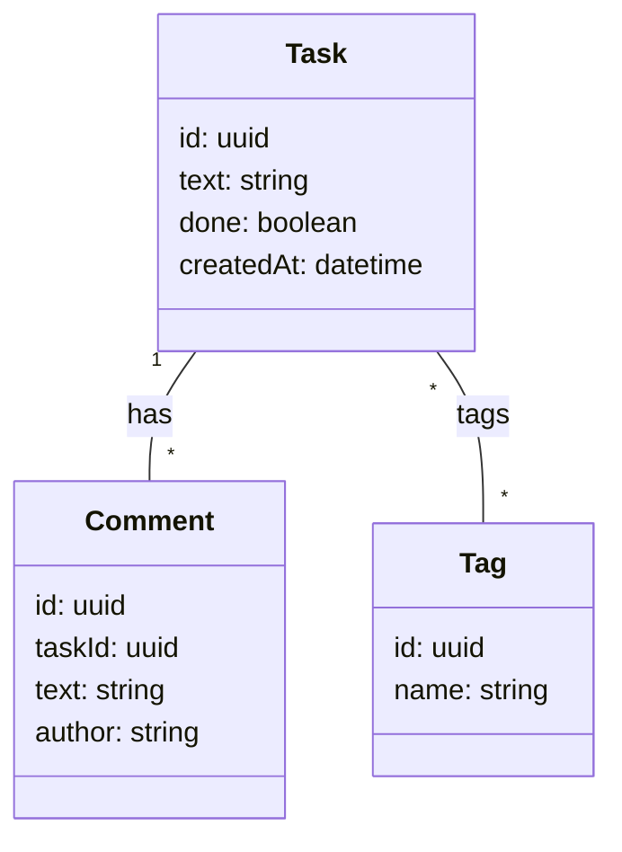
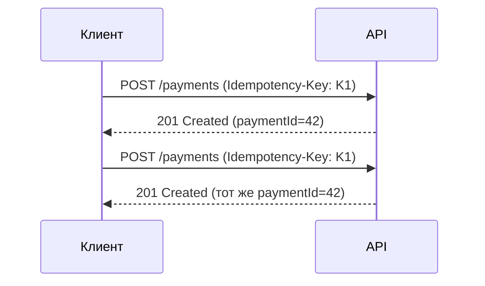
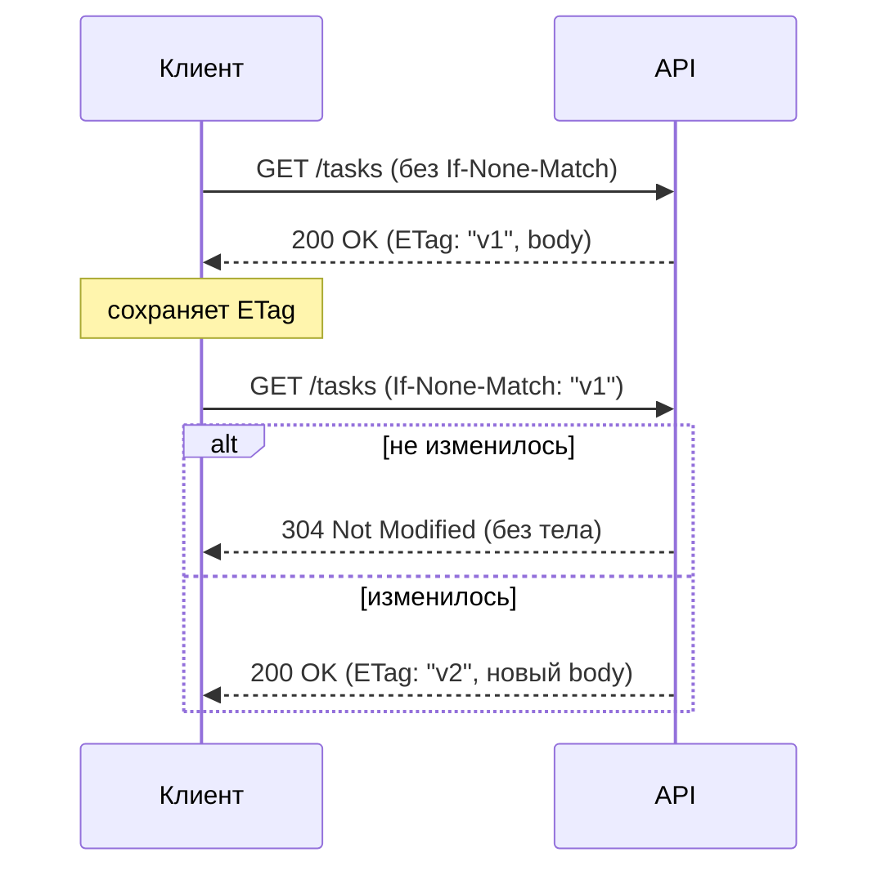

# Лекция 09. REST API: принципы, дизайн, контракты и эволюция

Эта лекция — практичный рассказ о том, как проектировать REST API так, чтобы им было легко пользоваться, безопасно развивать и удобно поддерживать в продакшене. Разбираем ресурсы и маршруты, ошибки и версии, пагинацию и фильтры, кэш и идемпотентность — без ссылок, в виде сгущённого опыта и примеров.

---

## 1) REST «по‑человечески»: ресурсы, представления, унифицированный интерфейс

REST — это про ресурсы, а не про RPC. Ресурс — сущность со своим URI, представление — обычно JSON. Унифицированный интерфейс — методы HTTP, статусы и заголовки.

### Пример ресурсной модели (Task — Comment — Tag)

Ниже — краткое объяснение модели и типовые представления/эндпоинты. Цель — показать отношения и рекомендации по сериализации в JSON: что хранить как ссылку, а что — встраивать.

- Сущности и отношения
  - Task — основная сущность (задача). Может иметь много Comment и много Tag.
  - Comment — подресурс, привязан к конкретной Task (one-to-many). Обычно хранится отдельно и доступен как /tasks/{id}/comments.
  - Tag — справочник (lookup). Отношение с Task — many-to-many: связи хранятся как ссылки/идентификаторы или через отдельную коллекцию/связку.

Рекомендации по представлению
- Для списка задач возвращайте компактные представления (id, text, done, короткий список tagIds или tagNames) и отдельный endpoint для детальной информации с встраиванием при необходимости.
- Комментарии обычно возвращаются как подресурс (постранично для больших объёмов).
- Теги — как отдельная коллекция; при создании/обновлении передаётся tagId.

Примеры JSON-схем (пример для ответа API)

Task (детально):
```json
{
  "id": "uuid",
  "text": "Buy milk",
  "done": false,
  "createdAt": "2025-10-15T10:00:00Z",
  "updatedAt": "2025-10-15T11:00:00Z",
  "tagIds": ["tag-1-uuid", "tag-2-uuid"]
}
```

Task (компактно — для списков):
```json
{
  "id": "uuid",
  "text": "Buy milk",
  "done": false,
  "createdAt": "2025-10-15T10:00:00Z",
  "tags": ["shopping", "urgent"]  // опционально: имена тегов для удобства UI
}
```

Comment (подресурс):
```json
{
  "id": "uuid",
  "taskId": "task-uuid",
  "author": "ivan@example.com",
  "text": "Не забудь проверить срок годности",
  "createdAt": "2025-10-15T10:05:00Z"
}
```

Tag:
```json
{
  "id": "uuid",
  "name": "shopping",
  "description": "Items to buy"
}
```

Типовые эндпоинты
- Коллекции:
  - GET /tasks
  - POST /tasks
  - GET /tags
  - POST /tags
- Элементы и подресурсы:
  - GET /tasks/{id}
  - PATCH /tasks/{id}
  - DELETE /tasks/{id}
  - GET /tasks/{id}/comments
  - POST /tasks/{id}/comments
  - POST /tasks/{id}/tags { "tagId": "..." } — добавить связь
  - DELETE /tasks/{id}/tags/{tagId} — удалить связь

Советы по эволюции дизайна
- Для расширения полей Task добавляйте новые необязательные поля; не удаляйте и не переименовывайте существующие.
- При больших объёмах комментариев поддерживайте пагинацию на /tasks/{id}/comments.
- Если нужна атомарная операция создания задачи с тегами и комментариями — используйте транзакционный endpoint (POST /tasks с вложенными объектами) или отдельный бизнес-оператор, документируйте поведение (идемпотентность).
- В ответах для создания возвращайте 201 + Location: /tasks/{id} и тело созданного ресурса.
- Для оптимизации кеширования возвращайте в заголовках ETag/Last-Modified и поддерживайте условные GET для списков/элементов.

Этот набор правил и примеров даёт удобную, понятную модель ресурсов и позволяет масштабировать API без ломки клиентов.



---

## 2) Маршруты, методы и идемпотентность

Коллекции и элементы:

```text
GET    /tasks           # список
POST   /tasks           # создать
GET    /tasks/{id}      # получить
PATCH  /tasks/{id}      # обновить частично
PUT    /tasks/{id}      # заменить целиком
DELETE /tasks/{id}      # удалить
```

Подресурсы: `/tasks/{id}/comments`, связь «многие ко многим» — через коллекции/ссылки: `/tasks/{id}/tags`, `POST /tasks/{id}/tags { tagId }`.

Идемпотентность в дизайне:

- GET/HEAD/PUT/DELETE — идемпотентны; POST — нет; PATCH — зависит от операции.
- На критичных POST используйте идемпотентный ключ (`Idempotency-Key`) — сервер кэширует результат для ключа и возвращает тот же ответ при повторах.

Диаграмма (идемпотентный POST):



---

## 3) Форматы и контракты: «сначала схема, потом код»

Смысл «сначала схема, потом код»: сначала формально описывают форматы данных и контракт API (JSON Schema, OpenAPI, GraphQL schema и т.п.), а затем реализуют сервер/клиент по этому контракту. Это превращает API в явный, проверяемый и документированный контракт между сторонами.

Контракт‑first: схема → генерация → тесты → реализация

```mermaid
flowchart LR
  S[Schema (OpenAPI / JSON Schema)] --> G[Codegen (server/client stubs)]
  G --> T[Contract tests / Mock servers]
  T --> I[Implement business logic against stubs]
  I --> D[Deploy; monitor & version]
```

Преимущества:

- Явные контракты: потребители и поставщики договариваются через схему.
- Генерация SDK и моков ускоряет разработку и интеграцию.
- Контрактные тесты (consumer-driven or schema-based) ловят расхождения на ранней стадии.
- Лёгкость эволюции: схема — источник правды, версии и миграции видны явно.

Тело ответа для задачи:

```json
{
  "id": "uuid",
  "text": "Buy milk",
  "done": false,
  "createdAt": "2025-10-15T10:00:00Z"
}
```

Пагинация/фильтрация/сортировка:

- Запрос: `GET /tasks?page=1&pageSize=20&done=true&sort=-createdAt`.
- Ответ:

```json
{
  "items": [ /* ... */ ],
  "total": 137,
  "page": 1,
  "pageSize": 20
}
```

Единый формат ошибок:

```json
{
  "code": "VALIDATION_ERROR",
  "message": "text is required",
  "details": { "text": "required" },
  "traceId": "b3f5..."
}
```

Рекомендации:

- Валидируйте вход (тип/границы/бизнес‑правила), не смешивайте 4xx и 5xx.
- Для создания используйте 201 + заголовок `Location: /tasks/{id}`.
- Возвращайте `Content-Type: application/json; charset=utf-8` и явные `Cache-Control`.

---

## 4) Коды и заголовки, которые делают API предсказуемым

- Успех: 200 OK, 201 Created (+ Location), 204 No Content.
- Клиентские ошибки: 400/401/403/404/409/422/429.
- Серверные ошибки: 500/502/503.
- Кэширование и условные запросы: `ETag/If-None-Match`, `Last-Modified/If-Modified-Since`.
- Версионирование контента: `Accept: application/vnd.example.v2+json` (по ситуации).

Диаграмма: условный GET с ETag



---

## 5) Аутентификация и авторизация: токены, роли, CORS (развернуто)

Кратко: аутентификация — кто вы (identity), авторизация — что разрешено (permissions). В реальных API это сочетание токенов/сессий, правил доступа (roles/scopes/claims) и защиты браузерного взаимодействия (CORS, cookies, CSRF).

### 5.1 Токены: типы и когда что использовать

- JWT (self‑contained): содержит claims (iss, aud, sub, exp, iat, jti, scope/roles). Удобен для распределённых систем (нет обращения к центральному хранилищу при каждом запросе), но требует короткого времени жизни и проверки подписи.
- Opaque tokens (слепые идентификаторы): сервер хранит состояние (token store / introspection). Проще отозвать и управлять сессиями.
- Refresh tokens: длиноживущий, хранится безопасно (см. storage). Используется для получения новых access token.

Рекомендации:

- Используйте короткоживущий access token (~minutes–hours).
- Refresh tokens — только при доверенных клиентах; применяйте ротацию refresh token и храните их безопасно.
- Для критичных операций добавляйте nonce или jti + серверную дедупликацию.

Пример простого JWT payload:
```json
{
  "iss": "https://auth.example.com",
  "aud": "tasks-api",
  "sub": "user-123",
  "scope": "tasks:read tasks:write",
  "roles": ["user"],
  "exp": 1710000000,
  "iat": 1709996400,
  "jti": "uuid"
}
```

### 5.2 Где хранить токены (безопасность браузера)

- Никогда не хранить чувствительные токены в localStorage/sessionStorage, если возможен XSS — считывание легко.

Для веб‑приложений предпочтительны HttpOnly, Secure cookies с SameSite=strict/lax для session/refresh tokens:

```text
Set-Cookie: refresh=...; HttpOnly; Secure; SameSite=Strict; Path=/auth
```

- Для SPA с OAuth2 — рекомендован PKCE + хранение access token в памяти (не persist), refresh token — через secure cookie или Authorization Code + refresh on server side.

### 5.3 CSRF, XSS и защита при использовании cookies

- Если используете cookies для аутентификации, защищайте от CSRF: SameSite, CSRF‑токен для state‑changing запросов или используйте double submit cookie.

- XSS mitigations: CSP, эскейпинг, регулярный аудит кода — чтобы не допускать кражи токенов.

### 5.4 OAuth2 / OpenID Connect практики

- Для серверных приложений — Authorization Code flow.
- Для публичных клиентов (SPA, мобильные) — Authorization Code + PKCE.
- Используйте OpenID Connect, если нужен identity (userinfo, id_token).
- Проверяйте: iss, aud, exp, nbf, jti (при необходимости), подпись и алгоритм (не принимаете unsigned).

### 5.5 Роли, scope, claims: модель авторизации

- Scope — действие/операция (tasks:read, tasks:write) — хорошо для coarse‑grained API разрешений.
- Roles — удобны в приложениях для групповых прав (admin, moderator).
- Claims — дополнительная информация (tenantId, orgId) для контекстной авторизации.

Проверки:

- Двууровневая авторизация: маршрутное (route-level) разрешение + бизнес‑логика на уровне операций.
- Принцип наименьших привилегий: выдавайте минимально необходимые scope/role.

### 5.6 Отзыв токенов, ротация и безопасность

- Для JWT: короткий срок жизни + механизм blacklisting/revocation для критичных случаев (logout, компрометация).
- Для refresh tokens: ротация (при обмене выдавать новый refresh token и помечать старый как использованный).
- Используйте token introspection для opaque tokens (RFC 7662).

### 5.7 Логирование, аудит и мониторинг

- Логируйте события аутентификации/отзыва (не сохраняйте токены в логах).
- Добавляйте traceId и correlation id для расследования проблем.
- Включайте метрики неудачных попыток входа и подозрительную активность (rate limit, brute force).

### 5.8 CORS: настройки и нюансы

- CORS нужен только когда браузерный клиент на другом origin обращается к API.

Минимально необходимые заголовки:

- Access-Control-Allow-Origin: https://app.example.com  (не "*" если с credentials)
- Access-Control-Allow-Credentials: true  (если используете cookie)
- Vary: Origin
- Access-Control-Allow-Methods: GET, POST, PATCH, DELETE, OPTIONS
- Access-Control-Allow-Headers: Authorization, Content-Type, X-Requested-With, Idempotency-Key

- Не делайте Access-Control-Allow-Origin: * при Access-Control-Allow-Credentials: true.
- Реагируйте корректно на preflight (OPTIONS): отдавайте CORS‑заголовки и подходящий Access‑Control‑Max‑Age.
- Для экспонирования кастомных заголовков (например, Location или Retry-After) используйте Access-Control-Expose-Headers.

Пример ответа для cookie + CORS:

```http
Access-Control-Allow-Origin: https://app.example.com
Access-Control-Allow-Credentials: true
Vary: Origin
```

### 5.9 Примеры использования токенов
- Bearer header:
  - Authorization: Bearer eyJhbGciOi...
- Установка HttpOnly cookie (серверный ответ):
  - Set-Cookie: refresh=...; HttpOnly; Secure; SameSite=Strict; Path=/auth

### 5.10 Контрольный список (быстрые рекомендации)
- access token — короткий срок жизни; refresh токен — защищённо и с ротацией.
- используйте Authorization header для API‑вызовов; для браузера — предпочтительно HttpOnly cookie + CSRF.
- реализуйте проверку подписи/iss/aud/exp/nbf для JWTs.
- реализуйте server‑side authorization (RBAC/ABAC) в бизнес‑логике, а не только на уровне маршрутов.
- не возвращайте токены в логах/ошибках; логируйте события входа/отзыва.
- правильно конфигурируйте CORS: конкретные origin, credentials только при необходимости, Vary: Origin.

Эти правила дают баланс между удобством (SPA, мобильные клиенты) и безопасностью (XSS/CSRF/отзыв токенов). Под каждый проект адаптируйте TTL, модель хранения и flow (OAuth2 vs session) с учётом угроз и доверия к клиенту.

- `Authorization: Bearer <JWT>`; в payload — `sub`, `scope`/`roles`, `exp`.
- Разграничивайте доступ на уровне маршрутов и бизнес‑операций.
- Для браузера настройте CORS: конкретный `Access-Control-Allow-Origin`, `Vary: Origin`, `Access-Control-Allow-Credentials` по необходимости.

---

## 6) Версионирование и эволюция API

Не ломайте клиентов. Стратегии:

1. Версия в URI: `/v1` — просто, наглядно.
1. Версия в медиатипе/заголовке — гибче, но сложнее в обслуживании.

Правила эволюции без мажора:

- Добавление необязательных полей — допустимо.
- Запрет же на удаление/переименование полей, смену типов, изменение значений по умолчанию.
- Для критичных изменений — новая версия; старую объявляйте устаревшей с горизонтом вывода.

---

## 7) Документация как контракт (OpenAPI)

Сначала схема, затем реализация и автогенерация SDK/моков. Пример фрагмента:

```yaml
openapi: 3.0.3
info:
  title: Tasks API
  version: 1.0.0
paths:
  /tasks:
    get:
      responses:
        '200': { description: OK }
```

---

## 8) Десять правил «приятного» REST API

1. Ресурсы и коллекции по существительным, действия — через методы.
1. Стабильные коды и заголовки: 201+Location при создании, 204 при удалении без тела.
1. Единый формат ошибок с `code`/`message`/`details`/`traceId`.
1. Пагинация/фильтры/сортировка — консистентные имена и типы.
1. Идемпотентность там, где это критично, — ключ или дедупликация.
1. Кэшируйте «читающие» ответы, используйте ETag/304.
1. Явные лимиты и ошибки 429, заголовки rate limit (при наличии).
1. Логи/метрики/корреляция (traceId), чтобы быстро находить проблемы.
1. Версионирование с политикой обратной совместимости.
1. Документация — часть поставки, не пост‑фактум.

---

## Схема жизненного цикла запроса (REST)

```mermaid
flowchart TD
  A[Запрос] --> B[Аутентификация/Авторизация]
  B -- fail --> X1[401/403]
  B -- ok --> C[Валидация входных данных]
  C -- fail --> X2[422/400]
  C -- ok --> D[Бизнес-логика]
  D --> E[Доступ к данным (DB/Cache/Queue)]
  E --> F[Формирование ответа]
  F --> G[Заголовки: Content-Type, Cache-Control, ETag]
  G --> H[Логи/Метрики/TraceId]
  H --> I[Ответ клиенту]
```

### Карта обработки ошибок (REST)

```mermaid
flowchart TD
  A[Запрос] --> B{Аутентификация/доступ}
  B -- нет токена/истёк --> E1[401 Unauthorized]
  B -- нет прав/запрещено --> E2[403 Forbidden]
  B -- ок --> C{Валидация ввода}
  C -- синтаксис/тип/формат --> E3[400 Bad Request]
  C -- бизнес-валидация не прошла --> E4[422 Unprocessable Entity]
  C -- ок --> D{Ресурс/операция}
  D -- не найдено --> E5[404 Not Found]
  D -- конфликт состояния --> E6[409 Conflict]
  D -- превышен лимит --> E7[429 Too Many Requests]
  D -- ок --> R[200/201/204 ...]
  %% Непредвиденная ошибка
  A -. исключение .-> E8[5xx (500/502/503)]
```

## Практика (мини‑задачи)

1. Спроектируйте `Task` API (коллекция/элемент/подресурсы), добавьте пагинацию/фильтры/сортировку.
1. Реализуйте формат ошибок и статусы для типовых сценариев (201/204/404/409/422/429).
1. Добавьте ETag и условные GET, проверьте 304 в DevTools.
1. Введите `Idempotency-Key` для POST, покройте повторные запросы.
1. Оформите OpenAPI и сгенерируйте мок/SDK.

---

## Как запустить (Windows)

### Вариант: Node + Express (демо API)

```js
import express from 'express'
import cors from 'cors'
import { randomUUID } from 'node:crypto'

const app = express()
app.use(cors())
app.use(express.json())

let tasks = []

app.get('/tasks', (req, res) => {
  res.json({ items: tasks, total: tasks.length, page: 1, pageSize: tasks.length })
})

app.post('/tasks', (req, res) => {
  const { text } = req.body || {}
  if (!text) return res.status(422).json({ code: 'VALIDATION_ERROR', message: 'text required' })
  const t = { id: randomUUID(), text, done: false, createdAt: new Date().toISOString() }
  tasks.push(t)
  res.status(201).location(`/tasks/${t.id}`).json(t)
})

app.patch('/tasks/:id', (req, res) => {
  const t = tasks.find(x => x.id === req.params.id)
  if (!t) return res.sendStatus(404)
  Object.assign(t, req.body)
  res.json(t)
})

app.delete('/tasks/:id', (req, res) => {
  const before = tasks.length
  tasks = tasks.filter(x => x.id !== req.params.id)
  if (tasks.length === before) return res.sendStatus(404)
  res.sendStatus(204)
})

app.listen(3000, () => console.log('http://localhost:3000'))
```

---

Примечание по источникам: материал агрегирован из проверенных русскоязычных руководств по HTTP/REST, практик проектирования API и опыта продакшен‑эксплуатации. Формулировки адаптированы под учебный формат без прямого цитирования.
 
