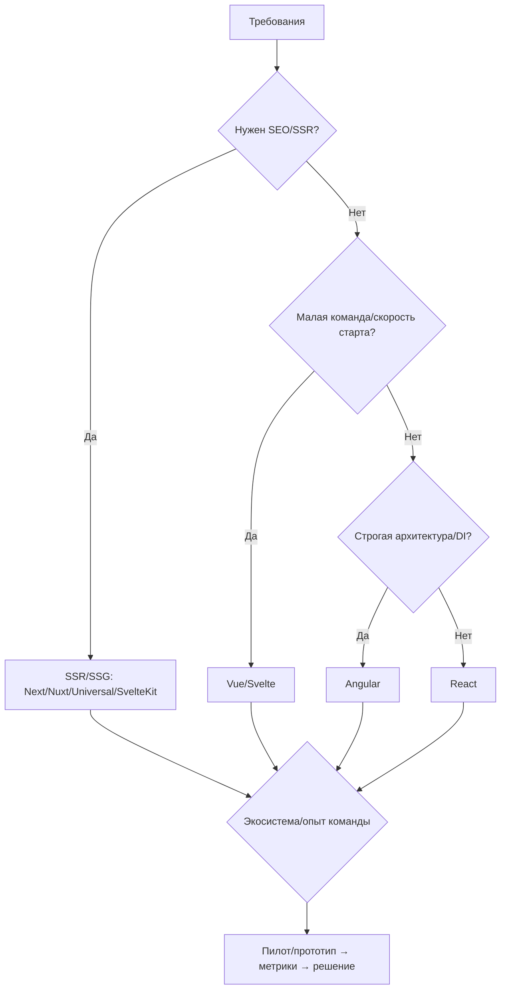

# Лекция 12. Фронтенд‑фреймворки: как думают React, Vue, Angular и Svelte

Это обзор без «религиозных войн»: разбираем ментальные модели, экосистемы и производительность, чтобы осознанно выбирать инструмент под задачу. В конце — минимальные примеры и практикум «Список задач» на каждом.

---

## 1) Как устроено обновление UI: четыре подхода

- React: виртуальный DOM, функции и хуки, однонаправленный поток данных. Контрольный выстрел — предсказуемость через чистые компоненты и эффекты.
- Vue: реактивность на proxy — зависимости собираются «прозрачно», меняете данные — меняются подписчики. Можно шаблоны или JSX, удобный Composition API.
- Angular: DI и декларативные шаблоны, реактивное мышление (RxJS) и строгая архитектура. В последних версиях — standalone‑компоненты и signals для точечных апдейтов.
- Svelte: компилятор превращает компоненты в минимальный JS — меньше рантайма, реактивность на уровне присваиваний.

Общий цикл:

Что общего у этих фреймворков
Отличия играют решающую роль, но давайте сперва попробуем выяснить, что общего у фреймворков из нашего теста.
Все они:

с открытым исходным кодом;
предназначены для веб-разработки;
расширяют возможности HTML, чтобы можно было использовать циклы и условия;
имеют компоненты для инкапсуляции;
позволяют создавать одностраничные приложения (SPA);
поддерживают командную строку (CLI);
имеют комфортную среду разработки с поддержкой отладки в браузере;
используют VS Code как IDE по умолчанию;
обладают достойной производительностью.

---

## 2) Базовые паттерны: компоненты, состояние, маршруты, формы

- Компоненты как функции/классы/шаблоны; вход — props, выход — UI.
- Локальное состояние и глобальное (Redux/Pinia/NgRx/Zustand и т.п.).
- Маршрутизация: отдельный пакет/модуль; защищённые маршруты и lazy‑загрузка.
- Формы: контролируемые элементы/директивы, валидация, UX ошибок.

---

## 3) Производительность и рендеринг: SSR/SSG, гидратация, разделение кода
- SSR/SSG — ускорение первого рендера и SEO (Next.js, Nuxt, Angular Universal, SvelteKit)  
  SSR (Server‑Side Rendering) — рендер страницы на сервере по запросу и отдача готового HTML. Плюсы: быстрый первый контент (FCP), актуальные данные и простая SEO‑индексация. Минусы: нагрузка на сервер/edge, сложность кэширования и возможная задержка TTFB.  
  SSG (Static Site Generation) — предкомпиляция страниц во время сборки в статические HTML‑файлы. Плюсы: быстрая отдача через CDN, простое масштабирование и отличное кэширование. Минусы: долгие сборки при большом количестве страниц и сложности с персонализацией; решается ISR/edge‑рендерингом или комбинированием с CSR/SSR для отдельных маршрутов.  
  Практический совет: выбирать SSR при частых изменениях/персонализации, SSG — для контента, который редко меняется; гибридные подходы (инкрементальная генерация, serverless/edge) дают компромисс.

- Гидратация и частичная гидратация (islands) — снижение JS‑нагрузки на клиенте  
  Гидратация — процесс привязки клиентского JS к HTML, сгенерированному на сервере, чтобы сделать страницу интерактивной. Проблемы: задержка интерактивности, возможные mismatch‑ошибки и двойной рендер.  
  Частичная гидратация (islands architecture) — только интерактивные фрагменты страницы получают JS и гидратируются; остальное остаётся статичным. Это уменьшает общий объём выполняемого JS и ускоряет Time to Interactive.  
  Практический совет: помечайте мелкие виджеты как «острова», загружайте их лениво и используйте lightweight runtime для критических интерактивных частей.

- Code splitting и динамический импорт — обязательны для крупных приложений  
  Code splitting — разделение бандла на логические чанки (страницы, модули, роутинговые сегменты). Динамический импорт (import()) позволяет загружать код по требованию. Плюсы: меньший начальный бандл, быстрее первая загрузка и масштабируемая скорость разработки.  
  Минусы/нюансы: сложнее отладка, нужно управлять preload/prefetch и учитывать зависимости между чанками. Инструменты (webpack, Vite, Rollup, фреймворковые рантаймы) обычно предоставляют удобные механизмы для этого.  
  Практический совет: split по роутам и крупным компонентам; критический код бандлить вместе, неблокирующие части — лениво загружать. Используйте HTTP/2/3 и префетчи для UX.

- Точечные обновления: signals / реактивность без тяжёлого vDOM‑диффа  
  Подход: вместо полного виртуального DOM‑diffing обновлять только те подписанные куски состояния, которые поменялись. Signals (или fine‑grained reactivity) — примитивы, которые уведомляют только подписчиков конкретного значения. Плюсы: меньше работы при обновлениях, предсказуемая производительность и меньше накладных расходов рантайма.  
  Где применимо: в высокочастотных интерфейсах, таблицах с петлями обновлений, виджетах с отдельным состоянием.  
  Практический совет: комбинируйте сигналы для «горячих» участков UI, а vDOM/компоненты — для более крупных структур; измеряйте профили и избегайте ненужных подписок.

---

## 5) Экосистемы и критерии выбора

- SSR/SSG: Next.js (React), Nuxt (Vue), Angular Universal, SvelteKit.
- Состояние: Redux/RTK, Zustand, Pinia, NgRx, а также RxJS для сложных потоков.
- Маршрутизация: React Router, Vue Router, Angular Router, встроенный в SvelteKit.
- Тестирование: Jest/Vitest + Testing Library, end‑to‑end — Cypress/Playwright.

Критерии:

- Команда и текущая экспертиза.
- Экосистемные возможности: SSR, i18n, формы, DX.
- Требования к производительности/SEO/рендерингу и размеру бандла.

Небольшая «памятка выбора»:

---

## Svelte

Svelte отличается от остальных, его даже фреймворком можно назвать с натяжкой, это больше компилятор. Он не помещает все приложение целиков в браузер для выполнения, как это делают остальные. Вместо этого на каждый запрос Svelte запускает компилятор на сервере, генерирует страницу и отправляет ее клиенту. Благодаря этому, удается снизить «расходы» на загрузку всего фреймворка до прогрузки первой страницы.

**Преимущества**

Svelte достаточно любим разработчиками, и их можно понять. Это не детище огромной компании вроде Google или Microsoft, у истоков фреймворка стоит открытый к общению и харизматичный Рич Харрис, которого совсем недавно наняла Vercel, лишь бы он работал исключительно над Svelte.

Фреймворк имеет ряд крутых фишек, которых нет у других, например, встроенная анимация. В то же время у него нет достаточно важных функций вроде валидатора форм или реактивности.

**Недостатки**

Svelte оставляет ощущение слегка сырого продукта. Зачастую решение проблемы приходится искать на Github.

И это не единственная проблема. Например, Svelte использует предварительно скомпилированные стили, а это значит их нельзя изменять «на лету». Документация содержит устаревшую информацию и не всегда дает необходимые ответы.

Сообщество разработчиков Svelte не очень большое, хоть и фанатичное.

## Vue

Разработчик Vue — Эван Ю был программистом из Google, который хотел создать более простую альтернативу Angular. Будучи настоящим гиком, он уволился с работы с написал свой фреймворк. Но что-то пошло не так и результат оказался больше похожим на React, чем на Angular: виртуальный DOM и функциональная парадигма.

**Преимущества**
Подобно Svelte и React, фреймворк Vue хранит все компоненты в одном файле, разделенном на три части:

В то время как React предполагает добавление кода HTML в Javscript, а Angular наоборот — внедрение Javascript в HTML, Vue оставляет их разделенными, и это очень удобно.

Проект на Vue остается минималистичным и простым, вместе с тем он позволяет подключать нужные модули по мере необходимости.

**Недостатки**
Они, конечно, присутствуют, но у остальных фреймворков в этих вопросах все еще хуже. Поэтому можно условно считать, что недостатков нет.

Vue — безопасный фреймворк со своими плюсами и совсем незначительными минусами. Vue производит впечатление более качественного продукта, чем Svelte, в то же время он не настолько усложнен, как Angular или React.

## React

Был представлен разработчиками из Facebook в 2013 году. На сегодняшний день это самый популярный фреймворк, затмивший даже Angular.

**Преимущества**

На текущий момент у React самое крупное коммьюнити пользователей и внушительный набор библиотек. При его освоении навряд ли возникнут трудности с документацией или нерешаемыми проблемами.

React позволяет создавать чистый, понятный и целостный код. Ради этого можно затратить чуть больше усилий, требуемых на его освоение.

**Недостатки**

React не поддерживает добавление кода в HTML. Для создания итераций и условий вам придется использовать все современные контейнеры и методы Javscript. Зачастую это сложно для новичков и не интуитивно для опытных разработчиков. Никаких "if" или "for", вместо этого "&" и "|".

Саппорт жизненного цикла написанного кода также непростое занятие. Пока три других фреймворка поддерживают события вроде "mounted" или "OnInit", в React приходится использовать хук "useEffect()". Да, он имеет широкие возможности, но вместе с тем непрост для освоения.

## Angular

Разработанный в Google, Angular — самый старый и вместе с тем стабильный фреймворк. Именно он является родоначальником фреймворков такого типа.

**Преимущества**
Несомненно, Angular обладает самыми широкими возможностями из всех четырех.

Управление статусами с Angular становится простым и удобным. Все в меру инкапсулировано, без лишнего фанатизма. Достаточно установить data в любом классе TypeScript и далее Angular самостоятельно обновляет свои DOM.

TypeScript встроен в Angular. Остальные три фреймворка тоже поддерживают его, но несколько неуклюже.

**Недостатки**
Компоненты распределены по трем файлам: HTML, CSS и TypeScript. Постоянное переключение между ними несколько досаждает. Можно объединить все в один ".ts" файл, но тогда придется отказаться от автодополнений и подсказок.

При создании нового компонента его обязательно нужно зарегистрировать в app.module.ts. Достаточно неочевидный шаг и потенциальный источник ошибок, тем более для новичков.

Angular раздут наподобие Java или C#. Неудивительно, что без TypeScript не обойтись. Для выполнения простейших задач придется написать простыню кода. Angular — самый сложный в освоении фреймворк. Его семантика требует отдельного изучения, здесь будет недостаточно просто ознакомиться с примером. Возможно, именно поэтому популярность Angular снижается.

Кстати, Angular будет проще освоить разработчикам, уже имеющим бэкенд опыт.

Итоги
Идеальный фрэймворк должен быть быстрым, простым и распространенным. Что мы имеем:
Скорость: все три практически с одинаковой производительностью;
Простота: Svelte и Vue;
Популярность: React и Angular.
Angular и React обладают прекрасным коммьюнити для решения любых вопросов. Но они сложны в освоении. Vue и Svelte гораздо дружелюбнее к новичкам. Но их популярность сильно отстает от Angular и React. Придется идти на компромисс и выбирать то, что для вас важнее.
