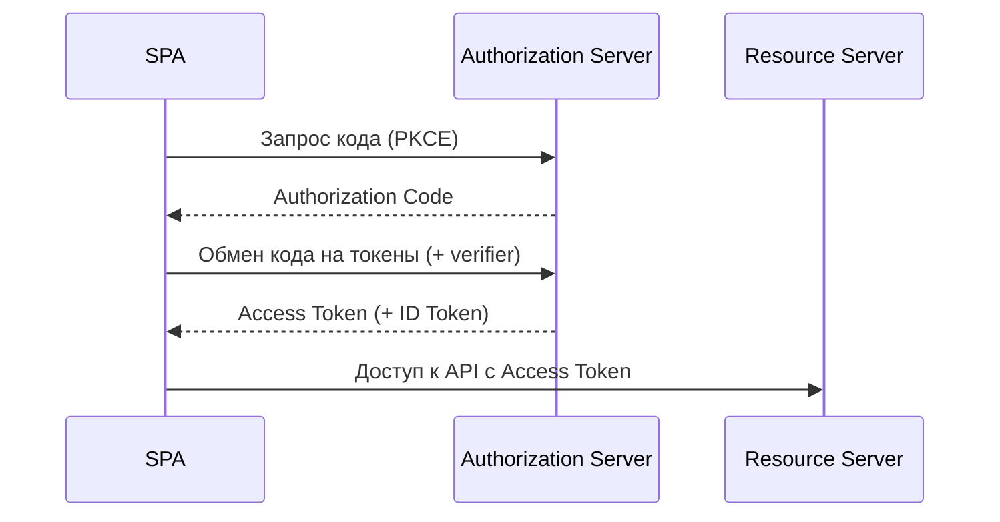

# Лекция 24. Аутентификация и авторизация: JWT, OAuth2, OpenID Connect

Коротко: как безопасно узнавать «кто вы» (аутентификация) и определять «что вам можно» (авторизация) в веб‑приложениях. Рассмотрим JWT, OAuth 2.1 и OpenID Connect, типовые потоки для SPA/мобайл, хранение токенов и практику с Keycloak/Node/Spring.

---

## Результаты обучения

- Понимать различия: идентификация, аутентификация, авторизация, сессии.
  - Идентификация — «кто это?», аутентификация — «доказать, что это именно он», авторизация — «что ему можно?», сессия — «как сервер помнит пользователя».
- Разбирать структуру JWT, виды подписей, сроки жизни и хранение.
  - Уметь читать header/payload, определять `alg`, понимать `exp/iat/nbf`, выбирать RS256 vs HS256.
- Описывать роли и потоки OAuth 2.1, назначение PKCE.
  - Знать роли RO/Client/AS/RS; уметь объяснить Authorization Code + PKCE шаги и защиту от перехвата.
- Понимать OpenID Connect: ID Token, UserInfo, scopes/claims.
  - Различать ID Token (для клиента) и Access Token (для API), использовать `openid profile email` и `nonce`.
- Настроить локальный провайдер (Keycloak), выполнить вход и защищать API.
  - Поднять контейнер, создать Realm/Client/User, настроить redirect URI, проверить `/me`.
- Оценивать риски (XSS/CSRF/CORS), выбирать безопасные способы хранения токенов.
  - Определять, когда куки безопаснее, как настраивать SameSite/CORS, когда CSRF актуален.

## Пререквизиты

- Базовые знания HTTP, cookies, заголовков и статуса ответов.
  - Понимать Redirect (3xx), Authorization header, Set-Cookie.
- Понимание концепции REST API и базовой работы фронтенда (SPA).
  - Знать CORS, preflight (OPTIONS), fetch/XHR особенности.
- Установленный Docker (Windows), доступ к PowerShell.
  - Проверить `docker --version`, открыть порт 8080.
- Желательно: Node.js (>=18) и Java (>=17) для примеров.
  - Проверить `node -v`, `java -version`.

## Введение: картина мира

Представьте, что у вас есть пропуск в здание. Пропуск говорит «кто вы» (аутентификация) и «куда можно» (авторизация). В вебе пропуском часто является токен.

- Аналогия «ключ и двери»: ключ (токен) открывает только те двери (ресурсы), на которые у вас есть права.
- Аналогия «бейдж + список прав»: бейдж — это ID Token, права — в `scope/claims`.
- На реальных проектах часто есть сторонний «выдающий бейджи» (Authorization Server), а ваши сервисы проверяют бейдж.
- Компромиссы: куки удобнее для CSRF‑защиты, bearer проще для API‑взаимодействия; выбор зависит от архитектуры.

Небольшая история из практики: команда делает новое веб‑приложение и хочет, чтобы пользователи входили «через Google». Параллельно нужно дать приложению доступ к их файлам в облаке. Здесь в игру вступают протоколы — OAuth помогает делегировать доступ к ресурсу (например, Google Drive), а OIDC добавляет удобную аутентификацию и даёт приложению проверяемую информацию о пользователе (ID Token).

Цель лекции — разложить эту картину по полочкам: от базовых понятий до шагов настройки, чтобы вы уверенно собирали поток «Войти с провайдером», защищали API и грамотно относились к токенам.

## Основные понятия и терминология

- Идентификация: попытка узнать, кто перед нами (например, по логину).
- Аутентификация: проверка, что субъект — это именно он (пароль, MFA, внешние провайдеры).
- Авторизация: решение, что субъект может сделать (роли/права/политики).
- Сессия: состояние авторизованного пользователя на стороне сервера (cookie‑сессия).
- Токен: компактный переносимый «пропуск» для доступа (обычно bearer‑токен).
- JWT: JSON Web Token — формат токена: `header.payload.signature` (Base64URL).
- OAuth 2.1: протокол делегирования доступа, роли и потоки получения токенов.
- OpenID Connect: надстройка над OAuth 2.0/2.1 для аутентификации (ID Token и UserInfo).

Контра‑пример: «JWT шифрует данные». Нет. JWT обычно подписан, но не зашифрован. Не кладите секреты в payload.
 Дополнение: JWS — подписанный JWT; JWE — зашифрованный (редко в SPA сценариях). `kid` указывает на ключ в JWKS.

## Пошаговое освоение темы

### 1) JWT: структура и подпись

Определения:

- `JWT`: компактный токен формата `header.payload.signature` (Base64URL), обычно подписан (JWS), редко шифруется (JWE).
- `Claims`: утверждения внутри токена (`sub`, `iss`, `aud`, `exp`, `iat`, `nbf`, `scope`).
- `alg`: алгоритм подписи (например, `RS256` асимметричный, `HS256` симметричный); задаёт способ проверки.
- `kid/JWKS`: идентификатор ключа и набор публичных ключей поставщика (`/.well-known/jwks.json`) для валидации подписи.

Структура: `header.payload.signature`.

- `header`: тип и алгоритм подписи (например, `alg=RS256`).
- `payload`: утверждения (claims), например `sub`, `iss`, `exp`, `scope`.
- `signature`: HMAC (симметрично) или RSA/EC (асимметрично).
- Важные поля: `aud` (аудитория), `iat` (когда выдан), `nbf` (не раньше), `jti` (идентификатор токена).
- Антипаттерн: `alg: none` — запрещайте; всегда явно проверяйте `alg`.

Мини‑пример проверки в Node.js:

```js
import express from 'express'
import jwt from 'jsonwebtoken'

const app = express()

app.get('/me', (req, res) => {
  const token = req.headers.authorization?.replace('Bearer ', '')
  try {
    const payload = jwt.verify(token, process.env.JWT_PUBLIC_KEY, { algorithms: ['RS256'] })
    res.json({ sub: payload.sub, scope: payload.scope })
  } catch {
    res.status(401).json({ error: 'invalid_token' })
  }
})

app.listen(3000)
```

Короткие выводы: не храните чувствительные данные в payload; контролируйте `exp`.
Частые ошибки: забывать алгоритм при проверке; использовать слишком длительный `exp`.
 Расширение: получайте публичные ключи по JWKS и валидируйте по `kid`.

```js
import { createRemoteJWKSet, jwtVerify } from 'jose'

const JWKS = createRemoteJWKSet(new URL('https://localhost:8080/realms/demo/protocol/openid-connect/certs'))

async function verify(token) {
  const { payload } = await jwtVerify(token, JWKS, {
    issuer: 'https://localhost:8080/realms/demo',
    audience: 'api'
  })
  return payload
}
```

### 2) Хранение токенов в браузере

Определения:

- `httpOnly` cookie: кука недоступна из JS (`document.cookie`), снижает XSS‑риски.
- `SameSite`: политика отправки куки при межсайтовых запросах (`Lax/Strict/None`).
- `Secure`: кука передаётся только по HTTPS; обязательна при `SameSite=None`.
- `credentials: include`: режим fetch/XHR, отправляющий куки; требует точного `Access-Control-Allow-Origin` и `Allow-Credentials`.

- Предпочтительно: `httpOnly` cookies + `SameSite=Lax/Strict`.
- Локальное хранилище (`localStorage`) — уязвимо к XSS.
- Для SPA — лучше проксировать через бэкенд, выдавая куки.
- `SameSite=Lax` блокирует отправку куки при межсайтовых POST, снижая CSRF.
- `Secure` — требует HTTPS; на проде обязательно.
- При CORS и `credentials: include` нужно точное `Access-Control-Allow-Origin` без `*`.

Мини‑пример установки cookie в Express:

```js
res.cookie('access', token, {
  httpOnly: true,
  secure: true,
  sameSite: 'lax'
})
```

### 3) OAuth 2.1: роли и поток Authorization Code + PKCE

Определения:

- Роли: `Resource Owner` (пользователь), `Client` (приложение), `Authorization Server`, `Resource Server`.
- `Authorization Code + PKCE`: поток для public‑клиентов; `code_verifier` доказывает владение запросом.
- `Scope`: набор разрешений (например, `read:orders`); ограничивает доступ токена.
- `Audience (aud)`: кому предназначен токен; ресурс проверяет соответствие.

Роли: Resource Owner (пользователь), Client (приложение), Authorization Server (AS), Resource Server (RS).



PKCE защищает public‑клиентов от перехвата кода (подтверждение владения запросом).
 Шаги PKCE:

- Сгенерировать `code_verifier` (случайная строка).
- Посчитать `code_challenge = base64url(SHA256(verifier))`.
- На авторизации отправить `code_challenge`.
- На обмене кода предъявить исходный `code_verifier`.

 В 2.1 удалён implicit grant; рекомендуется Authorization Code + PKCE для SPA/мобайл.

Небольшой сценарий: «MyApp и доступ к Google Drive». Вместо того чтобы просить пароль от Google, MyApp перенаправляет пользователя на страницу согласия у Google (Authorization Server), получает код, обменивает его на Access Token и далее делает запросы к ресурсам от имени пользователя. Так мы отделяем вход (как именно Google аутентифицирует пользователя — вне рамок OAuth) от делегирования доступа к ресурсам.

### 4) OpenID Connect: аутентификация поверх OAuth

Определения:

- `ID Token`: JWT с утверждениями о пользователе (`sub`, `email`, `name`) — для клиента.
- `UserInfo`: эндпоинт провайдера, возвращающий профиль пользователя по Access Token.
- `nonce`: случайное значение для защиты от повторного использования ID Token.
- `Discovery`: документ настроек провайдера (`/.well-known/openid-configuration`).

- ID Token: утверждения о пользователе (`sub`, `name`, `email`, `aud`).
- UserInfo: отдельная точка API для получения профиля пользователя.
- `scope`: набор разрешений (например, `openid profile email`).
- `claims`: конкретные утверждения в ID/Access токенах.
- `nonce`: защита от повторного использования; клиент валидирует `nonce` в ID Token.
- Discovery: `/.well-known/openid-configuration` — адреса `authorization`, `token`, `userinfo`, `jwks_uri`.
- `acr/amr`: уровень/методы аутентификации (например, MFA).

Небольшой сценарий: «Войти с Google». Приложению важнее знать «кто пользователь», чем доступ к его файлам. OIDC добавляет ID Token — компактный проверяемый набор утверждений о личности. Клиент получает ID Token вместе с Access Token (или без него, в зависимости от настроек) и может аутентифицировать пользователя без лишних запросов к провайдеру.

### 5) Потоки для SPA и мобильных

Определения:

- `Redirect URI`: адрес возврата после авторизации; должен быть заранее зарегистрирован у провайдера.
- `PKCE` в мобайле: доказательство владения запросом без секрета внутри приложения.
- `AppAuth`: рекомендованные библиотеки для iOS/Android, соблюдающие требования безопасности.

- SPA: Authorization Code + PKCE, хранение через бэкенд‑куки, CORS аккуратно настраивать.
- Мобильные: PKCE, редиректы через схему `myapp://callback`.
- iOS/Android: используйте AppAuth; храните токены в системном хранилище (Keystore/Keychain).
- Universal Links/Android App Links — безопасные редиректы вместо кастомных схем.

### 6) Refresh Tokens и обновление

Определения:

- `Refresh Token`: долгоживущий токен для получения нового Access Token; требует усиленной защиты.
- `Rotation`: выдача нового refresh при каждом обмене; старый немедленно отзывается.
- `Revocation`: отзыв токенов провайдером; используется при утечке/компрометации.

- Refresh хранить аккуратно (кука `httpOnly`, короткая ротация).
- Обновление access по refresh через защищённый бэкенд‑эндпоинт.
- Ротация refresh: каждый раз выдавать новый; старый помечать недействительным.
- Ограничивайте область действия (scope) refresh; храните только в `httpOnly` куке.
- При утечке refresh проведите принудительный logout и отзовите цепочку.

### 7) CORS и CSRF

Определения:

- `CORS`: контроль междоменных запросов браузером; сервер настраивает допустимые Origin/Headers/Methods.
- `CSRF`: атака на state‑changing запросы от другого сайта; защищается `SameSite` и CSRF‑токенами.
- `Preflight`: предварительный запрос `OPTIONS`, проверяющий разрешения CORS.

- CORS: разрешайте только доверенные origin; учитывайте `credentials`.
- CSRF: для cookie‑сессий — `SameSite` и CSRF‑токены; для bearer — обычно не требуется.
- CSRF‑токен: double submit cookie (кука + заголовок), совпадение значений.
- Preflight: убедитесь, что `Access-Control-Allow-Methods`/`Headers` покрывают ваш запрос.
- Никогда не используйте `*` с `Access-Control-Allow-Credentials: true`.

### 8) Проверка токена на сервере (RS)

Определения:

- `iss/aud/exp`: издатель, аудитория, срок действия — ключевые поля проверки JWT.
- `Clock skew`: допустимое расхождение часов между системами, чтобы не отклонять валидные токены.
- `Scopes/Authorities`: права, проверяемые на эндпоинтах (`hasAuthority('SCOPE_profile')`).

- Node: `jwt.verify` + проверка `iss/aud/exp`.
- Spring Resource Server: настройка `issuer-uri` и проверка JWT автоматически.
- Проверяйте `scope/roles` на уровне эндпоинтов; не доверяйте данным из клиента.
- Учитывайте расхождение часов (clock skew) — допустимая погрешность в пару секунд.

Мини‑пример Spring (application.yaml):

```yaml
spring:
  security:
    oauth2:
      resourceserver:
        jwt:
          issuer-uri: https://localhost:8080/realms/demo
        
      client:
        registration:
          keycloak:
            client-id: spa
            authorization-grant-type: authorization_code
            redirect-uri: http://localhost:5173/callback
            scope: openid,profile,email
        provider:
          keycloak:
            issuer-uri: https://localhost:8080/realms/demo
```

Короткие выводы: доверяйте токенам только от ожидаемого `issuer`, проверяйте `aud`.

### 9) Провайдер: Keycloak локально

Запуск Keycloak в dev‑режиме:

```powershell
docker run -p 8080:8080 -e KEYCLOAK_ADMIN=admin -e KEYCLOAK_ADMIN_PASSWORD=admin quay.io/keycloak/keycloak:24 start-dev
```

Настройте Realm/Client (public + PKCE), укажите redirect URI вашей SPA (например, Vite dev URL).
 Создание пользователя:

1. Откройте админ‑консоль `http://localhost:8080/` (admin/admin).
2. Создайте Realm `demo`.
3. Добавьте Client `spa` (Public, включить PKCE, `Valid Redirect URIs`: `http://localhost:5173/callback`).
4. Добавьте мапперы для `email`, `preferred_username` (если нужно в ID Token).
5. Создайте пользователя `student` с паролем.
6. Проверьте Discovery: `http://localhost:8080/realms/demo/.well-known/openid-configuration`.

### 10) Интеграция: защищённый ресурс `/me`

- Бэкенд проверяет Access Token (RS) и возвращает профиль.
- Опционально: прокси для обмена refresh на новый access.
- Эндпоинты бэкенда:
  - `GET /login` — редирект на AS с `code_challenge`.
  - `GET /callback` — приём `code`, обмен на токены; установка куки `access`/`refresh`.
  - `GET /me` — проверка `access` и возврат профиля.
- В Spring: ограничьте доступ к `/me` по `hasAuthority('SCOPE_profile')`.

---

## Разбор типичных ошибок и анти‑паттернов

- Хранение access/refresh в `localStorage` без защиты — риск XSS.
- Длинные сроки жизни access — повышают риск компрометации.
- Отсутствие проверки `iss/aud` — приём чужих токенов.
- Неверная настройка CORS (`*` с credentials) — утечка.
- Смешение ID Token и Access Token — неправильное использование токенов.

Наблюдайте признаки: неожиданные 401/403, жалобы пользователей на логауты, ошибки обмена кода. Чините: сокращайте `exp`, вводите ротацию, корректируйте CORS/CSRF, валидируйте `iss/aud`.

Диагностика:

- Логи AS/RS: ошибки проверки подписи, несоответствие `aud/iss`.
- Проверка даты/времени на серверах (NTP), чтобы исключить проблемы `exp/nbf`.
- Инспекция CORS: смотрите preflight ответы и заголовки.

---

## Практика: «SPA + OIDC вход» (репродуцируемо)

Цель: войти через публичного провайдера (Keycloak локально) по Authorization Code + PKCE, получить защищённый `/me`.

### Шаги

1. Запустите Keycloak локально.
2. Создайте Realm `demo` и Client `spa` (public, включить PKCE, задать redirect URI).
3. Настройте бэкенд (Node или Spring) для проверки Access Token.
4. Настройте SPA: инициировать авторизацию, получить код, обменять код на токены (через бэкенд), хранить `httpOnly` cookie.
5. Проверьте `GET /me` с токеном; при истечении — обновите по refresh через бэкенд.

### Проверка результата

Ожидаете:

- Успешный редирект назад в SPA.
- Заполненные куки (`access`, при необходимости `refresh`).
- Запрос `GET /me` возвращает `{ sub: ..., scope: ... }`.
- При тесте без токена — 401 `invalid_token`.
- При неправильном `iss/aud` — отказ доступа.

---

## Как собрать и запустить (Windows)

Keycloak локально:

```powershell
docker run -p 8080:8080 -e KEYCLOAK_ADMIN=admin -e KEYCLOAK_ADMIN_PASSWORD=admin quay.io/keycloak/keycloak:24 start-dev
```

Пример обмена кода на токены (через бэкенд‑прокси):

```powershell
Invoke-RestMethod -Method Post -Uri "http://localhost:3000/oidc/callback" -Body @{ code = "RECEIVED_CODE"; verifier = "PKCE_VERIFIER" }
```

Проверка `/me`:

```powershell
Invoke-WebRequest -Uri "http://localhost:3000/me" -Headers @{ Authorization = "Bearer $env:ACCESS_TOKEN" }
```

Spring Resource Server (файл `application.yaml`):

```yaml
spring:
  security:
    oauth2:
      resourceserver:
        jwt:
          issuer-uri: https://localhost:8080/realms/demo
server:
  port: 8081
```

Node (Express) проверка JWT — см. код выше в разделе «JWT».

---

## Вопросы для самопроверки

1. Чем отличаются JWT access и ID Token (OIDC)?
2. Зачем нужен PKCE и когда он обязателен?
3. Какие риски у хранения токенов в `localStorage`?
4. Что означает `iss`, `aud`, `exp` в JWT и как их проверять?
5. Когда использовать HMAC vs RS256 и почему?
6. Что такое `scope` и `claims`? Приведите примеры.
7. Почему bearer‑токены уязвимы при утечке?
8. Как настроить CORS для SPA с куками?
9. Чем отличается авторизация в cookie‑сессии от bearer‑токенов?
10. Что делает endpoint `UserInfo` в OIDC?
11. Как реализовать безопасное обновление токенов?
12. Что такое revocation и когда его применять?
13. Как отличить Access Token от ID Token в потоке?
14. Какие признаки неправильной конфигурации CORS/CSRF?
15. Как организовать ротацию refresh токенов?
16. Что такое Discovery документ и зачем он нужен?
17. Как работает `nonce` в OIDC и где его проверять?

---

## Краткий конспект (cheat‑sheet)

Команды (Windows PowerShell):

```powershell
docker run -p 8080:8080 -e KEYCLOAK_ADMIN=admin -e KEYCLOAK_ADMIN_PASSWORD=admin quay.io/keycloak/keycloak:24 start-dev
Invoke-RestMethod -Method Post -Uri "http://localhost:3000/oidc/callback" -Body @{ code = "RECEIVED_CODE"; verifier = "PKCE_VERIFIER" }
```

Spring `application.yaml`:

```yaml
spring:
  security:
    oauth2:
      resourceserver:
        jwt:
          issuer-uri: https://localhost:8080/realms/demo
       client:
         registration:
           keycloak:
             client-id: spa
             authorization-grant-type: authorization_code
             redirect-uri: http://localhost:5173/callback
             scope: openid,profile,email
         provider:
           keycloak:
             issuer-uri: https://localhost:8080/realms/demo
```

Ключевые понятия:

- `JWT`: формат токена, не шифрует, содержит claims.
- `Access Token`: доступ к API; короткий срок.
- `ID Token`: утверждения о пользователе; для клиента.
- `PKCE`: защита public‑клиентов в Authorization Code.
- `CORS/CSRF`: настройки междоменных запросов и защита сессий.
- `JWKS`: набор публичных ключей провайдера, используется для проверки подписи.

Полезная формула выбора срока жизни (интуитивно): риск компрометации растёт с временем $t$ примерно как $P=1-e^{-\lambda t}$, укорачивая $t$ — снижаете $P$.

Блоковая запись:

$$
P(t) = 1 - e^{-\lambda t},\quad \lambda > 0
$$

---

## Дополнительно

Глоссарий:

- `iss`: издатель токена.
- `aud`: аудитория — кому предназначен токен.
- `exp`: срок истечения.
- `nonce`: число для защиты от повторного использования в OIDC.
- `scope`: набор разрешений.
- `claims`: утверждения внутри токена.
 - `jti`: идентификатор токена (используется для трекинга/отзыва).
- `amr`: методы аутентификации (пароль, OTP, и т.д.).
- `acr`: уровень аутентификации (например, требование MFA).

Ссылки:

- [OAuth 2.1 (черновик)](https://oauth.net/2.1/)
- [OpenID Connect](https://openid.net/connect/)
- [Keycloak Docs](https://www.keycloak.org/documentation)
- [Auth0 (статьи по OAuth/OIDC/JWT на русском)](https://auth0.com)
- [RFC 7519: JSON Web Token (JWT)](https://www.rfc-editor.org/rfc/rfc7519)
- [RFC 7636: PKCE](https://www.rfc-editor.org/rfc/rfc7636)

Коротко про SAML и SSO (для общей картины):

- SAML: XML‑утверждения, исторически распространён в корпоративной среде; гибкий, но более тяжёлый для внедрения.
- OIDC: JSON/JWT, проще для современных веб/мобайл сценариев, дружелюбен к разработчикам.
- SSO: единый вход через централизованного провайдера идентичности (IdP) — один раз вошли, получили доступ к нескольким приложениям. SSO может работать поверх OIDC или SAML.

Повествовательный стиль лекции вдохновлён обзорной статьёй Logto — см. [Понимание IAM, OAuth, OIDC, SAML, SSO и JWT](https://blog.logto.io/ru/iam-oauth-oidc-saml-sso-jwt).

---

## Примечания по безопасности

- Минимизируйте время жизни access; защищайте refresh (куки `httpOnly`).
- Чётко настраивайте CORS, не используйте `*` вместе с `credentials`.
- Проверяйте `iss/aud/exp`, алгоритм подписи и целостность.
- Реализуйте logout и revocation у провайдера.
- Включайте MFA там, где это оправдано; используйте `amr/acr` для политики доступов.
- Логируйте минимально необходимое (без токенов в чистом виде), маскируйте секреты.

```mermaid
flowchart LR
  Client(SPA) -->|Auth Code + PKCE| AS[Authorization Server]
  AS -->|Access/ID Token| Backend
  Backend -->|Set-Cookie httpOnly| Browser
  Browser -->|GET /me (credentials)| Backend
  Backend --> RS[Resource Server]
  RS --> Backend
```

 
