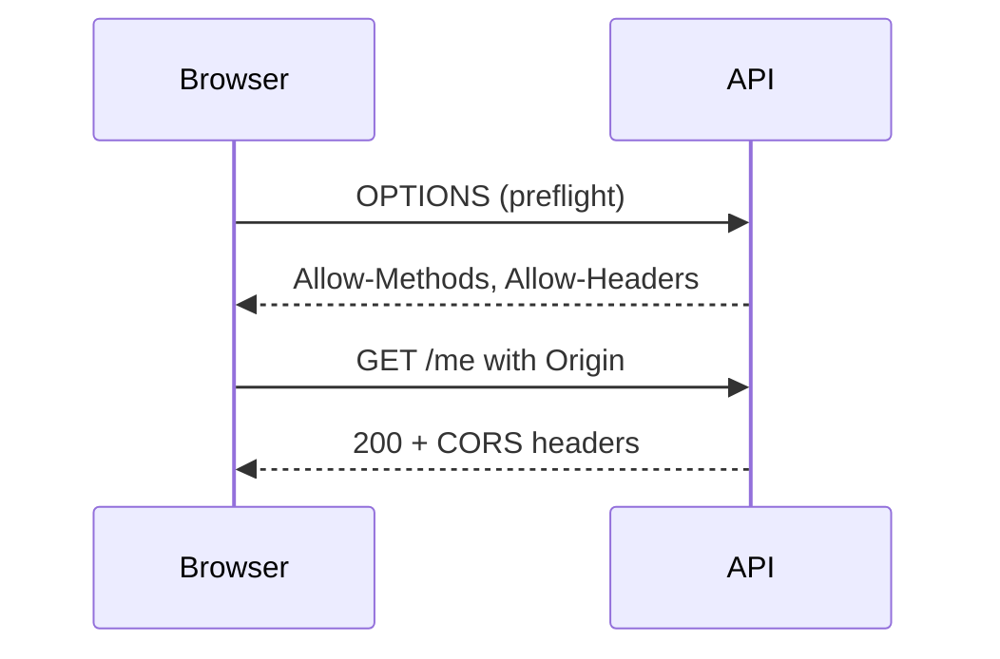

# Лекция 25. Безопасность фронтенда и API: XSS, CSRF, CORS и лучшие практики

Коротко: как защитить веб‑приложение от XSS и CSRF, корректно настроить CORS, применять CSP, безопасно работать с куками и токенами. Практика на Node/Express и настройки заголовков, а также проверочные команды для Windows PowerShell.

---

## Результаты обучения

- Понимать различия между XSS (внедрение скриптов) и CSRF (межсайтовая подделка запросов).
- Настраивать CORS безопасно: точный `Origin`, `credentials`, preflight.
- Применять Content Security Policy (CSP), `httpOnly`/`Secure`/`SameSite` для куки.
- Внедрять CSRF‑защиту: double submit cookie или синхронные токены.
- Обнаруживать и устранять XSS: экранирование/санитайз, безопасные рендеры шаблонов.
- Проверять защиту с помощью запросов из PowerShell и мерить эффекты.

## Пререквизиты

- Базовые знания HTML/JS, HTTP заголовков и cookies.
- Понимание SPA и запросов fetch/XHR; знание preflight OPTIONS.
- Node.js (>=18) и Docker желательно; PowerShell доступен.

## Введение: картина мира

На фронтенд влияют два класса проблем: XSS — злоумышленник вставляет и исполняет скрипт в вашем DOM, CSRF — злоумышленник заставляет браузер пользователя отправить запрос от его имени.

- XSS атакует «что выполняется в браузере».
- CSRF атакует «какие запросы уходят с браузера».
- CORS — настройка междоменных запросов: кто может общаться с API.

Компромиссы: куки удобны для сессий, но требуют строгой CSRF‑защиты; bearer‑токены удобны для API, но уязвимы при XSS. CSP снижает XSS‑поверхность, но требует дисциплины загрузок.

## Основные понятия и терминология

- XSS: внедрение скриптов (reflected, stored, DOM‑based).
- CSRF: межсайтовая подделка запросов (обычно бьёт по state‑changing POST/PUT/DELETE).
- CORS: политика браузера на междоменные запросы; управляется заголовками сервера.
- CSP: Content Security Policy, ограничение источников скриптов/стилей/ресурсов.
- `SameSite`: политика отправки куки при межсайтовых запросах (`Lax/Strict/None`).
- `Secure`: куки только по HTTPS; `httpOnly`: куки недоступны JS.

Контра‑пример: «CORS защищает от CSRF». Нет. CORS — контроль междоменных запросов, CSRF — атака на отправку запроса от другого сайта; `SameSite` и CSRF‑токены — основной барьер.

## Пошаговое освоение темы

### 1) Типы XSS и их признаки

- Reflected (отражённый): ввод пользователя возвращается в том же ответе.
  
  Признаки:
  - Опасные точки: параметры URL (`?q=`), заголовки (`Referer`, `User-Agent`), тело формы.
  - Скрипт выполняется сразу после запроса (без сохранения на сервере).
  
  Пример вектора:
  
  ```text
  http://example.com/search?q=%3Cscript%3Ealert(1)%3C/script%3E
  ```
  
  Неправильный рендер:
  
  ```js
  res.send(`<h1>${req.query.q}</h1>`)
  ```
  
  Правильно:
  
  ```js
  res.send(`<h1>${escapeHtml(req.query.q)}</h1>`)
  ```
  
  Где `escapeHtml` заменяет `&`, `<`, `>`, `"`, `\'`.

- Stored (хранимый): вредоносный ввод сохраняется в БД/кэше и показывается другим.
  
  Признаки:
  - Поля профиля, комментарии, названия файлов/постов содержат HTML/JS.
  - Вредоносный контент «переживает» перезагрузку и виден многим пользователям.
  
  Пример опасной вставки:
  
  ```html
  <div class="comment">{{ rawHtmlFromDb }}</div>
  ```
  
  Правильно: хранить как текст и экранировать при выводе;
  если нужен HTML — использовать санитайзер (DOMPurify) на сервере/клиенте.

- DOM‑based: уязвимость в клиентском коде, когда данные из DOM/URL влияют на создание HTML/JS.
  
  Признаки:
  - Использование `innerHTML`, `document.write`, `insertAdjacentHTML` с непроверенным вводом.
  - Чтение `location.hash/search` и прямое помещение в DOM.
  
  Опасный код:
  
  ```js
  const content = new URLSearchParams(location.search).get('msg')
  element.innerHTML = content
  ```
  
  Безопаснее:
  
  ```js
  const content = new URLSearchParams(location.search).get('msg')
  element.textContent = content
  ```

Дополнительные каналы XSS:

- Атрибуты: вставка в `href/src/on*` может исполнить JS (запрещайте `javascript:`).
- CSS/JS файлы: подмена источников без CSP позволяет загрузить вредоносный ресурс.
- Шаблоны/рендеры: небезопасные конструкции и «сырой HTML».

Как обнаруживать на практике:

- Пробные пэйлоады: `<script>alert(1)</script>`, `"><script>alert(1)</script>`.
- Проверка URL/форм: меняйте параметры и смотрите, появляется ли значение «как есть» в DOM.
- Инструменты: Content Security Policy отчёты (`report-to`/`report-uri`), SAST/DAST, линтеры/сканеры.

Короткие выводы: экранируйте вывод, не доверяйте ввод, избегайте `innerHTML` без санитайза, включайте CSP.

### 2) CSP: первая линия обороны от XSS

Определения:

- `CSP (Content Security Policy)`: политика ограничения источников скриптов/стилей/ресурсов.
- `default-src/script-src/connect-src`: директивы, управляющие разрешёнными источниками.
- `nonce`/`hash`: безопасный способ разрешить отдельные инлайн‑скрипты.
- `unsafe-inline`: небезопасный режим; избегайте в `script-src`.

Базовый заголовок CSP (строгий вариант для SPA):

```http
Content-Security-Policy: default-src 'self'; script-src 'self'; style-src 'self' 'unsafe-inline'; img-src 'self' data:; connect-src 'self'; frame-ancestors 'none'
```

Пояснения:

- `default-src 'self'`: только свои источники.
- `script-src 'self'`: запрет внешних скриптов; при необходимости использовать `nonce-...`.
- `connect-src 'self'`: ограничение API‑запросов.
- Избегайте `unsafe-inline` в `script-src`; если нужен инлайн, применяйте `nonce`.

### 3) Безопасные куки

Определения:

- `httpOnly`: кука недоступна `document.cookie`; снижает XSS‑эксфильтрацию.
- `Secure`: передача куки только по HTTPS.
- `SameSite`: политика отправки куки при межсайтовых запросах (`Lax/Strict/None`).

Выдавайте куки так:

```js
res.cookie('session', sessionId, {
  httpOnly: true,
  secure: true,
  sameSite: 'lax'
})
```

- `httpOnly`: недоступно `document.cookie`.
- `Secure`: только HTTPS.
- `SameSite=Lax`: не отправляется в большинстве межсайтовых POST, снижает CSRF.

### 4) CSRF: double submit cookie

Определения:

- `CSRF`: атака, при которой другой сайт инициирует запросы с куками жертвы.
- `Double submit cookie`: шаблон, где кука и заголовок содержат совпадающее значение токена.
- `Synchronizer token`: сервер хранит токен в сессии и проверяет его на каждом запросе.

Идея: сервер устанавливает CSRF‑куку, клиент при запросе присылает её значение и заголовок; сервер сравнивает.

```js
// Установка куки
res.cookie('csrf', token, { httpOnly: false, sameSite: 'lax', secure: true })

// Проверка на сервере
app.post('/transfer', (req, res) => {
  const tokenCookie = req.cookies.csrf
  const tokenHeader = req.headers['x-csrf-token']
  if (!tokenCookie || tokenCookie !== tokenHeader) return res.status(403).json({ error: 'csrf' })
  // выполнить действие
})
```

Альтернатива: синхронный токен на серверной сессии (формы/SPA получают актуальный токен уникально для пользователя).

### 5) CORS: точный контроль

Определения:

- `Origin`: источник запроса (схема + хост + порт), участвует в проверке CORS.
- `Preflight`: `OPTIONS` запрос с `Access-Control-Request-*` заголовками.
- `Access-Control-Allow-*`: заголовки ответа, указывающие разрешённые источники/методы/заголовки.

Правильная настройка (пример Express):

```js
import cors from 'cors'

app.use(cors({
  origin: 'http://localhost:5173',
  credentials: true,
  methods: ['GET','POST','PUT','DELETE'],
  allowedHeaders: ['Content-Type','Authorization','X-CSRF-Token']
}))
```

Правила (подробно):

- Никогда не используйте `*` вместе с `credentials: true`.
  - Причина: браузеры запрещают сочетание `*` и `Access-Control-Allow-Credentials: true`; требуется точный `Origin`.
  - Правильно:

    ```http
    Access-Control-Allow-Origin: http://localhost:5173
    Access-Control-Allow-Credentials: true
    Vary: Origin
    ```

  - Неверно:

    ```http
    Access-Control-Allow-Origin: *
    Access-Control-Allow-Credentials: true
    ```

- Всегда перечисляйте `allowedHeaders` и `methods`.
  - Preflight: браузер отправляет `Access-Control-Request-Method` и `Access-Control-Request-Headers`.
  - Ответ должен явно разрешать нужные методы и заголовки:

    ```http
    Access-Control-Allow-Methods: GET,POST,PUT,DELETE
    Access-Control-Allow-Headers: Content-Type,Authorization,X-CSRF-Token
    Access-Control-Expose-Headers: X-RateLimit-Remaining,X-Trace-Id
    ```

  - `Expose-Headers` позволяет читать заголовки ответа из JS.

- Проверьте preflight: сервер должен отвечать на `OPTIONS` корректно.
  - Возвращайте `204 No Content` (или `200`) c CORS‑заголовками и, при необходимости, `Access-Control-Max-Age`.
  - Express:

    ```js
    import cors from 'cors'

    const whitelist = ['http://localhost:5173','https://app.example.com']
    const corsOptions = {
      origin: function (origin, callback) {
        if (!origin || whitelist.includes(origin)) callback(null, true)
        else callback(new Error('Not allowed by CORS'))
      },
      credentials: true,
      methods: ['GET','POST','PUT','DELETE'],
      allowedHeaders: ['Content-Type','Authorization','X-CSRF-Token'],
      exposedHeaders: ['X-RateLimit-Remaining','X-Trace-Id'],
      maxAge: 600
    }

    app.use(cors(corsOptions))
    app.options('*', cors(corsOptions)) // preflight
    ```

  - Ручная настройка заголовков (альтернатива):

    ```js
    app.use((req, res, next) => {
      const origin = req.headers.origin
      if (origin && ['http://localhost:5173','https://app.example.com'].includes(origin)) {
        res.header('Access-Control-Allow-Origin', origin)
        res.header('Vary', 'Origin')
        res.header('Access-Control-Allow-Credentials', 'true')
        res.header('Access-Control-Allow-Methods', 'GET,POST,PUT,DELETE')
        res.header('Access-Control-Allow-Headers', 'Content-Type,Authorization,X-CSRF-Token')
        res.header('Access-Control-Expose-Headers', 'X-RateLimit-Remaining,X-Trace-Id')
        res.header('Access-Control-Max-Age', '600')
      }
      if (req.method === 'OPTIONS') return res.sendStatus(204)
      next()
    })
    ```

- Динамический список доверенных источников.
  - В проде часто требуется несколько `origin`; используйте whitelist и возвращайте точный `Access-Control-Allow-Origin` + `Vary: Origin`.

- Кэширование preflight.
  - `Access-Control-Max-Age: 600` уменьшает нагрузку за счёт кэширования ответа на `OPTIONS`.

- Запросы с куками и `fetch`.
  - На клиенте: `fetch(url, { credentials: 'include' })`.
  - На сервере: точный `Access-Control-Allow-Origin` и `Access-Control-Allow-Credentials: true`; для межсайтовых куки — `SameSite=None; Secure`.

Последствия неправильной настройки (к чему приводит):

- `Access-Control-Allow-Origin: *` + попытка отправлять куки: браузер отбросит куки, но если позже ошибочно выставят конкретный Origin без валидации — откроется путь к краже данных из API (доступ для произвольных сайтов).
- Отсутствие `Vary: Origin`: кэш может вернуть ответ, предназначенный для одного Origin, другому сайту, случайно раскрыв чувствительные заголовки.
- Чрезмерно широкие `Access-Control-Allow-Headers`: злоумышленник может навязать неожиданные заголовки (например, `X-Override-Auth`) и атаковать нестандартные фильтры бэкенда.
- Разрешение опасных методов (`DELETE`, `PUT`) без проверки авторизации с куками повышает риск несанкционированных модификаций при комбинированных атаках (CSRF + слабая проверка токена).
- Отсутствие корректного ответа на preflight (`OPTIONS`) приводит к тихим отказам: приложение кажется «ломается», пользователи обходят защиту через прокси/расширения.
- Разрешение нескольких динамических Origin без белого списка: любой сайт может получить доступ к приватным ресурсам и читать ответ (включая пользовательские данные).
- Отсутствие ограничения `Access-Control-Expose-Headers`: фронтенд сможет читать чувствительные заголовки (например, токен, референсы внутренних идентификаторов), что облегчает XSS‑эксфильтрацию.
- Неправильный `Access-Control-Max-Age` (слишком большой) фиксирует у клиента раннее ошибочное разрешение, усложняя отзыв прав и тестирование изменений безопасности.
- Нет строгой проверки Origin → возможен сценарий подделки через поддомен злоумышленника (если проверка по `endsWith` вместо точного сравнения).
- Неправильное сочетание CORS и `SameSite=None` без `Secure`: куки будут утекать на небезопасные соединения, повышая риск перехвата.

Как обнаружить:

- Используйте DevTools (Network) — сравнивайте `Access-Control-Allow-*` с исходящими `Access-Control-Request-*`.
- Инжектируйте тестовый Origin (`curl -H "Origin: http://evil.test"`) и проверяйте ответ.
- Проверяйте кэш заголовков через повторные запросы разным Origin, наблюдая отсутствует ли `Vary`.
- Периодически сканируйте заголовки с помощью автоматизированных тестов (Security CI job).

### 6) Борьба с DOM‑XSS в коде

Избегайте опасных API:

```js
// Опасно
element.innerHTML = userInput
// Лучше
element.textContent = userInput
```

Используйте санитайзеры (DOMPurify) при необходимости HTML.

### 7) Шаблонизаторы и экранирование

Большинство шаблонизаторов экранируют по умолчанию (`{{ }}` в React/Angular/Vue безопасны). Опасности в «сыром HTML» и вставке атрибутов/URL.

Проверяйте атрибуты `href/src` на допустимые схемы (`http/https`), запрещайте `javascript:`.

### 8) Логирование и наблюдаемость

Логируйте причины отказа (403 CSRF, проблемы preflight), но не логируйте токены целиком. Включайте метрики количества preflight и отказов.

### 9) Проверка PowerShell

Проверка preflight и CORS:

```powershell
Invoke-WebRequest -Method Options -Uri "http://localhost:8081/me" -Headers @{ Origin = "http://localhost:5173" }
Invoke-WebRequest -Method Get -Uri "http://localhost:8081/me" -Headers @{ Origin = "http://localhost:5173" }
```

Проверка CSRF заголовков:

```powershell
Invoke-WebRequest -Method Post -Uri "http://localhost:8081/transfer" -Headers @{ "X-CSRF-Token" = "TOKEN" } -Body @{ amount = 10 }
```

### 10) Мини‑пример сервера (Express)

```js
import express from 'express'
import helmet from 'helmet'
import cors from 'cors'

const app = express()
app.use(express.json())
app.use(helmet({
  contentSecurityPolicy: {
    useDefaults: true,
    directives: {
      defaultSrc: ["'self'"],
      scriptSrc: ["'self'"],
      connectSrc: ["'self'"],
      imgSrc: ["'self'", 'data:'],
      frameAncestors: ["'none'"]
    }
  }
}))

app.use(cors({ origin: 'http://localhost:5173', credentials: true }))

app.get('/me', (req, res) => res.json({ ok: true }))

app.listen(8081)
```

### 11) Диаграммы угроз

```mermaid
flowchart LR
  Attacker[Attacker Site] -->|Tricks user| Browser
  Browser -->|Sends POST (cookies)| TargetAPI
  TargetAPI -->|No CSRF| Damage
  Browser -. CSP blocks inline .-> Safe
```



### 12) Модель риска (интуитивно)

Время экспозиции повышает шанс успешной XSS, а строгий CSP снижает его. Интуитивная зависимость:

$$
R(t) = R_0 \cdot e^{-k \cdot CSP_{strict}} \cdot (1 + \alpha t)
$$

Где $CSP_{strict}$ — показатель строгости (0..1), $k>0$, $\alpha$ малое; усиливая CSP, снижаете начальный риск; чем дольше открытое окно ввода — тем выше шанс ошибки.

---

## Разбор типичных ошибок и анти‑паттернов

- `*` Origin с `credentials: true` — опасно.
- Отсутствие CSRF‑токена при cookie‑сессиях.
- `SameSite=None` без `Secure` — уязвимость.
- `unsafe-inline` в `script-src` без `nonce` — XSS.
- Логирование токенов и секретов — утечки.

---

## Вопросы для самопроверки

1. Чем отличаются XSS и CSRF по сути атаки?
2. Почему `SameSite=Lax` снижает CSRF?
3. Какие риски несёт `unsafe-inline` в CSP?
4. Чем опасен `innerHTML` при выводе ввода пользователя?
5. Как правильно настроить CORS с `credentials`?
6. Чем double submit cookie отличается от синхронного CSRF‑токена?
7. Зачем нужен preflight и что он проверяет?
8. Как безопасно логировать ошибки безопасности?
9. Что означают `httpOnly` и `Secure` для куки?
10. Какие схемы URL стоит запрещать в атрибутах?
11. Как проверить CORS/CSRF с PowerShell?
12. В чём плюсы/минусы CSP для SPA?

---

## Краткий конспект (cheat‑sheet)

Заголовки:

```http
Content-Security-Policy: default-src 'self'; script-src 'self'; connect-src 'self'; img-src 'self' data:; frame-ancestors 'none'
Access-Control-Allow-Origin: http://localhost:5173
Access-Control-Allow-Credentials: true
Access-Control-Allow-Methods: GET,POST,PUT,DELETE
Access-Control-Allow-Headers: Content-Type,Authorization,X-CSRF-Token
```

Express:

```js
app.use(helmet())
app.use(cors({ origin: 'http://localhost:5173', credentials: true }))
res.cookie('session', id, { httpOnly: true, secure: true, sameSite: 'lax' })
```

PowerShell:

```powershell
Invoke-WebRequest -Method Options -Uri "http://localhost:8081/me" -Headers @{ Origin = "http://localhost:5173" }
Invoke-WebRequest -Method Post -Uri "http://localhost:8081/transfer" -Headers @{ "X-CSRF-Token" = "TOKEN" }
```

---

## Дополнительно

Глоссарий:

- `CSP`: политика контента, ограничивает источники.
- `CSRF`: атака на state‑changing запросы.
- `XSS`: внедрение скриптов.
- `Preflight`: проверка междоменных запросов (OPTIONS).
- `SameSite`: политика отправки куки при межсайтовых запросах.

Ссылки:

- [Content Security Policy (MDN)](https://developer.mozilla.org/docs/Web/HTTP/CSP)
- [CORS (MDN)](https://developer.mozilla.org/docs/Web/HTTP/CORS)
- [OWASP Cheat Sheets: XSS, CSRF, CORS](https://cheatsheetseries.owasp.org/)

---

## Примечания по безопасности

- Минимизируйте поверхность XSS: CSP, отказ от инлайна, санитайз.
- Строго настраивайте CORS и preflight, не используйте `*` с `credentials`.
- Для cookie‑сессий: `httpOnly`, `Secure`, `SameSite`, CSRF‑токен.
- Разделяйте хранение: секреты в серверной сессии, минимум в браузере.
 
*** End Patch

План:

1. Угроза‑модель: что защищаем, от кого, какие активы.
2. XSS: отражённый/хранимый/DOM‑based; защита: экранирование, CSP, Trusted Types.
3. CSRF: механизм, защита: токены, SameSite, двойное отправление cookie.
4. CORS: цели, preflight, настройки серверов, ошибки конфигурации.
5. Безопасное хранение секретов, заголовки безопасности (Helmet), зависимостная безопасность.
6. Практика: аудит минимального приложения и устранение уязвимостей.

Чтение (RU/оф. доки):

- OWASP Cheat Sheets (XSS/CSRF/CORS/Headers)
- MDN: [Security](https://developer.mozilla.org/ru/docs/Web/Security)

---

## 1. XSS и защита

Опасный код:

```js
// Не делайте так
el.innerHTML = location.search.substring(1)
```

Безопаснее:

```js
el.textContent = new URLSearchParams(location.search).get('q') || ''
```

CSP пример:

```http
Content-Security-Policy: default-src 'self'; script-src 'self'; object-src 'none'
```

## 2. CSRF и защита

- Анти‑CSRF токен (double submit, synchronizer token pattern).
- Cookie SameSite=Lax/Strict, `Secure` для HTTPS.

## 3. CORS

Правильные заголовки на сервере:

```js
app.use((req,res,next)=>{
  res.header('Access-Control-Allow-Origin','https://app.example.com')
  res.header('Access-Control-Allow-Methods','GET,POST,PUT,DELETE')
  res.header('Access-Control-Allow-Headers','Content-Type,Authorization')
  next()
})
```

## 4. Best practices

- Helmet (Node), безопасные заголовки по умолчанию.
- Хранение секретов: переменные окружения/Secret Manager, не хранить в git.
- SCA/Dependabot, регулярные обновления и аудит.

## Мини‑проект: «Почини безопасность SPA + API»

Требования:

- Защитить от XSS (экранирование/рендер), включить CSP и подумать о Trusted Types.
- Для cookie‑сессий: CSRF‑токены, SameSite; для bearer — корректный CORS.
- Добавить Helmet/аналог, вынести секреты в env.

 
