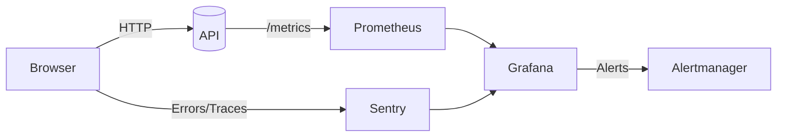

# Лекция 27. Мониторинг и логирование: Sentry, Prometheus, Grafana

Зачем: мониторинг и логирование превращают «черный ящик» приложения в понятную приборную панель. Вы своевременно видите ошибки (Sentry), поведение системы в числах (Prometheus) и получаете наглядные дешборды и алерты (Grafana).

## Результаты обучения

- Понимать разницу между логами, метриками и трейсами; объяснять SLI/SLO/SLA и error budget.
- Интегрировать Sentry во фронтенд и бэкенд, выпускать релизы, загружать sourcemaps, включать performance tracing.
- Экспортировать пользовательские метрики в Prometheus (Counter/Gauge/Histogram/Summary), избегая высокой кардинальности.
- Развернуть связку Prometheus + Grafana через Docker Compose и собрать рабочий дешборд.
- Настроить базовые алерты (ошибки 5xx, латентность P95) и связать их с Alertmanager.
- Выстраивать корреляцию: request-id/trace-id, связь логов, метрик и ошибок.

## Пререквизиты

- Базовый опыт веб‑разработки (Node.js/Express или аналог).
- Установленный Docker Desktop (Windows) и Windows PowerShell.
- Аккаунт в Sentry (облачный), либо готовность использовать self-hosted (опционально).

## Введение: «картина мира»

Представьте автомобиль: спидометр, обороты, лампочки ошибок. Мониторинг — это спидометр (метрики), лампочки — это алерты, а лог ошибок — это бортовой журнал (логи). Для расследования сложных кейсов нужны «следы» — трейсы, показывающие путь запроса через сервисы.

В проектах мы объединяем три слоя наблюдаемости:

- Логи: подробные записи событий и ошибок с контекстом.
- Метрики: агрегированные численные показатели по времени (RPS, ошибки, задержки).
- Трейсы: путь запроса через компоненты с таймингами (performance).

## Основные понятия и терминология

- Логи: уровни (`debug`, `info`, `warn`, `error`), структурированный формат JSON, корреляционные поля (`request_id`, `user_id`).
- Метрики: типы (Counter, Gauge, Histogram, Summary), лейблы (labels), кардинальность.
- Трейсы: span, trace id, W3C `traceparent`/`tracestate`.
- SLI/SLO/SLA: показатель качества, целевое значение и обязательство; error budget: $\text{budget} = 1 - \text{SLO}$.
- Pull vs Push: Prometheus опрашивает (`scrape`) цели; экспортеры предоставляют `/metrics`.

## Пошаговое освоение темы

### Шаг 1. Структурированные логи и корреляция

Определения:

- Структурированные логи: записи событий в формате JSON с фиксированными полями.
- Корреляция: связь событий одного запроса через `request_id`/`trace_id`.
- Уровни логов: степени важности (`debug`, `info`, `warn`, `error`).

Мини‑пример (Express + pino):

```js
import crypto from 'node:crypto'
import pino from 'pino'
import pinoHttp from 'pino-http'
import express from 'express'

const app = express()
const logger = pino({ level: process.env.LOG_LEVEL || 'info' })

app.use((req, res, next) => {
	req.id = crypto.randomUUID()
	res.setHeader('X-Request-ID', req.id)
	next()
})

app.use(pinoHttp({ logger, genReqId: (req) => req.id }))

app.get('/hello', (req, res) => {
	req.log.info({ user_id: 'u42' }, 'hello request')
	res.json({ ok: true, request_id: req.id })
})
```

Пояснение к примеру:

- `req.id` и заголовок `X-Request-ID`: передаем идентификатор запроса клиенту и далее используем его в логах/трейсах.
- `pino` и `pino-http`: логгер пишет JSON; `genReqId` синхронизирует `req.id` с полем логов.
- Контекстные поля: `user_id` добавлен в лог как структурированное поле, упрощая поиск и агрегации.
- Уровни логов: используйте `info` для штатных событий и `error`/`warn` для проблем.

Короткий вывод: используйте JSON‑логи, добавляйте `request_id`, избегайте огромного числа динамических полей (иначе поиск дорогостоящий).

### Шаг 2. Подключаем Sentry во фронтенд

Определения:

- Sentry: платформа для сбора ошибок и перформанс‑трейсов.
- DSN: идентификатор проекта/источника событий в Sentry.
- Sourcemaps: карты соответствия минифицированного кода исходникам.

```bash
npm i @sentry/browser @sentry/tracing
```

```js
// src/main.ts
import * as Sentry from '@sentry/browser'
import { BrowserTracing } from '@sentry/tracing'

Sentry.init({
	dsn: 'https://<key>@oXXXXXX.ingest.sentry.io/<project>',
	integrations: [new BrowserTracing()],
	tracesSampleRate: 0.1,
	release: 'my-app@1.0.0',
	environment: 'dev'
})

// пример явной отправки
try {
	throw new Error('Front demo error')
} catch (e) {
	Sentry.captureException(e)
}
```

Пояснение к примеру:

- `dsn`: URL проекта в Sentry — определяет, куда отправлять события.
- `BrowserTracing`: включает сбор перформанс‑трейсов (навигация, XHR/fetch).
- `tracesSampleRate`: доля запросов для перформанса (0.1 = 10%).
- `release` и `environment`: обязательны для привязки ошибок к релизам и окружениям.
- `captureException`: пример ручной отправки исключения, полезно в `try/catch`.

Проверка:

- Вызовите ошибку на странице, затем проверьте Sentry → Issues и Performance.
- Убедитесь, что у события корректные `release`/`environment` и читаемый стек‑трейс.

Sourcemaps: соберите и загрузите, чтобы стек‑трейсы были читаемыми.

```bash
npm i -D @sentry/webpack-plugin @sentry/cli
```

```bash
# пример выпуска релиза
sentry-cli releases new "my-app@1.0.0"
sentry-cli releases files "my-app@1.0.0" upload-sourcemaps ./dist --rewrite
sentry-cli releases finalize "my-app@1.0.0"
```

Пояснение к командам sourcemaps:

- `releases new`: регистрирует релиз в Sentry.
- `upload-sourcemaps`: загружает карты исходников; `--rewrite` обезличивает пути.
- `finalize`: помечает релиз как завершенный — события начнут группироваться корректно.

Частая ошибка: забывают `release` и sourcemaps — в Sentry видны «перемешанные» стек‑трейсы.

### Шаг 3. Подключаем Sentry в бэкенд (Express)

Определения:

- Middleware Sentry: `requestHandler` и `errorHandler` для контекста и перехвата ошибок.
- Profiling: интеграция для замера CPU/производительности на сервере.
- Release/Environment: метки для группировки событий по версии и окружению.

```bash
npm i @sentry/node @sentry/profiling-node
```

```js
import * as Sentry from '@sentry/node'
import { nodeProfilingIntegration } from '@sentry/profiling-node'
import express from 'express'

const app = express()

Sentry.init({
	dsn: process.env.SENTRY_DSN,
	tracesSampleRate: 0.1,
	integrations: [nodeProfilingIntegration()],
	environment: 'dev',
	release: process.env.RELEASE
})

app.use(Sentry.Handlers.requestHandler())

app.get('/boom', () => {
	throw new Error('Backend demo error')
})

app.use(Sentry.Handlers.errorHandler())
```

Пояснение к примеру:

- `requestHandler` ставьте как можно раньше — он добавляет контекст запроса.
- `errorHandler` — после роутов; он перехватывает необработанные исключения.
- `nodeProfilingIntegration` — профилирование CPU; полезно при расследовании перформанса.
- Настройки из окружения: `SENTRY_DSN`, `RELEASE`, `ENV` — не хардкодьте секреты.

Проверка:

- Запрос к `/boom` должен создать Issue в Sentry с серверным стеком, релизом и окружением.

Короткий вывод: для ошибок — `errorHandler`, для перформанса — трассировка; храните `dsn`, `release`, `environment` в переменных окружения.

### Шаг 4. Экспортируем метрики в Prometheus

Определения:

- Prometheus: система сбора метрик с pull‑моделью.
- Counter/Gauge/Histogram: типы метрик; гистограмма — для распределений (латентность).
- Label: ключ‑значение для разрезов метрик (route/method/code).

```bash
npm i prom-client
```

```js
import client from 'prom-client'
import express from 'express'

const app = express()
const register = new client.Registry()

client.collectDefaultMetrics({ register })

const httpRequests = new client.Counter({
	name: 'http_requests_total',
	help: 'Total HTTP requests',
	labelNames: ['route', 'method', 'code']
})
register.registerMetric(httpRequests)

const httpDuration = new client.Histogram({
	name: 'http_server_duration_seconds',
	help: 'Request duration',
	labelNames: ['route', 'method', 'code'],
	buckets: [0.01, 0.025, 0.05, 0.1, 0.25, 0.5, 1, 2]
})
register.registerMetric(httpDuration)

app.get('/work', async (req, res) => {
	const end = httpDuration.startTimer({ route: '/work', method: 'GET' })
	try {
		// имитация работы
		await new Promise(r => setTimeout(r, Math.random() * 500))
		res.json({ ok: true })
		httpRequests.inc({ route: '/work', method: 'GET', code: 200 })
	} catch (e) {
		httpRequests.inc({ route: '/work', method: 'GET', code: 500 })
		throw e
	} finally {
		end({ code: res.statusCode })
	}
})

app.get('/metrics', async (req, res) => {
	res.set('Content-Type', register.contentType)
	res.end(await register.metrics())
})
```

Пояснение к примеру:

- `collectDefaultMetrics`: стандартные метрики Node (heap, event loop lag, GC).
- Counter `http_requests_total`: только растет; используйте лейблы `route/method/code` для срезов.
- Histogram `http_server_duration_seconds`: измеряет латентность; `buckets` подбирайте под ваш SLO.
- `startTimer/end`: удобный способ измерить длительность обработки запроса.

Проверка:

- Откройте `http://localhost:3001/metrics` и убедитесь в наличии метрик и лейблов.
- Сгенерируйте нагрузку и посмотрите, как изменяются счетчики и гистограмма.

Короткий вывод: внимательно выбирайте лейблы, избегайте высокой кардинальности (например, не используйте `user_id` как лейбл).

### Шаг 5. Поднимаем Prometheus и Grafana (Docker Compose)

Определения:

- Docker Compose: декларативный запуск нескольких сервисов.
- Scrape config: настройки опроса таргетов Prometheus.
- Rule files: Prometheus правила и алерты.

Создайте файл `docker-compose.yml` рядом с проектом:

```yaml
version: '3.9'
services:
	prometheus:
		image: prom/prometheus:v2.55.0
		command:
			- --config.file=/etc/prometheus/prometheus.yml
		volumes:
			- ./infra/prometheus/prometheus.yml:/etc/prometheus/prometheus.yml:ro
			- ./infra/prometheus/rules.yml:/etc/prometheus/rules.yml:ro
		ports:
			- '9090:9090'

	grafana:
		image: grafana/grafana:11.2.0
		ports:
			- '3000:3000'
		environment:
			- GF_SECURITY_ADMIN_PASSWORD=admin
		volumes:
			- ./infra/grafana:/etc/grafana/provisioning
```

Пояснение к docker-compose:

- `prometheus`: монтирует конфиг и правила; порт 9090 доступен локально.
- `host.docker.internal`: специальный хост для обращения контейнера к приложению на Windows.
- `grafana`: порт 3000; пароль admin — смените в реальной среде; папка для provisioning источников/дашбордов.

`infra/prometheus/prometheus.yml`:

```yaml
global:
	scrape_interval: 10s
	evaluation_interval: 10s

rule_files:
	- /etc/prometheus/rules.yml

scrape_configs:
	- job_name: 'app'
		metrics_path: /metrics
		static_configs:
			- targets: ['host.docker.internal:3001']
```

		Пояснение к prometheus.yml:

		- `scrape_interval`: как часто собирать метрики.
		- `rule_files`: подключение файлов правил для алертинга.
		- `static_configs`: список целей (адресов) для опроса.
		- `metrics_path`: путь до экспозиции метрик (по умолчанию `/metrics`).

`infra/prometheus/rules.yml` (алерты):

```yaml
groups:
	- name: app.rules
		rules:
			- alert: HighErrorRate
				expr: rate(http_requests_total{code=~"5.."}[5m]) / rate(http_requests_total[5m]) > 0.05
				for: 5m
				labels:
					severity: critical
				annotations:
					summary: 'High 5xx rate (>5%)'

			- alert: HighLatencyP95
				expr: histogram_quantile(0.95, sum by (le) (rate(http_server_duration_seconds_bucket[5m]))) > 0.5
				for: 10m
				labels:
					severity: warning
				annotations:
					summary: 'P95 latency > 500ms'
```

			Пояснение к rules.yml:

			- `HighErrorRate`: доля 5xx за 5 минут выше 5% — критический алерт.
			- `for`: условие должно держаться 5–10 минут, чтобы избежать «флаппинга».
			- `HighLatencyP95`: P95 выше 0.5 сек по гистограмме за 5 минут — предупреждение.
			- Используйте Label `severity` для маршрутизации в Alertmanager.

Мини‑шаги (PowerShell):

```powershell
# Запустите ваш Node API на 3001
$env:PORT=3001; node .\server.js

# В отдельном терминале поднимите мониторинг
docker compose up -d

# Сгенерируйте трафик
1..50 | ForEach-Object { Invoke-WebRequest http://localhost:3001/work | Out-Null }
```

Пояснение к шагам:

- Сначала запустите приложение на 3001; затем поднимите мониторинг в контейнерах.
- Сгенерируйте нагрузку для появления данных; проверьте метрики в Prometheus (Graph) и панели в Grafana.

### Шаг 6. Подключаем Grafana и строим графики

Определения:

- Grafana: визуализация метрик и алертов.
- Datasource: источник данных (Prometheus URL).
- PromQL: язык запросов для метрик Prometheus.

- Зайдите на `http://localhost:3000` (admin/admin), добавьте источник данных Prometheus: `http://prometheus:9090`.
- Примеры PromQL:
	- RPS: `sum(rate(http_requests_total[1m]))`
	- Ошибки: `sum(rate(http_requests_total{code=~"5.."}[5m]))`
	- P95: `histogram_quantile(0.95, sum by (le) (rate(http_server_duration_seconds_bucket[5m])))`
- Постройте панель с порогами (thresholds) и включите алерты в Grafana (или оставьте алертинг в Prometheus/Alertmanager).

Подсказки по панелям:

- Для латентности выставьте единицы «seconds» и примените форматирование.
- Добавьте Thresholds: warning 0.5s, critical 1s, чтобы видеть цветовые зоны.
- Используйте `sum by (code)` для раскраски по классам ответов.

### Шаг 7. Практика: Sentry + Prometheus + Grafana end‑to‑end

- Вызовите `/boom`, убедитесь, что ошибка появилась в Sentry с правильным `release`/`environment`.
- Генерируйте трафик на `/work`, посмотрите, как растут метрики и реагируют алерты.
- Свяжите запись из логов по `request_id` с трейсом в Sentry (через breadcrumbs/contexts).

## Разбор типичных ошибок и анти‑паттернов

- Высокая кардинальность лейблов: лейбл с `user_id` или `request_id` «взрывает» TSDB.
- Логи без структуры: трудно искать и кореллировать, отсутствуют `request_id`/`trace_id`.
- Нет ретенции и бюджета: диски заполняются логами/метриками; отсутствует план архивирования.
- Не загружены sourcemaps: ошибки фронта нечитабельны.
- Семплинг Sentry 100% в проде: лишние расходы; используйте adaptive/dynamic sampling.
- Смешение типов метрик: один и тот же `name` как Counter и Gauge.

## Вопросы для самопроверки

1. Чем отличаются логи, метрики и трейсы и когда использовать каждый инструмент?
2. Что такое SLI/SLO/SLA и как считать error budget $b = 1 - SLO$?
3. Зачем нужны лейблы в Prometheus и чем опасна высокая кардинальность?
4. Как работают Histogram и функция `histogram_quantile` в PromQL?
5. Как загрузить sourcemaps в Sentry и зачем указывать `release`?
6. Какие поля важно добавлять в логи для корреляции?
7. В чем разница между алертингом в Prometheus и в Grafana?
8. Как измерить P95 латентность по гистограмме?
9. Какие типовые алерты задать для веб‑API?
10. Как защититься от «шумных» алертов?
11. Какие риски у семплинга 100% трафика в Sentry?
12. Как связать событие Sentry и запись лога одного запроса?

## Краткий конспект (cheat‑sheet)

- Sentry init (frontend): `@sentry/browser`, `BrowserTracing`, `tracesSampleRate`, `release`, `environment`.
- Sentry init (backend): `@sentry/node`, `requestHandler`, `errorHandler`, `profiling`.
- Sourcemaps: `sentry-cli releases files <rel> upload-sourcemaps ./dist --rewrite`.
- Prometheus: экспорт `/metrics` (prom-client), Counter/Gauge/Histogram, осторожно с лейблами.
- PromQL: `rate()`, `sum by()`, `histogram_quantile(0.95, ...)`.
- Grafana: datasource Prometheus `http://prometheus:9090`, панели + thresholds.
- Формула: $\text{error\_budget} = 1 - \text{SLO}$; алерт: «ошибки > 5% 5 минут».

## Дополнительно

Глоссарий:

- Exporter: процесс, отдающий метрики в формате Prometheus.
- Label: пара ключ‑значение, добавляющая измерению разрез (route, code).
- Cardinality: число уникальных сочетаний лейблов у метрики.
- Span/Trace: единица работы и цепочка единиц работы.
- Error budget: доля допустимых ошибок за период.

Полезные ссылки:

- Sentry: https://docs.sentry.io
- Prometheus: https://prometheus.io/docs/introduction/overview/
- Grafana: https://grafana.com/docs/

## Диаграмма потоков (наблюдаемость)



Пояснение к диаграмме:

- Ошибки и перформанс из браузера/бэкенда идут в Sentry.
- Метрики из API забирает Prometheus и передает в Grafana.
- Алерты исходят из Prometheus/Grafana к Alertmanager и далее в каналы (почта/мессенджеры).

## Быстрая практика (Windows PowerShell)

```powershell
# 1) Запустите API на 3001 (пример: node .\server.js)

# 2) Создайте файлы конфигурации как в лекции и поднимите стек:
docker compose up -d

# 3) Проверьте Prometheus и Grafana
Start-Process http://localhost:9090
Start-Process http://localhost:3000

# 4) Сгенерируйте нагрузку и ошибки
1..100 | ForEach-Object { Invoke-WebRequest http://localhost:3001/work | Out-Null }
Invoke-WebRequest http://localhost:3001/boom -ErrorAction SilentlyContinue | Out-Null
```

Ожидаемый результат: в Sentry видите событие ошибки с корректным `release`, в Grafana — RPS, долю ошибок и P95, алерты срабатывают по правилам.
