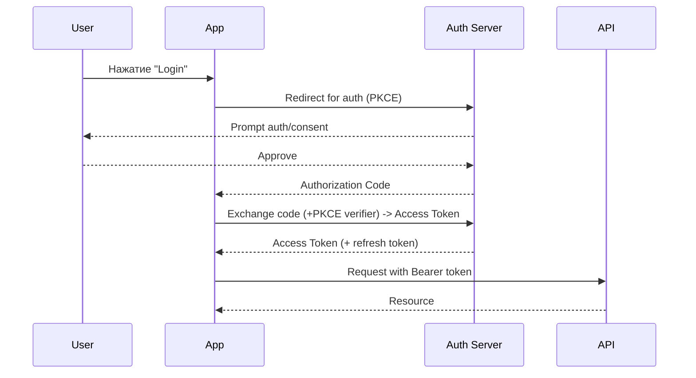

# Лекция 31. Интеграции: внешние API, OAuth, Webhooks и идемпотентность

Коротко: зачем и где применяется. Современные приложения часто интегрируются с внешними сервисами — платёжными системами, CI/CD, мессенджерами и др. Надёжная интеграция требует понимания аутентификации (OAuth), безопасного приёма событий (webhooks), и гарантий идемпотентности при повторной доставке и сбоях.

## Результаты обучения

После лекции вы:

- будете понимать OAuth‑flows (Authorization Code + PKCE, Client Credentials) и когда какой использовать;
- реализуете безопасный приём вебхуков (HMAC подписи, таймстемпы, проверка replay);
- внедрите схемы идемпотентности (Idempotency‑Key, dedup store, транзакции);
- спроектируете поведение клиента при rate‑limits, retry/backoff и circuit breakers;
- проведёте локальную проверку интеграции с использованием ngrok и тестовых webhook‑поставщиков.

## Пререквизиты

- Базовые знания HTTP, REST, JSON и Node.js/Express (или аналог);
- Понимание асинхронности, очередей и базовых принципов безопасности (HMAC, TLS);
- Навыки работы в терминале и с инструментами вроде ngrok, curl.

## Введение: картина мира

Интеграция — это договор (контракт) между системами: API, форматы, SLA, лимиты. Внешние системы могут быть ненадёжны: они ограничивают частоту запросов, повторно доставляют события и могут возвращать transient errors. Наша задача — строить взаимодействие, сохраняющее согласованность и защищающее сервис от злоупотреблений.

## Основные понятия и терминология

- OAuth 2.0: протокол авторизации; даёт access token для доступа к защищённым ресурсам.
- Webhook: HTTP callback — способ уведомления о событии от поставщика.
- HMAC: крипто‑подпись для проверки целостности и аутентичности вебхука.
- Idempotency: свойство операции давать один и тот же результат при многократном повторе.
- Rate limit: ограничение частоты запросов; требует корректной стратегии повторов.

## Ядро лекции — пошаговое освоение

### Подтема 1. OAuth: основные потоки и безопасность

Определения:

- Authorization Code + PKCE: безопасный flow для публичных клиентов (SPA/Native) с защитой от interception.
- Client Credentials: flow для сервис‑к‑сервису (machine‑to‑machine).
- Refresh Token: обновление access token без повторной авторизации пользователя.



Пояснение к примеру: PKCE добавляет verifier/challenge и безопасен для клиентов, которые не хранят секрет; Client Credentials — для бэкендов/cron.

Проверка:

- Настройте OAuth client (sandbox) и выполните авторизацию в dev‑окружении; проверьте, что токен действителен и что refresh token позволяет получить новый access token.

Типичные ошибки:

- хранить access/refresh токены в небезопасном месте (localStorage без защиты);
- не проверять expiry и пытаться использовать просроченный токен;
- пытаться использовать Authorization Code без PKCE в SPA.

### Подтема 2. Клиентская стратегия: retry, backoff, rate limiting

Определения:

- Exponential backoff: увеличение интервала между попытками при ошибках.
- Jitter: рандомизация задержек, чтобы избежать «thundering herd». 
- Circuit breaker: временно прерывает попытки к упавшему сервису.

Пример (псевдо‑код):

```js
// простой retry с exponential backoff + jitter
async function fetchWithRetry(url, opts, retries=5) {
  for (let i=0;i<retries;i++){
    try { return await fetch(url, opts) }
    catch(err){
      const backoff = Math.min(1000 * 2**i, 30000)
      const jitter = Math.random() * 200
      await sleep(backoff + jitter)
    }
  }
  throw new Error('Max retries reached')
}
```

Пояснение к примеру: при transient errors (5xx, timeouts) используйте backoff+jitter; при 429 (rate limit) учитывайте Retry‑After заголовок.

Проверка: симулируйте 500/429 ответы и проверьте логи и интервалы повторов.

Типичные ошибки:

- агрессивные быстрые повторы → усугубление проблемы;
- отсутствие краткосрочного circuit breaker → лавина попыток.

### Подтема 3. Webhooks: подписи, таймстемпы, replay и дедупликация

Определения:

- HMAC signature: подпись тела запроса с секретом (например, SHA256 HMAC).
- Timestamp window: допустимый временной разброс для защиты от replay.
- Dedup store: хранилище для отметок обработанных event_id.

Определения перед примером: подпись, timestamp, event_id — обязательные поля для безопасного webhook‑контракта.

```js
// file: webhook-handler.js (express)
import express from 'express'
import crypto from 'crypto'
import redis from 'redis'

const client = redis.createClient({ url: process.env.REDIS_URL })
await client.connect()

const app = express()
app.post('/webhooks/provider', express.raw({ type: '*/*' }), async (req, res) => {
  const sig = req.headers['x-hub-signature-256'] || req.headers['x-signature']
  const ts = req.headers['x-timestamp']
  const body = req.body // Buffer

  // Проверка таймстемпа (в секундах)
  if (Math.abs(Date.now()/1000 - Number(ts)) > 300) return res.status(400).send('stale')

  const expected = crypto.createHmac('sha256', process.env.WEBHOOK_SECRET).update(ts + '.' + body).digest('hex')
  if (!safeCompare(sig, expected)) return res.status(401).send('invalid signature')

  const payload = JSON.parse(body.toString())
  const eventId = payload.id || payload.event_id

  // Дедупликация: попытаться пометить ключ, если уже есть — записать в лог и вернуть 200
  const key = `webhook:${eventId}`
  const existed = await client.set(key, 'processing', { NX: true, EX: 60*60 })
  if (!existed) return res.status(200).send('duplicate')

  try {
    // обработка события: push в очередь/попытка применить бизнес‑операцию
    res.status(200).send('ok')
  } catch (err) {
    // если упали — удаляем ключ, чтобы allow retry
    await client.del(key)
    throw err
  }
})

function safeCompare(a,b){
  if (!a || !b) return false
  // постоянное время сравнения
  return crypto.timingSafeEqual(Buffer.from(a), Buffer.from(b))
}

app.listen(3000)
```

Пояснение к примеру: проверяем timestamp (защита от replay), затем подпись HMAC (ts + '.' + body), затем используем Redis для краткосрочной дедупликации. Если обработка не удалась — освобождаем ключ для повторной доставки.

Проверка:

- Сгенерируйте подписанный запрос и отправьте curl; попробуйте повторить тот же event_id — второй раз сервер вернёт duplicate.
- Проверьте, что при ошибке обработки ключ удаляется и событие может быть обработано повторно.

Типичные ошибки:

- проверять подпись поверх JSON.parse(body) — тело уже изменилось;
- не учитывать временную метку → replay уязвимость;
- хранить дедупликацию навечно без TTL → утечка ключей.

### Подтема 4. Идемпотентность: стратегии приложения и API

Определения:

- Idempotency‑Key: уникальный ключ от клиента для операции (например, создание платежа).
- Put‑once/Upsert: операции, которые можно выполнять многократно без усиления эффекта.

Пример сервера для платёжного эндпоинта (псевдо‑код):

```js
// Приём запроса с Idempotency-Key
app.post('/payments', async (req, res) => {
  const key = req.headers['idempotency-key']
  if (!key) return res.status(400).send('missing idempotency key')

  const existing = await db.getIdempotency(key)
  if (existing) return res.status(200).json(existing.response)

  // Создаём запись в транзакции: reserved state
  await db.beginTransaction()
  try {
    const result = await processPayment(req.body)
    await db.saveIdempotency(key, { response: result })
    await db.commit()
    return res.status(200).json(result)
  } catch (err) {
    await db.rollback()
    throw err
  }
})
```

Пояснение к примеру: перед выполнением бизнес‑логики проверяем и сохраняем ответ в таблице idempotency; используйте транзакции, чтобы избежать race‑conditions.

Проверка:

- Отправьте два одинаковых запросa с тем же ключом — второй должен вернуть тот же результат и не создавать дублей.

Типичные ошибки:

- использовать ключи без проверки подлинности — злоумышленник может подставлять ключи;
- не учитывать ограничения хранения истории идемпотентности (TTL/archival).

### Подтема 5. End‑to‑end: локальная практика с ngrok и симуляцией

Определения:

- Ngrok/Cloudflared: туннелирование локального сервера для внешних вебхуков.

Пошаговая практика:

1. Запустите локальный сервер webhook handler (см. пример выше) на порту 3000.
2. Откройте туннель: `ngrok http 3000` и получите публичный URL.
3. В панели провайдера укажите URL и секрет; отправьте тестовое событие.
4. Наблюдайте подпись, timestamp, и повторы; проверьте дедупликацию.

Пояснение: локальная проверка упрощает разработку и отладку обработчиков вебхуков.

Проверка: используйте `curl` для отправки подписанного тела и убедитесь, что ваше приложение принимает/отклоняет запросы по правилам.

Типичные ошибки: открывать туннель в прод‑режиме с секретом в URL; не логировать исходы обработок.

### Подтема 6. Observability и post‑mortem интеграций

Определения:

- Tracing/Logs/Metrics: важные источники для выявления проблем с интеграциями.

Короткий вывод: логируйте события webhook (id, source, signature result), запись retry/backoff и результат обработки; собирайте метрики ошибок и latency по внешним API.

Типичные ошибки: отсутствие correlation id между запросами, логов и метрик; отсутствие алертов на рост 5xx от внешних API.

## Разбор типичных ошибок и анти‑паттернов

- Полагаться на «всегда надёжный» внешний API — готовьте fallback и graceful degradation.
- Хранить секреты в коде или в публичных переменных окружения.
- Игнорировать заголовки Retry‑After и rate limits.
- Не иметь механизма дедупликации и idempotency — риск двойных платежей/операций.

## Вопросы для самопроверки

1. Какие OAuth‑flows вы бы выбрали для SPA, мобильного клиента и backend‑to‑backend? Почему?
2. Как защитить webhook от replay‑атак?
3. Почему важно использовать jitter в backoff?
4. В каких случаях нужен Idempotency‑Key, а когда достаточно транзакций в БД?
5. Что делать при получении 429 от внешнего API?
6. Как связать логи webhook с трассировкой запросов в системе?
7. Какие риски при хранении токенов в браузере?
8. Как обеспечить безопасность подписи webhook если секрет скомпрометирован?
9. Что такое safeCompare и зачем он нужен при проверке подписи?
10. Как управлять TTL записей дедупликации?
11. Почему не стоит сразу отвечать 500 при ошибке обработки вебхука?
12. Как провести локальное тестирование интеграции с платежным провайдером?
13. Какие метрики важны для мониторинга интеграций?
14. Как реализовать circuit breaker для внешнего API?
15. Какие дополнительные меры можно принять против replay и DOS‑атак?

## Краткий конспект (cheat‑sheet)

- OAuth: Authorization Code + PKCE (SPA), Client Credentials (machine‑to‑machine), используйте refresh tokens.
- Webhooks: подпись (HMAC), timestamp, event_id, дедупликация через Redis/DB, TTL ключей.
- Идемпотентность: Idempotency‑Key + db table с результатами; транзакции для race‑conditions.
- Retry: exponential backoff + jitter; honor Retry‑After; circuit breaker для защиты системы.

## Дополнительно

Глоссарий:

- PKCE, HMAC, Idempotency‑Key, Retry‑After, Circuit Breaker, TTL, Jitter.

Полезные ссылки:

- OAuth 2.0: [https://oauth.net/2/](https://oauth.net/2/)
- Stripe webhooks guide: [https://stripe.com/docs/webhooks](https://stripe.com/docs/webhooks)
- GitHub webhook docs: [https://docs.github.com/en/webhooks-and-events/webhooks](https://docs.github.com/en/webhooks-and-events/webhooks)

## Быстрая практика

```bash
# 1) Запуск локального webhook‑handler
NODE_ENV=development WEBHOOK_SECRET=secret node webhook-handler.js

# 2) Ngrok: получить публичный URL
ngrok http 3000

# 3) Сгенерировать подписанный запрос (пример с node)
node -e "const crypto=require('crypto'); const body=JSON.stringify({id:'evt-1'}); const ts=Math.floor(Date.now()/1000); const sig=crypto.createHmac('sha256','secret').update(ts+'.'+body).digest('hex'); console.log(sig, ts, body)"

# 4) Отправить curl
curl -X POST \
  -H "Content-Type: application/json" \
  -H "x-hub-signature-256: <sig>" \
  -H "x-timestamp: <ts>" \
  --data '{"id":"evt-1"}' https://<your-ngrok-url>/webhooks/provider

# 5) Повторить тот же запрос — проверить duplicate handling
```

Ожидаемый результат: первое событие обработано, второе — признано дубликатом; при некорректной подписи приходит 401.

