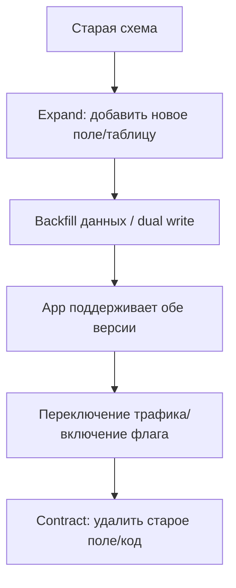

# Лекция 32: Миграции и обновления — версионирование, feature flags, rollback

Коротко: зачем и где применяется. Обновления и миграции — не только про изменение кода: это координация схемы базы, данных, контрактов и поведения клиентов. Правильная стратегия миграций уменьшает простои, предотвращает потерю данных и обеспечивает безопасный rollback.

## Результаты обучения

После лекции вы:

- поймёте виды миграций (schema vs data, online vs offline, forward/backward);
- составите безопасный план релиза с zero‑downtime (expand‑and‑contract);
- внедрите feature flags для мягкого раската и быстрого отката;
- реализуете idempotent миграции/скрипты и дедупликацию в процессе миграций;
- настроите тесты миграций в CI и runbook для отката.

## Пререквизиты

- Знание SQL и принципов транзакций; опыт работы с ORM (Prisma/TypeORM/Django) желателен;
- Опыт использования CI/CD и умение читать логи/метрики.

## Введение: понятия и карта области

- Migration — код или скрипт, который надёжно переводит схему/данные из состояния A → B.
- Expand‑and‑contract — безопасный шаблон: сначала добавляем новую структуру (expand), затем переводим трафик, и в конце удаляем устаревшее (contract).
- Idempotent script — можно запускать несколько раз без вреда.



Пояснение к диаграмме: каждый шаг — отдельный релиз/миграция с проверкой наблюдаемости и возможностью отката.

## Пошаговое освоение темы

### Подтема 1. Типы миграций и idempotency

Определения:

- Schema migration: изменение структуры (ALTER TABLE, INDEX…);
- Data migration (backfill): заполнение/обновление значений, трансформация данных;
- Online vs Offline: online — без окна простоя; offline — требуется остановка сервиса.

Лучшие практики:

- делайте миграции идемпотентными (IF NOT EXISTS / CREATE INDEX CONCURRENTLY / guard checks);
- разделяйте schema и heavy data migrations (backfill отдельными заданиями);
- держите миграции в VCS и привязывайте к релизу.

Типичные ошибки:

- писать миграции, которые не удаётся выполнить повторно;
- объединять схему и тяжёлые трансформации в одной транзакции.

### Подтема 2. Zero‑downtime: expand‑and‑contract паттерн

Пошаговый шаблон:

1. Expand: добавить nullable поля/новые таблицы/индексы non‑blocking.
2. Backfill/dual‑write: приложение пишет в старое и новое место, выполняется backfill для исторических данных.
3. Switch: включить feature flag/маршрутизацию на новую логику для части трафика (canary).
4. Contract: удалить старую логику и структуру после проверки.

Пояснение к шагам: каждая стадия — отдельный релиз/миграция с проверками SLO и метрик.

Проверка: измеряйте latency/error rate до/после каждого шага; выполняйте smoke tests.

Типичные ошибки:

- удалять старую структуру слишком рано;
- выполнять долгие ALTER без CONCURRENTLY в PG.

### Подтема 3. Миграции на практике: Prisma / TypeORM / Django / Flyway

Определение перед примерами: всегда добавляйте "Пояснение к примеру", "Проверка" и "Типичные ошибки".

#### Prisma (Node.js)

schema.prisma (фрагмент):

```prisma
model User {
  id    Int     @id @default(autoincrement())
  email String  @unique
  name  String?
}
```

Добавить username:

```bash
npx prisma migrate dev --name add_username
```

Пояснение к примеру:

- Prisma генерирует SQL‑миграции из декларативной схемы; миграция добавляет колонку nullable — это безопасный expand‑шаг.

Проверка:

- Выполните миграцию в staging, проверьте, что новая колонка существует и запросы работают;
- Выполните backfill для username частями и проверьте корректность данных.

Типичные ошибки:

- применять non‑nullable столбцы без default/заполнения;
- забыть про индексы и уникальные ограничения при backfill.

#### TypeORM (TS)

```ts
export class AddUsername1710000000000 implements MigrationInterface {
  public async up(queryRunner: QueryRunner): Promise<void> {
    await queryRunner.query("ALTER TABLE users ADD COLUMN username varchar(100)");
  }
  public async down(queryRunner: QueryRunner): Promise<void> {
    await queryRunner.query("ALTER TABLE users DROP COLUMN username");
  }
}
```

Пояснение к примеру:

- TypeORM даёт вам контроль над SQL; важно писать down‑миграции, но помните — откат реальной data migration может требовать ручных шагов.

Проверка:

- Проведите `migration:generate` и `migration:run` в тестовом окружении; проверьте `down` на копии БД.

Типичные ошибки:

- полагаться на `down` для удаления данных — лучше иметь snapshot/бэкап.

#### Django ORM

```bash
python manage.py makemigrations
python manage.py migrate
```

Пояснение к примеру:

- Django автоматически генерирует миграции, но крупные data migrations лучше выносить в отдельные scripts/job'ы.

Проверка:

- Запустите миграцию и выполните unit/integration тесты; проверьте, нет ли долгих миграций.

Типичные ошибки:

- смешивание schema и heavy data migration в одном `migrate`.

#### Flyway (SQL)

V2__add_username.sql:

```sql
ALTER TABLE users ADD COLUMN username varchar(100);
```

Пояснение к примеру:

- Flyway исполняет SQL напрямую и удобен для простого контроля версий миграций; но data migrations требуют осторожности.

Проверка:

- Выполните `flyway info` и `flyway migrate` на staging; проверьте idempotency и возможность повторного запуска.

Типичные ошибки:

- запускать SQL‑скрипты без проверки на concurrency/blocking;
- хранить секреты подключения в открытом виде.

### Подтема 4. Feature flags: практические рекомендации

Определения:

- Release flags, Experiment flags, Ops flags, Permission flags.

Пояснение:

- Используйте feature flags для gradual rollout, A/B тестов и аварийного отключения фич.

Пример (бекенд):

```ts
function featureEnabled(req, key) {
  // читать из кеша/Unleash SDK/локального конфига
  return req.user?.role === 'beta';
}
```

Пояснение к примеру:

- Решение флага должно быть быстрым (кэш) и логироваться; держите TTL и аудитацию.

Проверка:

- Включите флаг для 5% пользователей и проверьте метрики ошибок/latency;
- Прогоните rollback, убедитесь в быстроте реакции.

Типичные ошибки:

- держать флаги навсегда (technical debt);
- не логировать кто/когда изменил флаг.

### Подтема 5. Rollout, rollback и backup стратегии

Пояснение:

- Rollout начинайте с canary/процентного трафика, мониторьте SLO/метрики и постепенно увеличивайте;
- Для rollback имейте:
  - immutable образ/тег по SHA
  - план отката миграций (down) или snapshot/restore
  - feature flags как мягкий rollback

Проверка:

- Протестируйте быстрый откат на staging: переключите трафик обратно и измерьте RTO;
- Проверьте, что backup snapshot восстанавливается за заявленное время.

Типичные ошибки:

- откат приложения без отката/восстановления данных → несогласованность;
- перезапись production данных при тестах отката.

### Подтема 6. Контракты и совместимость API

Пояснение:

- Для REST вставляйте новые поля, не удаляйте существующие; версии в пути/заголовке, если breaking change.
- Для событий используйте схемы (Avro/Protobuf) и поддерживайте forward/backward совместимость.

Проверка:

- Покройте контракты интеграционными тестами; проверьте старых потребителей при изменениях.

Типичные ошибки:

- ломать контракт без координации; не иметь тестов совместимости.

## Практика: план миграции переименования поля

1) Expand: добавить `full_name` nullable и индекс (если нужен).
2) Backfill: выполнить batched job, который заполняет `full_name` из `name`.
3) Dual write: обновлять оба поля в новом коде до полного раската.
4) Rollout: включать флаг `use_full_name_ui` для 10% → 50% → 100%.
5) Contract: удалить `name` после верификации и архивации.

Пояснение: этот план минимизирует простой и риск потери данных, позволяет откатиться на любом шаге.

Проверка: выполните план в staging и прогоните smoke tests; проверьте, что оба поля содержат корректные значения.

## CI/CD и тестирование миграций

Рекомендации:

- Прогоняйте миграции в изолированном ephemeral окружении в CI (docker compose / ephemeral RDS);
- Тестируйте `up` и `down`; делайте backup snapshot перед опасными изменениями;
- Автоматизируйте длительные backfill jobs как джобы в очереди (Kubernetes Jobs).

## Runbook / Checklist перед релизом

- Проверить наличие бэкапа и возможности point‑in‑time recovery;
- Прогонить миграцию в staging и нагрузочный smoke test;
- Убедиться, что метрики и алерты настроены (error rate, latency, DB locks);
- Подготовить rollback plan, snapshot команды и лиц, ответственных за откат;
- Установить временные окна для выполнения длительных операций.

## Быстрая практика (команды)

```powershell
# 1) Прогон миграций (Prisma example)
npx prisma migrate deploy --preview-feature

# 2) Запуск batched backfill job (пример для Node.js)
node scripts/backfill_full_name.js --batch-size=1000

# 3) Проверка схемы в staging
psql $STAGING_DB -c "\d users"

# 4) Создать snapshot (пример AWS RDS)
aws rds create-db-snapshot --db-instance-identifier mydb --db-snapshot-identifier pre-migration-$(date +%s)

# 5) Откат миграции (если поддерживается)
npx prisma migrate resolve --applied "migration_name" # пример управления
```

## Заключение и полезные ссылки

- Практика миграций — это процесс: автоматизация, тесты, наблюдаемость и runbooks делают обновления безопасными.
- Документация: Prisma Migrate, TypeORM, Django Migrations, Flyway, Unleash, LaunchDarkly.

