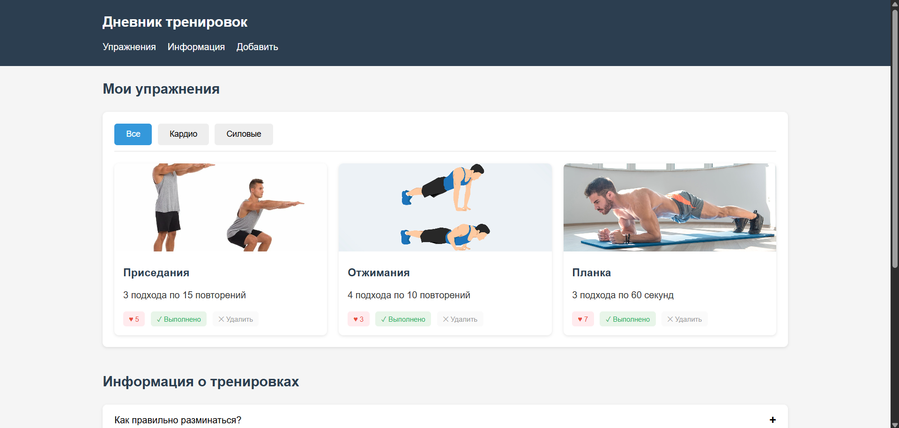
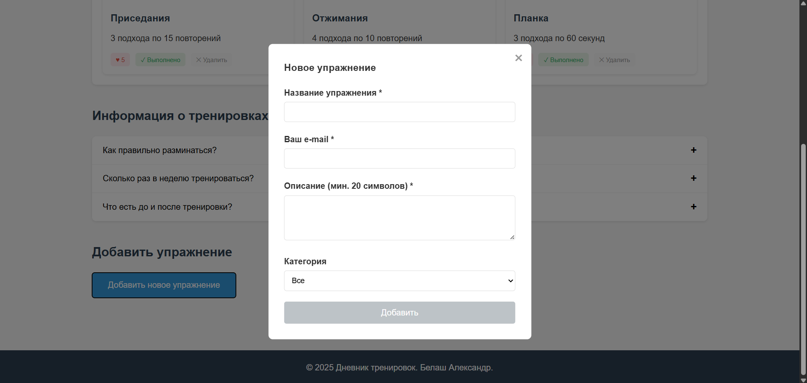
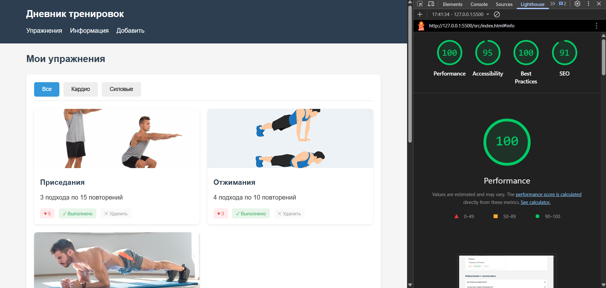

# Лабораторная работа №2

<p align="center">Министерство образования Республики Беларусь</p>
<p align="center">Учреждение образования</p>
<p align="center">"Брестский Государственный технический университет"</p>
<p align="center">Кафедра ИИТ</p>
<br><br><br><br><br><br>
<p align="center"><strong>Лабораторная работа №2</strong></p>
<p align="center"><strong>По дисциплине:</strong> "Веб-технологии"</p>
<p align="center"><strong>Тема:</strong> DOM и события: интерактивные компоненты и формы (JavaScript)</p>
<br><br><br><br><br><br>
<p align="right"><strong>Выполнил:</strong></p>
<p align="right">Студент 4 курса</p>
<p align="right">Группы АС-64</p>
<p align="right">Белаш А. О.</p>
<p align="right"><strong>Проверил:</strong></p>
<p align="right">Несюк А. Н.</p>
<br><br><br><br><br>
<p align="center"><strong>Брест 2025</strong></p>

---

## Цель работы

Освоить работу с DOM: добавление, удаление и изменение элементов интерфейса. Научиться обрабатывать события, использовать делегирование, работать с клавиатурной доступностью. Реализовать клиентскую валидацию форм.

---

### Вариант №25

Тема: Дневник тренировок: карточки упражнений, делегирование отметок, форма добавления.

## Ход выполнения работы

### 1. Структура проекта

```
+---doc
|   |   README.md
|   |
|   \---screenshots
|           screenshot1.png
|           screenshot2.png
|           lighthouse.png
|
\---src
    |   index.html
    |   styles.css
    |   main.js
    |
    \---img
            exercise1.jpg
            exercise2.jpg
            exercise3.jpg
            exercise4.jpg
            exercise5.jpg
```

- `index.html` — основная страница с дневником тренировок
- `styles.css` — стилизация и медиазапросы
- `main.js` — логика интерактивных компонентов
- `img/` — изображения упражнений

### 2. Реализованные элементы

- Семантическая разметка HTML5 (header, main, section, nav, footer)
- Табы для переключения категорий упражнений (Все, Кардио, Силовые)
- Аккордеон с информацией о тренировках
- Модальное окно для добавления нового упражнения
- Форма с валидацией (имя, e-mail, описание)
- Карточки упражнений с кнопками лайка, отметки выполнения и удаления
- Делегирование событий на контейнере карточек
- Базовая клавиатурная навигация (Tab, Enter, Escape)
- ARIA-атрибуты для аккордеона и модального окна
- Адаптивная вёрстка (1 брейкпоинт 768px)

### 3. Скриншоты выполненой лабораторной работы

#### Главная страница с карточками упражнений



#### Модальное окно с формой добавления



## Проверка качества

### Lighthouse



**Результаты Lighthouse:**

- Performance: 100
- Accessibility: 85
- Best Practices: 100
- SEO: 91

### Валидаторы

- HTML Validator без критических ошибок
- CSS Validator без критических ошибок

---

## Таблица критериев

| Критерий                                | Выполнено |
|------------------------------------------|-----------|
| Семантика/структура (landmarks, заголовки) | ✅ |
| Интерактивные компоненты (табы, аккордеон, модалка) | ✅ |
| Форма с валидацией | ✅ |
| Делегирование событий | ✅ |
| Доступность (ARIA, клавиатура) | ✅ |
| Адаптивная вёрстка | ✅ |
| Качество кода | ✅ |
| Публикация и отчёт | ✅ |

### Дополнительные бонусы

| Бонус                                     | Выполнено |
|-------------------------------------------|-----------|
| Сохранение состояния в localStorage       | ❌ |
| Тёмная тема                               | ❌ |
| Юнит-тесты                                | ❌ |

---

## Вывод

В ходе выполнения лабораторной работы был создан интерактивный дневник тренировок. Реализованы основные компоненты: табы, аккордеон, модальное окно с формой. Применено делегирование событий для обработки действий с карточками упражнений. Добавлена базовая клавиатурная доступность и ARIA-атрибуты.
