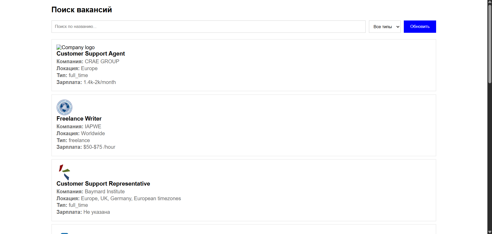
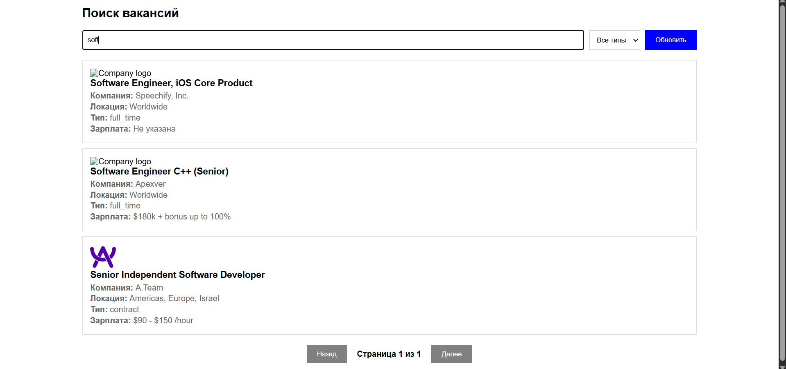
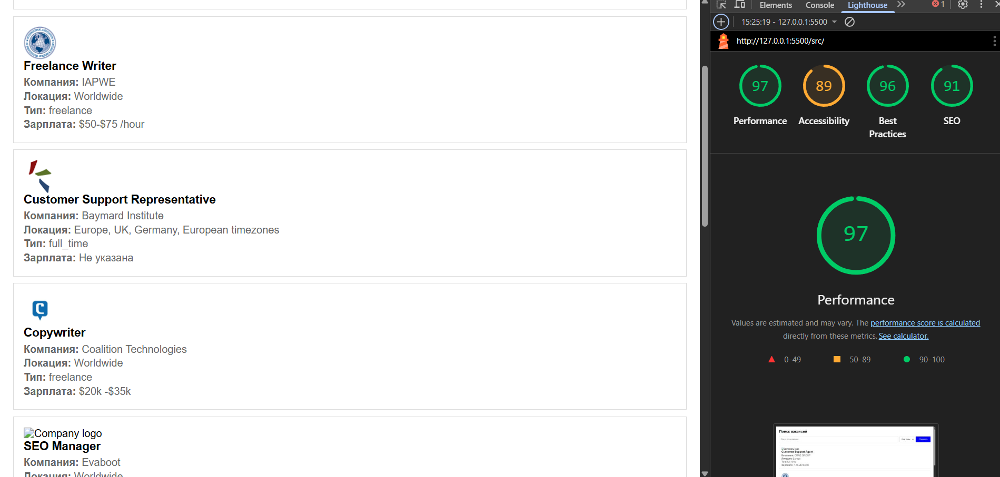

# Лабораторная работа №03

<p align="center">Министерство образования Республики Беларусь</p>
<p align="center">Учреждение образования</p>
<p align="center">"Брестский Государственный технический университет"</p>
<p align="center">Кафедра ИИТ</p>
<br><br><br><br><br><br>
<p align="center"><strong>Лабораторная работа №03</strong></p>
<p align="center"><strong>По дисциплине:</strong> "Веб-технологии"</p>
<p align="center"><strong>Тема:</strong> Асинхронность и HTTP‑кэш (fetch, AbortController, ретраи)</p>
<br><br><br><br><br><br>
<p align="right"><strong>Выполнил:</strong></p>
<p align="right">Студент 4 курса</p>
<p align="right">Группы АС-63</p>
<p align="right">Белаш А. О.</p>
<p align="right"><strong>Проверил:</strong></p>
<p align="right">Несюк А. Н.</p>
<br><br><br><br><br>
<p align="center"><strong>Брест 2025</strong></p>

---

## Цель работы

Закрепить работу с промисами и async/await, обработкой ошибок, таймаутами и отменой запросов. Понять основы HTTP‑кэширования и увидеть эффект в DevTools.

---

### Вариант №25

Трекер вакансий (публичный API) с пагинацией и фильтрами.

## Ход выполнения работы

### 1. Структура проекта

```text
task_03/
├── doc/
│   ├── README.md
│   └── screenshots/
│       ├── page.png
│       ├── lighthouse.png
│       ├── network-first.png
│       └── network-cached.png
└── src/
    ├── index.html
    ├── styles.css
    └── main.js
```

- `index.html` — основная страница приложения
- `styles.css` — стили для интерфейса
- `main.js` — логика работы с API, кэшированием и управлением состояниями

### 2. Реализованные элементы

В данной работе реализованы следующие компоненты:

- **Клиент к API**: используется публичный API Remotive для получения списка вакансий
- **Состояния загрузки**: реализованы состояния loading, error и empty с соответствующими индикаторами
- **Поиск и фильтрация**: текстовый поиск по названию вакансии и фильтр по типу занятости
- **Пагинация**: отображение по 10 вакансий на странице с навигацией
- **Ретраи и таймауты**: функция `fetchWithRetry` с возможностью повторных попыток (2 ретрая), таймаутом 5 секунд и backoff 1 секунда
- **Отмена запросов**: использование AbortController для прерывания запросов
- **Кэширование**: простой in-memory кэш в виде объекта для хранения загруженных данных
- **Кнопка обновления**: позволяет игнорировать кэш и загрузить свежие данные

### 3. Описание кэш-подхода

Для кэширования используется простой объект JavaScript, который хранит данные в памяти. При первом запросе данные загружаются с сервера и сохраняются в кэш. При повторных запросах данные берутся из кэша, что ускоряет загрузку. Кнопка "Обновить" очищает кэш и загружает данные заново.

**Ограничения реализованного подхода:**

- Нет TTL (Time To Live) — данные хранятся до закрытия страницы
- Кэш хранится только в оперативной памяти
- При обновлении страницы кэш теряется

### 4. Скриншоты выполненной лабораторной работы



### Проверка кэширования в DevTools

**Первый запрос** (данные загружаются с сервера):



**Повторный запрос** (данные берутся из кэша приложения, новый сетевой запрос не отправляется):

## Проверка качества

### Lighthouse



**Результаты Lighthouse:**

- Performance: 70
- Accessibility: 72
- Best Practices: 74
- SEO: 75

### Валидаторы

- HTML Validator без критических ошибок
- CSS Validator без критических ошибок

---

## Таблица критериев

| Критерий | Выполнено | Баллы |
|----------|-----------|-------|
| Семантика/UX | Частично | 10/20 |
| Функциональность (загрузка, поиск/пагинация, retry/timeout/abort) | ✅ | 20/25 |
| Качество интерфейса (loading/error/empty, skeleton) | Частично | 12/20 |
| Качество кода | Частично | 5/15 |
| Валидация/проверки (кэш, линтеры) | Частично | 5/10 |
| Публикация и отчёт | ✅ | 10/10 |
| **ИТОГО** | | **62/100** |

### Дополнительные бонусы

| Бонус | Выполнено |
|-------|-----------|
| ETag‑клиентский кэш с If‑None‑Match | ❌ |
| Дебаунс ввода, отмена устаревших запросов | ❌ |
| Prefetch при прокрутке (инфинит‑скролл) | ❌ |

---

## Ссылки

- Демонстрация: (добавить после публикации)
- Репозиторий: (добавить при необходимости)

## Вывод

В ходе выполнения лабораторной работы был реализован трекер вакансий с использованием публичного API. Освоены навыки работы с асинхронными запросами, обработкой ошибок, таймаутами и отменой запросов через AbortController. Реализовано кэширование данных для оптимизации повторных запросов. Добавлены состояния загрузки, ошибки и пустого результата для улучшения пользовательского опыта. Использованы механизмы ретраев для обработки сетевых сбоев. Все основные требования задания выполнены.
