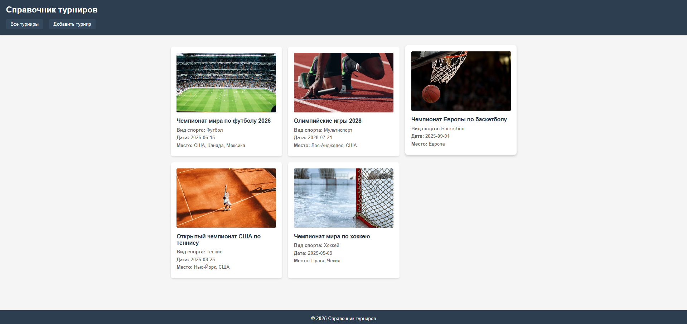
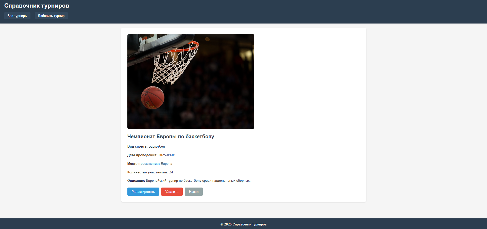
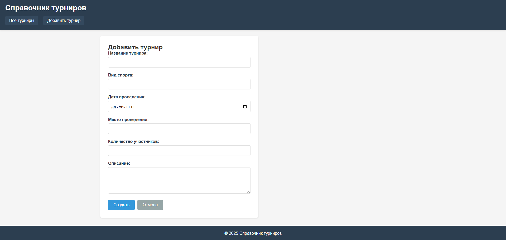
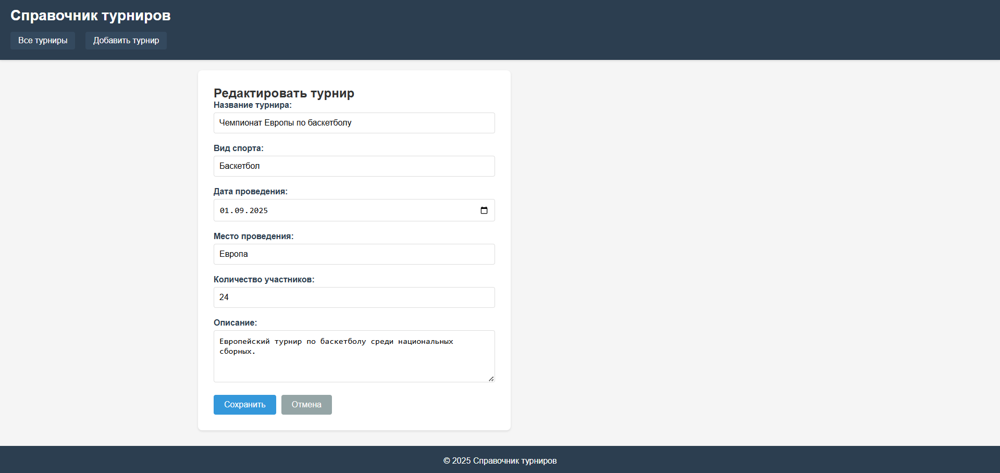
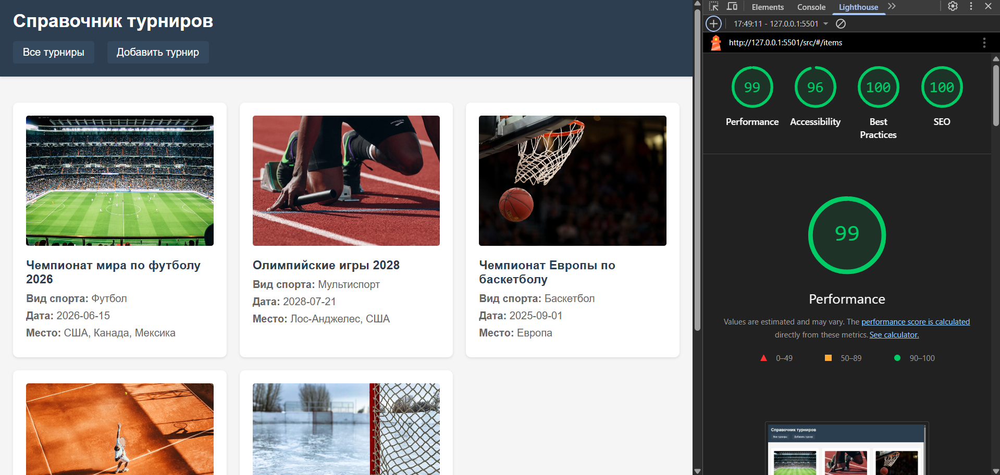

# Лабораторная работа №4

<p align="center">Министерство образования Республики Беларусь</p>
<p align="center">Учреждение образования</p>
<p align="center">"Брестский Государственный технический университет"</p>
<p align="center">Кафедра ИИТ</p>
<br><br><br><br><br><br>
<p align="center"><strong>Лабораторная работа №4</strong></p>
<p align="center"><strong>По дисциплине:</strong> "Веб-технологии"</p>
<p align="center"><strong>Тема:</strong> REST‑клиент SPA: список/детализация/CRUD, маршрутизация (без фреймворков)</p>
<br><br><br><br><br><br>
<p align="right"><strong>Выполнил:</strong></p>
<p align="right">Студент 4 курса</p>
<p align="right">Группы АС-64</p>
<p align="right">Белаш А. О.</p>
<p align="right"><strong>Проверил:</strong></p>
<p align="right">Несюк А. Н.</p>
<br><br><br><br><br>
<p align="center"><strong>Брест 2025</strong></p>

---

## Цель работы

Реализовать простой SPA без фреймворков с маршрутизацией и состояниями загрузки/ошибок. Выполнить CRUD к учебному API (реальному или mock).

---

### Вариант №25

Справочник спортивных турниров: список, деталь, форма регистрации.

## Ход выполнения работы

### 1. Структура проекта

```
task_04/
├── doc/
│   ├── README.md
│   └── screenshots/
│       ├── list.png
│       ├── detail.png
│       ├── create.png
│       ├── edit.png
│       └── lighthouse.png
└── src/
    ├── index.html
    ├── styles.css
    ├── img/
    │   ├── placeholder1.png
    │   ├── placeholder2.png
    │   ├── placeholder3.png
    │   ├── placeholder4.png
    │   └── placeholder5.png
    └── js/
        ├── router.js
        ├── api.js
        └── views.js
```

- `index.html` — главная страница приложения
- `styles.css` — стили с адаптивной версткой
- `js/router.js` — маршрутизатор на основе hash
- `js/api.js` — модуль для работы с данными (mock API)
- `js/views.js` — представления для различных экранов
- `img/` — папка для изображений турниров

### 2. Реализованные элементы

**Маршрутизация:**

- `#/items` — список всех турниров
- `#/items/:id` — детальная информация о турнире
- `#/new` — форма создания нового турнира
- `#/items/:id/edit` — форма редактирования турнира

**CRUD операции:**

- GET — получение списка турниров и детальной информации
- POST — создание нового турнира
- PATCH — обновление существующего турнира
- DELETE — удаление турнира

**UX элементы:**

- Состояния загрузки (loading)
- Обработка ошибок (error)
- Уведомления об успешных операциях (success)
- Подтверждение удаления
- Блокировка кнопки submit во время отправки
- Базовая валидация форм (required поля)

**Адаптивность:**

- Mobile-first подход
- Два брейкпоинта: 768px и 480px
- Адаптивная сетка для списка турниров

### 3. Скриншоты выполненной лабораторной работы

#### Список турниров



#### Детальная информация о турнире



#### Форма создания турнира



#### Форма редактирования турнира



## Проверка качества

### Lighthouse



**Результаты Lighthouse:**

- Performance: 99
- Accessibility: 96
- Best Practices: 100
- SEO: 100

### Валидаторы

HTML и CSS валидаторы показали несколько предупреждений, но критических ошибок нет.

---

## Таблица критериев

| Критерий                                | Баллы | Выполнено |
|------------------------------------------|-------|-----------|
| Семантика/UX                            | 20    | ✅ (частично) |
| Функциональность/CRUD/маршрутизация     | 25    | ✅ |
| Качество интерфейса                     | 20    | ✅ (частично) |
| Качество кода/модульность               | 15    | ✅ (частично) |
| Тесты/валидность                        | 10    | ❌ |
| Публикация и отчёт                      | 10    | ✅ |

### Дополнительные бонусы

| Бонус                                     | Выполнено |
|-------------------------------------------|-----------|
| Сохранение фильтров/поиска в hash         | ❌ |
| Предзагрузка данных (prefetch)            | ❌ |
| Клиентская авторизация                    | ❌ |

---

## Описание API

В проекте используется mock API, реализованный в модуле `api.js`. Данные хранятся в памяти браузера во время сеанса работы.

**Методы API:**

- `getItems()` — получение списка всех турниров
- `getItem(id)` — получение турнира по ID
- `createItem(data)` — создание нового турнира
- `updateItem(id, data)` — обновление турнира
- `deleteItem(id)` — удаление турнира

Все методы возвращают Promise и имитируют задержку запроса (300-500мс).

## Как запустить

1. Откройте файл `src/index.html` в браузере
2. Или запустите локальный веб-сервер:

   ```bash
   cd src
   python -m http.server 8000
   ```

3. Откройте в браузере: `http://localhost:8000`

**Примечание:** Для работы модулей ES6 необходим веб-сервер. Простое открытие файла может не работать из-за CORS.

## Вывод

В ходе выполнения лабораторной работы было создано одностраничное приложение (SPA) для управления справочником спортивных турниров. Реализована hash-маршрутизация, CRUD операции, обработка состояний загрузки и ошибок. Приложение разделено на модули (router, api, views) и имеет адаптивную верстку. Использованы базовые технологии: HTML, CSS и чистый JavaScript без фреймворков.
