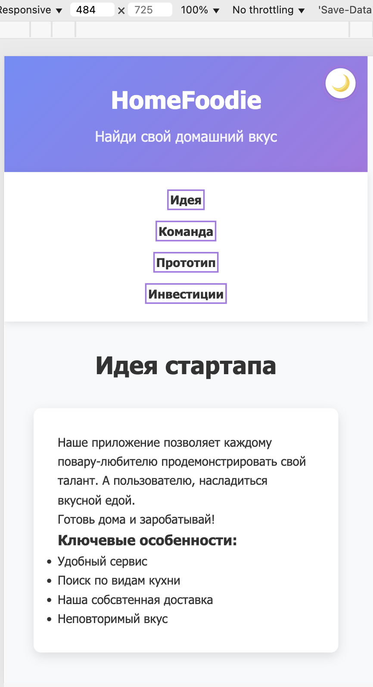
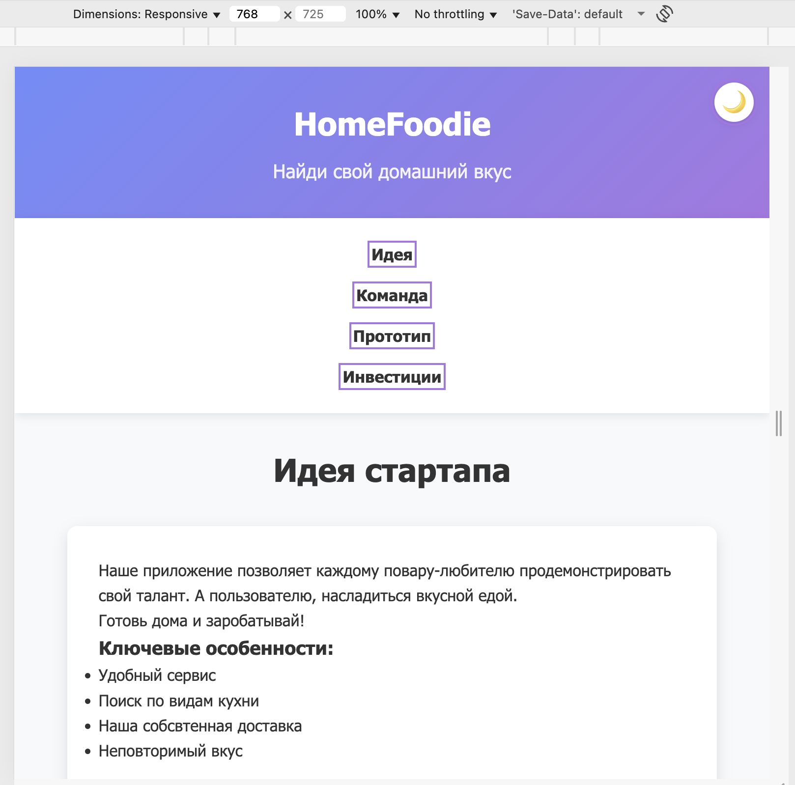
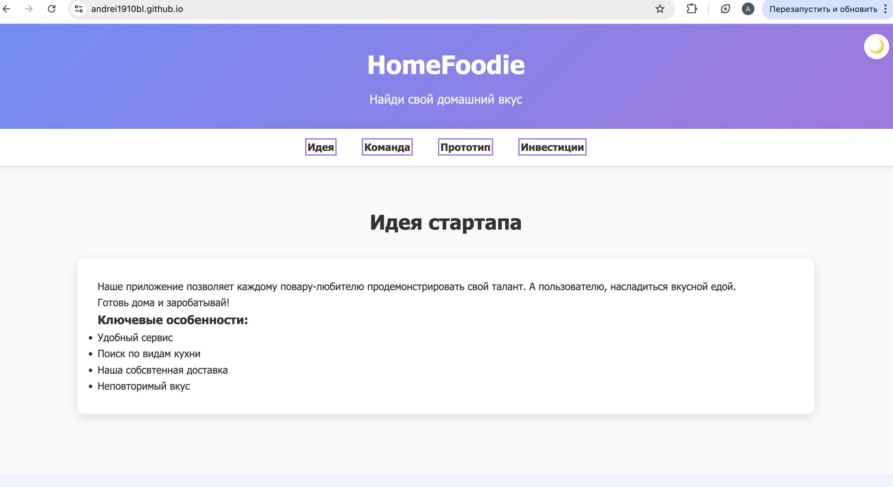
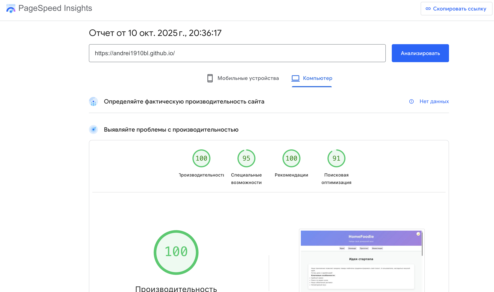
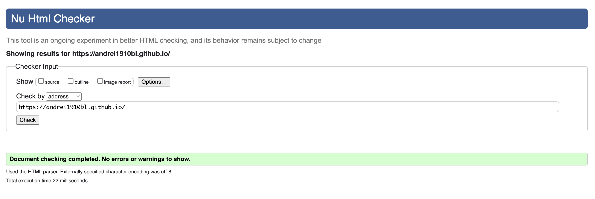
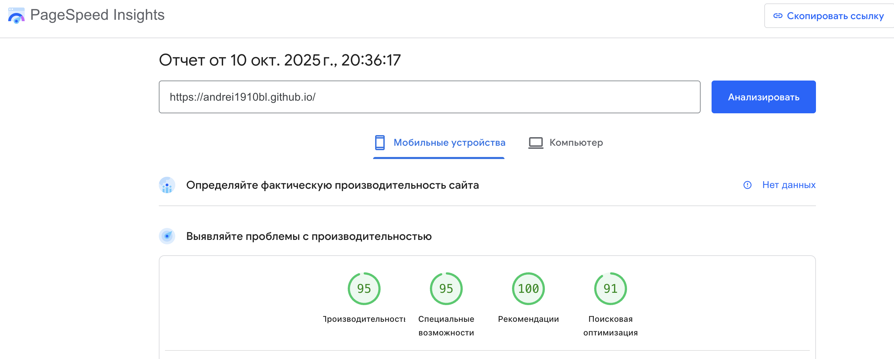

Министерство образования Республики Беларусь

Учреждение образования

“Брестский Государственный технический университет”

Кафедра ИИТ

      

<strong>Лабораторная работа №1</strong>

<strong>По дисциплине:</strong> “Веб-технологии”

<strong>Тема:</strong> “HTML/CSS: семантика, адаптивность и доступность”

      

<strong>Выполнил:</strong>

Студент 4 курса

Группы АС-64

<Булавский А. C.>

<strong>Проверил:</strong>

Несюк А.Н.

     

<strong>Брест 2025</strong>

---

## Цель работы

Освоить основы семантической вёрстки HTML5, реализовать адаптивную структуру веб-страницы по принципу **mobile-first** и обеспечить её доступность в соответствии с современными стандартами.

---

### Вариант №6

## Ход выполнения работы

### 1. Структура проекта
- `index.html` — основная страница  
- `styles.css` — стилизация и медиазапросы  
- `assets/` — изображения и дополнительные материалы  

### 2. Реализованные элементы

- Семантическая разметка HTML5 (`header`, `nav`, `main`, `section`, `footer`, правильная иерархия заголовков)
- Flexbox и CSS Grid для построения сеток
- Mobile-first медиазапросы (2 брейкпоинта: 768px, 480px)
- Атрибуты `alt`, `aria-label` для доступности, видимая подсветка фокуса
- Контрастность цветов ≥ 4.5:1, проверено через WebAIM Contrast Checker
- Кнопка для ручного переключения светлой/тёмной темы
- Использование `<picture>` и `srcset` для адаптивных изображений

### 3. Скриншоты работы сайта

- Мобильная версия (≤600px):  
  

- Планшетная версия (601–1024px):  
  

- Десктопная версия (>1024px):  
  

---

## Проверка качества

### Lighthouse

- Accessibility: 100
- Best Practices: 100

  

### Валидаторы

- HTML Validator  
  

- CSS Validator  
  

---

## Таблица критериев

| Критерий                                | Выполнено |
|------------------------------------------|-----------|
| Семантика/структура (landmarks, заголовки) | ✅ |
| Адаптивная вёрстка (2+ брейкпоинта, Flex/Grid) | ✅ |
| Доступность (alt/label, фокус, контраст, клавиатура) | ✅ |
| Качество и валидность (Lighthouse ≥ 90, валидаторы) | ✅ |
| Оформление кода/структура проекта        | ✅ |
| Публикация и отчёт                       | ✅ |

### Дополнительные бонусы 

| Бонус                                     | Выполнено |
|-------------------------------------------|-----------|
| Тёмная тема (prefers-color-scheme + кнопка) | ✅ |
| Адаптивные изображения (picture/srcset)   | ✅ |
| Улучшения Web Vitals (CLS/LCP/INP)        | ✅ |
| Другие улучшения (ручное переключение темы) | ✅ |

---

## Ссылка на публикацию:
https://[Страница](https://andrei1910bl.github.io/)

## Вывод

В ходе работы была создана адаптивная одностраничная веб-страница с использованием современных стандартов HTML5 и CSS3. Реализованы семантическая разметка, доступность, поддержка тёмной темы, адаптивные изображения, а также ручное переключение темы. Проведена проверка валидаторами и Lighthouse, все критерии выполнены.
