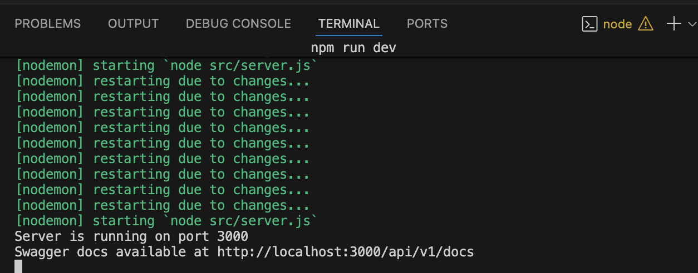
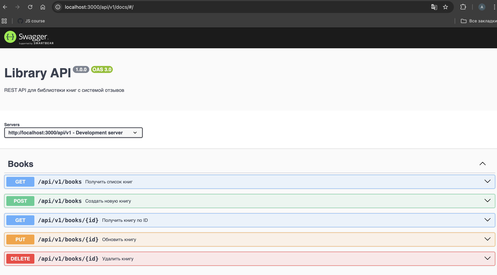
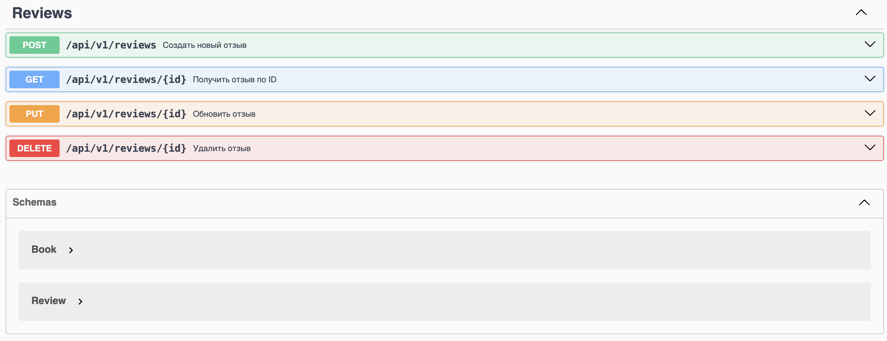
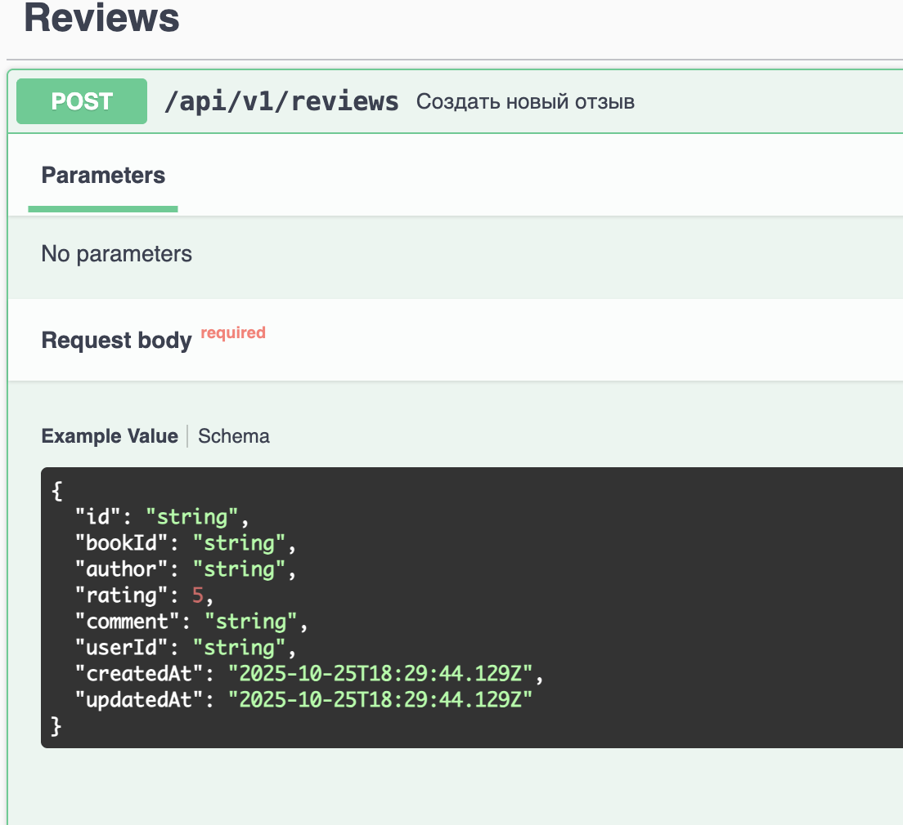
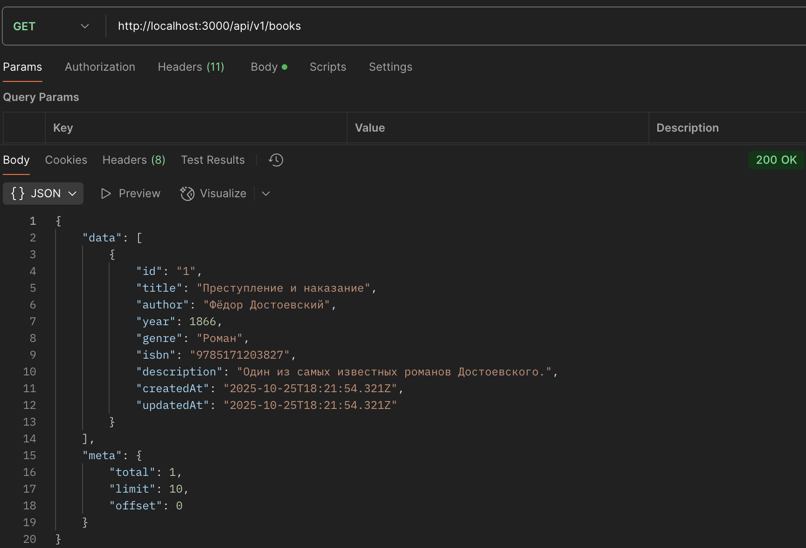
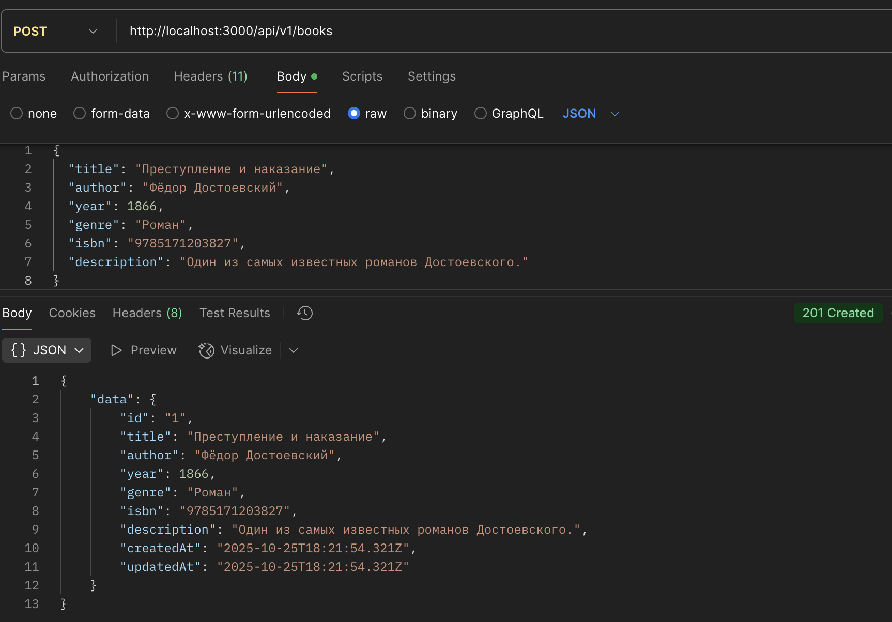
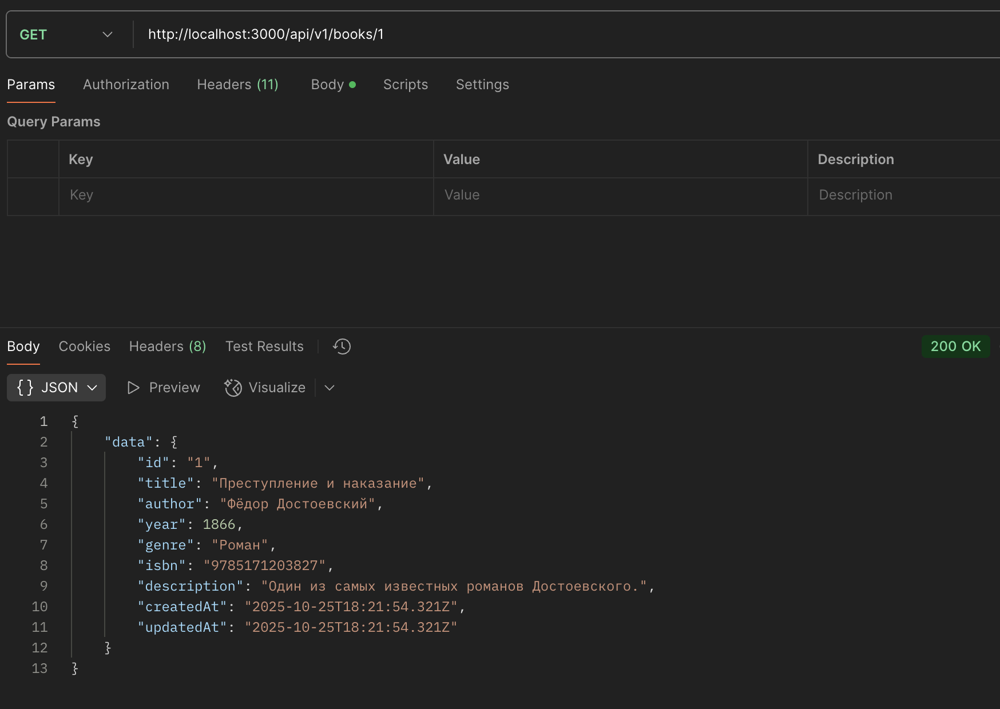
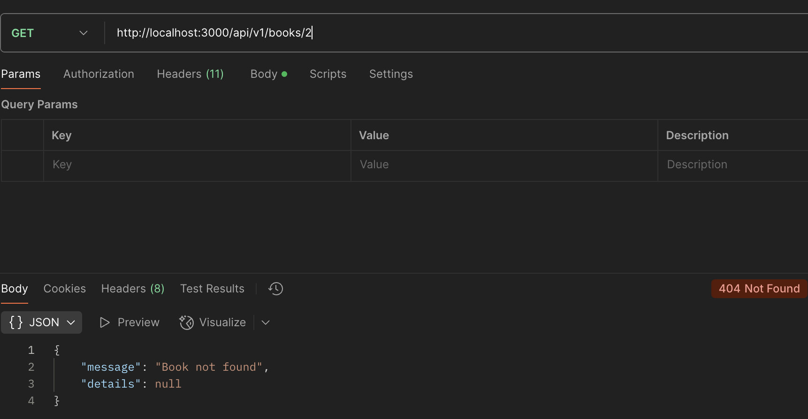

# Отчет по лабораторной работе №5
## Серверное REST API на Node.js + Express

### Цель работы
Разработка REST API для управления библиотекой книг с системой отзывов, включая валидацию данных, обработку ошибок и документацию Swagger.

### Выполненные задачи
- ✅ Создана базовая структура Express-приложения
- ✅ Реализованы CRUD операции для книг и отзывов
- ✅ Добавлена валидация данных с использованием Zod
- ✅ Реализована централизованная обработка ошибок
- ✅ Создана документация API с Swagger UI
- ✅ Добавлены пагинация, поиск и фильтрация

### Проверка работы API

#### 1. Запуск сервера

*Терминал с успешным запуском сервера командой `npm run dev`*

#### 2. Swagger документация

*Главная страница Swagger UI по адресу `/api/v1/docs`*

*Пример 1*

*Пример 2*

#### 3. GET /api/v1/books - список книг

*Запрос получения списка книг с пагинацией*

#### 4. POST /api/v1/books - создание книги

*Успешное создание новой книги*

#### 5. GET /api/v1/books/{id} - получение книги по ID

*Получение конкретной книги по идентификатору*

#### 6. Ошибка 404 - книга не найдена

*Ответ на запрос несуществующей книги*

### Выводы

В ходе лабораторной работы успешно разработано REST API, соответствующее всем требованиям:

- Реализованы все CRUD операции
- Настроена валидация входных данных
- Обеспечена корректная обработка ошибок
- Создана полная документация API
- Добавлены дополнительные функции (пагинация, поиск)

API готово к использованию и соответствует критериям оценивания лабораторной работы.