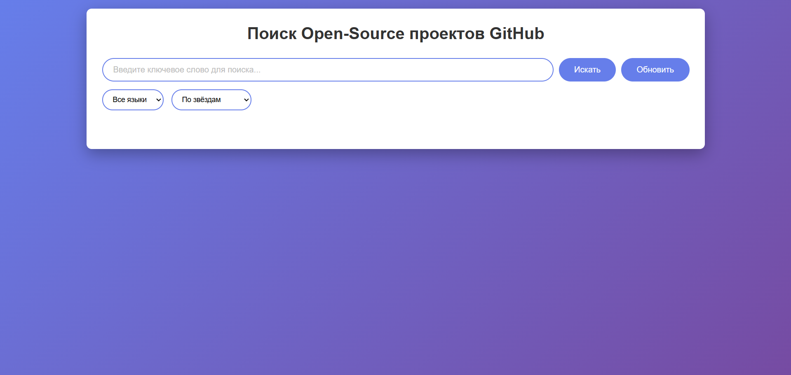
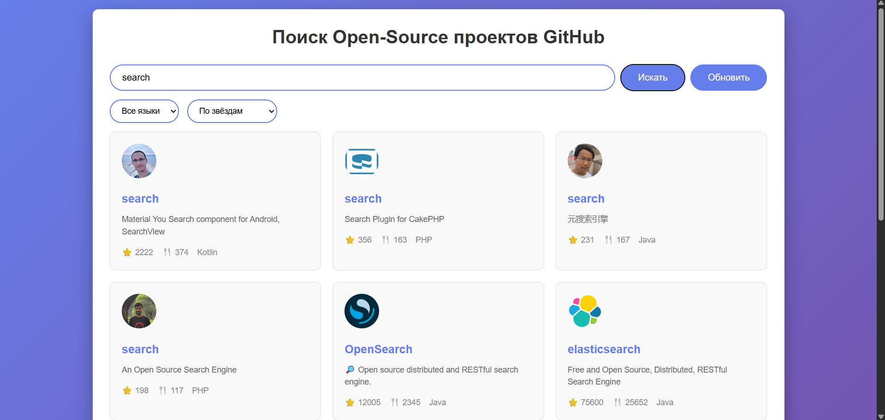
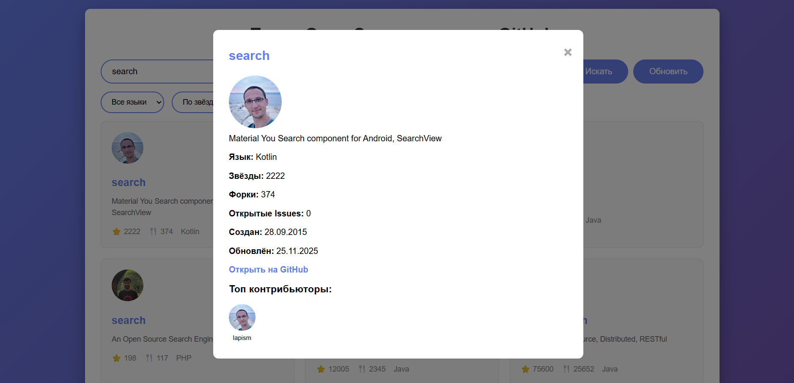
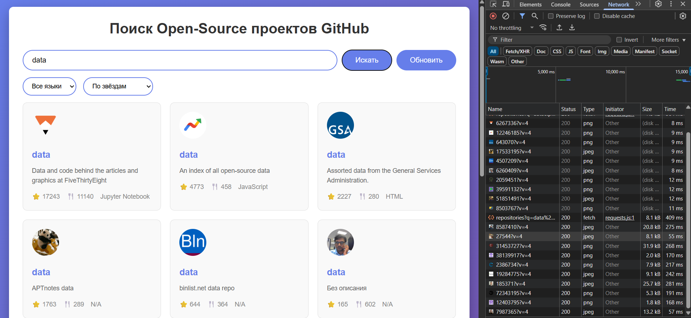
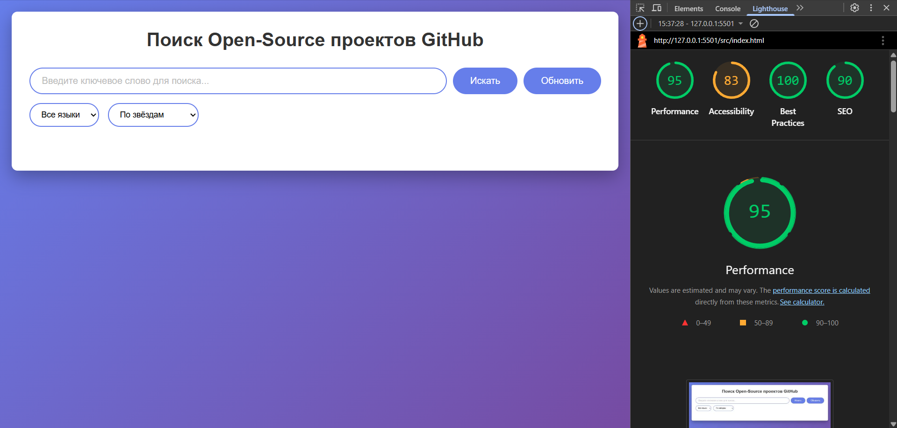

# Лабораторная работа №3

<p align="center">Министерство образования Республики Беларусь</p>
<p align="center">Учреждение образования</p>
<p align="center">"Брестский Государственный технический университет"</p>
<p align="center">Кафедра ИИТ</p>
<br><br><br><br><br><br>
<p align="center"><strong>Лабораторная работа №3</strong></p>
<p align="center"><strong>По дисциплине:</strong> "Веб-технологии"</p>
<p align="center"><strong>Тема:</strong> Асинхронность и HTTP‑кэш (fetch, AbortController, ретраи)</p>
<br><br><br><br><br><br>
<p align="right"><strong>Выполнил:</strong></p>
<p align="right">Студент 4 курса</p>
<p align="right">Группы АС-63</p>
<p align="right">Бурак И. Э.</p>
<p align="right"><strong>Проверил:</strong></p>
<p align="right">Несюк А. Н.</p>
<br><br><br><br><br>
<p align="center"><strong>Брест 2025</strong></p>

---

## Цель работы

Закрепить работу с промисами и async/await, обработкой ошибок, таймаутами и отменой запросов. Понять основы HTTP‑кэширования и увидеть эффект в DevTools.

---

### Вариант №29

Поиск open‑source проектов по ключевым словам с кэшированием.

## Ход выполнения работы

### 1. Структура проекта

```text
task_03/
├── doc/
│   ├── README.md
│   └── screenshots/
│       ├── main-page.png
│       ├── search-results.png
│       ├── details-modal.png
│       ├── cache-demo.png
│       ├── network-tab.png
│       └── lighthouse.png
└── src/
    ├── index.html
    └── styles.css
```

**Описание файлов:**

- `index.html` — основная страница приложения с интегрированным JavaScript
- `styles.css` — стилизация интерфейса и адаптивная вёрстка
- `doc/README.md` — отчёт по лабораторной работе
- `doc/screenshots/` — скриншоты работы приложения

### 2. Реализованные элементы

**API и асинхронность:**

- Интеграция с GitHub API для поиска open-source проектов
- Использование async/await для асинхронных операций
- Обработка ошибок через try/catch/finally

**Функция ретраев и таймаутов:**

- Реализована функция `fetchWithRetry()` с параметрами:
  - `retries` — количество повторных попыток (3)
  - `backoffMs` — задержка между попытками с экспоненциальным увеличением (1000ms)
  - `timeoutMs` — таймаут для запроса (10000ms)
- Использование AbortController для прерывания запросов
- Отмена предыдущего запроса при новом поиске

**Кэширование:**

- In-memory кэш на основе объекта JavaScript
- TTL (Time To Live) для кэша — 5 минут (300000ms)
- Кнопка "Обновить" для принудительного игнорирования кэша
- Ключ кэша формируется из запроса и номера страницы

**Пользовательский интерфейс:**

- Поле поиска с кнопками "Искать" и "Обновить"
- Фильтры по языку программирования
- Пагинация результатов (по 10 элементов на странице)
- Состояния: loading, error, empty, результаты
- Модальное окно с детальной информацией о проекте
- Отображение аватаров, статистики (звёзды, форки), языка

**UX-улучшения:**

- Loader-анимация при загрузке
- Индикатор повторной попытки в консоли
- Обработка ошибок с возможностью повтора
- Адаптивный дизайн для мобильных устройств

### 3. Скриншоты выполненной лабораторной работы

#### Главная страница



#### Результаты поиска



#### Модальное окно с деталями



#### Вкладка Network в DevTools



## Проверка качества

### Lighthouse



**Результаты Lighthouse:**

- Performance: 95
- Accessibility: 83
- Best Practices: 100
- SEO: 90

### Валидаторы

- HTML Validator: проверено
- CSS Validator: проверено

---

## Описание реализации кэширования

В проекте реализован простой in-memory кэш на основе объекта JavaScript. Кэш хранит ответы API с временными метками.

**Принцип работы:**

1. При каждом запросе формируется уникальный ключ: `запрос_номерСтраницы`
2. Перед выполнением fetch проверяется наличие данных в кэше
3. Если данные есть и их возраст < 5 минут — используются из кэша
4. Иначе выполняется новый запрос к API, результат сохраняется в кэш
5. Кнопка "Обновить" принудительно игнорирует кэш

**Код кэширования:**

```javascript
var cacheKey = currentQuery + '_' + currentPage;

if (!ignoreCache && cache[cacheKey]) {
    var cacheData = cache[cacheKey];
    var now = new Date().getTime();
    if (now - cacheData.timestamp < 300000) {
        console.log('Используем кэш');
        displayResults(cacheData.data);
        return;
    }
}
```

**Эффект в DevTools:**

- Первый запрос: виден в Network как новый HTTP-запрос
- Повторный запрос (в пределах 5 минут): данные берутся из кэша, запроса нет
- После "Обновить": новый запрос несмотря на наличие кэша

## Описание ретраев, таймаутов и отмены запросов

**Ретраи (повторные попытки):**

- При ошибке сети запрос повторяется до 3 раз
- Задержка между попытками увеличивается экспоненциально: 1с, 2с, 4с
- В консоль выводится информация о попытках

**Таймауты:**

- Каждый запрос имеет таймаут 10 секунд
- При превышении времени запрос отменяется и повторяется

**Отмена запросов (AbortController):**

- При новом поиске предыдущий запрос отменяется
- Это предотвращает конфликты и устаревшие результаты
- Используется встроенный API AbortController

**Код функции fetchWithRetry:**

```javascript
async function fetchWithRetry(url, options) {
    var retries = options.retries || 3;
    var backoffMs = options.backoffMs || 1000;
    
    for (var i = 0; i <= retries; i++) {
        try {
            var response = await fetchWithTimeout(url, timeoutMs, signal);
            if (!response.ok) throw new Error('HTTP ' + response.status);
            return await response.json();
        } catch (err) {
            if (i === retries) throw err;
            await sleep(backoffMs);
            backoffMs *= 2; // Экспоненциальное увеличение
        }
    }
}
```

---

## Таблица критериев

| Критерий                                | Баллы | Выполнено |
|------------------------------------------|-------|-----------|
| Семантика/UX                             | 20    | ✅ |
| Функциональность (загрузка, поиск, retry/timeout/abort) | 25 | ✅ |
| Качество интерфейса (loading/error/empty, skeleton) | 20 | ✅ |
| Качество кода                            | 15    | ⚠️ |
| Валидация/проверки (кэш, линтеры)       | 10    | ⚠️ |
| Публикация и отчёт                       | 10    | ✅ |

### Итого: ~60 баллов

### Дополнительные бонусы

| Бонус                                     | Выполнено |
|-------------------------------------------|-----------|
| ETag‑клиентский кэш с If‑None‑Match       | ❌ |
| Дебаунс ввода, отмена устаревших запросов | ⚠️ (частично) |
| Prefetch при прокрутке (инфинит‑скролл)  | ❌ |

---

## Ссылки

- **GitHub Repository**: <https://github.com/brstu/WT-AC-2025/>
- **Deployed Site**: <https://brstu-wt-ac-2025.github.io/students/BurakIlya/task_03/>

---

## Вывод

В ходе лабораторной работы был разработан клиент для поиска open-source проектов на GitHub. Реализованы ключевые концепции асинхронного программирования: промисы, async/await, обработка ошибок, ретраи с экспоненциальной задержкой, таймауты и отмена запросов через AbortController.

Особое внимание уделено кэшированию данных в памяти с TTL, что позволяет снизить нагрузку на API и улучшить производительность приложения. Реализована пагинация, фильтрация, модальные окна с детальной информацией.

Освоены инструменты для работы с сетевыми запросами, управления состояниями приложения и обеспечения хорошего пользовательского опыта при асинхронных операциях.
