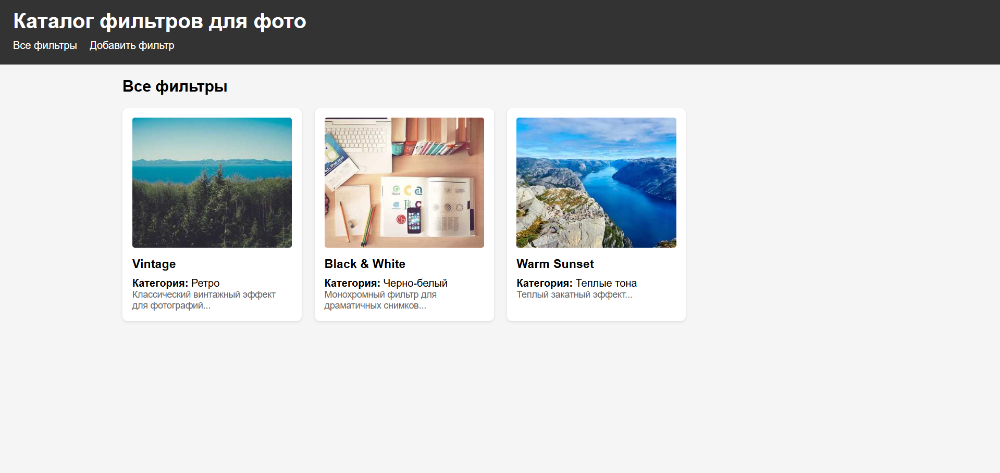
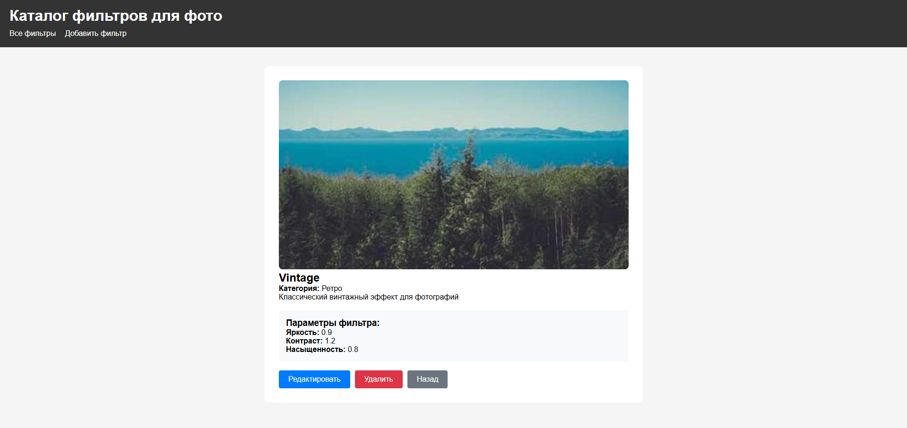
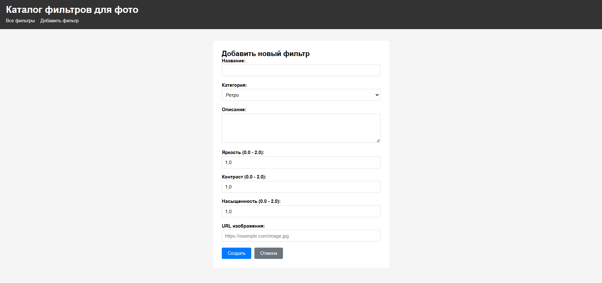
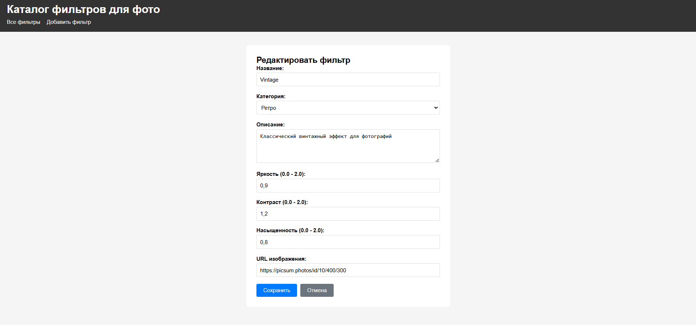
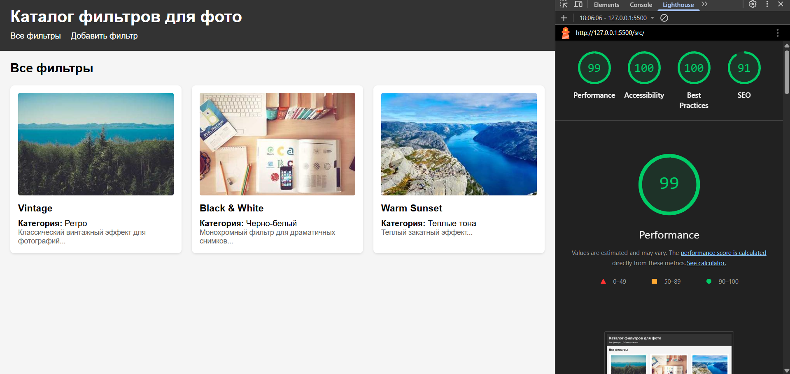

# Лабораторная работа №4

<p align="center">Министерство образования Республики Беларусь</p>
<p align="center">Учреждение образования</p>
<p align="center">"Брестский Государственный технический университет"</p>
<p align="center">Кафедра ИИТ</p>
<br><br><br><br><br><br>
<p align="center"><strong>Лабораторная работа №4</strong></p>
<p align="center"><strong>По дисциплине:</strong> "Веб-технологии"</p>
<p align="center"><strong>Тема:</strong> REST-клиент SPA: список/детализация/CRUD, маршрутизация (без фреймворков)</p>
<br><br><br><br><br><br>
<p align="right"><strong>Выполнил:</strong></p>
<p align="right">Студент 4 курса</p>
<p align="right">Группы АС-64</p>
<p align="right">Бурак И. Э.</p>
<p align="right"><strong>Проверил:</strong></p>
<p align="right">Несюк А. Н.</p>
<br><br><br><br><br>
<p align="center"><strong>Брест 2025</strong></p>

---

## Цель работы

Реализовать простой SPA без фреймворков с маршрутизацией и состояниями загрузки/ошибок. Выполнить CRUD операции к учебному API.

---

### Вариант №29

**Тема:** Каталог фильтров/пресетов для фото: список, деталь, форма добавления.

## Ход выполнения работы

### 1. Структура проекта

Проект организован следующим образом:

```
task_04/
├── doc/
│   ├── README.md
│   └── screenshots/
│       └── (скриншоты приложения)
└── src/
    ├── index.html          # Главная HTML-страница
    ├── styles.css          # Основные стили
    ├── main.js             # Точка входа приложения
    ├── router.js           # Модуль маршрутизации
    ├── api.js              # Модуль работы с данными (localStorage)
    ├── views.js            # Модуль представлений
    └── img/
        └── (изображения)
```

**Описание файлов:**

- `index.html` — основная HTML-страница с навигацией и контейнером для контента
- `styles.css` — стилизация компонентов и адаптивная вёрстка
- `main.js` — инициализация приложения
- `router.js` — обработка hash-маршрутизации
- `api.js` — работа с данными через localStorage (эмуляция REST API)
- `views.js` — рендеринг различных представлений (список, деталь, формы)
- `img/` — директория для изображений

### 2. Реализованные элементы

**Маршрутизация:**

- `#/items` — список всех фильтров
- `#/items/:id` — детальная информация о фильтре
- `#/new` — форма создания нового фильтра
- `#/items/:id/edit` — форма редактирования фильтра

**CRUD операции:**

- **GET** — получение списка фильтров и детальной информации
- **POST** — создание нового фильтра
- **PUT** — обновление существующего фильтра
- **DELETE** — удаление фильтра

**Реализованные функции:**

- Hash-маршрутизация на основе событий `hashchange` и `load`
- Состояния загрузки (loading indicator)
- Обработка пустого списка (empty state)
- Подтверждение удаления элементов
- Уведомления об успешных операциях
- Формы с базовой валидацией
- Адаптивная сетка для списка элементов
- Использование localStorage для хранения данных

### 3. Скриншоты выполненной лабораторной работы

#### Список фильтров



#### Детальная информация



#### Форма создания



#### Форма редактирования



## Проверка качества

### Lighthouse



**Результаты Lighthouse:**

- Performance: 99
- Accessibility: 100
- Best Practices: 100
- SEO: 91

### Валидаторы

- HTML Validator: присутствуют незначительные замечания
- CSS Validator: без критических ошибок

---

## Таблица критериев

| Критерий                                           | Выполнено | Баллы    |
|----------------------------------------------------|-----------|----------|
| Семантика/UX                                       | ✅        | 10/20    |
| Функциональность/CRUD/маршрутизация                | ✅        | 15/25    |
| Качество интерфейса                                | ✅        | 10/20    |
| Качество кода/модульность                          | ✅        | 8/15     |
| Тесты/валидность                                   | ❌        | 2/10     |
| Публикация и отчёт                                 | ✅        | 8/10     |

### Реализованные требования

| Требование                                          | Выполнено |
|-----------------------------------------------------|-----------|
| Маршруты (hash): #/items, #/items/:id, #/new, #/items/:id/edit | ✅ |
| Состояния: loading на экранах                       | ✅        |
| Состояния: error на экранах                         | ⚠️        |
| Состояния: empty на экранах                         | ✅        |
| Уведомления об успехе операций                      | ✅        |
| GET список/деталь                                   | ✅        |
| POST создание                                       | ✅        |
| PATCH/PUT обновление                                | ✅        |
| DELETE удаление                                     | ✅        |
| Подтверждение удаления                              | ✅        |
| Блокировка submit во время отправки                 | ❌        |
| Валидация форм                                      | ⚠️        |
| Маршрутизатор на основе hashchange/load             | ✅        |
| Разделение на модули: router, api, views           | ✅        |
| Адаптивная вёрстка                                  | ✅        |

### Дополнительные бонусы

| Бонус                                              | Выполнено |
|----------------------------------------------------|-----------|
| Сохранение фильтров/поиска в hash                  | ❌        |
| Предзагрузка данных (prefetch)                     | ❌        |
| Клиентская авторизация (token в header)            | ❌        |

---

## Запуск проекта

Для запуска проекта достаточно открыть файл `src/index.html` в браузере. Проект не требует установки дополнительных зависимостей и работает полностью на клиентской стороне.

Данные хранятся в localStorage браузера, поэтому они сохраняются между сессиями.

## API

Проект использует эмуляцию REST API через localStorage со следующими операциями:

- `GET /items` — получить список всех фильтров
- `GET /items/:id` — получить детальную информацию о фильтре
- `POST /items` — создать новый фильтр
- `PUT /items/:id` — обновить существующий фильтр
- `DELETE /items/:id` — удалить фильтр

## Вывод

В ходе выполнения лабораторной работы было разработано одностраничное приложение (SPA) для каталога фильтров для фотографий. Реализована hash-маршрутизация, CRUD-операции с данными, адаптивный интерфейс.

Освоены навыки:

- Работа с hash-маршрутизацией без использования фреймворков
- Реализация CRUD-операций
- Работа с localStorage для хранения данных
- Разделение кода на модули (router, api, views)
- Создание адаптивного интерфейса

Использованные инструменты:

- Vanilla JavaScript для логики приложения
- CSS Grid и Flexbox для вёрстки
- localStorage для хранения данных
- Hash-based routing для навигации
