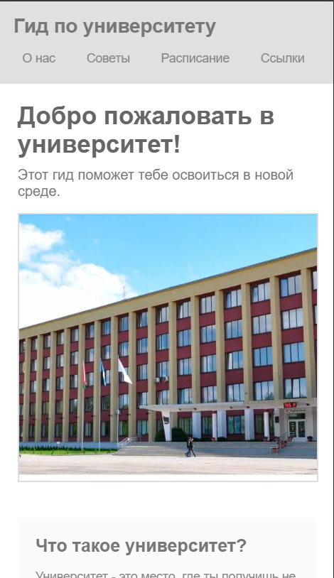
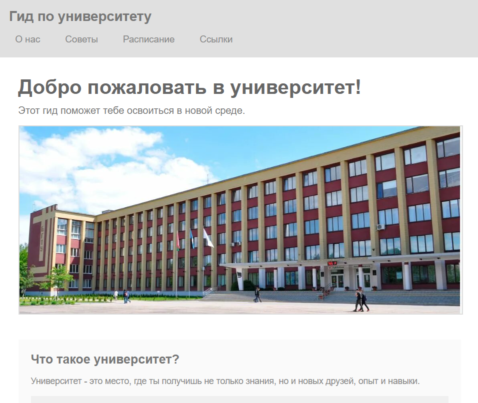
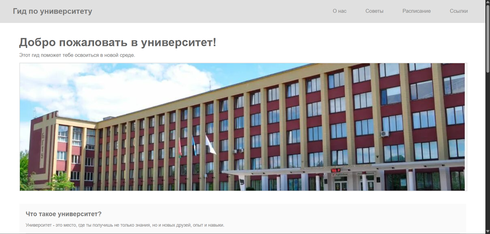
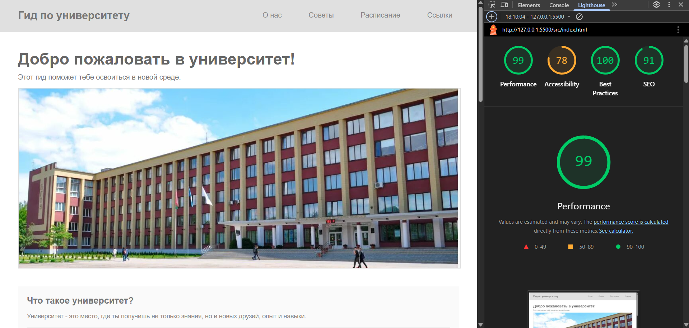

# Лабораторная работа №01

<p align="center">Министерство образования Республики Беларусь</p>
<p align="center">Учреждение образования</p>
<p align="center">"Брестский Государственный технический университет"</p>
<p align="center">Кафедра ИИТ</p>
<br><br><br><br><br><br>
<p align="center"><strong>Лабораторная работа №01</strong></p>
<p align="center"><strong>По дисциплине:</strong> "Веб-технологии"</p>
<p align="center"><strong>Тема:</strong> HTML/CSS: семантика, адаптивность и доступность</p>
<br><br><br><br><br><br>
<p align="right"><strong>Выполнил:</strong></p>
<p align="right">Студент 4 курса</p>
<p align="right">Группы АС-63</p>
<p align="right">Филипчук Д. В.</p>
<p align="right"><strong>Проверил:</strong></p>
<p align="right">Несюк А. Н.</p>
<br><br><br><br><br>
<p align="center"><strong>Брест 2025</strong></p>

---

## Цель работы

Освоить семантическую разметку HTML5, реализовать адаптивную вёрстку по схеме mobile-first с 2+ брейкпоинтами, повысить качество интерфейса и доступности.

---

### Вариант №22

**Тема:** Гид по университетской жизни: советы первокурсникам, расписание, полезные ссылки.

## Ход выполнения работы

### 1. Структура проекта

```text
+---doc
|   |   README.md
|   |
|   \---screenshots
|           lighthouse.png
|           mobile.png
|           tablet.png
|           desktop.png
|
\---src
    |   index.html
    |   styles.css
    |
    \---img
            university.jpg
            tip1.jpg
            tip2.jpg
            tip3.jpg
```

- `index.html` — основная страница с информацией для первокурсников
- `styles.css` — стилизация и медиазапросы
- `img/` — изображения для контента

### 2. Реализованные элементы

- HTML-разметка с использованием структурных элементов
- Flexbox для построения сеток
- Mobile-first медиазапросы (3 брейкпоинта: ≤600px, 601-1024px, >1024px)
- Атрибуты `alt` для изображений
- Адаптивные карточки советов
- Таблица расписания
- Навигационное меню
- Секция полезных ссылок

### 3. Скриншоты выполненой лабораторной работы

#### Мобильная версия (≤600px)



#### Планшетная версия (601-1024px)



#### Десктопная версия (>1024px)



## Проверка качества

### Lighthouse



**Результаты Lighthouse:**

- Performance: 99
- Accessibility: 78
- Best Practices: 100
- SEO: 91

### Валидаторы

- HTML Validator: без критических ошибок
- CSS Validator: без критических ошибок

---

## Таблица критериев

| Критерий                                | Выполнено |
|------------------------------------------|-----------|
| Семантика/структура (landmarks, заголовки) | ✅ |
| Адаптивная вёрстка (2+ брейкпоинта, Flex/Grid) | ✅ |
| Доступность (alt/label, фокус, контраст, клавиатура) | ❌ |
| Качество и валидность (Lighthouse ≥ 90, валидаторы) | ❌ |
| Оформление кода/структура проекта        | ✅ |
| Публикация и отчёт                       | ✅ |

### Дополнительные бонусы

| Бонус                                     | Выполнено |
|-------------------------------------------|-----------|
| Тёмная тема (prefers-color-scheme)        | ❌ |
| Адаптивные изображения (picture/srcset)   | ❌ |
| Улучшения Web Vitals (CLS/LCP/INP)        | ❌ |
| Другие улучшения (указать свои)           | ❌ |

---

## Ссылки

- **Репозиторий GitHub:** [ссылка на репозиторий]
- **GitHub Pages:** [ссылка на публикацию]

## Вывод

В ходе выполнения лабораторной работы был создан одностраничный сайт-гид для первокурсников университета. Реализована адаптивная вёрстка с использованием Flexbox и медиазапросов для трёх брейкпоинтов. Применена HTML-разметка с использованием структурных элементов. Добавлены атрибуты alt для изображений. Проект опубликован и протестирован с помощью Lighthouse.
