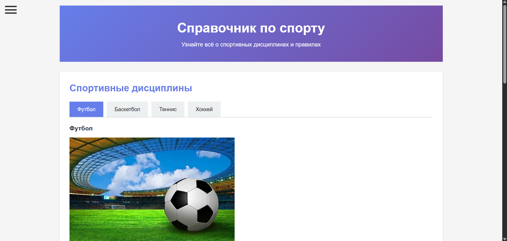
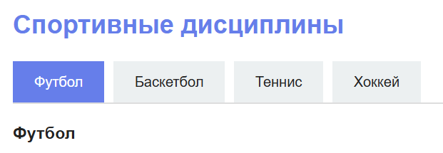
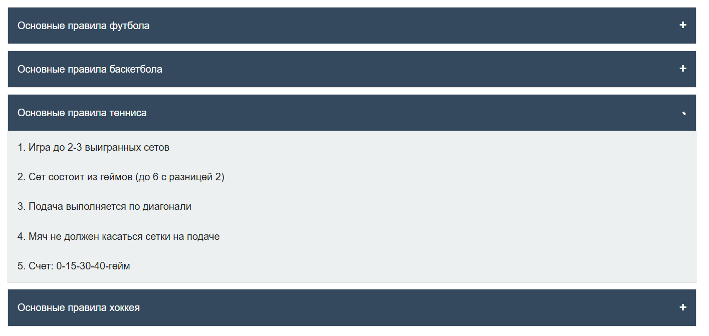
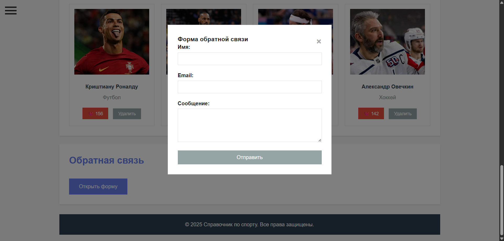
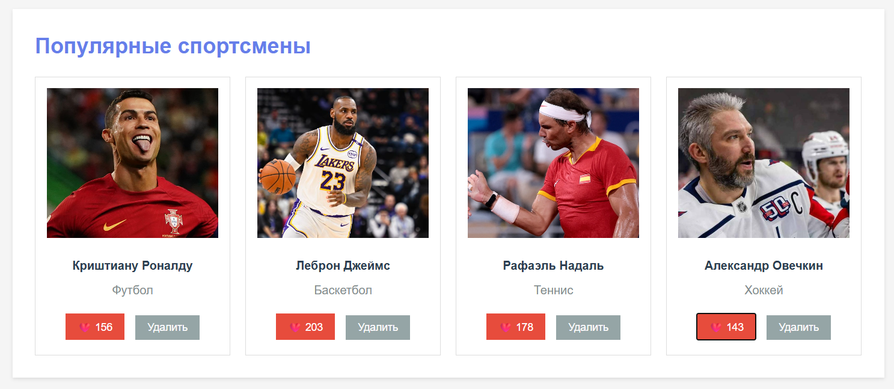
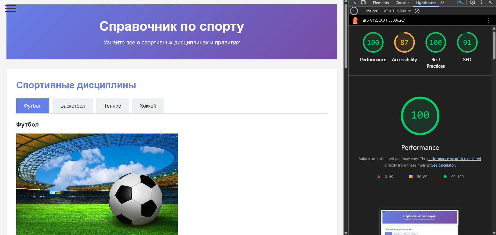

# Лабораторная работа №02

<p align="center">Министерство образования Республики Беларусь</p>
<p align="center">Учреждение образования</p>
<p align="center">"Брестский Государственный технический университет"</p>
<p align="center">Кафедра ИИТ</p>
<br><br><br><br><br><br>
<p align="center"><strong>Лабораторная работа №02</strong></p>
<p align="center"><strong>По дисциплине:</strong> "Веб-технологии"</p>
<p align="center"><strong>Тема:</strong> DOM и события: интерактивные компоненты и формы (JavaScript)</p>
<br><br><br><br><br><br>
<p align="right"><strong>Выполнил:</strong></p>
<p align="right">Студент 4 курса</p>
<p align="right">Группы АС-63</p>
<p align="right">Филипчук Д. В.</p>
<p align="right"><strong>Проверил:</strong></p>
<p align="right">Несюк А. Н.</p>
<br><br><br><br><br>
<p align="center"><strong>Брест 2025</strong></p>

---

## Цель работы

Освоить работу с DOM: добавление, удаление и изменение элементов интерфейса. Научиться обрабатывать события, использовать делегирование, работать с клавиатурной доступностью. Реализовать дружелюбную клиентскую валидацию форм.

---

### Вариант №22

Справочник по спорту: табы дисциплин, аккордеоны правил, форма обратной связи.

## Ход выполнения работы

### 1. Структура проекта

```text
task_02/
├── doc/
│   ├── README.md
│   └── screenshots/
│       └── (скриншоты)
└── src/
    ├── index.html
    ├── styles.css
    ├── script.js
    └── img/
        ├── football.jpg
        ├── basketball.jpg
        ├── tennis.jpg
        ├── hockey.jpg
        ├── athlete1.jpg
        ├── athlete2.jpg
        ├── athlete3.jpg
        └── athlete4.jpg
```

- `index.html` — главная страница справочника по спорту
- `styles.css` — стилизация всех компонентов и адаптивность
- `script.js` — логика работы интерактивных компонентов
- `img/` — изображения спортивных дисциплин и спортсменов

### 2. Реализованные элементы

В рамках лабораторной работы были реализованы следующие компоненты и функциональность:

#### Интерактивные компоненты

1. **Табы** - переключение между спортивными дисциплинами (Футбол, Баскетбол, Теннис, Хоккей)
2. **Аккордеон** - раскрывающиеся блоки с правилами для каждого вида спорта
3. **Модальное окно** - форма обратной связи открывается по клику на кнопку
4. **Бургер-меню** - навигационное меню для мобильных устройств

#### Форма с валидацией

- Поле имени (обязательное)
- Поле email (с проверкой формата)
- Поле сообщения (минимум 20 символов)
- Валидация при вводе и при отправке
- Кнопка отправки активна только при валидной форме
- Вывод результата отправки на странице

#### Делегирование событий

- Список карточек спортсменов
- Обработка кликов на кнопки "Лайк" и "Удалить" через делегирование на контейнер

#### Доступность

- Закрытие модального окна по клавише Escape
- ARIA-атрибуты для интерактивных элементов

### 3. Скриншоты выполненой лабораторной работы


*Главный экран справочника по спорту*


*Табы с различными спортивными дисциплинами*


*Раскрывающиеся правила спортивных игр*


*Модальное окно с формой обратной связи*


*Список популярных спортсменов с функцией лайков*

## Проверка качества

### Lighthouse



**Результаты Lighthouse:**

- Performance: 100
- Accessibility: 87
- Best Practices: 100
- SEO: 91

### Валидаторы

- HTML Validator: есть замечания по семантике
- CSS Validator: проходит базовую проверку

---

## Таблица критериев

| Критерий                                | Выполнено |
|------------------------------------------|-----------|
| Семантика/структура и UX-основы | ✅ |
| Функциональность (компоненты + форма + делегирование) | ✅ |
| Качество интерфейса (адаптивность/стили/поведение) | ✅ |
| Качество кода (читаемость, структура, модули) | ❌ |
| Тесты/валидность/качество | ❌ |
| Публикация и отчёт | ✅ |

### Дополнительные бонусы

| Бонус                                     | Выполнено |
|-------------------------------------------|-----------|
| Сохранение состояния в localStorage       | ❌ |
| Тёмная тема (prefers-color-scheme)        | ❌ |
| Юнит-тесты на чистые функции              | ❌ |

---

## Вывод

В ходе выполнения лабораторной работы был создан справочник по спорту с интерактивными компонентами. Реализованы табы для переключения между дисциплинами, аккордеоны для отображения правил, модальное окно с формой обратной связи и бургер-меню. Применено делегирование событий для обработки кликов на карточках спортсменов. Форма имеет клиентскую валидацию с проверкой при вводе. Интерфейс адаптирован для мобильных устройств с использованием media queries.

В процессе работы освоены базовые принципы работы с DOM, обработка событий и создание интерактивных компонентов на чистом JavaScript.
