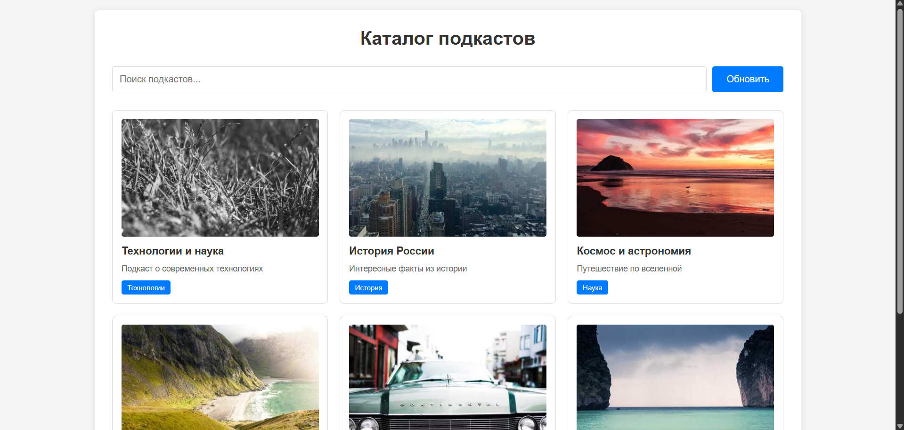
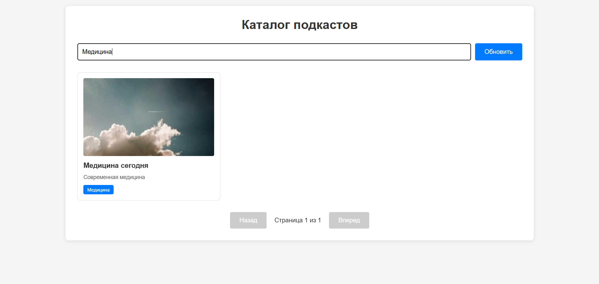
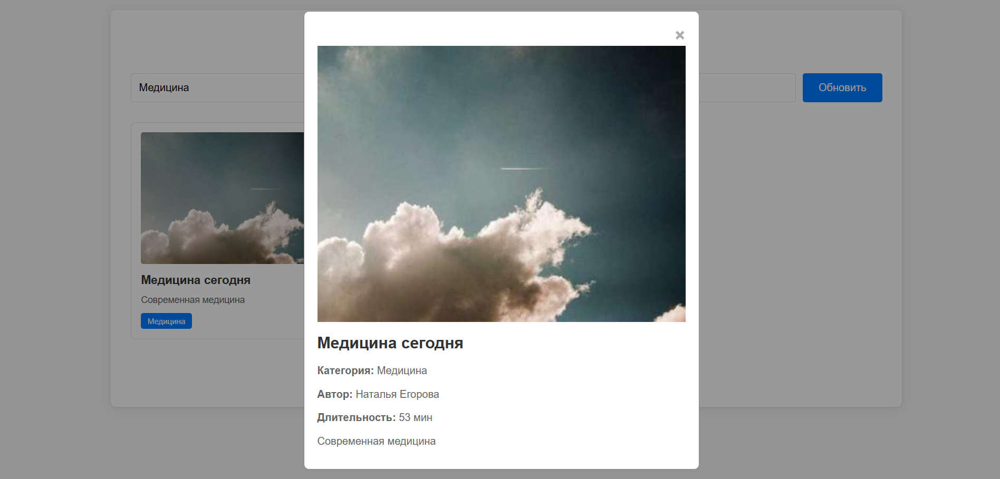
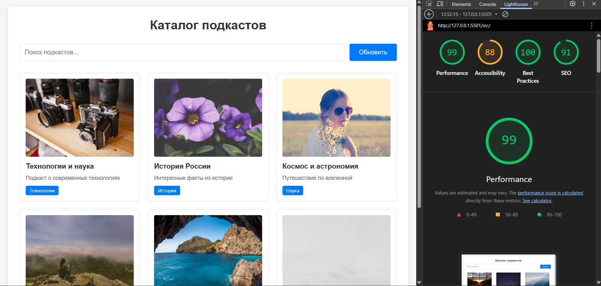

# Лабораторная работа №3

<p align="center">Министерство образования Республики Беларусь</p>
<p align="center">Учреждение образования</p>
<p align="center">"Брестский Государственный технический университет"</p>
<p align="center">Кафедра ИИТ</p>
<br><br><br><br><br><br>
<p align="center"><strong>Лабораторная работа №3</strong></p>
<p align="center"><strong>По дисциплине:</strong> "Веб-технологии"</p>
<p align="center"><strong>Тема:</strong> "Асинхронность и HTTP‑кэш"</p>
<br><br><br><br><br><br>
<p align="right"><strong>Выполнил:</strong></p>
<p align="right">Студент 4 курса</p>
<p align="right">Группы АС-63</p>
<p align="right">Филипчук Д. В.</p>
<p align="right"><strong>Проверил:</strong></p>
<p align="right">Несюк А. Н.</p>
<br><br><br><br><br>
<p align="center"><strong>Брест 2025</strong></p>

---

## Цель работы

Закрепить работу с промисами и async/await, обработкой ошибок, таймаутами и отменой запросов. Понять основы HTTP‑кэширования и увидеть эффект в DevTools.

---

### Вариант №22

Каталог подкастов по темам с поиском и загрузкой деталей.

## Ход выполнения работы

### 1. Структура проекта

```text
task_03/
├── doc/
│   ├── README.md
│   └── screenshots/
│       ├── main-page.png
│       ├── search.png
│       ├── details.png
│       └── lighthouse.png
└── src/
    ├── index.html
    ├── styles.css
    └── img/
        ├── podcast1.jpg
        ├── podcast2.jpg
        └── ... (20 изображений подкастов)
```

- `index.html` — основная страница с каталогом подкастов
- `styles.css` — стили для отображения карточек и модального окна
- `img/` — изображения подкастов

### 2. Реализованные элементы

**Функциональность:**

- Загрузка списка из 20 подкастов (моковые данные)
- Поиск по названию и категории подкастов
- Пагинация (по 6 элементов на странице)
- Модальное окно с детальной информацией о подкасте
- Состояния loading/error/empty
- Кнопка "Обновить" для очистки кэша

**Асинхронность:**

- Функция `fetchWithRetry()` с параметрами retries, backoffMs, timeoutMs
- Использование AbortController для отмены запросов
- Обработка ошибок через try/catch

**Кэширование:**

- Простой in-memory кэш на основе объекта
- Кэш привязан к номеру страницы и поисковому запросу
- Кнопка обновления полностью очищает кэш

### 3. Скриншоты выполненой лабораторной работы

#### Главная страница



#### Поиск подкастов



#### Детальная информация



## Проверка качества

### Lighthouse



**Результаты Lighthouse:**

- Performance: 99
- Accessibility: 88
- Best Practices: 100
- SEO: 91

### Особенности реализации

**Кэширование:**
Используется простой объект JavaScript для хранения результатов запросов. Кэш хранит данные по ключу, состоящему из номера страницы и поискового запроса.

**Retry механизм:**
При неудаче запроса происходит повторная попытка с экспоненциальной задержкой (backoff). Максимальное количество попыток - 3.

**Таймауты:**
Каждый запрос имеет таймаут 5 секунд. При превышении времени запрос отменяется через AbortController.

**Отмена запросов:**
При вводе нового поискового запроса предыдущий запрос отменяется, что позволяет избежать гонки условий.

---

## Таблица критериев

| Критерий                                | Выполнено |
|------------------------------------------|-----------|
| Семантика/UX                             | ✅ |
| Функциональность (загрузка, поиск/пагинация, retry/timeout/abort) | ✅ |
| Качество интерфейса (loading/error/empty, skeleton) | ✅ |
| Качество кода                            | ⚠️ |
| Валидация/проверки (кэш, линтеры)        | ⚠️ |
| Публикация и отчёт                       | ✅ |

### Дополнительные бонусы

| Бонус                                     | Выполнено |
|-------------------------------------------|-----------|
| ETag‑клиентский кэш с If‑None‑Match       | ❌ |
| Дебаунс ввода, отмена устаревших запросов | ❌ |
| Prefetch при прокрутке (инфинит‑скролл)   | ❌ |

---

## Ссылки

Проект опубликован по адресу: `file:///...` (локальная версия)

## Вывод

В ходе лабораторной работы был создан каталог подкастов с функционалом поиска, пагинации и детальным просмотром. Реализованы механизмы повторных попыток запросов (retry), таймаутов и отмены запросов через AbortController. Добавлено простое кэширование данных в памяти. Освоены принципы работы с асинхронным кодом, обработкой состояний загрузки и ошибок.
