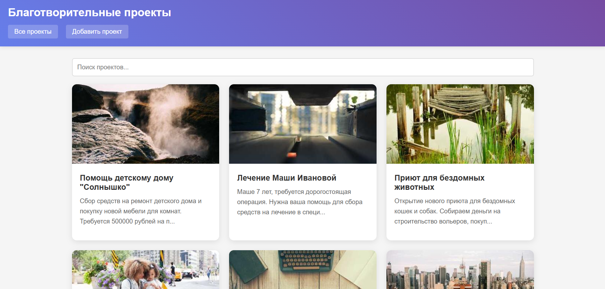
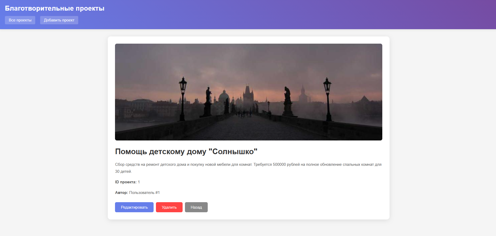
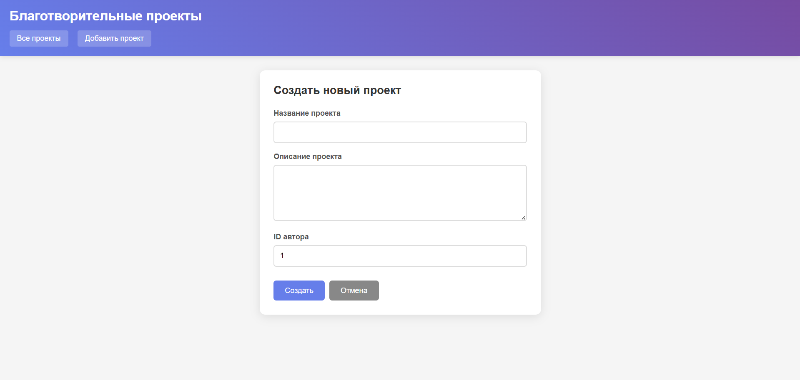
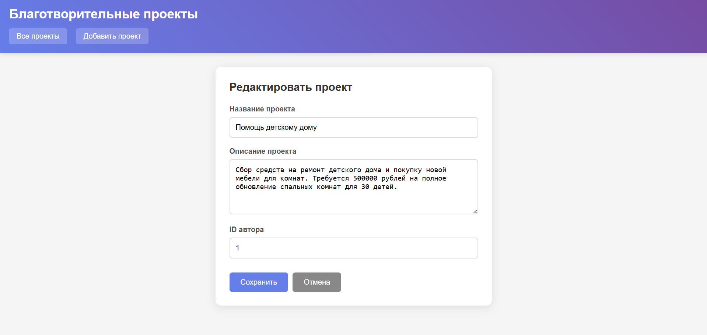
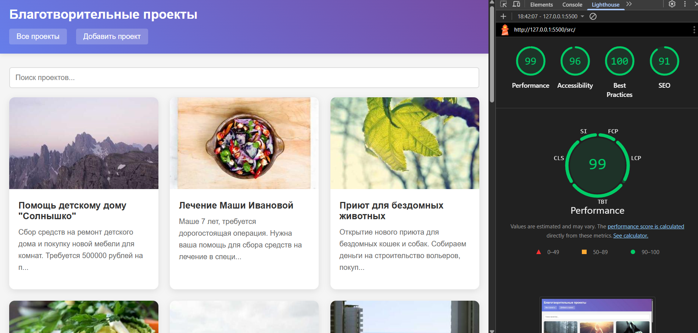

# Лабораторная работа №4

<p align="center">Министерство образования Республики Беларусь</p>
<p align="center">Учреждение образования</p>
<p align="center">"Брестский Государственный технический университет"</p>
<p align="center">Кафедра ИИТ</p>
<br><br><br><br><br><br>
<p align="center"><strong>Лабораторная работа №4</strong></p>
<p align="center"><strong>По дисциплине:</strong> "Веб-технологии"</p>
<p align="center"><strong>Тема:</strong> REST-клиент SPA: список/детализация/CRUD, маршрутизация (без фреймворков)</p>
<br><br><br><br><br><br>
<p align="right"><strong>Выполнил:</strong></p>
<p align="right">Студент 4 курса</p>
<p align="right">Группы АС-63</p>
<p align="right">Филипчук Д. В.</p>
<p align="right"><strong>Проверил:</strong></p>
<p align="right">Несюк А. Н.</p>
<br><br><br><br><br>
<p align="center"><strong>Брест 2025</strong></p>

---

## Цель работы

Реализовать простой SPA без фреймворков с маршрутизацией и состояниями загрузки/ошибок. Выполнить CRUD к учебному API (реальному или mock).

---

### Вариант №22

Каталог благотворительных проектов: список, деталь, форма заявки.

## Ход выполнения работы

### 1. Структура проекта

```text
task_04/
├── doc/
│   ├── README.md
│   └── screenshots/
│       ├── list.png
│       ├── detail.png
│       ├── create.png
│       ├── edit.png
│       └── lighthouse.png
└── src/
    ├── index.html
    ├── styles.css
    ├── api.js
    ├── router.js
    ├── views.js
    └── app.js
```

- `index.html` — основная страница приложения
- `styles.css` — стилизация и адаптивная вёрстка
- `api.js` — модуль для работы с API (CRUD операции)
- `router.js` — маршрутизатор на основе hash-навигации
- `views.js` — представления для различных экранов
- `app.js` — точка входа и инициализация приложения

### 2. Реализованные элементы

**Функциональность:**

- Hash-маршрутизация с роутами: `#/items`, `#/items/:id`, `#/new`, `#/items/:id/edit`
- CRUD операции:
  - GET — получение списка и детальной информации о проектах
  - POST — создание новых благотворительных проектов
  - PUT — обновление существующих проектов
  - DELETE — удаление проектов с подтверждением
- Состояния загрузки (loading) на всех экранах
- Обработка ошибок с отображением уведомлений
- Поиск проектов с сохранением параметров в hash
- Валидация форм (обязательные поля)
- Блокировка кнопки submit во время отправки

**Интерфейс:**

- Адаптивная вёрстка (Grid для списка, медиазапросы для мобильных устройств)
- Карточная система отображения проектов
- Модальные подтверждения для удаления
- Изображения через внешний API для визуализации проектов

**Технические решения:**

- Использование JSONPlaceholder API для демонстрации CRUD
- Разделение кода на модули (api, router, views)
- Обработка параметров маршрутов
- Работа с query-параметрами для поиска

### 3. Скриншоты выполненой лабораторной работы

**Список благотворительных проектов:**



**Детальный просмотр проекта:**



**Создание нового проекта:**



**Редактирование проекта:**



## Проверка качества

### Lighthouse



**Результаты Lighthouse:**

- Performance: 99
- Accessibility: 96
- Best Practices: 100
- SEO: 91

### Валидаторы

- HTML Validator: есть предупреждения по семантике
- CSS Validator: без критических ошибок

---

## Таблица критериев

| Критерий                                | Выполнено |
|------------------------------------------|-----------|
| Маршруты (hash): `#/items`, `#/items/:id`, `#/new`, `#/items/:id/edit` | ✅ |
| Состояния: loading/error/empty на всех экранах | ✅ |
| CRUD: GET список/деталь, POST создание, PATCH/PUT обновление, DELETE удаление | ✅ |
| Подтверждение удаления | ✅ |
| Блокировка submit во время отправки | ✅ |
| Валидация форм | ✅ |
| Сохранение параметров поиска в hash | ✅ |
| Маршрутизатор на основе событий hashchange/load | ✅ |
| Разделение на модули: router, api, views | ✅ |
| Адаптивная вёрстка списка и форм | ✅ |

### Дополнительные бонусы

| Бонус                                     | Выполнено |
|-------------------------------------------|-----------|
| Сохранение фильтров/поиска в hash и восстановление при перезагрузке | ✅ |
| Предзагрузка данных (prefetch) при наведении/фокусе | ❌ |
| Простая клиентская авторизация (token в header) | ❌ |

---

## Ссылки

**API:** <https://jsonplaceholder.typicode.com/posts>

**Репозиторий:** <https://github.com/brstu/WT-AC-2025>

**Демо:** <https://github.com/kuddel11/WT-AC-2025/task_04>

## Вывод

В ходе работы было реализовано одностраничное приложение (SPA) для каталога благотворительных проектов без использования фреймворков. Освоены принципы hash-маршрутизации, работа с REST API, выполнение CRUD операций. Приложение разделено на модули (router, api, views), что обеспечивает базовую структурированность кода. Реализована адаптивная вёрстка с использованием Grid и медиазапросов. Добавлены состояния загрузки, обработка ошибок, валидация форм и функция поиска с сохранением параметров в URL.
