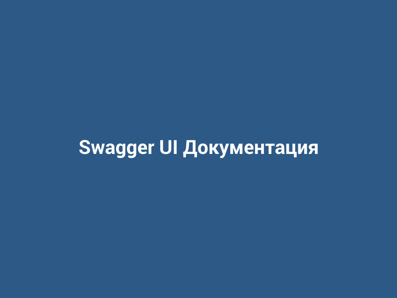
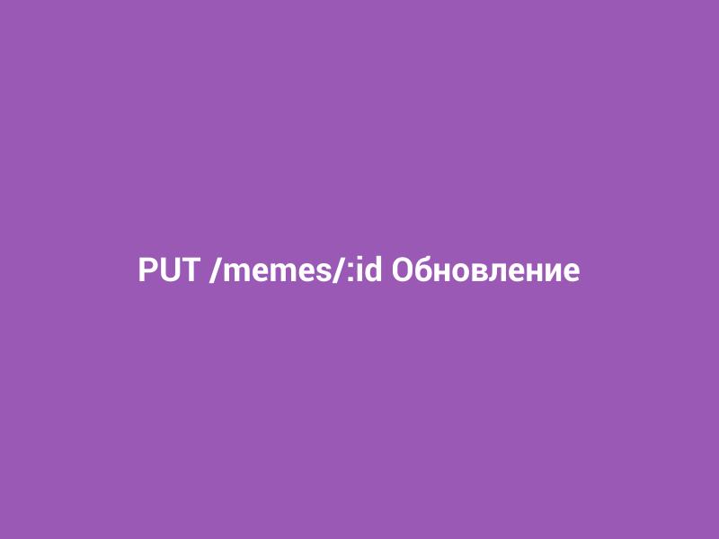

# Лабораторная работа №05

<p align="center">Министерство образования Республики Беларусь</p>
<p align="center">Учреждение образования</p>
<p align="center">"Брестский Государственный технический университет"</p>
<p align="center">Кафедра ИИТ</p>
<br><br><br><br><br><br>
<p align="center"><strong>Лабораторная работа №05</strong></p>
<p align="center"><strong>По дисциплине:</strong> "Веб-технологии"</p>
<p align="center"><strong>Тема:</strong> Серверное REST API на Node.js + Express</p>
<br><br><br><br><br><br>
<p align="right"><strong>Выполнил:</strong></p>
<p align="right">Студент 4 курса</p>
<p align="right">Группы АС-63</p>
<p align="right">Филипчук Д. В.</p>
<p align="right"><strong>Проверил:</strong></p>
<p align="right">Несюк А. Н.</p>
<br><br><br><br><br>
<p align="center"><strong>Брест 2025</strong></p>

---

## Цель работы

Создание REST API для ресурса на Express с валидацией входных данных, централизованной обработкой ошибок и документацией Swagger.

---

### Вариант №22

API библиотек мемов/шаблонов

## Ход выполнения работы

### 1. Структура проекта

```
src/
├── server.js          - основной файл сервера
├── package.json       - зависимости проекта
├── .env              - переменные окружения
├── .env.example      - пример конфигурации
└── .gitignore        - игнорируемые файлы
```

### 2. Реализованные элементы

- **Express-приложение** с базовыми middleware (json, cors, morgan)
- **CRUD эндпоинты** для ресурса "мемы":
  - GET /memes - получение списка с поддержкой поиска, фильтрации, пагинации
  - GET /memes/:id - получение конкретного мема по ID
  - POST /memes - создание нового мема
  - PUT /memes/:id - обновление существующего мема
  - DELETE /memes/:id - удаление мема
- **Валидация данных** с использованием Joi
- **Обработка ошибок** с централизованным error handler
- **Swagger документация** доступна по адресу /docs
- **Хранение данных** в памяти
- **Переменные окружения** через .env файл

### 3. Скриншоты выполненной лабораторной работы

#### Swagger документация



#### Получение списка мемов (GET /memes)


#### Получение мема по ID (GET /memes/:id)


#### Создание нового мема (POST /memes)


#### Обновление мема (PUT /memes/:id)



#### Удаление мема (DELETE /memes/:id)


---

## Таблица критериев

| Критерий                                          | Выполнено |
|---------------------------------------------------|-----------|
| Структура/семантика API                           | ✅        |
| Функциональность CRUD                             | ✅        |
| Качество интерфейса API (валидация, ошибки, статус-коды) | ✅ |
| Качество кода/архитектуры                         | ✅        |
| Тесты/проверки (supertest)                        | ❌        |
| Документация/инструкция                           | ✅        |

### Дополнительные бонусы

| Бонус                                             | Выполнено |
|---------------------------------------------------|-----------|
| Фильтрация/поиск/сортировка                       | ✅        |
| Пагинация с метаданными (total, limit, offset)    | ✅        |
| Версионирование API (/api/v1)                     | ❌        |

---

## Инструкция по запуску

1. Перейти в папку `src`:

   ```bash
   cd src
   ```

2. Установить зависимости:

   ```bash
   npm install
   ```

3. Запустить сервер:

   ```bash
   npm start
   ```

   Для разработки с автоперезагрузкой:

   ```bash
   npm run dev
   ```

4. Сервер будет доступен по адресу: `http://localhost:3000`

5. Swagger документация: `http://localhost:3000/docs`

## Примеры запросов

### Получить все мемы

```http
GET http://localhost:3000/memes
```

### Получить мемы с поиском

```http
GET http://localhost:3000/memes?q=кот
```

### Получить мемы с пагинацией

```http
GET http://localhost:3000/memes?limit=5&offset=0
```

### Получить мем по ID

```http
GET http://localhost:3000/memes/1
```

### Создать новый мем

```http
POST http://localhost:3000/memes
Content-Type: application/json

{
  "название": "Дистракшн бойфренд",
  "описание": "Парень оборачивается на другую девушку",
  "категория": "классика",
  "популярность": 95
}
```

### Обновить мем

```http
PUT http://localhost:3000/memes/1
Content-Type: application/json

{
  "популярность": 98
}
```

### Удалить мем

```http
DELETE http://localhost:3000/memes/1
```

## Вывод

В ходе выполнения лабораторной работы было создано REST API для библиотеки мемов с использованием Node.js и Express. Реализованы базовые CRUD операции, добавлена валидация входных данных с помощью Joi, настроена централизованная обработка ошибок и создана документация с использованием Swagger. API поддерживает поиск, фильтрацию и пагинацию результатов. Данные хранятся в памяти приложения.
