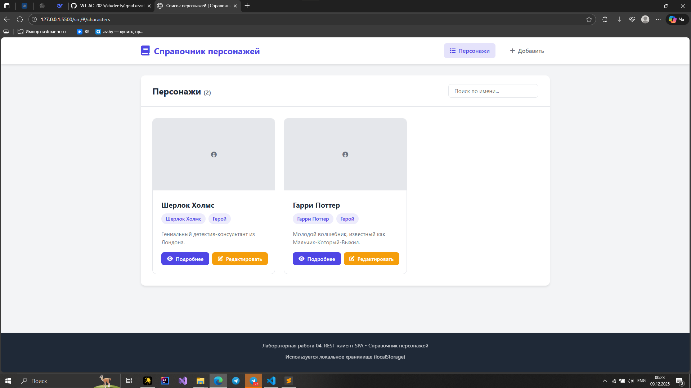
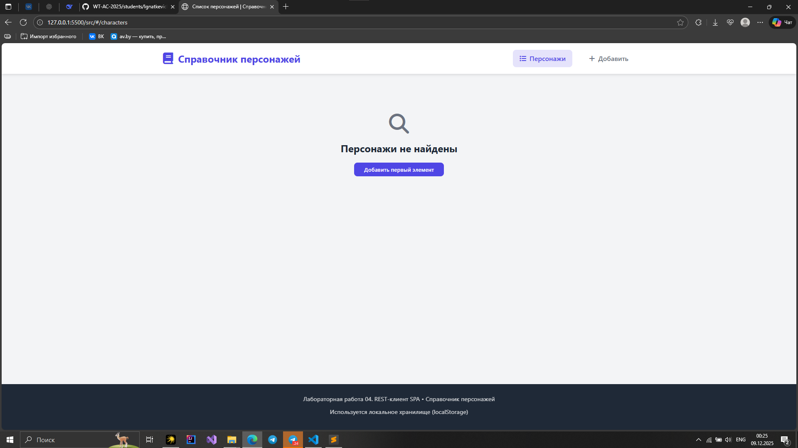
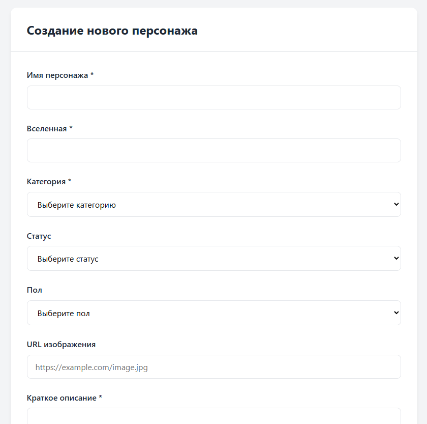
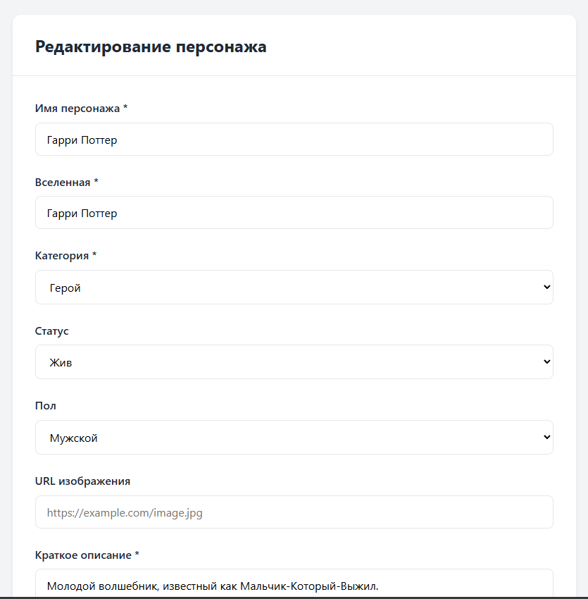
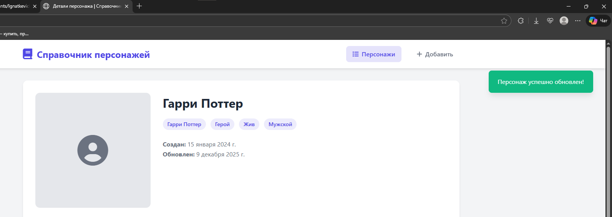

# Министерство образования Республики Беларусь

<p align="center">Учреждение образования</p>
<p align="center">“Брестский Государственный технический университет”</p>
<p align="center">Кафедра ИИТ</p>
<br><br><br><br><br><br>
<p align="center"><strong>Лабораторная работа №4</strong></p>
<p align="center"><strong>По дисциплине:</strong> “Веб-технологии”</p>
<p align="center"><strong>Тема:</strong> “REST‑клиент SPA: список/детализация/CRUD, маршрутизация (без фреймворков)”</p>
<br><br><br><br><br><br>
<p align="right"><strong>Выполнил:</strong></p>
<p align="right">Студент 4 курса</p>
<p align="right">Группы АС-63</p>
<p align="right">Грицук Д.Ю.</p>
<p align="right"><strong>Проверил:</strong></p>
<p align="right">Несюк А.Н.</p>
<br><br><br><br><br>
<p align="center"><strong>Брест 2025</strong></p>

---

## Цель работы

* Реализовать простой SPA без фреймворков с маршрутизацией и состояниями загрузки/ошибок.
* Выполнить CRUD к учебному API (реальному или mock).

---

### Вариант №3

## Ход выполнения работы

### 1. Структура проекта

- `index.html` — Основная страница.
- `css/styles.css` — Основные стили.
- `main.js` — Точка входа, инициализация приложения.
- `db.json` — База данных.
- `modules/` — Модули приложения
- `modules//api.js` — Работа с данными (CRUD, localStorage).
- `modules//router.js` — Маршрутизатор на основе hashchange.
- `modules//views.js` — Все представления.
- `modules//utils.js` — Вспомогательные функции.

---

### 2. Описание маршрутов

| Маршрут | Описание |
|---------|----------|
| `#/characters` | Список всех персонажей |
| `#/characters/:id` | Детальная информация о персонаже |
| `#/characters/:id/edit` | Форма редактирования персонажа |
| `#/new` | 	Форма создания нового персонажа |

---

### 3. Запуск проекта

#### 3.1 Локальный сервер (Live Server)

* Открть проект в VSCode.
* Запустить Live Server.
* Сайт откроется по адресу:

```bash
http://127.0.0.1:5500/task_04/
```

При первом запуске хэш автоматически установится в #/characters.

---

#### 3.2 Mock‑сервер (json-server)

Для работы API без настоящей базы данных:
* Установить json-server (если ещё не установлен):

```bash
npm install -g json-server
```

* Запустить сервер:

```bash
json-server --watch db.json --port 3000
```

* Теперь API доступно по:

```bash
http://localhost:3000/characters
```

Все CRUD-запросы работают через этот mock-сервер.

---

### 4 Скриншоты

Список альбомов с состоянием loading или пустым списком.

- Список альбомов


- Состояние Loading


- Состояние Empty


Детальная страница альбома.

- Детальная страница


Форма добавления/редактирования.

- Форма добавления


- Форма редактирования


Уведомление об успешной операции.

- Уведомление об успешной операции



---

## Таблица критериев

| Критерий                                                                | Баллы |  Выполнено |
|-------------------------------------------------------------------------|-------|------------|
| Семантика / UX                                                          |  20   |  ✅ / ✅  |
| Функциональность / CRUD / маршрутизация                                 |  25   |  ✅ / ✅  |
| Качество интерфейса                                                     |  20   |  ✅ / ✅  |
| Качество кода / модульность                                             |  15   |  ✅ / ✅  |
| Тесты / валидность                                                      |  10   |  ✅ / ✅  |
| Публикация и отчёт                                                      |  10   |  ✅ / ✅  |

### Дополнительные бонусы

| Бонус                                                                | Баллы | Выполнено |
| -------------------------------------------------------------------- | ----- | --------- |
| Сохранение фильтров/поиска в hash и восстановление при перезагрузке. | 10    | ✅ / ✅  |
| Предзагрузка данных (prefetch) при наведении/фокусе.                 | 10    | ✅ / ✅  |

---

## Вывод

Была выполнена лабораторная работа по созданию простой SPA без фреймворков. Приложение умеет переходить между страницами через hash-маршрутизацию и показывает состояния загрузки, ошибки и пустого списка. Реализованы все операции CRUD: просмотр списка и деталей альбомов, добавление, редактирование и удаление. Для работы использовался mock‑сервер json-server. Все функции проверялись через интерфейс и DevTools.
