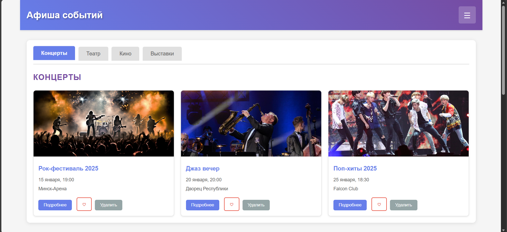
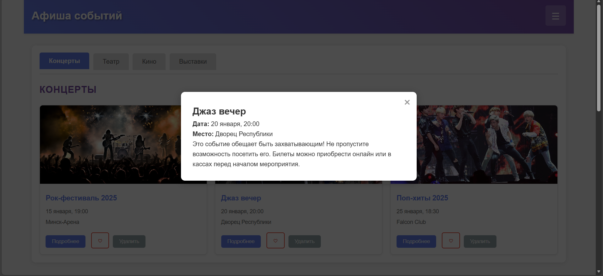
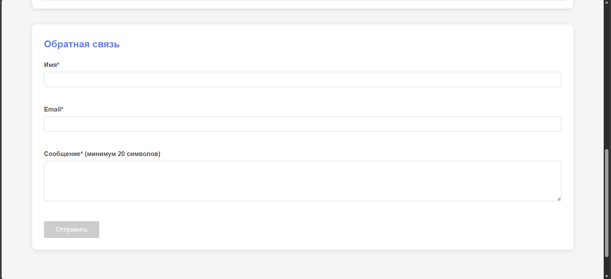
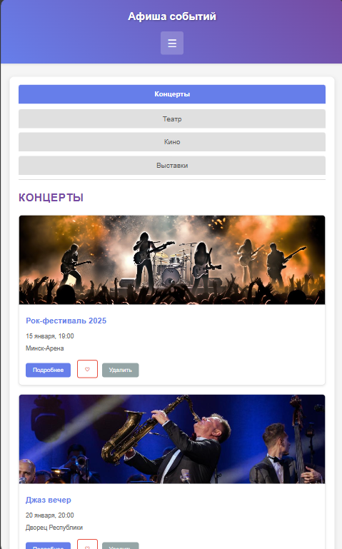
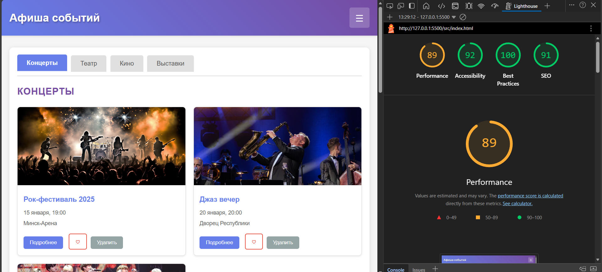

# Лабораторная работа №02

<p align="center">Министерство образования Республики Беларусь</p>
<p align="center">Учреждение образования</p>
<p align="center">"Брестский Государственный технический университет"</p>
<p align="center">Кафедра ИИТ</p>
<br><br><br><br><br><br>
<p align="center"><strong>Лабораторная работа №02</strong></p>
<p align="center"><strong>По дисциплине:</strong> "Веб-технологии"</p>
<p align="center"><strong>Тема:</strong> DOM и события: интерактивные компоненты и формы (JavaScript)</p>
<br><br><br><br><br><br>
<p align="right"><strong>Выполнил:</strong></p>
<p align="right">Студент 4 курса</p>
<p align="right">Группы АС-63</p>
<p align="right">Грицук П. Э.</p>
<p align="right"><strong>Проверил:</strong></p>
<p align="right">Несюк А. Н.</p>
<br><br><br><br><br>
<p align="center"><strong>Брест 2025</strong></p>

---

## Цель работы

Освоить работу с DOM: добавление, удаление и изменение элементов интерфейса. Научиться обрабатывать события, использовать делегирование, работать с клавиатурной доступностью. Реализовать дружелюбную клиентскую валидацию форм.

---

### Вариант №4

Афиша событий: табы по категориям, модалка подробностей, tooltip для быстрых подсказок.

## Ход выполнения работы

### 1. Структура проекта

```text
task_02/
│
├── doc/
│   ├── README.md
│   └── screenshots/
│       └── ...
│
└── src/
    ├── index.html
    ├── styles.css
    ├── script.js
    └── img/
        └── ...
```

- `index.html` — главная страница с афишей событий
- `styles.css` — стили для всех компонентов и адаптивная верстка
- `script.js` — JavaScript код для интерактивных компонентов
- `img/` — папка с изображениями событий

### 2. Реализованные элементы

В рамках лабораторной работы были реализованы следующие компоненты:

**Интерактивные компоненты:**

- **Табы** — переключение между категориями событий (Концерты, Театр, Кино, Выставки)
- **Модальное окно** — открывается при нажатии на кнопку "Подробнее" для отображения детальной информации о событии
- **Бургер-меню** — навигационное меню для мобильных устройств
- **Аккордеон** — раздел "Часто задаваемые вопросы" с раскрывающимися ответами
- **Tooltip** — всплывающие подсказки при наведении на кнопки "Подробнее"

**Форма с валидацией:**

- Поля: имя (обязательное), e-mail (с проверкой формата), сообщение (минимум 20 символов)
- Валидация в реальном времени при вводе
- Кнопка отправки активируется только при корректном заполнении всех полей
- Отображение результата отправки на странице

**Делегирование событий:**

- Обработчики для кнопок "Подробнее", "Лайк" и "Удалить" реализованы через делегирование на контейнер `.events-list`

**Доступность:**

- Навигация с клавиатуры (Tab, Enter, Space, Escape)
- ARIA-атрибуты для улучшения доступности (частично реализовано)

### 3. Скриншоты выполненой лабораторной работы









## Проверка качества

### Lighthouse



**Результаты Lighthouse:**

- Performance: 89
- Accessibility: 92
- Best Practices: 100
- SEO: 91

### Валидаторы

- HTML Validator: имеются незначительные замечания
- CSS Validator: стили проверены

---

## Таблица критериев

| Критерий                                                           | Выполнено |
|--------------------------------------------------------------------|-----------|
| Семантика/структура и UX-основы                                    | ✅        |
| Функциональность (компоненты + форма + делегирование)              | ✅        |
| Качество интерфейса: адаптивность/стили/поведение                  | ✅        |
| Качество кода: читаемость, структура, модули                       | ❌        |
| Тесты/валидность/качество (линтеры/валидаторы)                     | ❌        |
| Публикация и отчёт                                                 | ✅        |

### Дополнительные бонусы

| Бонус                                                 | Выполнено |
|-------------------------------------------------------|-----------|
| Сохранение состояния в localStorage                   | ❌        |
| Тёмная тема (prefers-color-scheme)                    | ❌        |
| Юнит-тесты на чистые функции                          | ❌        |

---

## Вывод

В ходе выполнения лабораторной работы был создан интерактивный веб-сайт "Афиша событий" с использованием чистого JavaScript. Реализованы основные интерактивные компоненты: табы для переключения категорий, модальные окна, бургер-меню, аккордеон и tooltip.

Освоена работа с DOM-деревом, обработка событий через делегирование, реализована клиентская валидация формы с проверкой в реальном времени. Добавлена базовая поддержка клавиатурной навигации для улучшения доступности.

Использованные инструменты: HTML5, CSS3 (с Flexbox и Grid), чистый JavaScript (ES6).
