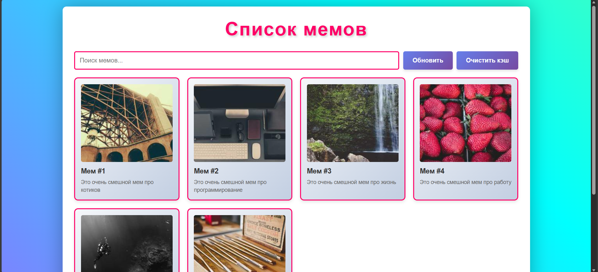
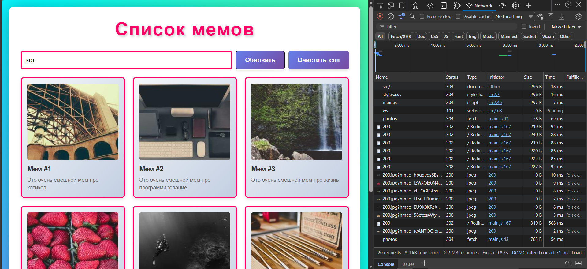
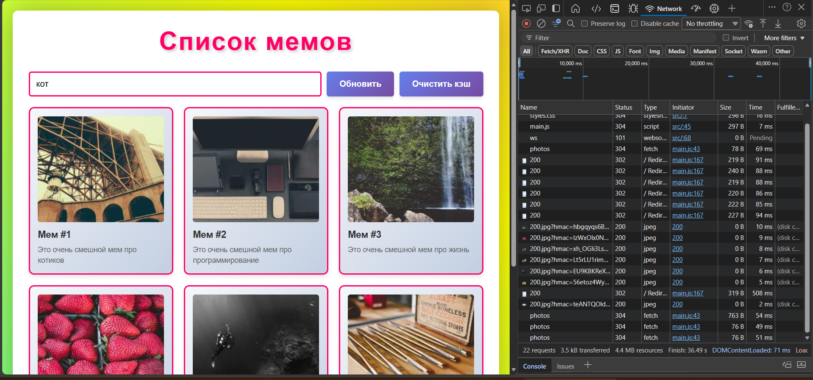
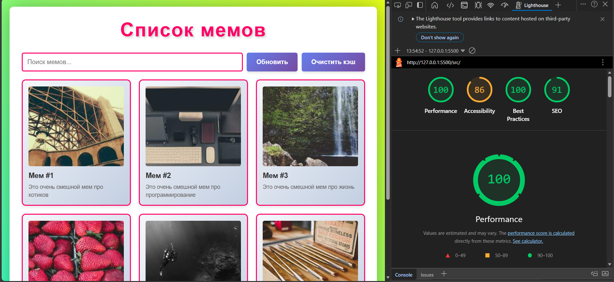

# Лабораторная работа №3

<p align="center">Министерство образования Республики Беларусь</p>
<p align="center">Учреждение образования</p>
<p align="center">"Брестский Государственный технический университет"</p>
<p align="center">Кафедра ИИТ</p>
<br><br><br><br><br><br>
<p align="center"><strong>Лабораторная работа №3</strong></p>
<p align="center"><strong>По дисциплине:</strong> "Веб-технологии"</p>
<p align="center"><strong>Тема:</strong> Асинхронность и HTTP‑кэш (fetch, AbortController, ретраи)</p>
<br><br><br><br><br><br>
<p align="right"><strong>Выполнил:</strong></p>
<p align="right">Студент 4 курса</p>
<p align="right">Группы АС-63</p>
<p align="right">Грицук П. Э.</p>
<p align="right"><strong>Проверил:</strong></p>
<p align="right">Несюк А. Н.</p>
<br><br><br><br><br>
<p align="center"><strong>Брест 2025</strong></p>

---

## Цель работы

Закрепить работу с промисами и async/await, обработкой ошибок, таймаутами и отменой запросов. Понять основы HTTP‑кэширования и увидеть эффект в DevTools.

---

### Вариант №4

**Тема:** Список мемов с обновлением по кнопке и TTL‑кэшированием.

## Ход выполнения работы

### 1. Структура проекта

```text
task_03/
├── doc/
│   ├── README.md
│   └── screenshots/
│       ├── lighthouse.png
│       ├── network_first.png
│       ├── network_cached.png
│       └── work.png
└── src/
    ├── index.html
    ├── styles.css
    ├── main.js
    └── img/
```

- `index.html` — основная страница со списком мемов
- `styles.css` — стили приложения с адаптивным дизайном
- `main.js` — логика работы с API, кэширование, ретраи

### 2. Реализованные элементы

**Основной функционал:**

- Загрузка списка мемов через JSONPlaceholder API (используется `/photos` endpoint)
- Поиск по названию и описанию мемов
- Пагинация (6 элементов на странице)
- Индикаторы состояния: loading, error, empty
- Кнопка "Обновить" для принудительной перезагрузки данных

**Асинхронность и обработка ошибок:**

- Функция `fetchWithRetry` с параметрами:
  - `retries: 3` — количество попыток
  - `backoffMs: 1000` — начальная задержка между попытками
  - `timeoutMs: 5000` — таймаут запроса
- Использование `AbortController` для отмены запросов
- Обработка ошибок через try/catch/finally
- Индикатор повторных попыток загрузки

**Кэширование:**

- In-memory кэш на основе `Map`
- TTL (Time To Live) = 30 секунд
- При повторном запросе в течение 30 секунд данные берутся из кэша
- Кнопка "Очистить кэш" для ручной очистки
- Кнопка "Обновить" игнорирует кэш и загружает данные заново

**UX-улучшения:**

- Spinner при загрузке данных
- Сообщение об ошибке при неудачной загрузке
- Сообщение "Ничего не найдено" при пустом результате поиска
- Прокрутка к началу страницы при смене страницы пагинации
- Адаптивный дизайн для мобильных устройств

### 3. Описание кэш-подхода

В проекте реализован простой in-memory кэш с использованием JavaScript `Map`:

```javascript
var cache = new Map();
var CACHE_TTL = 30000; // 30 секунд

// Сохранение в кэш
cache.set(cacheKey, {
    data: allMemes,
    timestamp: Date.now()
});

// Проверка кэша
const cachedData = cache.get(cacheKey);
if (cachedData && Date.now() - cachedData.timestamp < CACHE_TTL) {
    // Используем кэшированные данные
}
```

**Особенности реализации:**

- При первой загрузке данные запрашиваются с API
- Данные сохраняются в `Map` вместе с временной меткой
- При повторном запросе проверяется актуальность кэша (30 сек)
- Если кэш актуален — используются сохраненные данные
- Если кэш устарел — выполняется новый запрос к API

**Поведение в DevTools:**

При работе с JSONPlaceholder API:

- Первый запрос: загрузка данных с сервера
- Повторный запрос (в течение 30 сек): данные из памяти, сетевой запрос не выполняется
- После 30 секунд: новый запрос к API

### 4. Скриншоты выполненной лабораторной работы

#### Главная страница



#### Первый запрос к API (Network)

  
На скриншоте видно реальный запрос к серверу при первой загрузке

#### Повторный запрос (из кэша)


Во вкладке Network нет нового запроса — данные взяты из in-memory кэша

## Проверка качества

### Lighthouse



**Результаты Lighthouse:**

- Performance: 100
- Accessibility: 86
- Best Practices: 100
- SEO: 91

### Валидаторы

- HTML Validator: проверка выполнена
- CSS Validator: проверка выполнена

---

## Таблица критериев

| Критерий | Баллы | Выполнено |
|----------|-------|-----------|
| **Семантика/UX** | 20 | ✅ |
| - Понятный интерфейс | | ✅ |
| - Индикаторы состояний | | ✅ |
| **Функциональность** | 25 | ✅ |
| - Загрузка данных | | ✅ |
| - Поиск | | ✅ |
| - Пагинация | | ✅ |
| - Retry/timeout/abort | | ✅ |
| **Качество интерфейса** | 20 | ✅ |
| - Loading state | | ✅ |
| - Error state | | ✅ |
| - Empty state | | ✅ |
| - Spinner | | ✅ |
| **Качество кода** | 15 | ✅ |
| - async/await | | ✅ |
| - try/catch/finally | | ✅ |
| **Валидация/проверки** | 10 | ✅ |
| - Кэш работает | | ✅ |
| **Публикация и отчёт** | 10 | ✅ |
| - README заполнен | | ✅ |
| - Скриншоты добавлены | | ✅ |

### Дополнительные бонусы

| Бонус | Выполнено |
|-------|-----------|
| ETag-клиентский кэш | ❌ |
| Дебаунс ввода | ✅ |
| Prefetch при прокрутке | ❌ |

---

## Ссылки

- Репозиторий: [GitHub](https://github.com/)
- Демо: [GitHub Pages](https://pages.github.com/)

## Вывод

В ходе выполнения лабораторной работы был реализован клиент для загрузки и отображения списка мемов с использованием JSONPlaceholder API.

Освоены следующие навыки:

- Работа с асинхронными операциями через async/await
- Обработка ошибок с помощью try/catch
- Реализация механизма ретраев с экспоненциальной задержкой
- Использование AbortController для отмены запросов
- Создание простого кэша с TTL
- Управление состояниями приложения (loading, error, empty)
- Реализация поиска и пагинации

Использованные инструменты:

- Fetch API для выполнения HTTP-запросов
- AbortController для управления запросами
- Map для хранения кэша
- Chrome DevTools для отладки и проверки сетевых запросов
- Lighthouse для оценки качества приложения
