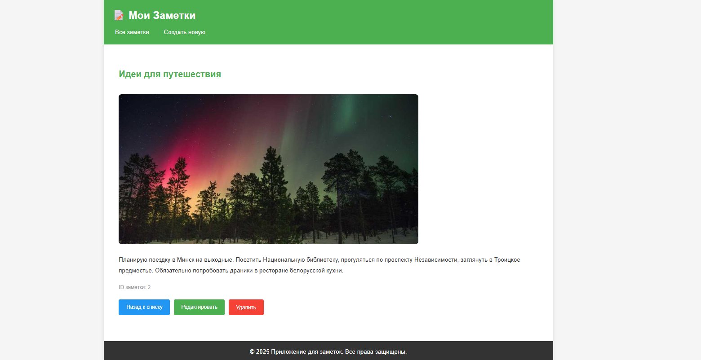
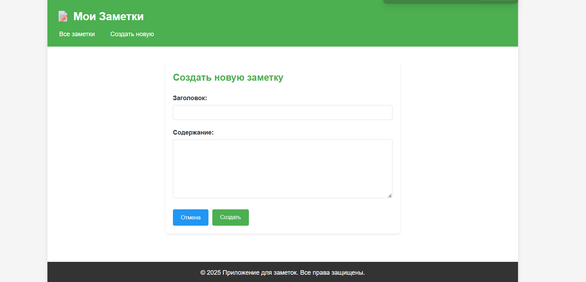
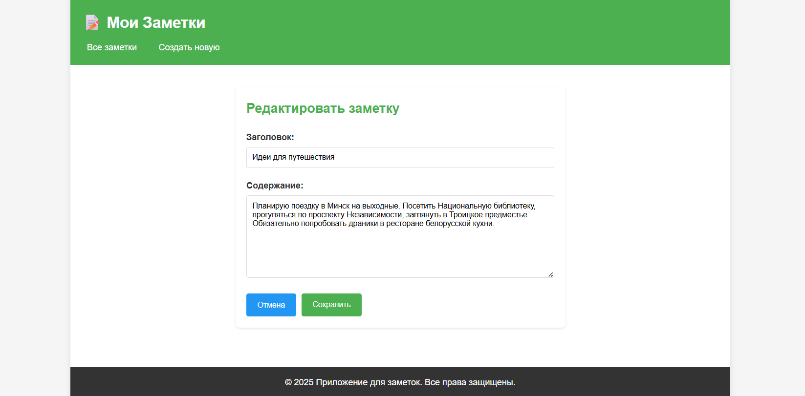
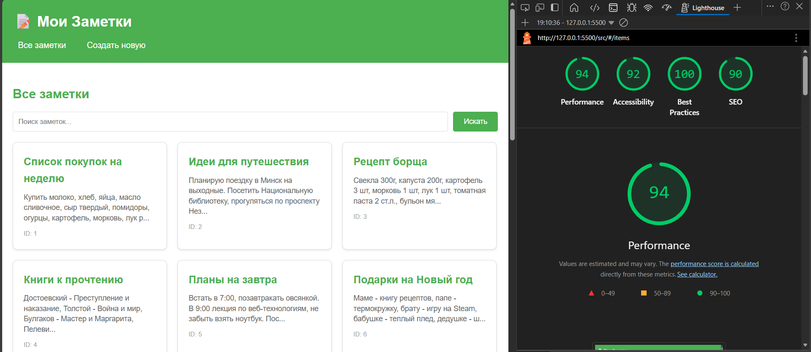

# Лабораторная работа №4

<p align="center">Министерство образования Республики Беларусь</p>
<p align="center">Учреждение образования</p>
<p align="center">"Брестский Государственный технический университет"</p>
<p align="center">Кафедра ИИТ</p>
<br><br><br><br><br><br>
<p align="center"><strong>Лабораторная работа №4</strong></p>
<p align="center"><strong>По дисциплине:</strong> "Веб-технологии"</p>
<p align="center"><strong>Тема:</strong> REST-клиент SPA: список/детализация/CRUD, маршрутизация (без фреймворков)</p>
<br><br><br><br><br><br>
<p align="right"><strong>Выполнил:</strong></p>
<p align="right">Студент 4 курса</p>
<p align="right">Группы АС-63</p>
<p align="right">Грицук П. Э.</p>
<p align="right"><strong>Проверил:</strong></p>
<p align="right">Несюк А. Н.</p>
<br><br><br><br><br>
<p align="center"><strong>Брест 2025</strong></p>

---

## Цель работы

Реализовать простой SPA без фреймворков с маршрутизацией и состояниями загрузки/ошибок. Выполнить CRUD к учебному API (реальному или mock).

---

### Вариант №4

**Заметки/Notes:** список заметок, страница заметки, формы создания/редактирования.

## Ход выполнения работы

### 1. Структура проекта

Проект организован в следующую структуру:

```text
task_04/
├── doc/
│   ├── README.md
│   └── screenshots/
│       ├── list.png
│       ├── detail.png
│       ├── create.png
│       ├── edit.png
│       └── lighthouse.png
└── src/
    ├── index.html
    ├── styles.css
    ├── app.js
    ├── router.js
    └── api.js
```

**Описание файлов:**

- `index.html` — основная HTML-страница приложения
- `styles.css` — стилизация и адаптивная вёрстка
- `app.js` — основная логика приложения, обработчики событий, рендеринг представлений
- `router.js` — модуль маршрутизации на основе hash
- `api.js` — модуль для работы с API (JSONPlaceholder)

### 2. Реализованные элементы

**Функциональность:**

- ✅ Hash-маршрутизация: `#/items`, `#/items/:id`, `#/new`, `#/items/:id/edit`
- ✅ CRUD операции: получение списка, детали, создание, обновление, удаление заметок
- ✅ Состояния загрузки (loading) на всех экранах
- ✅ Обработка ошибок с отображением сообщений
- ✅ Уведомления об успешных операциях
- ✅ Подтверждение удаления заметок
- ✅ Блокировка кнопки submit во время отправки формы
- ✅ Валидация форм (required поля)
- ✅ Поиск заметок с сохранением параметров в URL

**Технические особенности:**

- Использование JSONPlaceholder API для демонстрации CRUD операций
- Разделение на модули (router, api, app)
- Адаптивная вёрстка с медиа-запросами
- Изображения через Picsum Photos API

### 3. Скриншоты выполненной лабораторной работы

#### Список заметок


#### Детальная страница заметки



#### Форма создания заметки



#### Форма редактирования заметки



## Проверка качества

### Lighthouse



**Результаты Lighthouse:**

- Performance: 94
- Accessibility: 92
- Best Practices: 100
- SEO: 90

### Валидаторы

- HTML Validator: имеются незначительные предупреждения
- CSS Validator: проверка пройдена

---

## Таблица критериев

| Критерий                                | Выполнено |
|------------------------------------------|-----------|
| Маршруты (hash): #/items, #/items/:id, #/new, #/items/:id/edit | ✅ |
| Состояния: loading/error/empty на всех экранах | ✅ |
| CRUD: GET список/деталь, POST создание, PATCH/PUT обновление, DELETE удаление | ✅ |
| UX: подтверждение удаления | ✅ |
| UX: блокировка submit во время отправки | ✅ |
| UX: валидация форм | ✅ |
| Маршрутизатор на основе hashchange/load | ✅ |
| Разделение на модули: router, api, views | ✅ |
| Адаптивная вёрстка | ✅ |

### Дополнительные бонусы

| Бонус                                     | Выполнено |
|-------------------------------------------|-----------|
| Сохранение фильтров/поиска в hash         | ✅ |
| Предзагрузка данных (prefetch)            | ❌ |
| Клиентская авторизация                    | ❌ |

---

## Описание маршрутов

- `#/items` — список всех заметок с возможностью поиска
- `#/items?search=query` — список заметок с фильтром по поисковому запросу
- `#/items/:id` — детальная страница заметки с изображением
- `#/new` — форма создания новой заметки
- `#/items/:id/edit` — форма редактирования существующей заметки

## API

Приложение использует JSONPlaceholder API:

- Base URL: <https://jsonplaceholder.typicode.com/posts>
- GET `/posts` — получение списка заметок
- GET `/posts/:id` — получение одной заметки
- POST `/posts` — создание заметки
- PUT `/posts/:id` — обновление заметки
- DELETE `/posts/:id` — удаление заметки

Изображения загружаются через Picsum Photos API: `https://picsum.photos/800/400?random=:id`

## Как запустить

1. Открыть файл `src/index.html` в браузере
2. Или использовать любой HTTP-сервер, например:

   ```bash
   python -m http.server 8000
   ```

3. Перейти по адресу `http://localhost:8000/src/`

## Вывод

В ходе выполнения лабораторной работы был создан одностраничное приложение (SPA) для работы с заметками без использования фреймворков. Реализована hash-маршрутизация, CRUD-операции к REST API, обработка состояний загрузки и ошибок. Приложение разделено на модули (router, api, app), что обеспечивает читаемость кода. Освоены навыки работы с Fetch API, обработки асинхронных операций, динамического рендеринга HTML и управления состоянием приложения.
