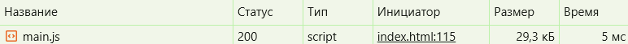
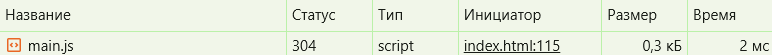

# Лабораторная работа 03. Асинхронность и HTTP‑кэш

**Вариант:** 8
**Студент**: Иванюк Иван

## Кэш-подход

**Тип**: In-memory кэш (Map)  
**TTL**: 5 минут  
**Ключ**: URL запроса  
**Инвалидация**: Временная на основе TTL

## Ретраи

**Попытки**: 3
**Задержка**: Экспоненциальный бэкофф (500 → 1000 → 2000 мс)
**Условия**: Таймауты и сетевые ошибки

## Таймауты

**Лимит**: 5000 мс
**Механизм**: AbortController
**Действие**: Автоматическая отмена при превышении

## Отмена запросов

**Сценарий**: Новый поиск при активном запросе
**Реализация**: AbortController.abort()
**Цель**: Предотвращение "гонки запросов"

## DevTools - скриншоты

**Первый запрос**:
**Status**: 200 OK
**Size**: (данные с сервера)
**Time**: 5 мс

**Повторный запрос**:
**Status**: 304 Not Modified
**Size**: (memory cache)
**Time**: 2 мс

## Ссылка

