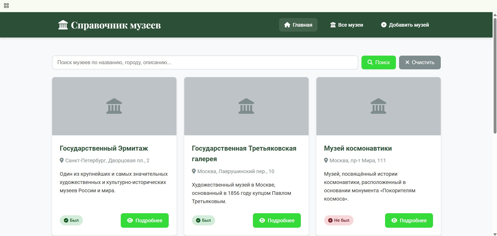
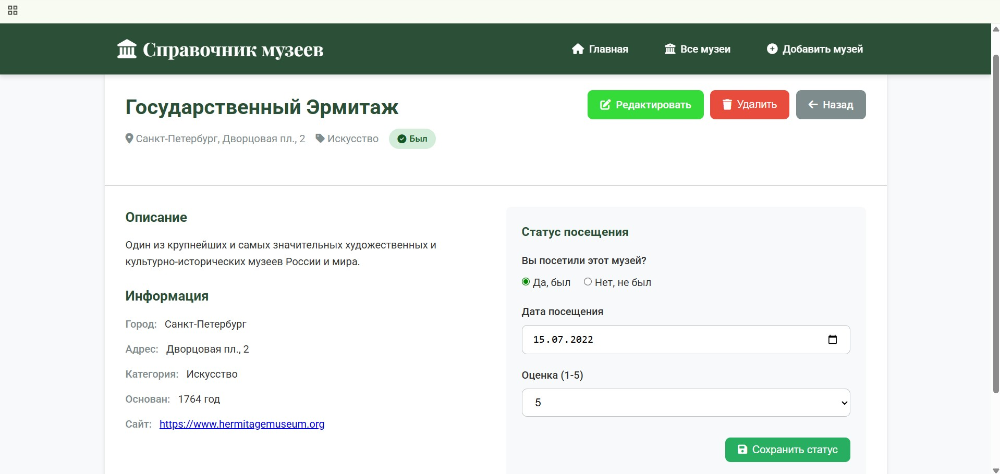
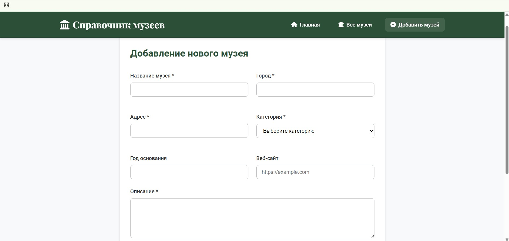

# Лабораторная работа 04. REST-клиент SPA

## Описание проекта

Одностраничное приложение (SPA) для управления справочником музеев с использованием чистого JavaScript. Приложение реализует hash-маршрутизацию, CRUD-операции и различные состояния интерфейса.

## Маршруты

* #/items - Список всех музеев
* #/items/:id - Детальная информация о музее
* #/new - Создание нового музея
* #/items/:id/edit - Редактирование информации о музее

## CRUD операции

* Create - Добавление нового музея
* Read - Просмотр списка и детальной информации
* Update - Редактирование существующего музея
* Delete - Удаление мема с подтверждением
* Search - Поиск музеев по критериям

## Состояния интерфейса

* Loading - Состояние загрузки
* Error - Обработка ошибок
* Empty - Пустые состояния
* Success - Уведомления об успешных операциях

## Архитектура

* Модульная структура - разделение на router, api, views
* Hash-маршрутизация - нативный роутер без фреймворков
* REST API - работа с мок-сервером

## UX улучшения

* Блокировка форм во время отправки
* Подтверждение удаления через модальное окно
* Валидация форм на клиенте
* Автосохранение параметров поиска в hash
* Уведомления об успешных операциях

## Структура проекта

```text
spa-app/
├── index.html
├── css/
│   └── style.css
├── js/
│   ├── app.js          # Точка входа
│   ├── router.js       # Маршрутизатор
│   └── api.js          # REST API клиент
└── README.md
```

## Запуск приложения

### Способ 1: Live Server

* Установите расширение Live Server для VS Code
* Откройте index.html в VS Code
* Нажмите "Go Live" в статус-баре

### Способ 2: Прямое открытие

* Откройте index.html непосредственно в браузере (некоторые функции могут не работать из-за CORS)

## API

### Mock API эндпоинты

* GET /items - Получить список музеев
* GET /items/:id - Получить музей по ID
* POST /items - Создать новый музей
* PATCH /items/:id - Обновить музей
* DELETE /items/:id - Удалить музей

### Структура данных мема

```js
{
  id: number,
  name: string,
  city: string,
  address: string,
  description: string,
  category: string,
  founded: number,
  website: string,
  visited: boolean,
  visitDate: string | null,
  rating: number | null
}
```

## Использование

### Просмотр музеев

* Перейдите на главную страницу (#/items)
* Используйте поиск для фильтрации
* Нажмите на кнопку "Подробнее" на карточке музея для просмотра деталей

### Добавление музея

* Нажмите "Добавить музей" в навигации
* Заполните обязательные поля (название, город, адрес, категория, описание и т.д.)
* Укажите, посещяли ли вы этот музей или нет
* Нажмите "Создать"

### Редактирование музея

* Перейдите на страницу деталей музея
* Нажмите "Редактировать"
* Внесите изменения
* Сохраните изменения

### Удаление мема

* На странице деталей музея нажмите "Удалить"
* Подтвердите действие
* Музей будет удален из справочника

## Скриншоты

**Главная страница со справочником музеев**


**Детальная страница музея**


**Форма создания музея**


## Технические детали

### Маршрутизатор

* Обработка событий hashchange и load
* Извлечение параметров из URL
* Поддержка query-параметров
* Обработка 404 ошибок

### API модуль

* Имитация задержки сети (500ms)
* Валидация данных
* Локальное хранение в памяти
* Обработка ошибок

## Ссылка на проект

[Ссылка](https://jonf1re.github.io/Lab4/)
