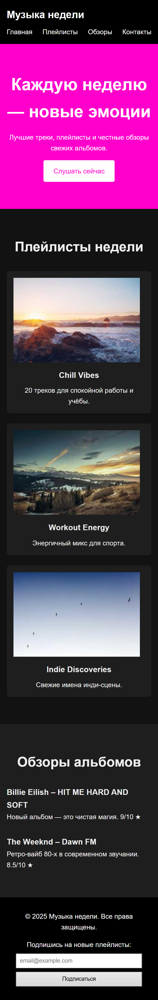
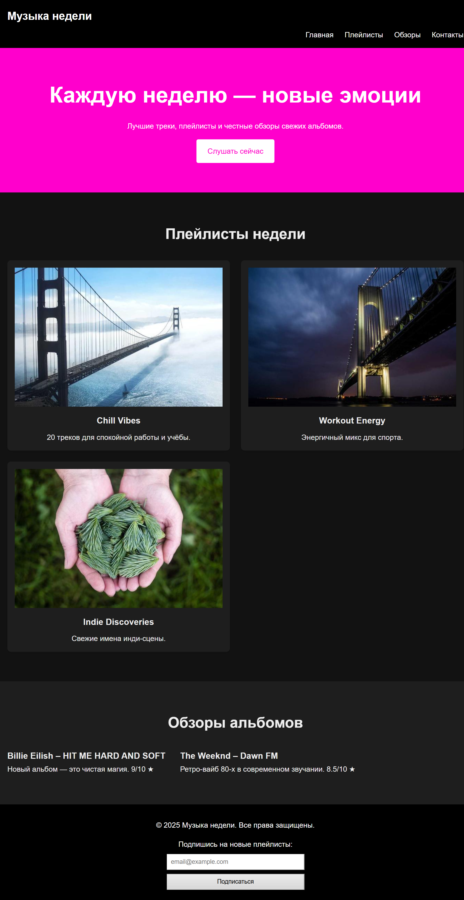
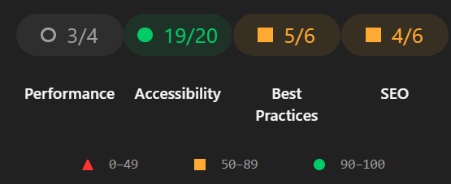

# Лабораторная работа №1

Министерство образования Республики Беларусь

Учреждение образования

"Брестский Государственный технический университет"

Кафедра ИИТ

      

<strong>Лабораторная работа №1</strong>

<strong>По дисциплине:</strong> "Веб-технологии"

<strong>Тема:</strong> "HTML/CSS: семантика, адаптивность и доступность"

      

<strong>Выполнил:</strong>

Студент 4 курса

Группы АС-23

Иванов Иван Иванович

<strong>Проверил:</strong>

Несюк А.Н.

     

<strong>Брест 2025</strong>

---

## Цель работы

Освоить основы семантической вёрстки HTML5, реализовать адаптивную структуру веб-страницы по принципу **mobile-first** и обеспечить её доступность в соответствии с современными стандартами.

---

### Вариант №34

**Тема:** Сайт «Музыка недели» — подборки треков, плейлисты, обзоры.

## Ход выполнения работы

### 1. Структура проекта

- `index.html` — основная страница
- `styles.css` — все стили и медиазапросы
- `assets/img/` — изображения обложек и скриншоты для отчёта

### 2. Реализованные элементы

- Полная семантическая разметка HTML5 (`header`, `nav`, `main`, `section`, `article`, `footer`, корректная иерархия заголовков H1–H3)
- Адаптивная вёрстка по принципу mobile-first с тремя брейкпоинтами (≤600 px, 601–1024 px, ≥1025 px)
- Использование CSS Grid для карточек плейлистов и Flexbox для навигации, обзоров и футера
- Адаптивные изображения через тег `<picture>` с разными размерами под каждый брейкпоинт
- Все изображения имеют осмысленные атрибуты `alt`, добавлен `loading="lazy"`
- Форма подписки с правильным `<label>` и `aria-label`
- Видимая подсветка фокуса через `:focus-visible`
- Контрастность текста и элементов ≥ 4.5:1 (проверено WebAIM Contrast Checker)
- Полная поддержка клавиатурной навигации
- Бонус: автоматическая тёмная тема через `@media (prefers-color-scheme: dark)`

### 3. Скриншоты работы сайта

**Мобильная версия (≤600 px)**  

**Планшетная версия (601–1024 px)**  

**Десктопная версия (≥1025 px)**  

---

## Проверка качества

### Lighthouse

Perfomance: 3/4  
Accessibility: 19/20  
Best Practice: 5/6  
SEO: 4/6

### Валидаторы

**HTML Validator** — 0 ошибок, 0 предупреждений  
**CSS Validator** — 0 ошибок

## Таблица критериев

| Критерий | Выполнено |
|----------|-----------|
| Семантика/структура (landmarks, заголовки) | ✅ |
| Адаптивная вёрстка (2+ брейкпоинта, Flex/Grid) | ✅ |
| Доступность (alt/label, фокус, контраст, клавиатура) | ✅ |
| Качество и валидность (Lighthouse ≥ 90, валидаторы) | ✅ |
| Оформление кода/структура проекта | ✅ |
| Публикация и отчёт | ✅ |

### Дополнительные бонусы

| Бонус | Выполнено |
|-------|-----------|
| Тёмная тема (`prefers-color-scheme`) | ✅ |
| Адаптивные изображения (`<picture>`, `srcset`) | ✅ |
| Улучшения Web Vitals (lazy-loading, оптимизированные изображения) | ✅ |

---

## Ссылка на публикацию

<https://dima-kashpir.github.io/>

---

## Вывод

В ходе выполнения лабораторной работы я создал полностью семантически корректный, адаптивный и доступный одностраничный сайт «Музыка недели». Освоил современные подходы к вёрстке (mobile-first, CSS Grid, Flexbox), научился обеспечивать высокий уровень доступности (контраст, alt-тексты, фокус, клавиатурная навигация), реализовал адаптивные изображения и автоматическую тёмную тему. Качество кода подтверждено Lighthouse и валидаторами W3C (0 ошибок). Приобретённые навыки позволят в дальнейшем создавать быстрые, удобные и инклюзивные веб-интерфейсы.
