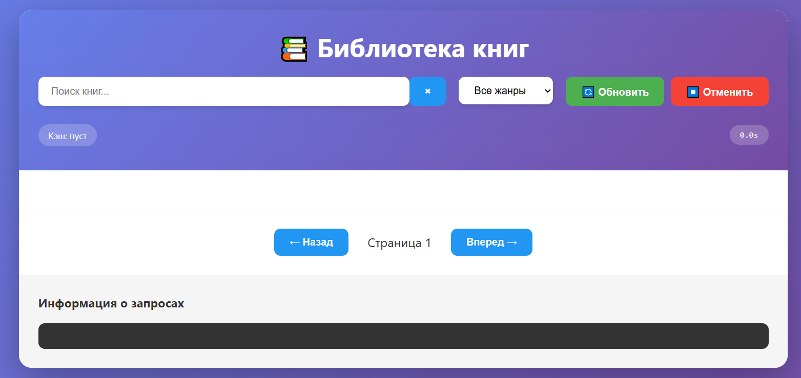
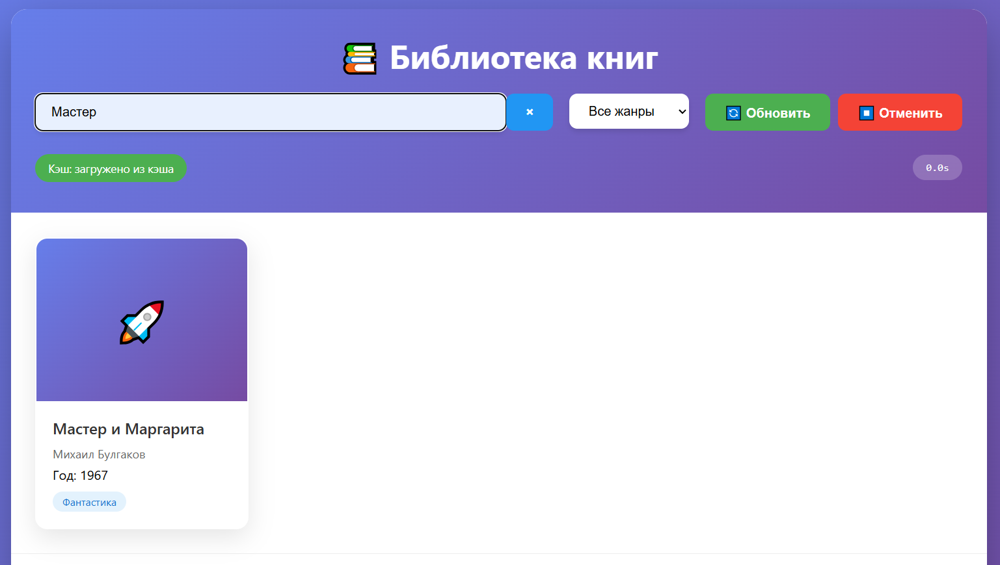

# Лабораторная работа №3: Библиотека книг

## Описание

Веб-приложение для просмотра библиотеки книг с поддержкой:
- Асинхронной загрузки данных
- Кэширования на клиентской стороне
- Ретраев при сбоях сети
- Отмены запросов
- Пагинации и поиска

## Функциональность

### 1. Основные возможности

- 📚 Просмотр списка книг с пагинацией
- 🔍 Поиск по названию и автору
- 🎯 Фильтрация по жанру
- 📖 Детальный просмотр информации о книге
- ⚡ Индикаторы загрузки и состояния

### 2. Кэширование

- **In-memory кэш** с TTL (5 минут)
- **LocalStorage кэш** для persistence
- **ETag поддержка** (If-None-Match)
- Автоматическая инвалидация устаревших данных
- Кнопка "Обновить" для игнора кэша

### 3. Обработка ошибок и ретраи

- **Экспоненциальный бекофф** при ретраях
- **Таймауты запросов** (8 секунд)
- **Отмена конкурентных запросов** через AbortController
- **Дебаунс поиска** (300ms)
- Визуальные индикаторы ретраев

### 4. UX улучшения

- Skeleton loading при загрузке
- Состояния: loading/error/empty/success
- Таймер выполнения запросов
- Дебаг-лог для мониторинга запросов

## Технологии

- Vanilla JavaScript (ES6+)
- Async/Await с обработкой ошибок
- Fetch API с AbortController
- LocalStorage для кэширования
- CSS Grid/Flexbox для layout

## Демонстрация сайта

https://catsker.github.io/wt-lab3/

