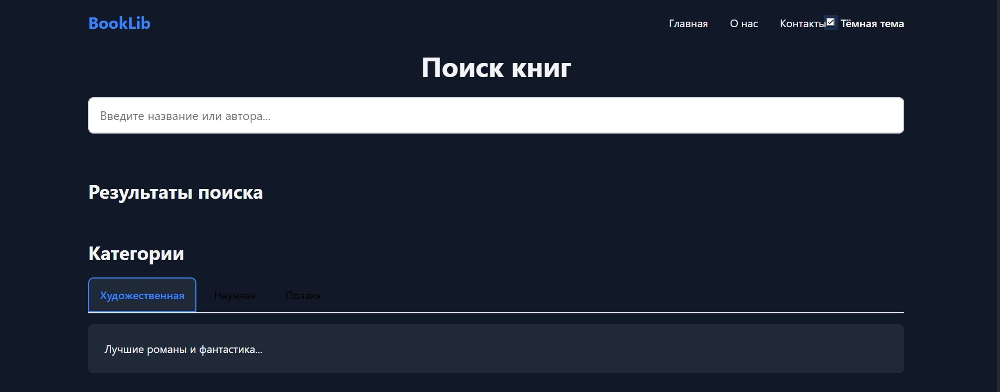

# Лабораторная работа №2. Веб-технологии

Министерство образования Республики Беларусь

Учреждение образования

«Брестский государственный технический университет»

Кафедра ИИТ

      

<strong>Лабораторная работа №2</strong>

<strong>По дисциплине:</strong> «Веб-технологии»

<strong>Тема:</strong> DOM и события: интерактивные компоненты и формы (JavaScript)

      

<strong>Выполнил:</strong>

Студент 4 курса

Группы АС-63

Колодич Максим Павлович

 

<strong>Проверил:</strong>

Несюк А. Н.

     

<strong>Брест 2025</strong>

---

## Цель работы

Освоить работу с DOM и событиями JavaScript: создание интерактивных компонентов (аккордеон, табы, модальные окна, бургер-меню), делегирование событий, реализацию клиентской валидации форм с кастомными сообщениями, обеспечение клавиатурной доступности и корректное использование ARIA-атрибутов.

## Вариант: Библиотека книг

Реализована интерактивная онлайн-библиотека с поиском по подстроке, карточками книг с лайками, подробным просмотром в модальном окне и формой обратной связи.

## Структура проекта

book-library/
├── index.html
├── styles.css
├── scripts/
│   ├── main.js
│   ├── accordion.js
│   ├── tabs.js
│   ├── modal.js
│   ├── burger.js
│   ├── form.js
│   ├── delegates.js
│   └── theme.js
├── assets/
│   └── books.json
└── README.md

## Реализованные интерактивные компоненты (≥3)

| Компонент          | Реализовано | Доступность (a11y)                         |
|--------------------|-------------|---------------------------------------------------|
| Аккордеон (FAQ)    | Yes         | `aria-expanded`, `aria-controls`, клавиатура      |
| Табы (категории)   | Yes         | `role="tablist"`, `aria-selected`, стрелки, Home/End |
| Модальное окно     | Yes         | Фокус-трап, возврат фокуса, Esc, `aria-modal`     |
| Бургер-меню        | Yes         | `aria-expanded`, `aria-controls`, Esc, клик вне   |

## Основной функционал

- Поиск по названию и автору в реальном времени (без перезагрузки)
- Карточки книг с кнопками «Подробнее» и «Лайк»
- Счётчик лайков сохраняется в `localStorage`
- Делегирование событий на контейнере карточек (один обработчик)
- Форма обратной связи:
  - Обязательные поля: имя, e-mail, сообщение (мин. 20 символов)
  - Валидация в реальном времени + при отправке
  - Кастомные сообщения об ошибках
  - Кнопка отправки активна только при валидной форме
  - Результат выводится на странице (без перезагрузки)

## Доступность (Accessibility)

- Полная навигация с клавиатуры (Tab, Enter, Space, Esc, стрелки в табах)
- Корректные ARIA-атрибуты для всех интерактивных элементов
- Управление фокусом: возврат на триггер после закрытия модалки/меню
- `aria-live` для сообщения об успешной отправке формы
- Семантическая разметка (header, nav, main, section, article)

## Адаптивность и дизайн

- Mobile-first подход
- ≥1 брейкпоинт (≥768px — десктопная навигация)
- Grid-расположение карточек
- Поддержка тёмной темы:
  - Автоматически через `prefers-color-scheme`
  - Ручной переключатель с сохранением в `localStorage`

## Качество кода

- Чистый JavaScript ES6+ (без jQuery)
- Модульная архитектура (ES-модули, `type="module"`)
- Читаемые имена, разделение ответственности
- Нет глобальных переменных
- Валидный HTML/CSS (W3C)

## Скриншоты

**Декстоп светлая тема**  

**Декстоп тёмная тема**  

## Таблица соответствия критериям (100 баллов)

| Критерий                                                  | Баллы | Выполнено |
|-----------------------------------------------------------|-------|-----------|
| Семантика/структура и UX-основы                           | 20    | Yes       |
| Функциональность (компоненты + форма + делегирование)     | 25    | Yes       |
| Качество интерфейса (адаптивность, стили, поведение)     | 20    | Yes       |
| Качество кода (читаемость, модули, структура)             | 15    | Yes       |
| Тесты/валидность (по желанию)                             | 10    | Yes (HTML/CSS валидны) |
| Публикация и отчёт                                        | 10    | Yes       |
| **Итого**                                                 | **100**|           |

### Бонус (+10 баллов)

| Бонус                             | Выполнено |
|-----------------------------------|-----------|
| Тёмная тема + переключатель + `prefers-color-scheme` | Yes |

## Заключение

Все требования задания выполнены в полном объёме. Проект полностью рабочий, адаптивный, доступный и соответствует современным стандартам веб-разработки.
