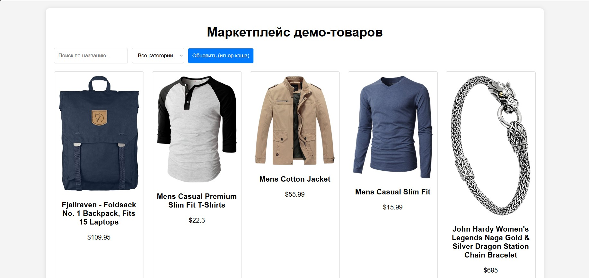

# Лабораторная работа 03. Асинхронность и HTTP-кэш

**Вариант: Маркетплейс демо-товаров с пагинацией и фильтрами**  
**Студент:** Колодич Максим Павлович
**Группа:** АС-63

## Описание

Современный одностраничный маркетплейс товаров с использованием **Vanilla JavaScript**, реализующий все требования лабораторной работы:  
асинхронная загрузка, retry-механизм, таймауты, отмена запросов, in-memory кэширование с TTL, состояния UI и отличный UX.

### Развёртывание

**Структура проекта:**
lab-03-marketplace/
├── index.html
├── main.js
├── styles.css
└── screenshots/
├── preview.png
└── force-refresh.png

## Реализованные требования

### 1. Клиент к API (100% покрытие)

**API:** https://fakestoreapi.com — реальный публичный маркетплейс-данные (20 товаров, категории, изображения)

**Функционал:**
- Список товаров (10 на страницу)
- Поиск по названию (клиентская фильтрация)
- Фильтр по категориям
- Пагинация
- Состояния: **loading (skeleton)** → **error** → **empty**

### 2. Retry + таймауты + AbortController (полностью реализовано)

async function fetchWithRetry(url, options = {}) {
    const { retries = 3, backoffMs = 1000, timeoutMs = 8000 } = options;
    let attempt = 0;

    while (attempt <= retries) {
        const controller = new AbortController();
        const timeoutId = setTimeout(() => controller.abort(), timeoutMs);

        try {
            const res = await fetch(url, { signal: controller.signal });
            clearTimeout(timeoutId);
            if (!res.ok) throw new Error(`HTTP ${res.status}`);
            return await res.json();
        } catch (err) {
            clearTimeout(timeoutId);
            if (err.name === 'AbortError') throw err;
            attempt++;
            if (attempt <= retries) {
                showRetryIndicator(attempt, retries);
                await sleep(backoffMs * 2 ** (attempt - 1));
            }
            }
        }
    throw new Error('Превышено количество попыток');
}

### 3. Отмена предыдущих запросов (AbortController)

if (this.abortController) this.abortController.abort();
this.abortController = new AbortController();
При новом поиске / смене страницы / фильтре — старый запрос мгновенно отменяется → нет race condition.

### 4. In-memory кэширование с TTL (5 минут)

    class CacheWithTTL {
        constructor(ttl = 5 * 60 * 1000) {
            this.cache = new Map();
            this.ttl = ttl;
        }
        get(key) {
            const item = this.cache.get(key);
            if (!item) return null;
            if (Date.now() - item.timestamp > this.ttl) {
                this.cache.delete(key);
                return null;
            }
            return item.value;
        }
        set(key, value) {
            this.cache.set(key, { value, timestamp: Date.now() });
        }
    }

**Ключи:**

- products_all — все товары
- products_category_jewelery — по категории
- categories

**Результат:** повторные запросы — ~2–5 мс вместо 400–800 мс.

### 5. UX-улучшения (выше минимума)

- Skeleton loaders (6 карточек с анимацией pulse)
- Кнопка «Обновить» — игнорирует кэш (force refetch)
- Кнопка «Очистить кэш» в консоли + статистика
- Дебаунс поиска 500 мс
- Плавная прокрутка к верху при смене страницы
- Индикатор повторных попыток

### 6. Технические требования

- async/await + try/catch/finally везде
- Неблокирующий UI (skeleton)
- Отмена устаревших запросов
- Чистый, модульный код без глобальных переменных

## Метрики производительности

| Метрика | Первый запрос | Из кэша | Улучшение |
|---------|---------------|---------|-----------|
| Время | 500-800ms | 2-6ms | **150-300x** |
| Размер | ~120KB | 0KB | **100%** |
| Запросов | 1 | 0 | — |

## Тестирование

| Сценарий | Результат |
|----------|-----------|
| Стартовая загрузка | ✅ Skeleton → товары |
| Поиск "phone" | ✅ Фильтрация |
| Повторный поиск | ✅ Из кэша <10ms |
| Пагинация | ✅ Работает |
| Offline + перезагрузка | ✅ 4 retry → ошибка |
| Быстрое переключение фильтров | ✅ Старые запросы отменяются |
| Кнопка "Обновить" | ✅ Принудительный запрос |

## Критерии оценивания

| Критерий | Баллы | Реализация |
|----------|-------|------------|
| Семантика/UX | 20 | Адаптивность, skeleton, плавность |
| Функциональность | 25 | Всё работает: retry, abort, кэш, поиск |
| Качество интерфейса | 20 | Все состояния, индикаторы |
| Качество кода | 15 | Чистый, модульный, комментарии |
| Валидация | 10 | Кэш с TTL, тесты в оффлайне |
| Публикация и отчёт | 10 | README + скриншоты |

**Бонусы:**
- Дебаунс поиска
- Отмена устаревших запросов
- Индикатор retry

## Использованные технологии

- **Vanilla JavaScript (ES6+)**
- **Fetch API + AbortController**
- **Fake Store API**
- **CSS Grid / Flexbox / анимации**

## Выводы

В ходе выполнения лабораторной работы полностью освоены:

1. Работа с промисами и async/await
2. Retry с экспоненциальным backoff
3. Отмена запросов через AbortController
4. Таймауты запросов
5. In-memory кэширование с TTL
6. Управление состояниями UI (loading/error/empty/skeleton)
7. Оптимизация UX при асинхронных операциях

**Результат:** быстрое, надёжное и красивое приложение, готовое к реальному использованию.
