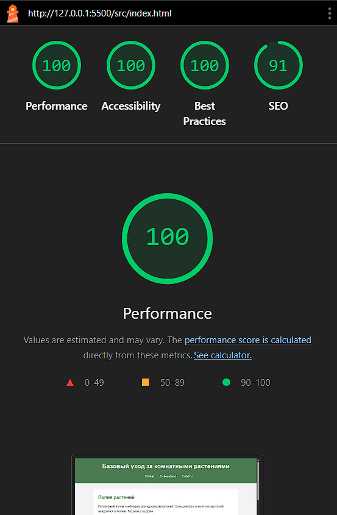
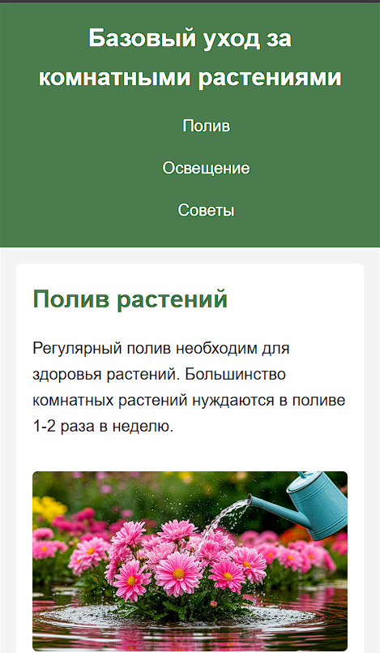
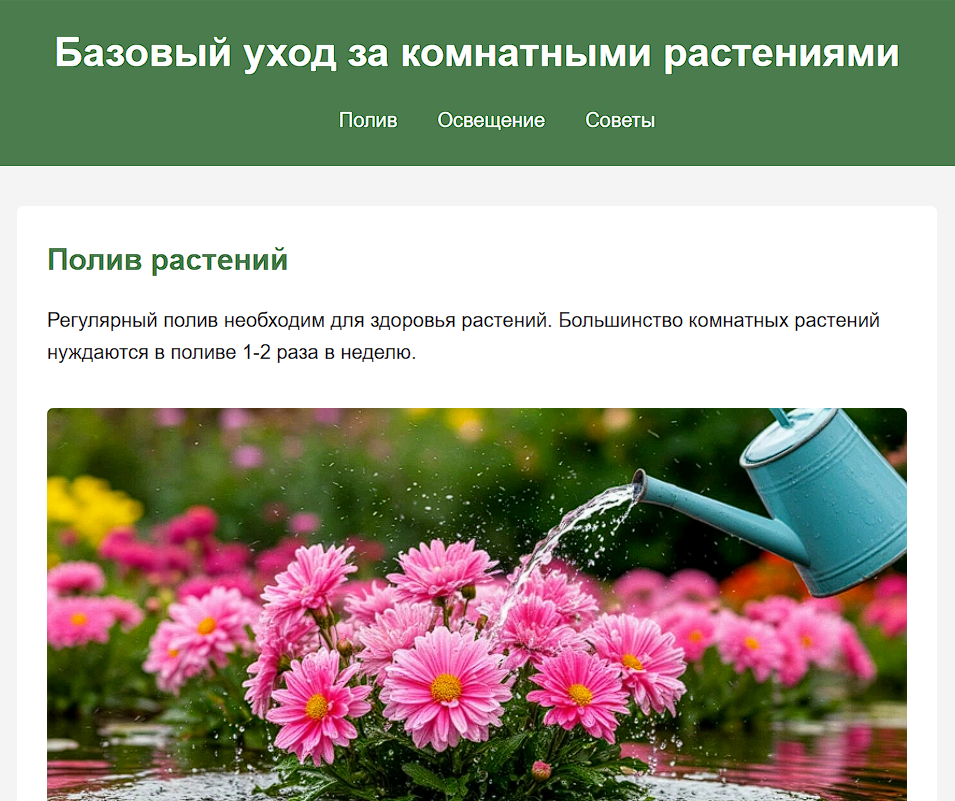
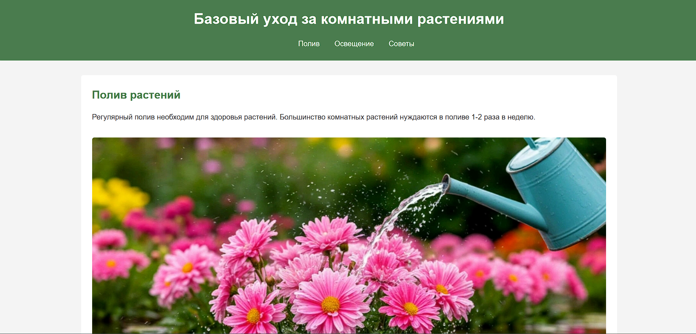

# Учебный проект: Уход за комнатными растениями

Студент: Котковец Кирилл  
Группа: АС-64

## Ссылка на опубликованный сайт

<https://kirill-kotkovets.github.io/WT-AC-2025/task_01>

## Скриншоты

### Валидация и производительность

### Адаптивность (брейкпоинты)

#### Мобильная версия (≤600px)

#### Планшет (601-1023px)

#### Десктоп (≥1024px)

## Архитектура вёрстки

### Медиазапросы

- Mobile-first подход
- 2 медиазапроса: `max-width: 600px` и `min-width: 1024px`

### Использование Grid

На десктопе (≥1024px) контейнер `main` использует CSS Grid с двумя колонками для размещения секций.

### Семантика

Базовые HTML5 элементы: `header`, `nav`, `main`, `section`, `footer`.
