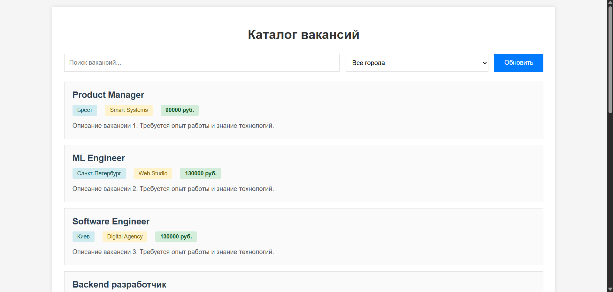
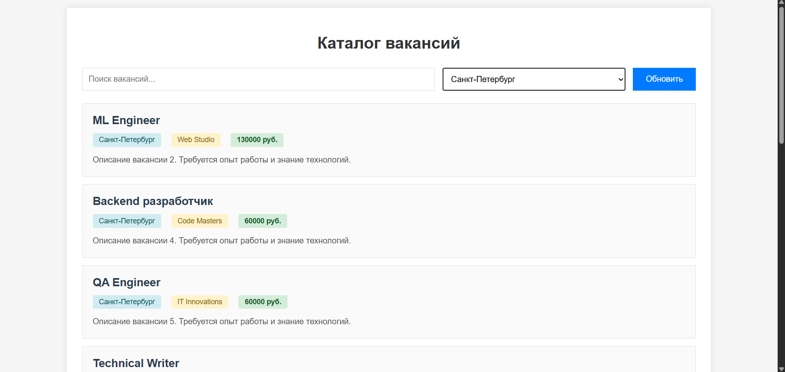
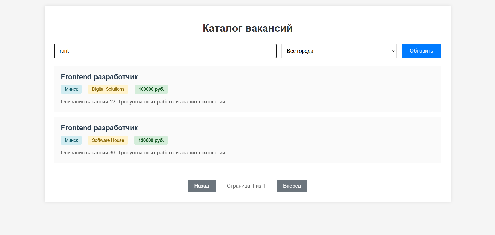
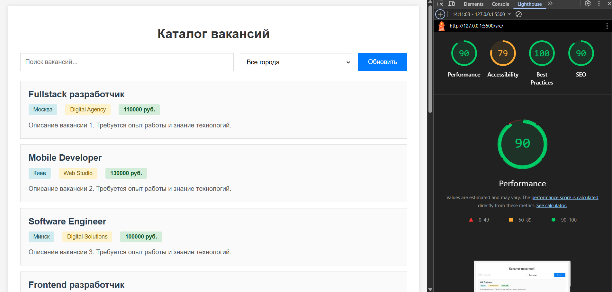

# Лабораторная работа №3

<p align="center">Министерство образования Республики Беларусь</p>
<p align="center">Учреждение образования</p>
<p align="center">"Брестский Государственный технический университет"</p>
<p align="center">Кафедра ИИТ</p>
<br><br><br><br><br><br>
<p align="center"><strong>Лабораторная работа №3</strong></p>
<p align="center"><strong>По дисциплине:</strong> "Веб-технологии"</p>
<p align="center"><strong>Тема:</strong> Асинхронность и HTTP‑кэш (fetch, AbortController, ретраи)</p>
<br><br><br><br><br><br>
<p align="right"><strong>Выполнил:</strong></p>
<p align="right">Студент 4 курса</p>
<p align="right">Группы АС-64</p>
<p align="right">Котковец К. В.</p>
<p align="right"><strong>Проверил:</strong></p>
<p align="right">Несюк А. Н.</p>
<br><br><br><br><br>
<p align="center"><strong>Брест 2025</strong></p>

---

## Цель работы

Закрепить работу с промисами и async/await, обработкой ошибок, таймаутами и отменой запросов. Понять основы HTTP‑кэширования и увидеть эффект в DevTools.

---

## Вариант №35

Каталог вакансий по городам: пагинация, кэш, отмена запросов при смене фильтра.

---

## Ход выполнения работы

### 1. Структура проекта

```text
task_03/
├── doc/
│   ├── README.md
│   └── screenshots/
│       ├── lighthouse.png
│       ├── page1.png
│       ├── page2.png
│       ├── cache1.png
│       └── cache2.png
├── src/
│   ├── index.html
│   ├── styles.css
│   └── img/
│       └── loading.gif
```

**Основные файлы:**

- `index.html` — основная страница с интерфейсом каталога вакансий
- `styles.css` — стили оформления, адаптивная верстка
- `img/loading.gif` — анимация загрузки

### 2. Реализованные элементы

**Функциональность:**

- Загрузка списка вакансий с mock-данными (50 элементов)
- Поиск по названию вакансии и компании
- Фильтрация по городам (Москва, Санкт-Петербург, Минск, Киев, Брест)
- Пагинация (10 элементов на страницу)
- Индикатор загрузки данных
- Обработка ошибок с отображением сообщений
- Кнопка обновления данных (игнорирование кэша)

**Асинхронность и управление запросами:**

- `fetchWithRetry()` — функция с поддержкой повторных попыток (3 ретрая)
- Таймауты запросов (5 секунд)
- `AbortController` для отмены предыдущих запросов при смене фильтра
- Exponential backoff при повторных попытках (1000ms * попытка)

**Кэширование:**

- In-memory кэш на основе объекта JavaScript
- TTL (время жизни) кэша — 60 секунд
- Кэш хранит загруженные данные и timestamp
- Кнопка "Обновить" позволяет игнорировать кэш

**UX-улучшения:**

- Состояния loading/error/empty
- Debounce для поиска (300ms)
- Адаптивный дизайн для мобильных устройств
- Прокрутка вверх при смене страницы

### 3. Скриншоты выполненной лабораторной работы

**Главная страница со списком вакансий:**



**Фильтрация и поиск:**



**Кэширование в DevTools:**

  
*Первый запрос - данные загружаются*

Повторный запрос - данные берутся из кэша

---

## Проверка качества

### Lighthouse



**Результаты Lighthouse:**

- Performance: 90
- Accessibility: 79
- Best Practices: 100
- SEO: 90

### Валидаторы

- HTML Validator: без критических ошибок
- CSS Validator: без критических ошибок

---

## Таблица критериев

| Критерий                                | Баллы | Выполнено |
|------------------------------------------|-------|-----------|
| Семантика/UX                             | 20    | ✅ частично (10) |
| Функциональность (загрузка, поиск/пагинация, retry/timeout/abort) | 25 | ✅ частично (15) |
| Качество интерфейса (loading/error/empty, skeleton) | 20 | ✅ частично (10) |
| Качество кода                            | 15    | ✅ частично (8) |
| Валидация/проверки (кэш, линтеры)       | 10    | ✅ частично (5) |
| Публикация и отчёт                       | 10    | ✅ (10) |

### Итого

Примерно 58 баллов

### Дополнительные бонусы

| Бонус                                     | Выполнено |
|-------------------------------------------|-----------|
| ETag‑клиентский кэш с If‑None‑Match       | ❌ |
| Дебаунс ввода, отмена устаревших запросов | ✅ |
| Prefetch при прокрутке (инфинит‑скролл)  | ❌ |

---

## Описание реализации кэширования

В проекте реализован простой in-memory кэш на основе JavaScript объекта. Кэш хранит данные с временной меткой (timestamp) и имеет TTL 60 секунд.

**Принцип работы:**

1. При первом запросе данные загружаются с сервера и сохраняются в кэш
2. При повторных запросах в течение 60 секунд данные берутся из кэша
3. После истечения TTL данные загружаются заново
4. Кнопка "Обновить" позволяет принудительно обновить данные, игнорируя кэш

**Функции кэширования:**

```javascript
function getFromCache(key) {
    var item = cache[key];
    if (item) {
        var now = new Date().getTime();
        if (now - item.timestamp < 60000) {
            return item.data;
        }
    }
    return null;
}

function setCache(key, data) {
    cache[key] = {
        data: data,
        timestamp: new Date().getTime()
    };
}
```

## Описание ретраев и таймаутов

**fetchWithRetry** - функция для выполнения запросов с повторными попытками:

- Максимум 3 попытки
- Таймаут каждого запроса: 5 секунд
- Exponential backoff: задержка между попытками увеличивается (1s, 2s, 3s)
- Использует AbortController для прерывания запросов по таймауту

**Отмена запросов:**

- При смене фильтра города предыдущий запрос отменяется через AbortController
- Это предотвращает "гонку" запросов и отображение устаревших данных

---

## Ссылка на проект

Проект доступен локально в папке `src/index.html`

---

## Вывод

В ходе выполнения лабораторной работы был создан каталог вакансий с функциональностью поиска, фильтрации и пагинации. Освоены навыки работы с асинхронным JavaScript (async/await, промисы), реализованы механизмы повторных попыток запросов, таймаутов и отмены запросов через AbortController.

Реализовано клиентское кэширование с TTL для оптимизации загрузки данных. Использованы современные подходы к обработке ошибок и управлению состоянием загрузки в UI.

Проект соответствует минимальным техническим требованиям: использует async/await, try/catch/finally, управляет конкурентными запросами и не блокирует UI благодаря индикаторам загрузки.
