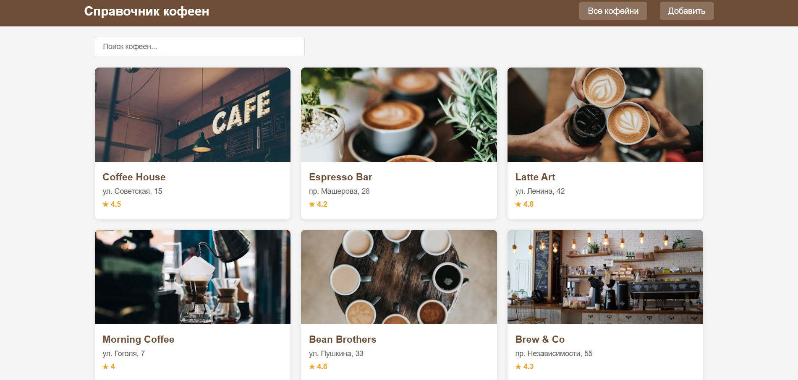
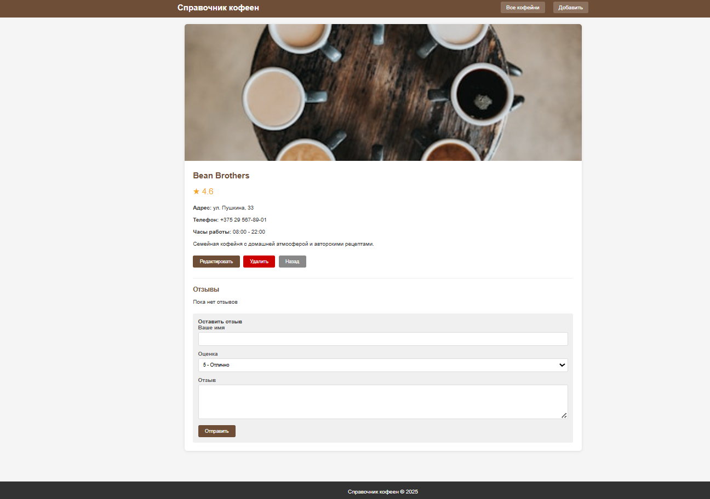
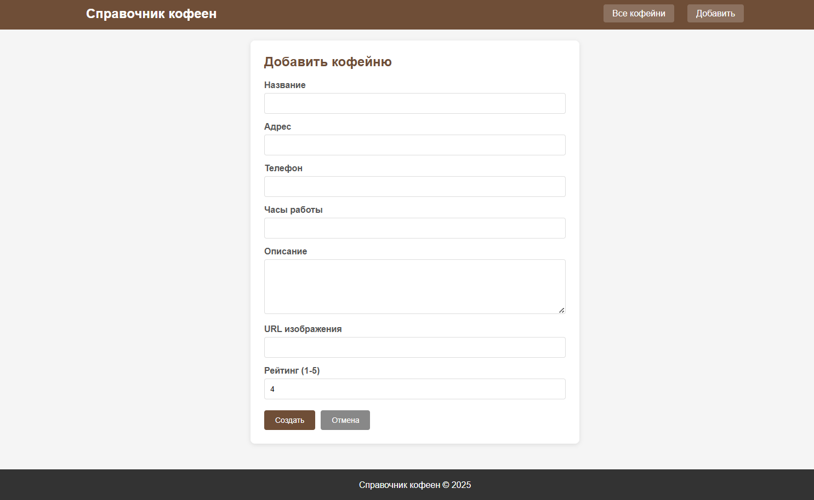
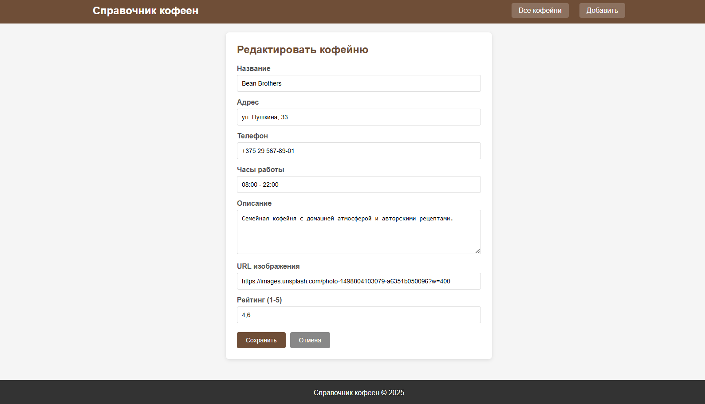
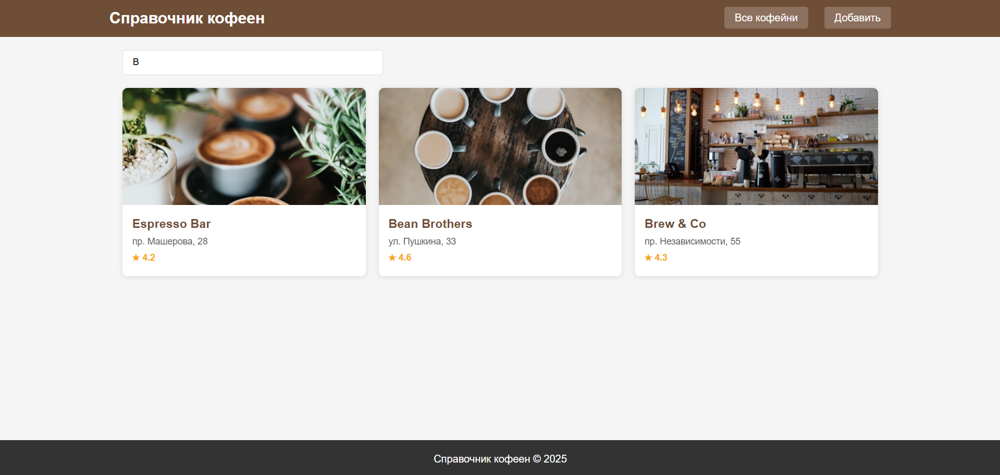
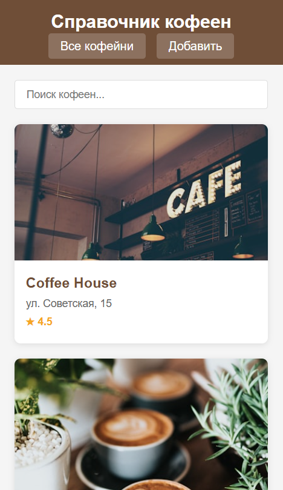
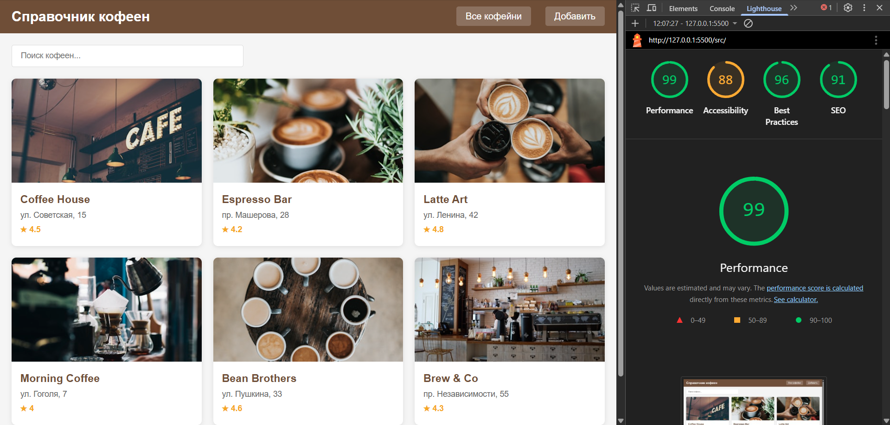

# Лабораторная работа №4

<p align="center">Министерство образования Республики Беларусь</p>
<p align="center">Учреждение образования</p>
<p align="center">"Брестский Государственный технический университет"</p>
<p align="center">Кафедра ИИТ</p>
<br><br><br><br><br><br>
<p align="center"><strong>Лабораторная работа №4</strong></p>
<p align="center"><strong>По дисциплине:</strong> "Веб-технологии"</p>
<p align="center"><strong>Тема:</strong> REST-клиент SPA: список/детализация/CRUD, маршрутизация</p>
<br><br><br><br><br><br>
<p align="right"><strong>Выполнил:</strong></p>
<p align="right">Студент 4 курса</p>
<p align="right">Группы АС-64</p>
<p align="right">Котковец К. В.</p>
<p align="right"><strong>Проверил:</strong></p>
<p align="right">Несюк А. Н.</p>
<br><br><br><br><br>
<p align="center"><strong>Брест 2025</strong></p>

---

## Цель работы

Реализовать простой SPA без фреймворков с маршрутизацией и состояниями загрузки/ошибок. Выполнить CRUD к учебному API (реальному или mock).

---

### Вариант №35

**Тема:** Справочник кофеен: список, деталь, форма отзыва/оценки.

## Ход выполнения работы

### 1. Структура проекта

```text
+---doc
|   |   README.md
|   |
|   \---screenshots
|           ...
|
\---src
    |   index.html
    |   styles.css
    |   api.js
    |   views.js
    |   router.js
    |   app.js
    |
    \---img
             ...
```

- `index.html` — основная страница SPA
- `styles.css` — стилизация и медиазапросы
- `api.js` — модуль для работы с данными (mock API)
- `views.js` — модуль отображения компонентов
- `router.js` — модуль маршрутизации
- `app.js` — основная логика приложения

### 2. Реализованные элементы

- Hash-маршрутизация (`#/items`, `#/items/:id`, `#/new`, `#/items/:id/edit`)
- Состояния загрузки и ошибок
- CRUD операции:
  - GET список кофеен
  - GET детальная информация о кофейне
  - POST создание новой кофейни
  - PUT/PATCH обновление кофейни
  - DELETE удаление кофейни
- Форма добавления отзыва
- Поиск кофеен с сохранением в hash
- Подтверждение удаления
- Блокировка кнопки submit во время отправки
- Адаптивная вёрстка

### 3. Маршруты приложения

| Маршрут | Описание |
|---------|----------|
| `#/items` | Список всех кофеен |
| `#/items/:id` | Детальная страница кофейни |
| `#/new` | Форма создания новой кофейни |
| `#/items/:id/edit` | Форма редактирования кофейни |

### 4. API

Приложение использует mock API, данные хранятся в памяти браузера.

**Основные функции:**

- `getAllCoffeeShops()` - получить список кофеен
- `getCoffeeShopById(id)` - получить кофейню по ID
- `createCoffeeShop(data)` - создать кофейню
- `updateCoffeeShop(id, data)` - обновить кофейню
- `deleteCoffeeShop(id)` - удалить кофейню
- `addReview(shopId, reviewData)` - добавить отзыв
- `searchCoffeeShops(query)` - поиск кофеен

### 5. Как запустить

1. Откройте файл `src/index.html` в браузере
2. Или используйте локальный сервер:

   ```cmd
   npx serve src
   ```

### 6. Скриншоты выполненой лабораторной работы

**Список кофеен (главная страница):**



**Детальная страница кофейни:**



**Форма создания новой кофейни:**



**Форма редактирования кофейни:**



**Поиск кофеен:**



**Мобильная версия:**



## Проверка качества

### Lighthouse



**Результаты Lighthouse:**

- Performance: 99
- Accessibility: 88
- Best Practices: 96
- SEO: 91

### Валидаторы

- HTML Validator без ошибок!
- CSS Validator без ошибок!

---

## Таблица критериев

| Критерий | Выполнено |
|----------|-----------|
| Семантика/UX | ✅ |
| Функциональность/CRUD/маршрутизация | ✅ |
| Качество интерфейса | ✅ |
| Качество кода/модульность | ✅ |
| Тесты/валидность | ❌ |
| Публикация и отчёт | ✅ |

### Дополнительные бонусы

| Бонус | Выполнено |
|-------|-----------|
| Сохранение фильтров/поиска в hash | ✅ |
| Предзагрузка данных (prefetch) | ❌ |
| Клиентская авторизация | ❌ |

---

## Вывод

В ходе выполнения лабораторной работы было создано одностраничное приложение (SPA) "Справочник кофеен" на чистом JavaScript без использования фреймворков. Реализована hash-маршрутизация, CRUD операции с mock API, формы создания и редактирования, система отзывов. Приложение имеет адаптивный дизайн и работает корректно в современных браузерах.
