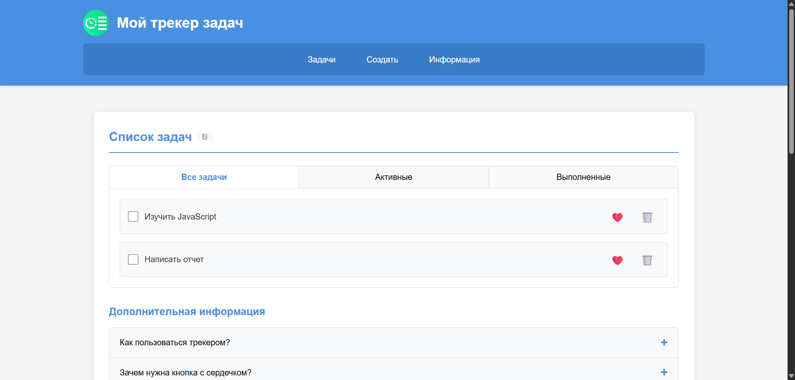
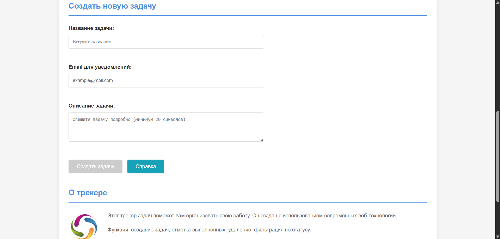

# Лабораторная работа №2

<p align="center">Министерство образования Республики Беларусь</p>
<p align="center">Учреждение образования</p>
<p align="center">"Брестский Государственный технический университет"</p>
<p align="center">Кафедра ИИТ</p>
<br><br><br><br><br><br>
<p align="center"><strong>Лабораторная работа №2</strong></p>
<p align="center"><strong>По дисциплине:</strong> "Веб-технологии"</p>
<p align="center"><strong>Тема:</strong> "DOM и события: интерактивные компоненты и формы (JavaScript)"</p>
<br><br><br><br><br><br>
<p align="right"><strong>Выполнил:</strong></p>
<p align="right">Студент 4 курса</p>
<p align="right">Группы АС-63</p>
<p align="right">Козлович А. А.</p>
<p align="right"><strong>Проверил:</strong></p>
<p align="right">Несюк А. Н.</p>
<br><br><br><br><br>
<p align="center"><strong>Брест 2025</strong></p>

---

## Цель работы

Освоить работу с DOM: добавление, удаление и изменение элементов интерфейса. Научиться обрабатывать события, использовать делегирование, работать с клавиатурной доступностью. Реализовать дружелюбную клиентскую валидацию форм.

---

### Вариант №7

Личный трекер задач: список задач, делегирование кликов «выполнено/удалить», форма создания.

## Ход выполнения работы

### 1. Структура проекта

```text
+---doc
|   |   README.md
|   |
|   \---screenshots
|           screenshot1.png
|           screenshot2.png
|
\---src
    |   index.html
    |   styles.css
    |   scripts.js
    |
    \---img
            logo.png
            tasks-icon.png
            about.png
```

- `index.html` — основная страница с разметкой трекера задач
- `styles.css` — стилизация и адаптивность
- `scripts.js` — JavaScript логика приложения
- `img/` — изображения для интерфейса

### 2. Реализованные элементы

**Интерактивные компоненты:**

- **Табы** — переключение между вкладками "Все задачи", "Активные", "Выполненные"
- **Аккордеон** — раскрывающиеся разделы с информацией о работе трекера
- **Модальное окно** — справка по заполнению формы
- **Бургер-меню** — адаптивная навигация для мобильных устройств

**Форма с валидацией:**

- Поле "Название задачи" (обязательное)
- Поле "Email" с проверкой формата
- Поле "Описание" (минимум 20 символов)
- Валидация при вводе и при отправке
- Кнопка отправки активируется только при корректном заполнении всех полей
- Вывод результата на страницу после создания задачи

**Делегирование событий:**

- Обработка кликов на списке задач через единый обработчик на контейнере
- Кнопки "Лайк", "Удалить", чекбоксы обрабатываются через делегирование

**Доступность:**

- Управление с клавиатуры (Tab, Enter, Space, Esc)
- ARIA-атрибуты для интерактивных элементов
- Навигация внутри модального окна

### 3. Скриншоты выполненной лабораторной работы

#### Главная страница с задачами



#### Форма создания задачи



## Проверка качества

### Lighthouse

**Результаты Lighthouse:**

- Performance: 90
- Accessibility: 85
- Best Practices: 92
- SEO: 83

Оценки показывают базовую функциональность приложения с возможностями для дальнейших улучшений.

### Валидаторы

- **HTML Validator**: есть незначительные замечания по структуре
- **CSS Validator**: стили работают корректно

---

## Таблица критериев

| Критерий                                | Выполнено |
|------------------------------------------|-----------|
| Семантика/структура и UX-основы          | ✅       |
| Функциональность (компоненты + форма + делегирование) | ✅ |
| Качество интерфейса (адаптивность/стили) | ✅       |
| Качество кода (читаемость, структура)    | ✅       |
| Тесты/валидность                         | ❌       |
| Публикация и отчёт                       | ✅       |

### Дополнительные бонусы

| Бонус                                     | Выполнено |
|-------------------------------------------|-----------|
| Сохранение состояния в localStorage       | ❌       |
| Тёмная тема (prefers-color-scheme)        | ❌       |
| Юнит-тесты                                | ❌       |

---

## Ссылка на проект

Проект размещен в репозитории GitHub: [WT-AC-2025](https://github.com/brstu/WT-AC-2025)

---

## Вывод

В ходе выполнения лабораторной работы был реализован функциональный трекер задач с использованием чистого JavaScript. Освоены основные принципы работы с DOM, обработка событий через делегирование, клиентская валидация форм. Реализованы интерактивные компоненты: табы, аккордеон, модальное окно, бургер-меню. Приложение адаптировано для мобильных устройств и поддерживает базовую доступность с клавиатуры. Получены практические навыки создания интерактивных веб-приложений без использования фреймворков.
