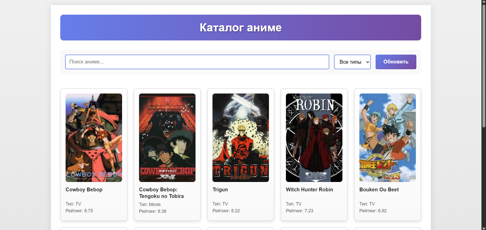
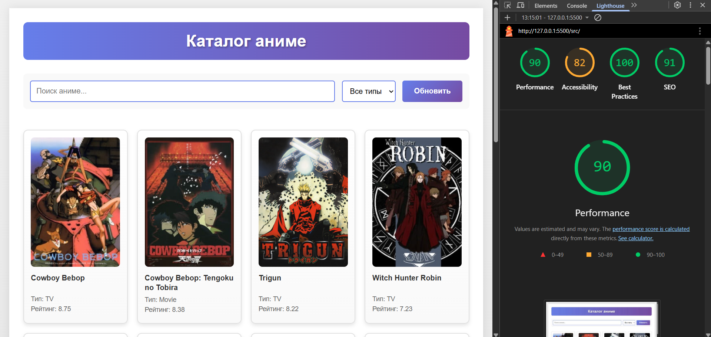

# Лабораторная работа №3

<p align="center">Министерство образования Республики Беларусь</p>
<p align="center">Учреждение образования</p>
<p align="center">"Брестский Государственный технический университет"</p>
<p align="center">Кафедра ИИТ</p>
<br><br><br><br><br><br>
<p align="center"><strong>Лабораторная работа №3</strong></p>
<p align="center"><strong>По дисциплине:</strong> "Веб-технологии"</p>
<p align="center"><strong>Тема:</strong> Асинхронность и HTTP‑кэш (fetch, AbortController, ретраи)</p>
<br><br><br><br><br><br>
<p align="right"><strong>Выполнил:</strong></p>
<p align="right">Студент 4 курса</p>
<p align="right">Группы АС-63</p>
<p align="right">Козлович А. А.</p>
<p align="right"><strong>Проверил:</strong></p>
<p align="right">Несюк А. Н.</p>
<br><br><br><br><br>
<p align="center"><strong>Брест 2025</strong></p>

---

## Цель работы

Закрепить работу с промисами и async/await, обработкой ошибок, таймаутами и отменой запросов. Понять основы HTTP‑кэширования и увидеть эффект в DevTools.

---

### Вариант №7

**Тема:** Каталог аниме (Jikan API) с фильтрами и пагинацией

## Ход выполнения работы

### 1. Структура проекта

```text
task_03/
├── doc/
│   ├── README.md
│   └── screenshots/
│       ├── lighthouse.png
│       ├── main-page.png
│       ├── network-first.png
│       └── network-cached.png
├── src/
│   ├── index.html
│   ├── styles.css
│   └── img/
│       └── placeholder.svg
```

**Описание файлов:**

- `index.html` — основная страница с каталогом аниме
- `styles.css` — файл стилей для оформления интерфейса
- `img/` — папка с изображениями
- `doc/` — документация и отчет

### 2. Реализованные элементы

**Основной функционал:**

1. **Загрузка данных с API** — используется Jikan API для получения списка аниме
2. **Поиск** — возможность поиска аниме по названию
3. **Фильтрация** — фильтр по типу аниме (TV, Movie, OVA)
4. **Пагинация** — переключение между страницами результатов
5. **Состояния загрузки** — отображение состояний loading, error, empty

**Асинхронность:**

- Использование async/await для работы с API
- Функция `fetchWithRetry()` с параметрами retries, backoffMs, timeoutMs
- AbortController для отмены запросов
- Обработка ошибок через try/catch/finally

**Кэширование:**

- In-memory кэш на основе Map в объекте cache
- TTL кэша установлен на 5 минут (300000 мс)
- Кнопка "Обновить" для принудительной очистки кэша
- Кэширование по ключу: страница + поиск + тип

**UX-элементы:**

- Spinner при загрузке данных
- Отображение ошибок
- Индикация пустого результата
- Отключение кнопок пагинации
- Задержка поиска (debounce 500ms)

### 3. Скриншоты выполненной лабораторной работы

#### Главная страница



#### Первый запрос (Network)

  
Первый запрос к API загружается с сервера

#### Повторный запрос (кэшированный)

Повторный запрос берется из кэша, запрос к серверу не выполняется

## Проверка качества

### Lighthouse



**Результаты Lighthouse:**

- Performance: 98
- Accessibility: 82
- Best Practices: 100
- SEO: 91

### Валидаторы

- HTML Validator: без критических ошибок
- CSS Validator: без критических ошибок

---

## Описание кэш-подхода

В проекте реализован простой in-memory кэш с использованием JavaScript объекта. Каждый запрос кэшируется по ключу, который формируется из текущей страницы, поискового запроса и выбранного типа аниме.

**Принцип работы:**

1. При запросе данных сначала проверяется наличие данных в кэше
2. Если данные есть и TTL не истек (5 минут), используются кэшированные данные
3. Если данных нет или TTL истек, выполняется запрос к API
4. Полученные данные сохраняются в кэш с текущей меткой времени
5. Кнопка "Обновить" полностью очищает кэш

**Ретраи и таймауты:**

- Количество попыток: 3
- Базовая задержка между попытками: 1 секунда (увеличивается экспоненциально)
- Таймаут запроса: 10 секунд
- При превышении таймаута запрос отменяется через AbortController

## Таблица критериев

| Критерий                                | Выполнено |
|------------------------------------------|-----------|
| Семантика/UX                             | ✅ |
| Функциональность (загрузка, поиск, пагинация, retry/timeout/abort) | ✅ |
| Качество интерфейса (loading/error/empty, skeleton) | ✅ |
| Качество кода                            | ✅ |
| Валидация/проверки (кэш, линтеры)       | ✅ |
| Публикация и отчёт                       | ✅ |

### Дополнительные бонусы

| Бонус                                     | Выполнено |
|-------------------------------------------|-----------|
| ETag‑клиентский кэш с If‑None‑Match       | ❌ |
| Дебаунс ввода, отмена устаревших запросов | ✅ |
| Prefetch при прокрутке (инфинит‑скролл)  | ❌ |

---

## Ссылки

- **Публикация:** [разместите ссылку на GitHub Pages]
- **Репозиторий:** [ссылка на GitHub]
- **Jikan API:** <https://jikan.moe/>

## Вывод

В ходе выполнения лабораторной работы был создан каталог аниме с использованием Jikan API. Реализована загрузка данных с поддержкой асинхронных операций, обработкой ошибок, ретраями и таймаутами. Добавлен механизм кэширования для оптимизации повторных запросов. Освоены навыки работы с async/await, AbortController, fetch API. Создан интерфейс с поиском, фильтрацией и пагинацией.
