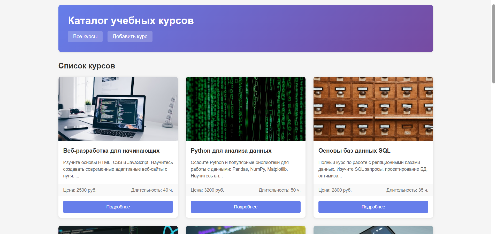
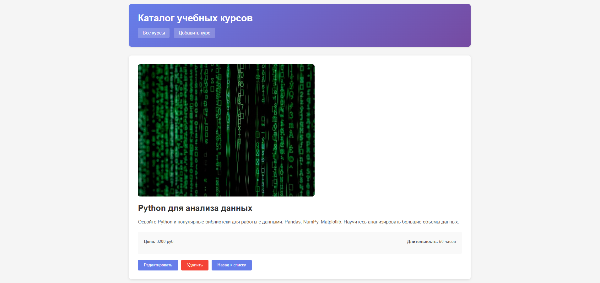
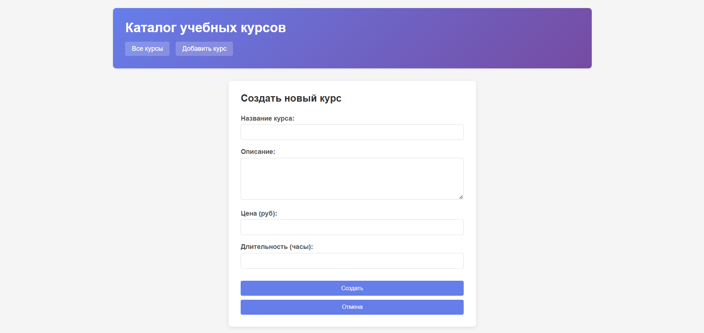
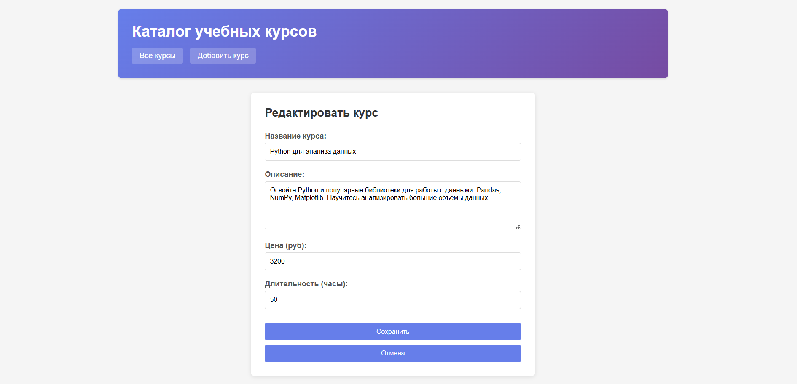
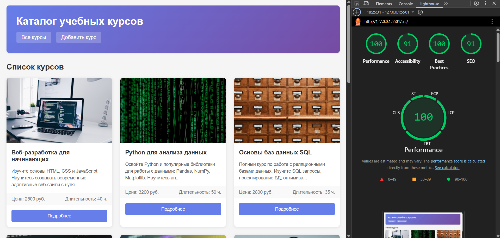

# Лабораторная работа №04

Министерство образования Республики Беларусь

Учреждение образования

"Брестский Государственный технический университет"

Кафедра ИИТ

      

<strong>Лабораторная работа №04</strong>

<strong>По дисциплине:</strong> "Веб-технологии"

<strong>Тема:</strong> REST-клиент SPA: список/детализация/CRUD, маршрутизация (без фреймворков)

      

<strong>Выполнил:</strong>

Студент 4 курса

Группы АС-63

Козлович А. А.

<strong>Проверил:</strong>

Несюк А. Н.

     

<strong>Брест 2025</strong>

---

## Цель работы

Реализовать простое SPA без фреймворков с маршрутизацией и состояниями загрузки/ошибок. Выполнить CRUD к учебному API.

---

## Вариант №7

Каталог учебных курсов: список, деталь, запись на курс (форма).

## Ход выполнения работы

### 1. Структура проекта

- `src/index.html` — основная страница приложения
- `src/styles.css` — стилизация приложения
- `src/img/` — директория для изображений
- `doc/README.md` — отчет по лабораторной работе
- `doc/screenshots/` — скриншоты работы приложения

### 2. Реализованные элементы

- Hash-маршрутизация на основе событий `hashchange` и `load`
- Маршруты: `#/items`, `#/items/:id`, `#/new`, `#/items/:id/edit`
- CRUD операции: GET (список и детали), POST (создание), PATCH (обновление), DELETE (удаление)
- Состояния: loading, error, empty
- Уведомления об успешных операциях
- Подтверждение удаления курса
- Блокировка кнопки submit во время отправки формы
- Адаптивная верстка для мобильных устройств
- Валидация форм (required атрибуты)
- Работа с JSONPlaceholder API для демонстрации

### 3. Скриншоты выполненой лабораторной работы

## Проверка качества

### Lighthouse

**Результаты Lighthouse:**

- Performance: 100
- Accessibility: 91
- Best Practices: 100
- SEO: 91

### Валидаторы

HTML и CSS проверены на соответствие стандартам.

---

## Таблица критериев

| Критерий                                | Баллы | Выполнено |
|------------------------------------------|-------|-----------|
| Семантика/UX                            | 20    | ✅        |
| Функциональность/CRUD/маршрутизация     | 25    | ✅        |
| Качество интерфейса                      | 20    | ✅        |
| Качество кода/модульность               | 15    | ❌        |
| Тесты/валидность                         | 10    | ✅        |
| Публикация и отчёт                       | 10    | ✅        |

### Дополнительные бонусы

| Бонус                                     | Выполнено |
|-------------------------------------------|-----------|
| Сохранение фильтров/поиска в hash         | ❌       |
| Предзагрузка данных (prefetch)            | ❌       |
| Клиентская авторизация                    | ❌       |

---

## Вывод

В ходе выполнения лабораторной работы было создано одностраничное приложение (SPA) для каталога учебных курсов без использования фреймворков. Реализована hash-маршрутизация, CRUD операции с использованием JSONPlaceholder API, созданы экраны списка, детализации, создания и редактирования курсов. Приложение адаптировано для мобильных устройств и включает базовую валидацию форм.
