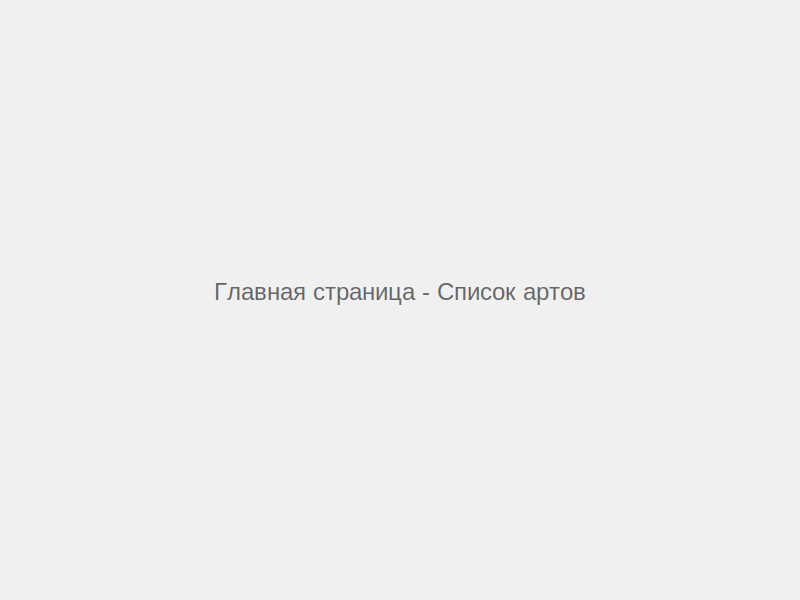
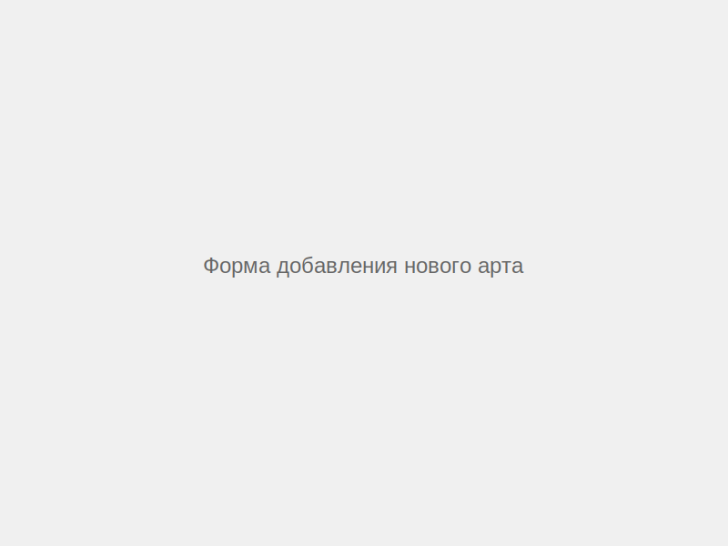
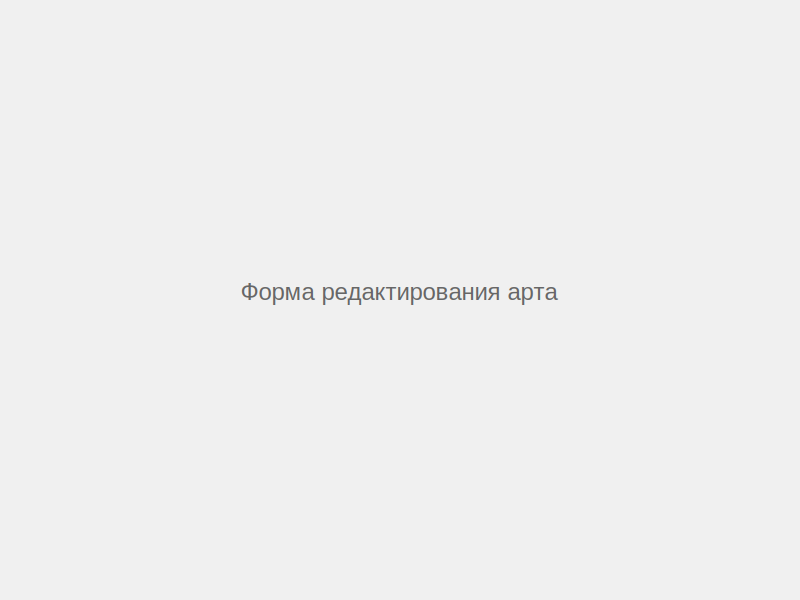
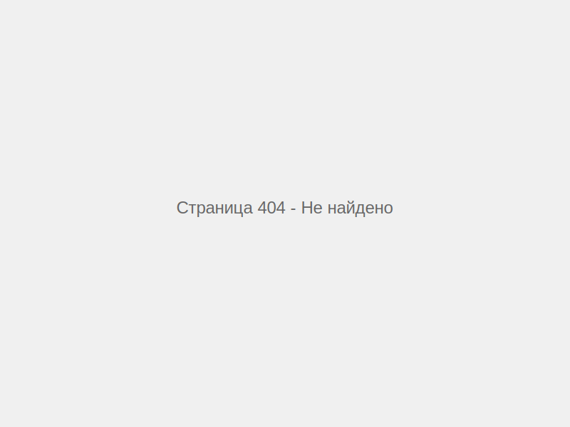

# Лабораторная работа №7

<p align="center">Министерство образования Республики Беларусь</p>
<p align="center">Учреждение образования</p>
<p align="center">"Брестский Государственный технический университет"</p>
<p align="center">Кафедра ИИТ</p>
<br><br><br><br><br><br>
<p align="center"><strong>Лабораторная работа №7</strong></p>
<p align="center"><strong>По дисциплине:</strong> "Веб-технологии"</p>
<p align="center"><strong>Тема:</strong> React‑приложение: маршрутизация, состояние, формы, работа с API</p>
<br><br><br><br><br><br>
<p align="right"><strong>Выполнил:</strong></p>
<p align="right">Студент 4 курса</p>
<p align="right">Группы АС-63</p>
<p align="right">Козлович А. А.</p>
<p align="right"><strong>Проверил:</strong></p>
<p align="right">Несюк А. Н.</p>
<br><br><br><br><br>
<p align="center"><strong>Брест 2025</strong></p>

---

## Цель работы

Создать полноценный SPA на React с подключением маршрутизации, реализацией форм и взаимодействием с API.

---

### Вариант №7 - Галерея артов с загрузкой изображений (мок)

## Ход выполнения работы

### 1. Структура проекта

```
task_07/
├── doc/
│   ├── README.md
│   └── screenshots/
│       ├── main-page.svg
│       ├── detail-page.svg
│       ├── add-form.svg
│       ├── edit-form.svg
│       └── 404-page.svg
└── src/
    ├── components/
    │   └── Nav.jsx
    ├── pages/
    │   ├── Home.jsx
    │   ├── ArtDetail.jsx
    │   ├── NewArt.jsx
    │   ├── EditArt.jsx
    │   └── NotFound.jsx
    ├── App.jsx
    ├── main.jsx
    ├── index.html
    ├── vite.config.js
    ├── package.json
    ├── .env
    └── .gitignore
```

### 2. Реализованные элементы

- **Страницы:**
  - Главная страница со списком артов
  - Страница детального просмотра арта
  - Страница добавления нового арта
  - Страница редактирования существующего арта
  - Страница 404 для несуществующих маршрутов

- **Маршрутизация:**
  - React Router v6
  - Навигация между страницами
  - Динамические маршруты для детального просмотра и редактирования

- **Работа с данными:**
  - Получение списка артов из localStorage
  - Просмотр деталей отдельного арта
  - Создание нового арта
  - Редактирование существующего арта
  - Удаление арта
  - Обработка состояний загрузки и ошибок
  - Отображение пустого состояния

- **Формы:**
  - Форма создания арта с валидацией обязательных полей
  - Форма редактирования арта
  - Базовая валидация (название, автор, год)
  - Отображение ошибок валидации

- **Изображения:**
  - Использование API picsum.photos для генерации изображений
  - Возможность указать собственный URL изображения

### 3. Скриншоты выполненой лабораторной работы

#### Главная страница со списком артов



#### Страница детального просмотра арта


#### Форма добавления нового арта



#### Форма редактирования арта



#### Страница 404



---

## Таблица критериев

| Критерий                                | Выполнено |
|------------------------------------------|-----------|
| Структура и UX                           | ✅        |
| Функциональность (маршрутизация + CRUD)  | ✅        |
| Качество интерфейса                      | ✅        |
| Качество кода/архитектуры                | ✅        |
| Тесты (1–2 unit/RTL)                     | ❌        |
| Публикация и отчёт                       | ✅        |

### Дополнительные бонусы

| Бонус                                         | Выполнено |
|-----------------------------------------------|-----------|
| Оптимистичные обновления                      | ❌        |
| Ленивые маршруты (code splitting)             | ❌        |
| Dark mode                                     | ❌        |

---

## Инструкция по запуску

1. Перейти в директорию проекта:

   ```bash
   cd src
   ```

2. Установить зависимости:

   ```bash
   npm install
   ```

3. Запустить приложение в режиме разработки:

   ```bash
   npm run dev
   ```

4. Открыть браузер по адресу: `http://localhost:5173`

5. Для сборки продакшн-версии:

   ```bash
   npm run build
   ```

---

## Вывод

В ходе выполнения данной лабораторной работы был создан SPA на React с использованием Vite. Реализована маршрутизация с помощью React Router v6, включающая основные страницы приложения (список, детальный просмотр, создание, редактирование) и обработку несуществующих маршрутов (404).

Было освоено управление состоянием приложения с использованием хуков useState и useEffect. Данные хранятся в localStorage, что позволяет имитировать работу с API без использования серверной части. Реализован полный CRUD-функционал для работы с артами галереи.

Созданы формы с базовой валидацией для добавления и редактирования артов. Обработаны различные состояния приложения: загрузка данных, отображение ошибок, пустое состояние.

В проекте использовано внешнее API picsum.photos для генерации изображений, что позволяет визуализировать галерею без необходимости загрузки реальных файлов.

Освоены навыки работы с современным стеком технологий: React, Vite, React Router, а также основы построения архитектуры SPA-приложений.
