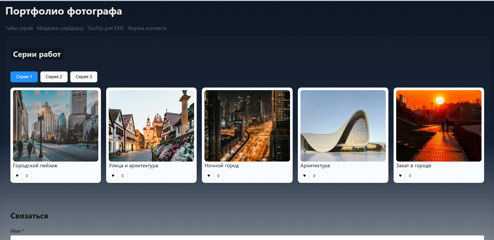
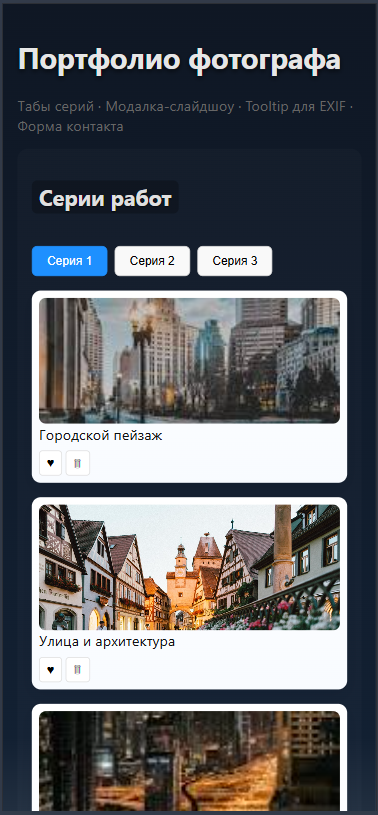
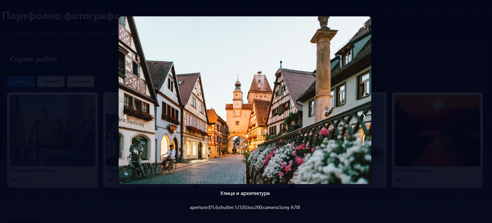
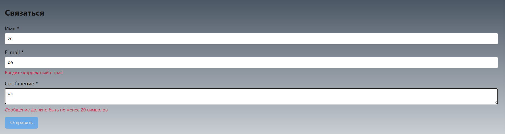

# Лабораторная работа 02 — Портфолио фотографа

<p align="center">Министерство образования Республики Беларусь</p>
<p align="center">Учреждение образования</p>
<p align="center">"Брестский Государственный технический университет"</p>
<p align="center">Кафедра ИИТ</p>
<br><br><br><br><br><br>
<p align="center"><strong>Лабораторная работа №2</strong></p>
<p align="center"><strong>По дисциплине:</strong> "Веб-технологии"</p>
<p align="center"><strong>Тема:</strong> "Портфолио фотографа: табы серий, модалка слайд‑шоу, tooltip для EXIF."</p>
<br><br><br><br><br><br>
<p align="right"><strong>Выполнил:</strong></p>
<p align="right">Студент 4 курса</p>
<p align="right">Группы АС-63</p>
<p align="right">Козловская А.Г.></p>
<p align="right"><strong>Проверил:</strong></p>
<p align="right">Несюк А.Н.</p>
<br><br><br><br><br>
<p align="center"><strong>Брест 2025</strong></p>

---

## Цели

- Продемонстрировать работу с интерактивными компонентами в браузере.
- Реализовать вкладки (tabs), модальное окно‑слайдшоу, tooltip для EXIF и форму с валидацией.
- Обеспечить базовую доступность (ARIA, клавиатурная навигация).

## Тема

Портфолио фотографа: табы серий, модалка слайд‑шоу, tooltip для EXIF.

- Табы (role=tab): переключение серий, поддержка клавиш стрелок, aria-selected/controls.
- Галерея карточек с изображениями: каждая карточка — `article.card`.
- Модальное окно (lightbox) со слайдшоу: Prev/Next, клавиатурная навигация, фокус.
- Tooltip для EXIF: при наведении/фокусе показываются данные EXIF (tooltip элемент).
- Делегирование событий: лайк и удаление карточек обрабатываются на контейнере `.gallery`.
- Контактная форма с валидацией: поля `name`, `email`, `message`, кнопка отправки активна только при валидности, сообщения об ошибках.

## Реализованные компоненты

- Табы (role=tab): переключение серий, поддержка клавиш стрелок, `aria-selected`/`aria-controls`.
- Галерея карточек с изображениями: каждая карточка — `article.card`.
- Модальное окно (lightbox) со слайдшоу: Prev/Next, клавиатурная навигация, управление фокусом.
- Tooltip для EXIF: при наведении/фокусе показываются данные EXIF (элемент `#tooltip`).
- Делегирование событий: лайк и удаление карточек обрабатываются на контейнере `.gallery`.
- Контактная форма с валидацией: поля `name`, `email`, `message` и включение кнопки только при валидности.
- Заготовка для сохранения состояния в `localStorage` (можно доработать).
- Табы (role=tab): переключение серий, поддержка клавиш стрелок, aria-selected/controls.
- Галерея карточек с изображениями: каждая карточка — `article.card`.
- Модальное окно (lightbox) со слайдшоу: Prev/Next, клавиатурная навигация, фокус.
- Tooltip для EXIF: при наведении/фокусе показываются данные EXIF (tooltip элемент).
- Делегирование событий: лайк и удаление карточек обрабатываются на контейнере `.gallery`.
- Контактная форма с валидацией: поля `name`, `email`, `message`, кнопка отправки активна только при валидности, сообщения об ошибках.
- Небольшое сохранение состояния (заготовка в localStorage) — бонус.

## Файлы

- `index.html` — основная разметка.
- `styles.css` — стили.
- `scripts/main.js` — логика табов, модалки, tooltip, делегирование, валидация.

## Доступность (a11y)

- Использованы семантические теги (`header`, `main`, `section`, `article`, `figure`).
- Таб-интерфейс использует `role=tablist/tab/tabpanel`, `aria-selected`, `aria-controls`.
- Модалка имеет `role=dialog`, `aria-modal`, управление фокусом, Esc для закрытия.
- Tooltip использует `role=status` и управляется атрибутом `aria-hidden`.

## Как проверить

1. Откройте `index.html` в браузере (можно через Live Server).
2. Переключите табы — контент должен меняться, текущий таб подсвечен.
3. Наведите курсор на изображение или сфокусируйте его — появится tooltip с EXIF.
4. Клик по изображению откроет модалку. В модалке стрелки и Esc работают.
5. Нажимайте на ❤ (кнопка с `data-like`) чтобы поставить/снять лайк. Кнопки удаления `data-delete` удаляют карточку (делегирование).
6. Заполните форму — пока не будет введено корректно, кнопка `Отправить` неактивна. После отправки появится сообщение.

## Скриншоты

В папке `scripts/screenshots` найдены следующие файлы:

- `tabs.png` — интерфейс с табами.
- `mobile.png` — вид страницы на мобильном экране.
- `lightbox.png` — модалка/слайдшоу.
- `form.png` — форма контакта и валидация.

```markdown




```

## Что можно улучшить

- Полное восстановление состояния (удалённые карточки, позиция лайков) через `localStorage`.
- Добавить анимации для modal/tooltip; более аккуратный focus-trap.
- Тесты для валидаторов (юнит-тесты).

## Ссылка на гитхаб

Ссылка <https://github.com/annkrq/WT-AC-2025/tree/main/students/KozlovskayaAnna/task_02>

## Примечания

- Все изображения подгружаются с Unsplash (open). В учебных целях это упрощённый набор данных.
- Код организован в одном модуле `scripts/main.js` для простоты. Можно разделить на ES‑модули при желании.
