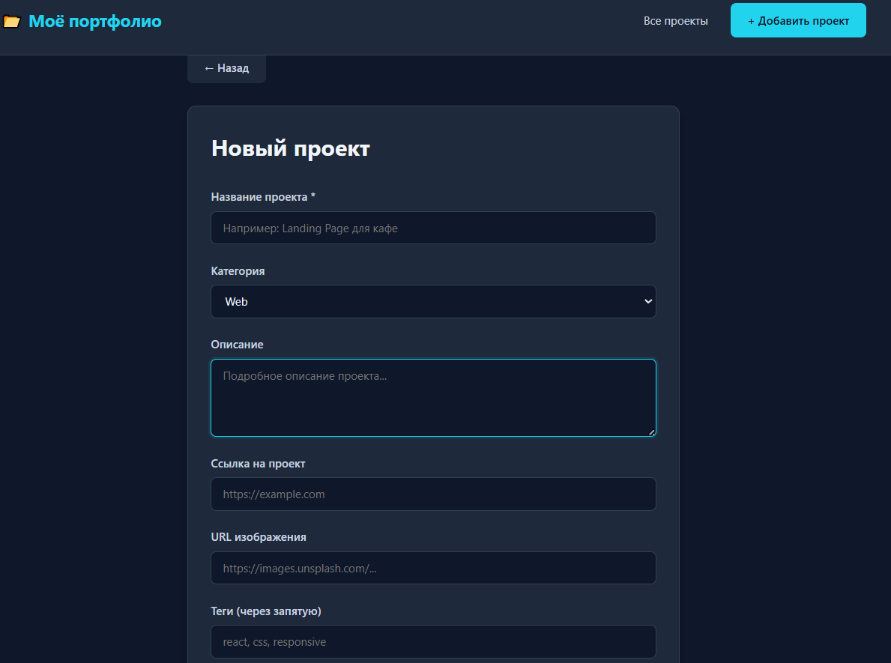
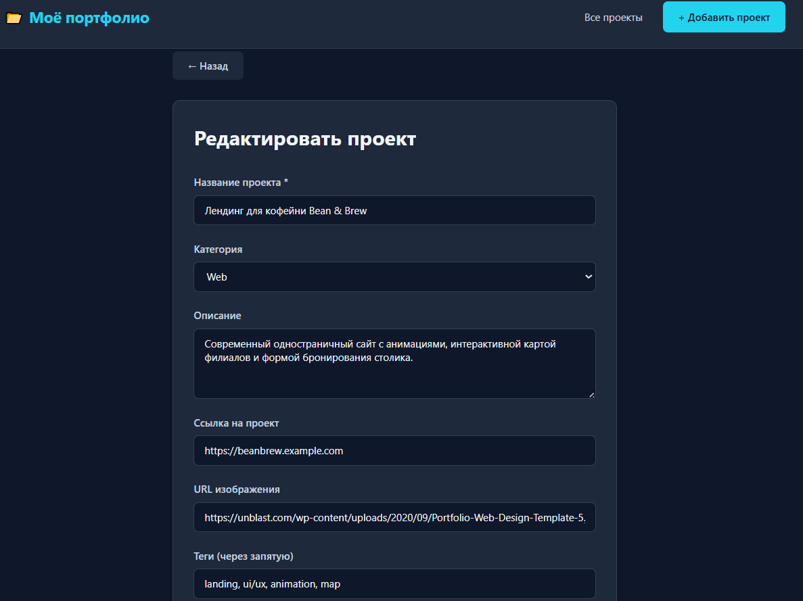

# Титульный лист

<p align="center">Министерство образования Республики Беларусь</p>
<p align="center">Учреждение образования</p>
<p align="center">“Брестский Государственный технический университет”</p>
<p align="center">Кафедра ИИТ</p>
<br><br><br><br><br><br>
<p align="center"><strong>Лабораторная работа №4</strong></p>
<p align="center"><strong>По дисциплине:</strong> “Веб-технологии”</p>
<p align="center"><strong>Тема:</strong> “Галерея работ (портфолио): список проектов, деталь, форма добавления.”</p>
<br><br><br><br><br><br>
<p align="right"><strong>Выполнил:</strong></p>
<p align="right">Студент 4 курса</p>
<p align="right">Группы АС-63</p>
<p align="right">Козловская А.Г.></p>
<p align="right"><strong>Проверил:</strong></p>
<p align="right">Несюк А.Н.</p>
<br><br><br><br><br>
<p align="center"><strong>Брест 2025</strong></p>

## Цели

- Освоить разработку одностраничных приложений (SPA) на чистом JavaScript.
- Реализовать hash-маршрутизацию без перезагрузки страницы.
- Выполнить полный CRUD к REST API (json-server).
- Отработать UX-состояния интерфейса: loading, error, empty.
- Сделать адаптивную тёмную тему с современным UI-паттернами.

## Тема

«Галерея работ (портфолио)» — SPA со списком проектов, детальной страницей и формами создания/редактирования.

## Описание проекта

**Галерея работ (Портфолио)** — современное одностраничное приложение (SPA) для управления портфолио веб-разработчика.

## Реализованные компоненты

- Роутер на hash: `#/projects`, `#/projects/:id`, `#/projects/new`, `#/projects/:id/edit`.
- Экран списка проектов: адаптивная grid-сетка карточек, поиск по title/description с дебаунсом 300мс и сохранением `?q=` в hash.
- Детальная страница проекта: дата, категория, теги, ссылка, действия «Редактировать/Удалить» (с подтверждением).
- Формы создания/редактирования: валидация обязательного поля `title`, блокировка кнопки submit («Сохранение…») во время запроса.
- UI-состояния: Loading (спиннер), Error (с понятным текстом и кнопкой «Повторить»), Empty.
- Prefetch данных проекта при наведении на карточку для мгновенного открытия детальной страницы.
- Модуль `api.js` с обработкой ошибок и всеми запросами: list/get/create/update/delete.

## Доступность

- Запуск в браузере через Live Server: <http://127.0.0.1:5501>
- REST API: <http://localhost:3000> (json-server, файл `db.json` в корне проекта)
- Управление с клавиатуры: интерактивные элементы — кнопки/ссылки; видимый фокус, читаемые контрастные цвета.
- Адаптивность: mobile-first, сетка карточек `minmax(320px, 1fr)`.

## Примечание

- Приложение использует ES-модули — открывайте только через сервер (Live Server), а не `file://`.
- Перед запуском убедитесь, что установлен Node.js и запущен json-server:

 ```powershell
 npm install -g json-server
 json-server --watch db.json --port 3000
 ```

- Если видите «Failed to fetch» — проверьте, что API доступно на 3000 порту и `db.json` находится в корне проекта.

---

## Основные возможности

### Функциональность (CRUD)

- ✅ Просмотр списка всех проектов
- ✅ Детальная страница каждого проекта
- ✅ Добавление новых проектов
- ✅ Редактирование существующих проектов
- ✅ Удаление проектов (с подтверждением)
- ✅ Поиск проектов с сохранением в URL

### UX/UI

- ✅ Современный тёмный дизайн
- ✅ Полностью адаптивная вёрстка (mobile-first)
- ✅ Состояния Loading / Error / Empty
- ✅ Анимации и hover-эффекты
- ✅ Валидация форм
- ✅ Блокировка кнопок при отправке

### Бонусные фичи

- ✅ Сохранение поискового запроса в hash (#/projects?q=search)
- ✅ Prefetch детальной страницы при наведении на карточку
- ✅ Обработка всех ошибок с понятными сообщениями
- ✅ Кнопка "Повторить" при ошибках

---

## 🛠️ Технологии

- **Frontend**: HTML5, CSS3, JavaScript (ES6+)
- **Архитектура**: SPA с Hash Router
- **API**: RESTful API (json-server)
- **Модули**: ES6 Import/Export
- **Стилизация**: Custom CSS (без фреймворков)

---

## 🖼️ Скриншоты

### Главная страница (список проектов)


*Адаптивная сетка карточек с поиском*

### Детальная страница проекта


*Полная информация о проекте с действиями*

### Форма добавления проекта


*Валидация и блокировка при отправке*

### Форма редактирования проекта


*Редактирование проекта, проверка валидации и состояния отправки*

---

## 💡 Особенности реализации

### Hash-роутинг

Приложение использует hash-навигацию для SPA без перезагрузки страницы:

```javascript
window.location.hash = '/projects/1'
```

### ES6 Modules

Модульная архитектура с импортами:

```javascript
import { api } from './api.js';
```

### Состояния UI

Централизованное управление состояниями:

- `LOADING` — спиннер загрузки
- `ERROR` — ошибка с кнопкой повтора
- `EMPTY` — пустой список
- `SUCCESS` — успешная загрузка

## Ссылка на гитхаб

Ссылка <https://github.com/annkrq/WT-AC-2025/tree/main/students/KozlovskayaAnna/task_04>
