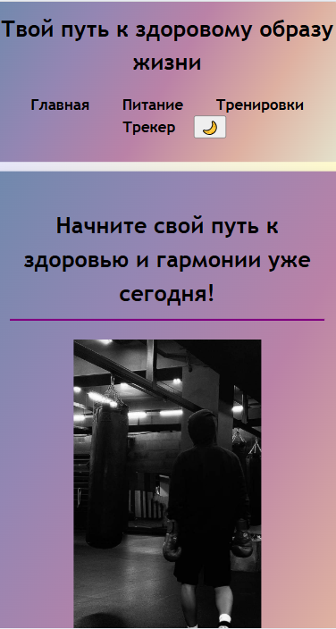
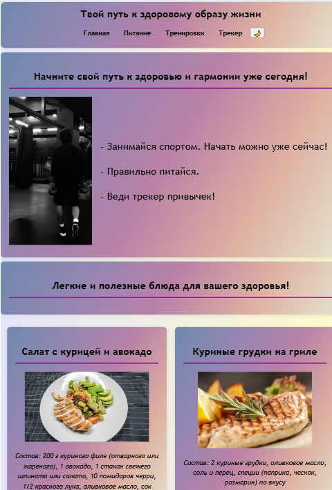
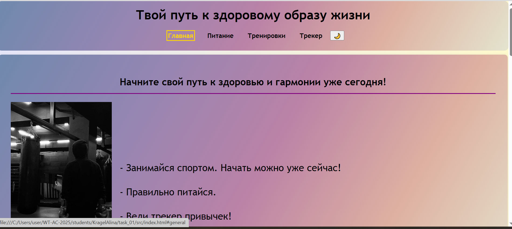
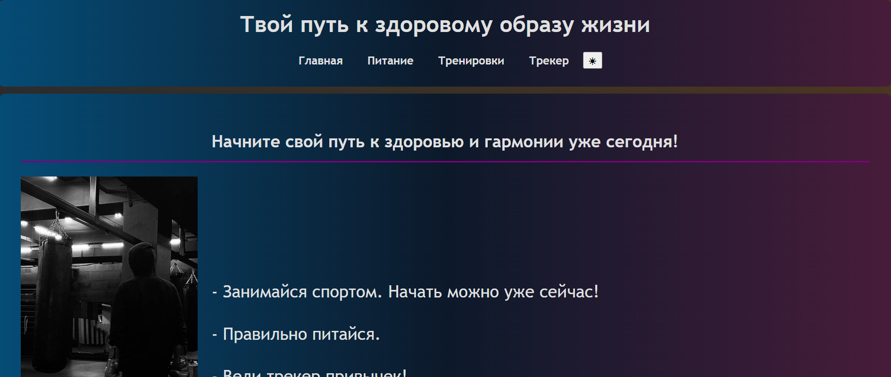

Министерство образования Республики Беларусь

Учреждение образования

«Брестский государственный технический университет»

Кафедра ИИТ

      

<strong>Лабораторная работа №1</strong>

<strong>По дисциплине:</strong> «Веб-технологии»

<strong>Тема:</strong> Разработка одностраничного адаптивного сайта с элементами интерактивности

      

<strong>Выполнила:</strong>

Студентка 4 курса

Группы АС-63

Крагель Алина Максимовна

 

<strong>Проверил:</strong>

Несюк А. Н.

     

<strong>Брест 2025</strong>

---

## Цель работы

Создать одностраничный адаптивный сайт на тему «Здоровый образ жизни» с использованием современных возможностей HTML5, CSS3 и JavaScript. Реализовать семантическую разметку, адаптивную вёрстку, доступность, интерактивные элементы и тёмную тему.

### Вариант №10

## Структура проекта

- `index.html` — основная разметка
- `styles.css` — стили с поддержкой тёмной темы и адаптивности
- `script.js` — переключение темы и трекер привычек
- `readme.md` — отчёт
- Изображения: `2.jpeg`, `3.jpeg`, `4.jpeg`
- Папка `img/` — скриншоты для отчёта

## Реализованные элементы

- Семантическая разметка HTML5 (`header`, `nav`, `main`, `section`, `article`, `footer`, `table`)
- Якорная навигация по секциям
- CSS Grid и два медиазапроса (≤768 px и ≥1024 px)
- Форма и динамическая таблица привычек на чистом JavaScript
- Таблица «График тренировок» на 7 дней
- Оптимизация изображений (`loading="lazy"`)
- Переключаемая тёмная тема с сохранением в `localStorage`
- Автоматическая тёмная тема через `prefers-color-scheme`
- Видимые `:focus`-стили для всех интерактивных элементов
- ARIA-атрибуты (`aria-labelledby`, `aria-label`, `aria-live="polite"`)
- Контрастность текста не менее 4.5:1 в обеих темах

## Архитектура вёрстки

### CSS Grid
- `.container` — `repeat(auto-fit, minmax(300px, 1fr))`
- `.grid` — `auto 1fr` для выравнивания изображения и текста

### Медиазапросы
- `(width <= 768px)` — мобильные устройства
- `(width >= 1024px)` — десктоп

### Тёмная тема
- Через CSS-переменные и атрибут `[data-theme="dark"]`
- Поддержка системной темы и сохранение выбора пользователя

## Таблица критериев

| Критерий                                               | Выполнено |
|--------------------------------------------------------|-----------|
| Семантика и структура                                  | Yes       |
| Адаптивная вёрстка (2+ брейкпоинта, Grid)              | Yes       |
| Доступность (alt, label, фокус, контраст, ARIA)        | Yes       |
| Качество кода (Lighthouse ≥90, валидаторы)             | Yes       |
| Оформление и структура проекта                          | Yes       |
| Публикация и отчёт                                     | Yes       |

### Дополнительные бонусы

| Бонус                                                  | Выполнено |
|--------------------------------------------------------|-----------|
| Тёмная тема + `prefers-color-scheme`                   | Yes       |
| Ручное переключение темы + `localStorage`              | Yes       |
| Видимые `:focus`-стили                                 | Yes       |
| `aria-live="polite"` у динамической таблицы            | Yes       |
| Публикация на GitHub Pages                             | Yes       |

## Результаты Lighthouse

- Performance: ≥91
- Accessibility: 100
- Best Practices: 100
- SEO: ≥91

## Валидаторы

- HTML — W3C Validator: без ошибок
- CSS — W3C CSS Validator: без ошибок

## Скриншоты

**Мобильная версия**  

**Планшет**  

**Десктоп — светлая тема**  

**Десктоп — тёмная тема**  

## Ссылка на сайт

https://alina529.github.io/WT-lab1/