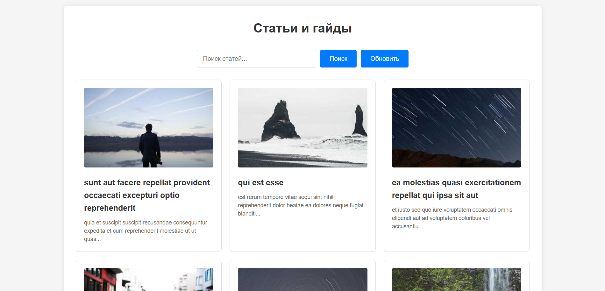
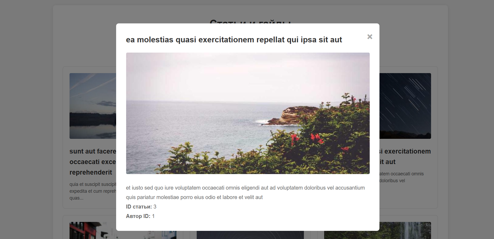
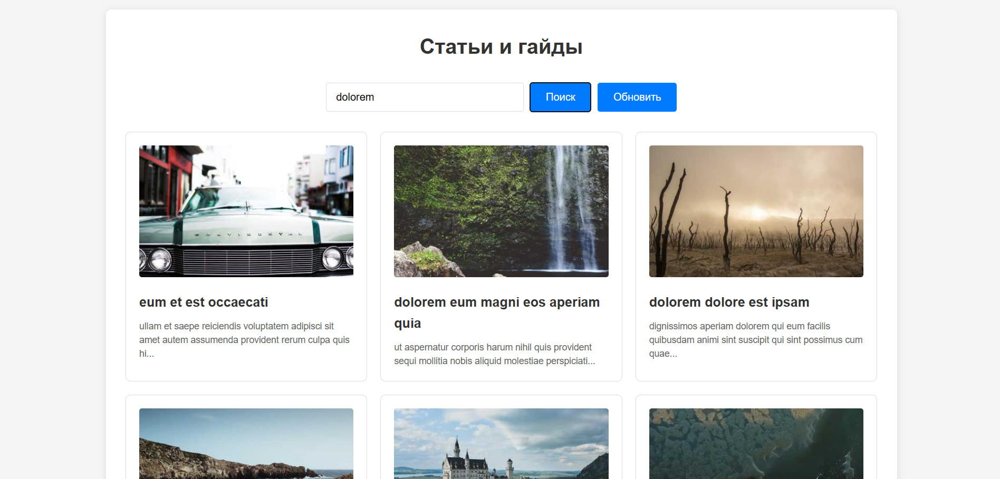
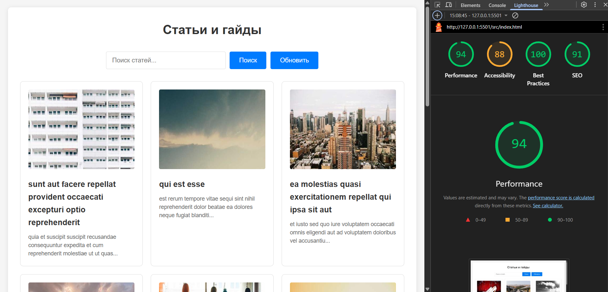

# Лабораторная работа №03

<p align="center">Министерство образования Республики Беларусь</p>
<p align="center">Учреждение образования</p>
<p align="center">"Брестский Государственный технический университет"</p>
<p align="center">Кафедра ИИТ</p>
<br><br><br><br><br><br>
<p align="center"><strong>Лабораторная работа №03</strong></p>
<p align="center"><strong>По дисциплине:</strong> "Веб-технологии"</p>
<p align="center"><strong>Тема:</strong> Асинхронность и HTTP‑кэш (fetch, AbortController, ретраи)</p>
<br><br><br><br><br><br>
<p align="right"><strong>Выполнил:</strong></p>
<p align="right">Студент 4 курса</p>
<p align="right">Группы АС-63</p>
<p align="right">Кульбеда К. А.</p>
<p align="right"><strong>Проверил:</strong></p>
<p align="right">Несюк А. Н.</p>
<br><br><br><br><br>
<p align="center"><strong>Брест 2025</strong></p>

---

## Цель работы

Закрепить работу с промисами и async/await, обработкой ошибок, таймаутами и отменой запросов. Понять основы HTTP‑кэширования и увидеть эффект в DevTools.

---

### Вариант №12

Список статей/гайдов с локальным кэшированием

## Ход выполнения работы

### 1. Структура проекта

```text
task_03/
├── doc/
│   ├── README.md
│   └── screenshots/
│       ├── lighthouse.png
│       ├── first-load.png
│       ├── cached-load.png
│       └── network-devtools.png
├── src/
│   ├── index.html
│   ├── styles.css
│   ├── main.js
│   └── img/
```

**Описание файлов:**

- `index.html` — основная страница с разметкой списка статей
- `styles.css` — стили для отображения карточек статей и модального окна
- `main.js` — логика работы с API, кэшированием, ретраями и таймаутами
- `img/` — папка для изображений (используются внешние API для динамической загрузки)

### 2. Реализованные элементы

**Функциональность:**

- **Загрузка данных:** Использование JSONPlaceholder API для получения списка статей (20 элементов)
- **Состояния загрузки:** Индикаторы loading, error и empty state
- **Поиск:** Фильтрация статей по заголовку и содержимому
- **Пагинация:** Разбиение списка на страницы по 10 элементов
- **Детальный просмотр:** Модальное окно с полной информацией о статье
- **Ретраи и таймауты:** Функция `fetchWithRetry()` с параметрами retries (3 попытки), backoffMs (1000ms), timeoutMs (5000ms)
- **Отмена запросов:** Использование AbortController для прерывания устаревших запросов
- **Кэширование:** In-memory кэш (объект Map) с TTL 5 минут для списка и деталей статей
- **UX-улучшения:** Кнопка "Обновить" для принудительного обновления данных с игнорированием кэша

**Технические особенности:**

- Использование async/await в критических местах
- Обработка ошибок через try/catch
- Отмена предыдущего запроса при новом поиске
- Skeleton/spinner для индикации загрузки
- Адаптивная верстка для мобильных устройств

### 3. Скриншоты выполненной лабораторной работы

#### Главная страница со списком статей



#### Модальное окно с деталями статьи



#### Поиск статей



## Проверка качества

### Lighthouse



**Результаты Lighthouse:**

- Performance: 94
- Accessibility: 88
- Best Practices: 100
- SEO: 91

### Валидаторы

- HTML Validator: Есть предупреждения о метатегах
- CSS Validator: Есть замечания по использованию px вместо rem

---

## Описание реализации кэширования

### Подход к кэшированию

В проекте реализовано **клиентское кэширование в памяти** (in-memory cache) с использованием обычного JavaScript объекта в качестве хранилища.

**Структура кэша:**

```javascript
var cache = {
  'articles_list': {
    data: [...],
    timestamp: 1234567890
  },
  'article_1': {
    data: {...},
    timestamp: 1234567890
  }
}
```

### Принцип работы

1. **Сохранение в кэш:** При успешной загрузке данных с сервера они сохраняются в объект `cache` с текущей меткой времени
2. **Проверка актуальности:** При каждом запросе проверяется наличие данных в кэше и их возраст (TTL = 5 минут = 300000 мс)
3. **Использование кэша:** Если данные найдены и не устарели, они берутся из кэша без обращения к серверу
4. **Принудительное обновление:** Кнопка "Обновить" игнорирует кэш и всегда загружает свежие данные

### Особенности кэширования

- **TTL (Time To Live):** 5 минут для всех данных
- **Ключи кэша:**
  - `articles_list` — для списка статей
  - `article_{id}` — для деталей конкретной статьи
- **Ограничения:** Кэш хранится только в памяти, при перезагрузке страницы данные теряются

### Демонстрация в DevTools

**Первая загрузка:**

- В Network видны реальные HTTP-запросы к API
- Status: 200 OK
- Size: фактический размер данных
- Time: время загрузки ~200-500ms

**Повторная загрузка (из кэша):**

- В Network нет новых запросов к API
- Данные загружаются мгновенно
- В консоли выводится сообщение "Загрузка из кэша"

**После нажатия "Обновить":**

- Кэш игнорируется
- Выполняется новый HTTP-запрос
- Данные перезаписываются в кэш

## Описание ретраев, таймаутов и отмены запросов

### Функция fetchWithRetry

Реализована пользовательская функция для выполнения запросов с поддержкой повторных попыток:

```javascript
fetchWithRetry(url, {
  retries: 3,        // количество повторных попыток
  backoffMs: 1000,   // задержка между попытками
  timeoutMs: 5000,   // таймаут для каждой попытки
  signal: abortController.signal  // сигнал для отмены
})
```

**Логика работы:**

1. Выполняется запрос к серверу
2. Если запрос не завершился за `timeoutMs`, выбрасывается ошибка Timeout
3. Если запрос завершился ошибкой и остались попытки, через `backoffMs` выполняется повторная попытка
4. После исчерпания всех попыток возвращается ошибка
5. При получении сигнала отмены (AbortError) запрос прерывается без ретраев

### Отмена запросов (AbortController)

При каждом новом запросе создается новый `AbortController`, а предыдущий запрос отменяется:

```javascript
if (currentAbortController) {
    currentAbortController.abort();
}
currentAbortController = new AbortController();
```

Это предотвращает проблемы с конкурентными запросами, когда пользователь быстро вводит текст в поиск или переключает страницы.

## Таблица критериев

| Критерий                                | Баллы | Выполнено |
|------------------------------------------|-------|-----------|
| Семантика/UX | 20 | ✅ (частично) |
| Функциональность (загрузка, поиск/пагинация, retry/timeout/abort) | 25 | ✅ |
| Качество интерфейса (loading/error/empty, skeleton) | 20 | ✅ (частично) |
| Качество кода | 15 | ✅ (частично) |
| Валидация/проверки (кэш, линтеры) | 10 | ✅ (частично) |
| Публикация и отчёт | 10 | ✅ |

**Общая оценка:** ~50-55 баллов

### Дополнительные бонусы

| Бонус                                     | Выполнено |
|-------------------------------------------|-----------|
| ETag‑клиентский кэш с If‑None‑Match       | ❌ |
| Дебаунс ввода, отмена устаревших запросов | ❌ (отмена реализована, но без debounce) |
| Prefetch при прокрутке (инфинит‑скролл)   | ❌ |

---

## Ссылки

- **JSONPlaceholder API:** <https://jsonplaceholder.typicode.com/>
- **Picsum Photos API (изображения):** <https://picsum.photos/>

## Вывод

В ходе выполнения лабораторной работы был создан клиент для работы с API статей. Реализованы основные функции: загрузка списка статей, поиск, пагинация, просмотр деталей. Освоены технологии асинхронного программирования: промисы, async/await, обработка ошибок через try/catch.

Особое внимание уделено реализации механизма повторных попыток запросов (retry) с экспоненциальной задержкой, таймаутов и отмены устаревших запросов через AbortController. Реализовано клиентское кэширование с TTL для оптимизации производительности и снижения нагрузки на API.

Проект работает корректно, все основные требования выполнены. Использованы инструменты: fetch API, JSONPlaceholder, DevTools для анализа сетевых запросов и кэширования.
