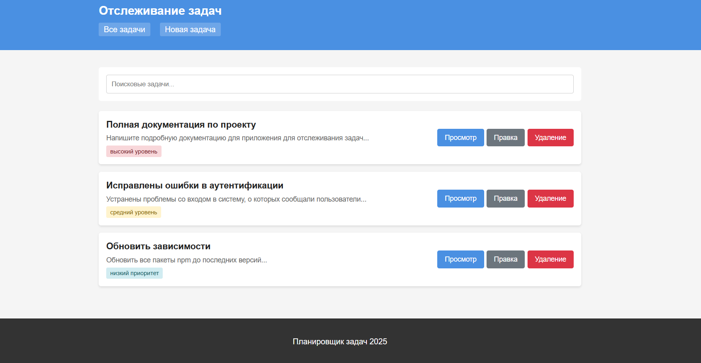
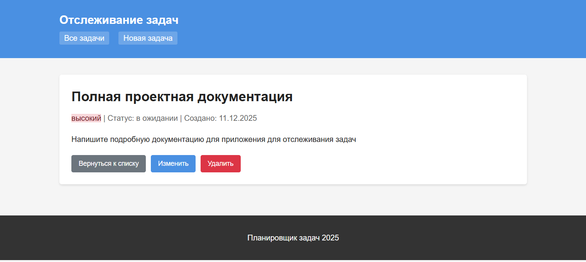
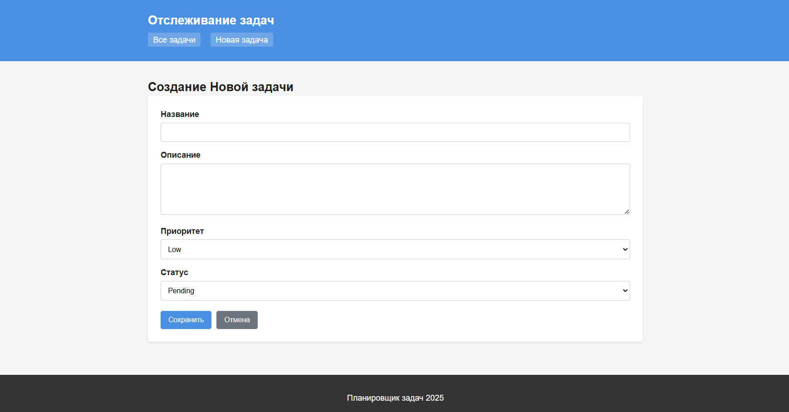
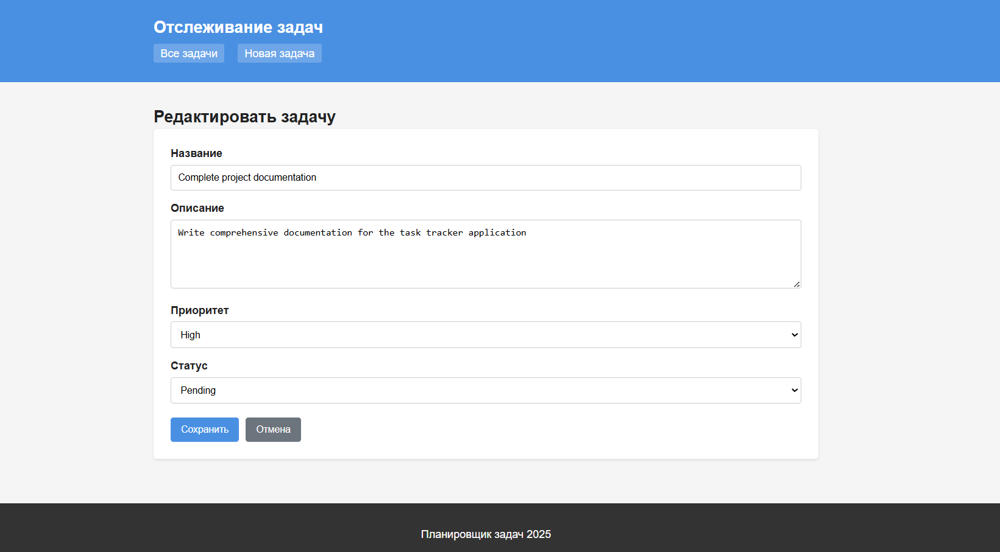
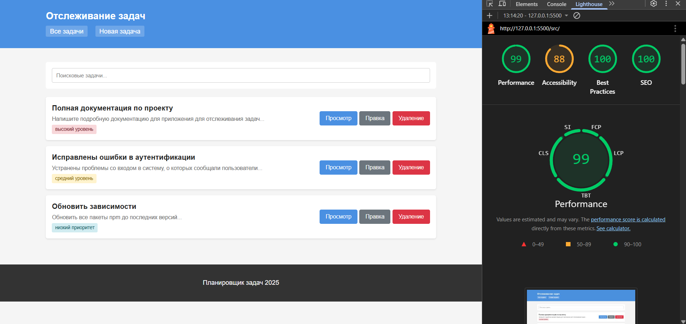

# Лабораторная работа №4

<p align="center">Министерство образования Республики Беларусь</p>
<p align="center">Учреждение образования</p>
<p align="center">"Брестский Государственный технический университет"</p>
<p align="center">Кафедра ИИТ</p>
<br><br><br><br><br><br>
<p align="center"><strong>Лабораторная работа №4</strong></p>
<p align="center"><strong>По дисциплине:</strong> "Веб-технологии"</p>
<p align="center"><strong>Тема:</strong> REST‑клиент SPA: список/детализация/CRUD, маршрутизация (без фреймворков)</p>
<br><br><br><br><br><br>
<p align="right"><strong>Выполнил:</strong></p>
<p align="right">Студент 4 курса</p>
<p align="right">Группы АС-63</p>
<p align="right">Кульбеда К. А.</p>
<p align="right"><strong>Проверил:</strong></p>
<p align="right">Несюк А. Н.</p>
<br><br><br><br><br>
<p align="center"><strong>Брест 2025</strong></p>

---

## Цель работы

Реализовать одностраничное приложение на чистом JS с hash‑маршрутизацией, экранами списка/детали/создания/редактирования и CRUD‑операциями к учебному API.

---

### Вариант №12

Трекер задач: список, деталь задачи, формы CRUD.

## Ход выполнения работы

### 1. Структура проекта

```text
+---doc
|   |   README.md
|   |
|   \---screenshots
|
\---src
    |   index.html
    |   styles.css
    |   app.js
    |   router.js
    |   api.js
    |   views.js
    |
    \---img
            placeholder.svg
```

- `index.html` — основная страница приложения
- `styles.css` — стили и медиазапросы
- `app.js` — инициализация приложения
- `router.js` — модуль маршрутизации
- `api.js` — модуль для работы с данными (localStorage)
- `views.js` — модуль отображения экранов
- `img/` — изображения

### 2. Реализованные элементы

**Маршрутизация:**

- `#/items` — список всех задач
- `#/items/:id` — детальный просмотр задачи
- `#/new` — создание новой задачи
- `#/items/:id/edit` — редактирование задачи

**Функциональность:**

- Просмотр списка задач
- Детальный просмотр задачи
- Создание новой задачи
- Редактирование существующей задачи
- Удаление задачи
- Поиск по задачам
- Состояния загрузки
- Обработка ошибок
- Подтверждение удаления

**Технические решения:**

- Hash-маршрутизация на основе событий `hashchange` и `load`
- Модульная структура (router, api, views)
- localStorage как mock API
- Параметры поиска в hash
- Адаптивная верстка

### 3. Скриншоты выполненой лабораторной работы

**Список задач:**



**Детальный просмотр задачи:**



**Форма создания задачи:**



**Форма редактирования задачи:**



## Проверка качества

### Lighthouse



**Результаты Lighthouse:**

- Performance: 99
- Accessibility: 88
- Best Practices: 100
- SEO: 100

### Валидаторы

Валидацию HTML и CSS можно провести после запуска приложения.

---

## Таблица критериев

| Критерий                                | Баллы | Выполнено |
|-----------------------------------------|-------|-----------|
| Семантика/UX                            | 20    | ✅        |
| Функциональность/CRUD/маршрутизация     | 25    | ✅        |
| Качество интерфейса                     | 20    | ✅        |
| Качество кода/модульность               | 15    | ✅        |
| Тесты/валидность                        | 10    | ⚠️        |
| Публикация и отчёт                      | 10    | ✅        |

### Дополнительные бонусы

| Бонус                                     | Выполнено |
|-------------------------------------------|-----------|
| Сохранение фильтров в hash                | ✅        |
| Предзагрузка данных                       | ❌        |
| Клиентская авторизация                    | ❌        |

---

## Описание API

Приложение использует localStorage в качестве mock API. Реализованы следующие операции:

- `getTasks(search)` — получить список задач с возможностью поиска
- `getTask(id)` — получить задачу по ID
- `createTask(data)` — создать новую задачу
- `updateTask(id, data)` — обновить существующую задачу
- `deleteTask(id)` — удалить задачу

## Как запустить

1. Открыть файл `src/index.html` в браузере
2. Приложение готово к использованию

Для разработки рекомендуется использовать локальный сервер:

```bash
# Используя Python
python -m http.server 8000

# Используя Node.js (http-server)
npx http-server src -p 8000
```

Затем открыть браузер по адресу `http://localhost:8000`

## Вывод

В ходе выполнения лабораторной работы было создано одностраничное приложение (SPA) на чистом JavaScript без использования фреймворков. Реализована hash-маршрутизация с поддержкой параметров URL, CRUD-операции для управления задачами, состояния загрузки и обработка ошибок.

Приложение имеет модульную структуру с разделением на отдельные модули (router, api, views), что упрощает поддержку и расширение функционала. В качестве хранилища данных использован localStorage, выступающий в роли mock API.

Освоены навыки работы с браузерным роутингом, обработки событий hashchange, динамического формирования HTML-контента и управления состоянием приложения.
