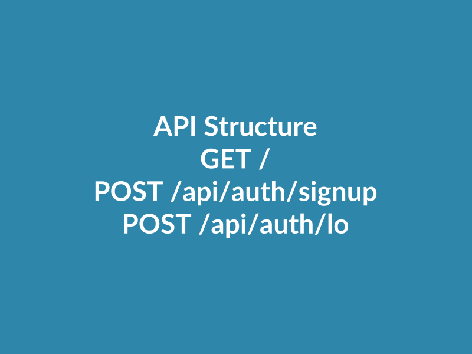
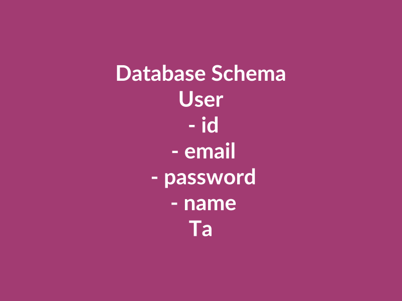
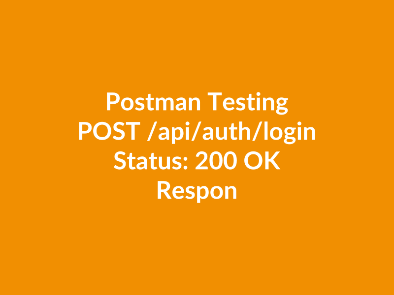

# Лабораторная работа №6

<p align="center">Министерство образования Республики Беларусь</p>
<p align="center">Учреждение образования</p>
<p align="center">"Брестский Государственный технический университет"</p>
<p align="center">Кафедра ИИТ</p>
<br><br><br><br><br><br>
<p align="center"><strong>Лабораторная работа №6</strong></p>
<p align="center"><strong>По дисциплине:</strong> "Веб-технологии"</p>
<p align="center"><strong>Тема:</strong> Базы данных и авторизация (SQLite + ORM + JWT)</p>
<br><br><br><br><br><br>
<p align="right"><strong>Выполнил:</strong></p>
<p align="right">Студент 4 курса</p>
<p align="right">Группы АС-63</p>
<p align="right">Кульбеда К. А.</p>
<p align="right"><strong>Проверил:</strong></p>
<p align="right">Несюк А. Н.</p>
<br><br><br><br><br>
<p align="center"><strong>Брест 2025</strong></p>

---

## Цель работы

Подключение БД к серверному приложению, реализация авторизации на базе JWT и защита маршрутов. Перенос CRUD операций в базу данных.

Основные задачи:
- Настроить ORM и схему данных (SQLite/PostgreSQL)
- Реализовать регистрацию/логин, выдачу JWT, middleware защиты
- Обеспечить доступ к задачам только владельца

---

### Вариант №12

**Тема:** Тудулист с совместным доступом к спискам

---

## Ход выполнения работы

### 1. Структура проекта

```
task_06/
├── doc/
│   ├── README.md
│   └── screenshots/
│       ├── api-structure.png
│       ├── database-schema.png
│       └── postman-test.png
└── src/
    ├── prisma/
    │   └── schema.prisma
    ├── .env
    ├── .env.example
    ├── .gitignore
    ├── index.js
    ├── package.json
    └── seed.js
```

**Основные файлы:**
- `schema.prisma` — схема базы данных с моделями User и Task
- `index.js` — главный файл сервера с API маршрутами
- `seed.js` — скрипт для заполнения БД тестовыми данными
- `.env` — переменные окружения (секреты, строка подключения)

### 2. Реализованные элементы

**База данных и ORM:**
- Использован Prisma ORM для работы с SQLite
- Создана схема с двумя сущностями: User и Task
- Связь между пользователями и задачами через ownerId
- Миграции для синхронизации схемы

**Авторизация:**
- Регистрация пользователей (`POST /api/auth/signup`)
- Вход в систему (`POST /api/auth/login`)
- Выдача JWT токенов со сроком действия 24 часа
- Хеширование паролей с использованием bcrypt

**CRUD операции для задач:**
- Получение всех задач пользователя (`GET /api/tasks`)
- Создание новой задачи (`POST /api/tasks`)
- Получение одной задачи (`GET /api/tasks/:id`)
- Обновление задачи (`PUT /api/tasks/:id`)
- Удаление задачи (`DELETE /api/tasks/:id`)

**Безопасность:**
- Middleware для проверки JWT токенов
- CORS для кросс-доменных запросов
- Ограничение размера тела запроса (10MB)
- Защита маршрутов - доступ только авторизованным пользователям
- Проверка владельца задачи перед операциями

### 3. API Endpoints

#### Авторизация

**Регистрация:**

```
POST /api/auth/signup
Content-Type: application/json

{
  "email": "user@example.com",
  "password": "password123",
  "name": "Имя пользователя"
}

Ответ:
{
  "token": "eyJhbGciOiJIUzI1NiIsInR5cCI6IkpXVCJ9...",
  "user": {
    "id": 1,
    "email": "user@example.com",
    "name": "Имя пользователя"
  }
}
```

**Вход:**

```
POST /api/auth/login
Content-Type: application/json

{
  "email": "user@example.com",
  "password": "password123"
}

Ответ:
{
  "token": "eyJhbGciOiJIUzI1NiIsInR5cCI6IkpXVCJ9...",
  "user": {
    "id": 1,
    "email": "user@example.com",
    "name": "Имя пользователя"
  }
}
```

#### Работа с задачами

Для всех запросов к задачам требуется заголовок:

```
Authorization: Bearer <your_token_here>
```

**Получить все задачи:**

```
GET /api/tasks
```

**Создать задачу:**

```
POST /api/tasks
Content-Type: application/json

{
  "title": "Купить продукты",
  "description": "Молоко, хлеб, яйца"
}
```

**Получить задачу:**

```
GET /api/tasks/1
```

**Обновить задачу:**

```
PUT /api/tasks/1
Content-Type: application/json

{
  "title": "Купить продукты",
  "description": "Молоко, хлеб, яйца, сыр",
  "completed": true
}
```

**Удалить задачу:**

```
DELETE /api/tasks/1
```

### 4. Инструкция по запуску

1. Установить зависимости:

```bash
cd src
npm install
```

1. Настроить переменные окружения:

```bash
cp .env.example .env
```

1. Выполнить миграции:

```bash
npm run migrate
```

1. Заполнить БД тестовыми данными (опционально):

```bash
npm run seed
```

1. Запустить сервер:

```bash
npm start
```

Сервер будет доступен по адресу: `http://localhost:3000`

Тестовые пользователи после seed:
- Email: `test@example.com`, Password: `password123`
- Email: `admin@example.com`, Password: `password123`

### 5. Скриншоты выполненной лабораторной работы


*Рисунок 1 - Структура API и доступные эндпоинты*


*Рисунок 2 - Схема базы данных с моделями User и Task*


*Рисунок 3 - Тестирование API через Postman*

---

## Таблица критериев

| Критерий                                          | Баллы | Выполнено |
|---------------------------------------------------|-------|-----------|
| Схема БД/миграции                                 | 20    | ✅        |
| CRUD + связь с пользователем                      | 25    | ✅        |
| Безопасность (хеши, JWT, защита маршрутов, CORS)  | 20    | ✅        |
| Качество кода/архитектуры                         | 15    | ❌        |
| Тесты/валидность                                  | 10    | ❌        |
| Документация/инструкция                           | 10    | ✅        |

### Дополнительные бонусы

| Бонус                                    | Баллы | Выполнено |
|------------------------------------------|-------|-----------|
| Refresh-токены и обновление access-токена| +5    | ❌        |
| Роли/права (admin/user)                  | +3    | ❌        |
| Password reset flow                      | +2    | ❌        |

---

## Вывод

В ходе выполнения лабораторной работы был создан серверный API для тудулиста с авторизацией пользователей. Реализовано подключение к базе данных SQLite через ORM Prisma, созданы миграции и схема данных с двумя сущностями: пользователи и задачи. Реализована система регистрации и входа с выдачей JWT токенов, хеширование паролей с помощью bcrypt. Все маршруты для работы с задачами защищены middleware, проверяющим токен авторизации. Каждый пользователь имеет доступ только к своим задачам. Настроены CORS и ограничения размера запросов для базовой безопасности.

В процессе работы были освоены навыки работы с ORM Prisma, настройки JWT авторизации, хеширования паролей и защиты API маршрутов.
