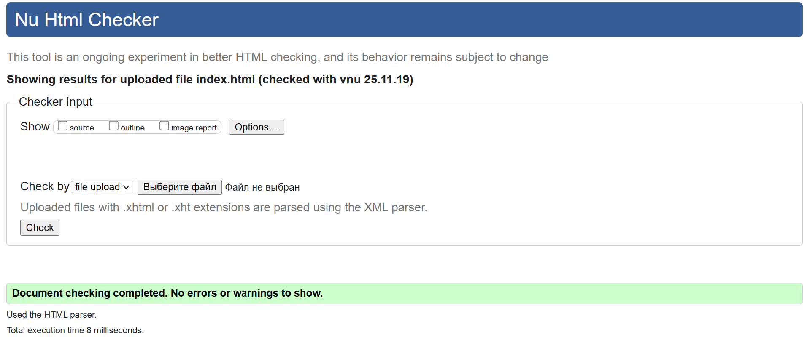
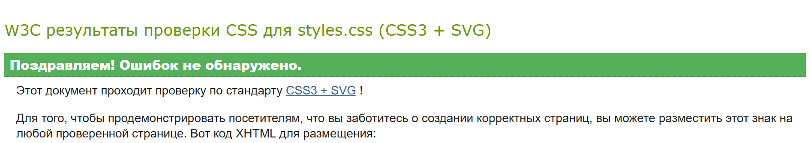
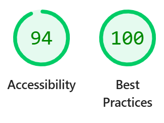

# Вариант 11: Каталог фильмов

## О проекте

Каталог фильмов с современным интерфейсом, реализованный на чистом JavaScript позволяет просматривать фильмы по категориям, изучать детальную информацию и добавлять новые фильмы через валидируемую форму.

[Главный экран каталога](image.png)

## Функциональность

### Система категорий

- **Табы с фильтрацией** по жанрам: Все, Комедии, Драмы, Фантастика, Боевики
- **Динамическое обновление** контента при переключении категорий
- **Клавиатурная навигация** между вкладками

### Карточки фильмов

- **Визуальные карточки** с постером, названием, жанром и рейтингом
- **Цветовая индикация** рейтинга (красный для низких, зеленый для высоких оценок)
- **Интерактивные подсказки** при наведении на рейтинг

### Детальная информация

- **Модальное окно** с полным описанием фильма
- **Анимации появления** и плавные переходы
- **Доступное управление** с клавиатуры

### Форма добавления

- **Валидация в реальном времени** всех полей
- **Умная блокировка** кнопки отправки при ошибках
- **Мгновенное обновление** каталога после добавления

## 🛠 Технические особенности

### Архитектура

- **Чистый JavaScript ES6+** без сторонних библиотек
- **Классовый подход** к организации кода
- **Модульная структура** компонентов

### Доступность (a11y)

- **Полная клавиатурная навигация**
- **ARIA-атрибуты** для скринридеров
- **Семантическая разметка**
- **Ловушки фокуса** в модальных окнах

### Адаптивность

- **Mobile-first подход**
- **Гибкая сетка** карточек фильмов
- **Оптимизированные интерфейсы** для мобильных устройств

## Компоненты системы

### CategoriesManager

Управление табами категорий и фильтрацией контента

**Функции:**
- Генерация интерфейса табов
- Фильтрация фильмов по категориям
- Обработка навигации с клавиатуры

### MovieModal

Контроллер модальных окон с детальной информацией

**Функции:**
- Открытие/закрытие модальных окон
- Ловушка фокуса внутри модалки
- Обработка клавиши ESC

### FormValidator

Система валидации формы добавления фильмов

**Функции:**
- Проверка полей в реальном времени
- Показ понятных сообщений об ошибках
- Контроль состояния кнопки отправки

### TooltipManager

Управление всплывающими подсказками

**Функции:**
- Позиционирование подсказок
- Плавные анимации появления
- Поддержка фокуса и ховера

### HTML Validator (W3C)

Код файла index.html прошёл проверку через валидатор (https://validator.w3.org/)

### CSS Validator (W3C)

Код файла styles.css прошёл проверку через валидатор (https://jigsaw.w3.org/css-validator/validator)

### Проверка на доступность и современные веб стандарты

На странице сайта проведена проверка на доступность и лучшие практики

### Бонусные задания

✅ Бонус 1: Сохранение состояния в localStorage
Сохранение выбранной категории - при перезагрузке страницы активная вкладка восстанавливается

Сохранение списка фильмов - добавленные фильмы сохраняются между сессиями

Сохранение избранного - список избранных фильмов сохраняется

Сохранение темы - выбранная светлая/тёмная тема сохраняется

✅ Бонус 2: Тёмная тема
Автоопределение системной темы через prefers-color-scheme

Переключатель темы в правом верхнем углу

Плавные переходы между темами

Полная поддержка всех элементов интерфейса в тёмной теме

Сохранение выбора темы в localStorage

✅ Бонус 3: Юнит-тесты
Полный набор тестов для функций валидации

Тестирование валидации рейтинга (6 тестов)

Тестирование валидации email (5 тестов)

Тестирование валидации описания (4 теста)

Тестирование обязательных полей (4 теста)

Визуальное отображение результатов тестирования

Интеграция с интерфейсом - кнопка "Запустить тесты"

## Проверка работы

### Тестирование навигации

1. **Табы категорий** - кликните по разным вкладкам
2. **Клавиатура** - используйте Tab и стрелки для навигации
3. **Модальные окна** - откройте детали фильма и попробуйте закрыть разными способами

### Проверка валидации

1. **Пустые поля** - попробуйте отправить форму без данных
2. **Некорректный email** - введите невалидный адрес
3. **Короткое описание** - проверьте ограничение минимальной длины

### Тестирование доступности

1. **Screen readers** - проверьте с NVDA или VoiceOver
2. **Клавиатура** - пройдите весь интерфейс без мыши
3. **Увеличение масштаба** - убедитесь в сохранении функциональности

## 📁 Файлы проекта

1. index.html - Главная страница
2. styles.css - Стили проекта
3. main.js - Основная логика
4. README.md - Документация
5. image.png - Скрин интерфейса
