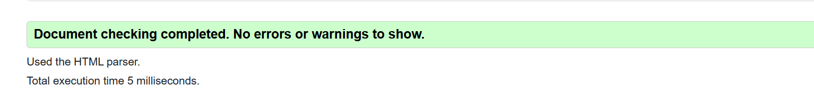
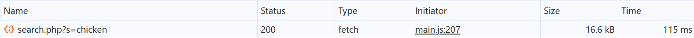
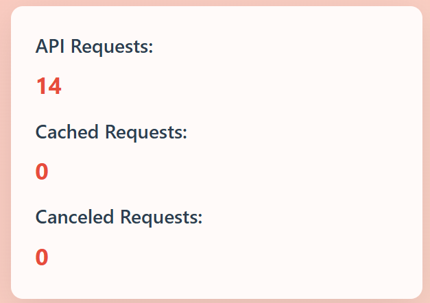
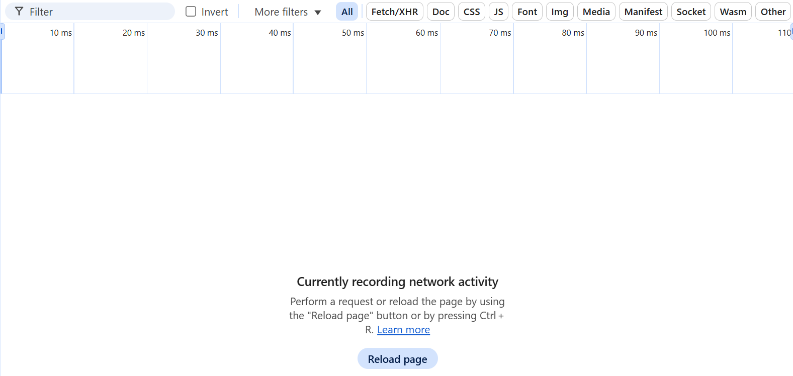
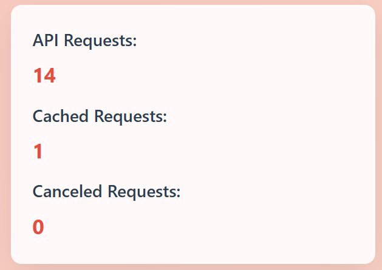
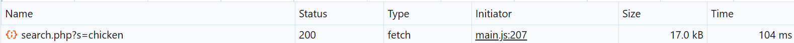
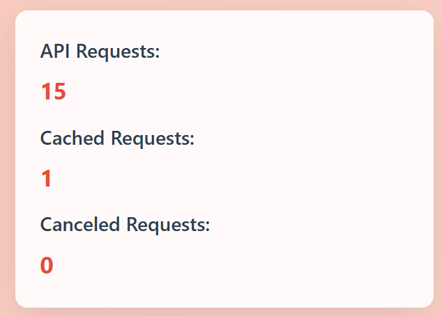

# Лабораторная работа 03: Асинхронность и HTTP‑кэш

**Вариант:** 11  
**Студент:** Куликович Иван

## Описание проекта

Веб-приложение "Recipe Catalog" для поиска и просмотра кулинарных рецептов с использованием TheMealDB API. Приложение демонстрирует работу с асинхронными запросами, управлением состоянием, кэшированием и обработкой ошибок.

## Основные функции

1. **Загрузка рецептов** из TheMealDB API
2. **Поиск и фильтрация** по названию и категории
3. **Кэширование запросов** в памяти браузера
4. **Повторные попытки** при сбоях сети
5. **Отмена устаревших запросов**
6. **Статистика запросов** в реальном времени

### Бонусные задания

1. **Дебаунс поиска** - 400 мс задержка для оптимизации
2. **Инфинит-скролл** - плавная подгрузка контента скроллом

## Реализованные технологии

### Асинхронные запросы

- Использование `async/await` для работы с промисами
- `fetch()` API для HTTP-запросов
- Обработка ошибок через `try/catch/finally`

### Кэширование (In-memory Map)

```js
javascript
class RecipeManager {
    constructor() {
        this.cache = new Map();
        this.cacheTtl = 120000; // 2 минуты
    }
    getFromCache(key) {
        const cached = this.cache.get(key);
        if (cached && Date.now() - cached.timestamp < this.
        cacheTtl) {
            return cached;
        }
        return null;
    }
}
```

**Параметры кэша:**

- **Тип**: In-memory (объект Map)
- **TTL**: 120000 мс (2 минуты)
- **Ключ**: Полный URL запроса
- **Структура**: `{ data: response, timestamp: Date.now() }`

**Параметры ретраев:**

- **Максимум попыток**: 3
- **Начальная задержка**: 500 мс
- **Стратегия**: Экспоненциальный бэк-офф (500 → 1000 → 2000 мс)
- **Условия**: Таймауты и сетевые ошибки

### Таймауты

**Настройки:**

- **Лимит времени**: 10000 мс (10 секунд)
- **Механизм**: AbortController + setTimeout
- **Действие**: Автоматическая отмена при превышении времени
- **Повторные попытки**: 3 раза с экспоненциальным бэк-оффом

**Реализация таймаутов (10 секунд):**

```js
async fetchWithRetry(url, options = {}) {
    const {
        retries = 3,
        backoffMs = 500,
        timeoutMs = 10000,
        ignoreCache = false,
        signal: externalSignal = null
    } = options;
```

### Отмена запросов

Сценарии использования:

- Новый поиск при активном запросе - пользователь быстро вводит текст
- Смена фильтра во время загрузки - переключение категорий
- Повторный запрос - ручное обновление данных

Предотвращение гонки запросов

- Без отмены: Могли бы приходить результаты старого запроса
- С отменой: Гарантированно получаем данные для текущего действия

Реализация:

```js
if (this.activeController) {
    this.activeController.abort();
    this.canceledRequestsCount++;
}
this.activeController = new AbortController();
```

### Управление состояниями

- **Loading**: Скелетоны и спиннеры
- **Error**: Индикация ошибок с кнопкой повтора
- **Empty**: Сообщение при отсутствии результатов
- **Success**: Отображение рецептов

## Валидация CSS

Стили прошли проверку валидатором W3C с использованием стандартных CSS3 свойств.
Скриншоты итогов проверки валидаторами css3 и html:



## Скриншоты работы

1. **Поиск "chicken" (первый раз):**
   - Network: видно запросы к API
   - Статистика: API Requests увеличивается
   Скришот DevTools:!   
   Скриншот статистики: 

2. **Тот же поиск "chicken" (второй раз):**
   - Network: пусто (данные из памяти)
   - Статистика: Cached Requests увеличивается
   - Вывод: In-memory кэш работает
   Скришот DevTools:    
   Скриншот статистики: 

3. **Нажатие "Refresh":**

   - Network: снова запросы к API
   - Статистика: API Requests увеличивается
   - Вывод: Refresh игнорирует кэш
   Скришот DevTools:    
   Скриншот статистики: 

## Заключение

Лабораторная работа демонстрирует практическое применение:

- Асинхронного программирования в JavaScript
- Эффективного кэширования HTTP-запросов
- Надежной обработки сетевых ошибок
- Оптимизации пользовательского интерфейса

Приложение готово к использованию по ссылке

---
**GitHub репозиторий**: []
