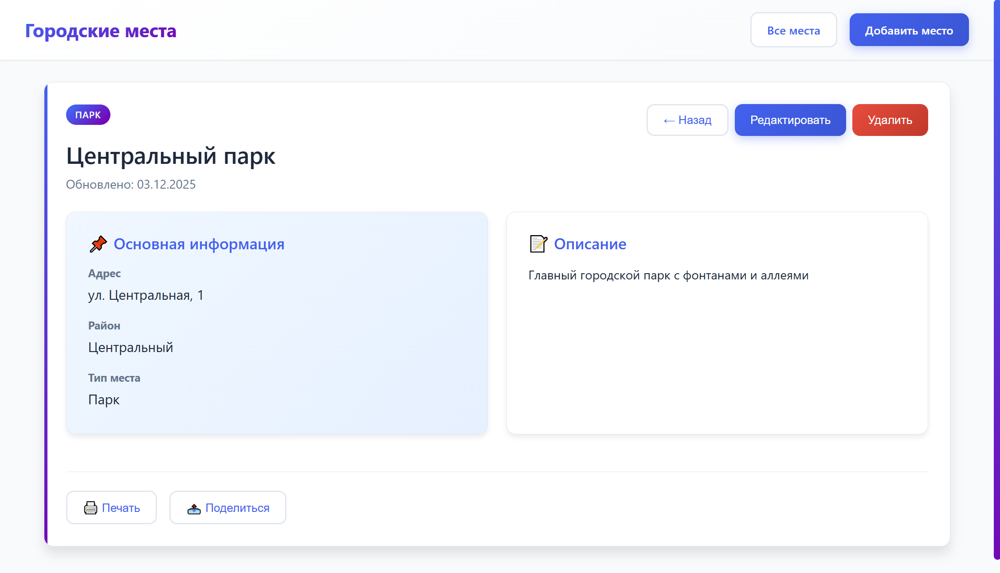
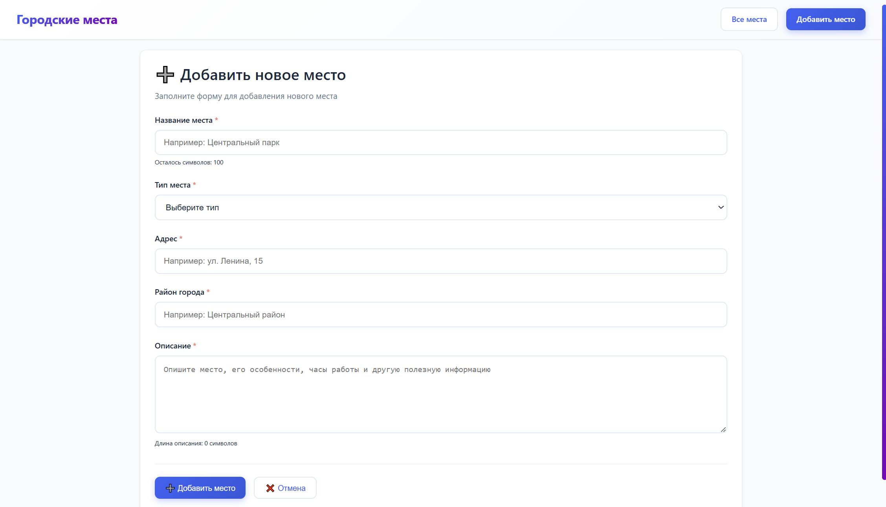

# Лабораторная работа 04. REST-клиент SPA

Одностраничное приложение на чистом JavaScript для управления справочником городских мест с **hash-маршрутизацией** и полным **CRUD**-функционалом.

## Запуск проекта

### 1. Установка `json-server`

```bash
npm install -g json-server@latest
```

### 2. Запуск API сервера

В **Терминале 1** выполните:

```bash
json-server --watch db.json --port 3000
```

Сервер будет доступен на [http://localhost:3000](http://localhost:3000).

### 3. Запуск приложения

В **Терминале 2** выберите один из способов:

#### Способ 1: **Live Server** (рекомендуется)

- Установите расширение **Live Server** для VS Code.
- Откройте `index.html` и нажмите **"Go Live"**.

#### Способ 2: **Python сервер**

```bash
python -m http.server 8080
```

#### Способ 3: **Node.js http-server**

```bash
npx http-server -p 8080 -o
```

Приложение будет доступно на [http://localhost:8080](http://localhost:8080).

---

## Маршруты приложения

| Маршрут            | Описание                          | Требует авторизации |
|--------------------|-----------------------------------|---------------------|
| `#/places`         | Список всех мест с поиском        | Нет                 |
| `#/places/:id`     | Детальная информация о месте     | Нет                 |
| `#/new`            | Создание нового места             | Да                  |
| `#/places/:id/edit`| Редактирование места             | Да                  |
| `#/login`          | Страница авторизации              | Нет                 |

---

## Основные возможности

### **CRUD операции**

- **Создание** — добавление новых мест через форму.
- **Чтение** — просмотр списка и детальной информации.
- **Обновление** — редактирование существующих мест.
- **Удаление** — удаление с подтверждением.

### **UX улучшения**

- Поиск с сохранением параметров в **URL**.
- Предзагрузка данных при наведении.
- Блокировка форм во время отправки.
- Подтверждение перед удалением.
- Валидация обязательных полей.
- Адаптивный дизайн для мобильных устройств.

---

## Архитектура

- **Модульная структура**:
  - `router.js` — маршрутизатор на событиях `hashchange`.
  - `api.js` — REST API клиент для работы с сервером.
  - `utils.js` — утилиты (Toast, Progress, Prefetch).
  - `views/` — компоненты экранов.

### **Технологический стек**

- Чистый JavaScript (ES6+).
- CSS3 с Grid/Flexbox.
- JSON Server для mock API.
- Hash-based маршрутизация.

---

## 🔌 API эндпоинты

| Метод | URL            | Описание                     |
|-------|----------------|------------------------------|
| GET   | `/places`      | Получить список мест         |
| GET   | `/places/:id`  | Получить место по ID         |
| POST  | `/places`      | Создать новое место          |
| PUT   | `/places/:id`  | Обновить место               |
| DELETE| `/places/:id`  | Удалить место                |

---

## Особенности реализации

### **Бонусные функции**

- Сохранение поиска — параметры сохраняются в **hash** и восстанавливаются.
- **Prefetch** данных — предзагрузка при наведении на карточки.
- Авторизация — **JWT-like** токены для защищённых операций.

### **UX особенности**

- Тёмная тема (автоматическое переключение).
- Анимации переходов между страницами.
- Подсказки при наведении.
- Горячие клавиши (**Ctrl+Enter**).

## Скриншоты

### **Главная страница**


### **Страница места**



### **Форма создания места**


