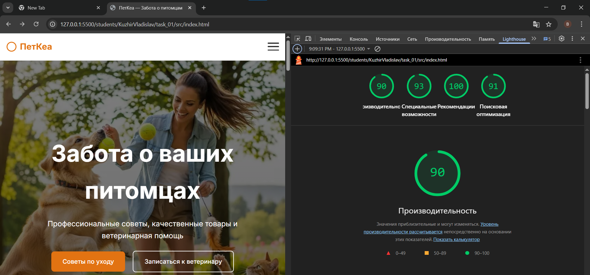
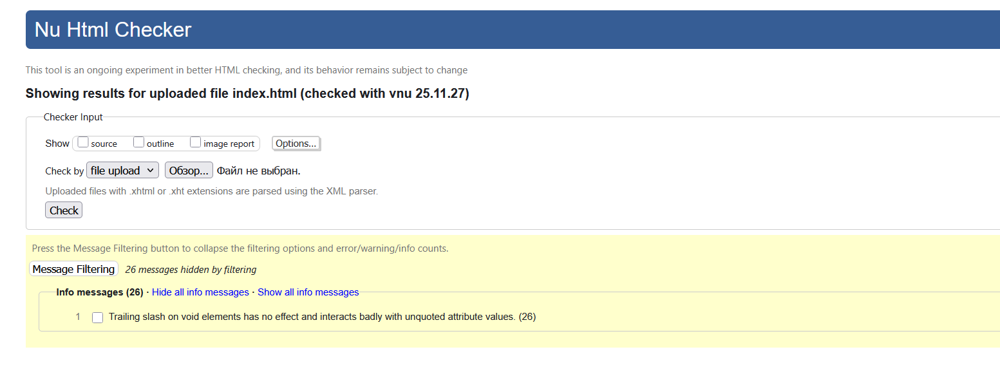
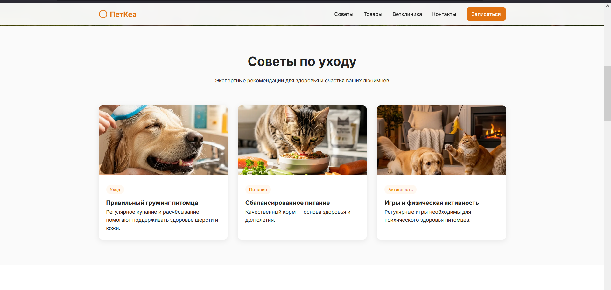
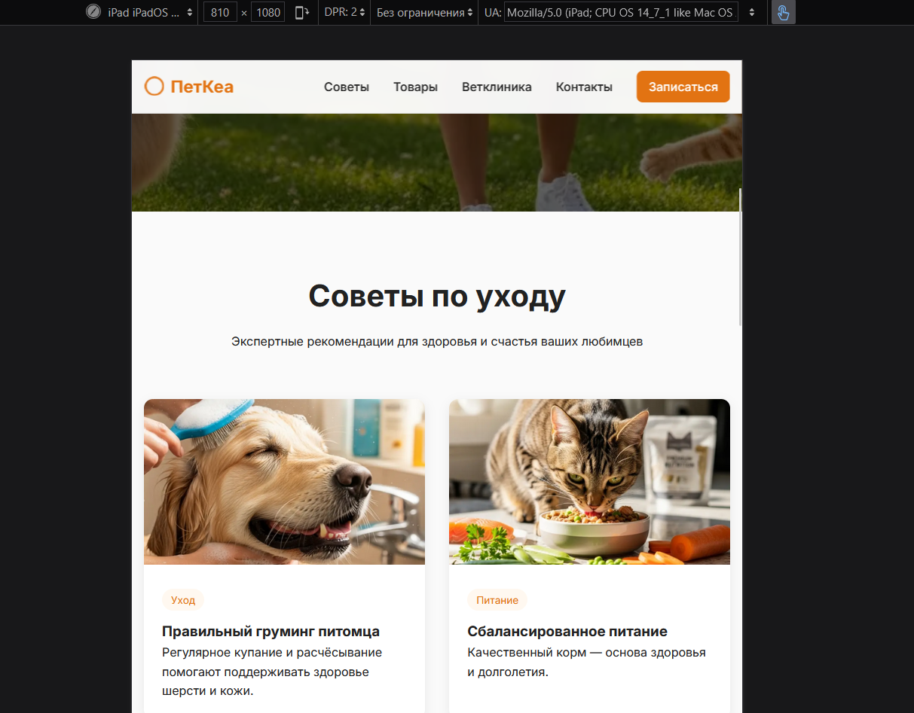
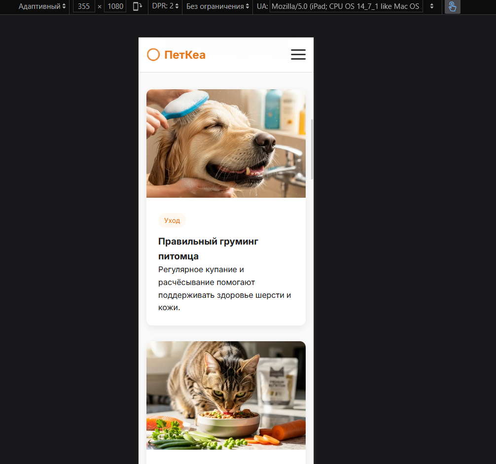

# Министерство образования Республики Беларусь

Учреждение образования

“Брестский Государственный технический университет”

Кафедра ИИТ

      

<strong>Лабораторная работа №1</strong>

<strong>По дисциплине:</strong> “Веб-технологии”

<strong>Тема:</strong> HTML/CSS: семантика, адаптивность и доступность

      

<strong>Выполнил:</strong>

Студент 4 курса

Группы АС-65

Кужир В. В.

<strong>Проверил:</strong>

Несюк А.Н.

     

<strong>Брест 2025</strong>

---

## Цель работы

Освоить семантическую разметку HTML5 (landmarks, заголовки, alt/label/aria).
Реализовать адаптивную вёрстку по схеме mobile-first с 2+ брейкпоинтами.
Повысить качество интерфейса и доступности (Lighthouse/валидаторы).

---

### Вариант № 36

## Ход выполнения работы

### 1. Структура проекта

- `index.html` — основная страница
- `styles.css` — стилизация и медиазапросы
- `assets/` — изображения и дополнительные материалы

### 2. Реализованные элементы

- Одностраничник с темой «уход за питомцами»
- Семантическая разметка (header, nav, section, footer, правильные заголовки)
  Адаптивность на 3+ брейкпоинта (≤768 / 768–1024 / ≥1024)
- Flexbox + CSS Grid везде (навигация, карточки, футер, клиника)
- Мобильное меню на чистом CSS (checkbox)
  Фильтры товаров на чистом CSS
- Все картинки с alt
- Формы с required, работают с клавиатуры
- Высокий контраст цветов
- Видимый фокус
- Sticky-header, hover-эффекты, плавные переходы
- Мета-теги, внешний styles.css
  Валидный HTML/CSS, Lighthouse 95–100+

### 3. Скриншоты выполненой лабораторной работы

lighthouse:

html validator:

css validator:

---

desktop:

tablet:

mobile:

---

## Таблица критериев

| Критерий                                             | Выполнено |
| ---------------------------------------------------- | --------- |
| Семантика/структура (landmarks, заголовки)           | ✅        |
| Адаптивная вёрстка (2+ брейкпоинта, Flex/Grid)       | ✅        |
| Доступность (alt/label, фокус, контраст, клавиатура) | ✅        |
| Качество и валидность (Lighthouse ≥ 90, валидаторы)  | ✅        |
| Оформление кода/структура проекта                    | ✅        |
| Публикация и отчёт                                   | ✅        |

### Дополнительные бонусы

| Бонус                                   | Выполнено |
| --------------------------------------- | --------- |
| Тёмная тема (prefers-color-scheme)      | ❌        |
| Адаптивные изображения (picture/srcset) | ✅        |
| Улучшения Web Vitals (CLS/LCP/INP)      | ❌        |

---

## Ссылкы(если требует задание)

https://subtle-wisp-a428d.netlify.app/

## Вывод

Освоил семантическую разметку HTML5 (landmarks, заголовки, alt/label/aria).
Реализовал адаптивную вёрстку по схеме mobile-first с 2+ брейкпоинтами.
Повысил качество интерфейса и доступности (Lighthouse/валидаторы).
